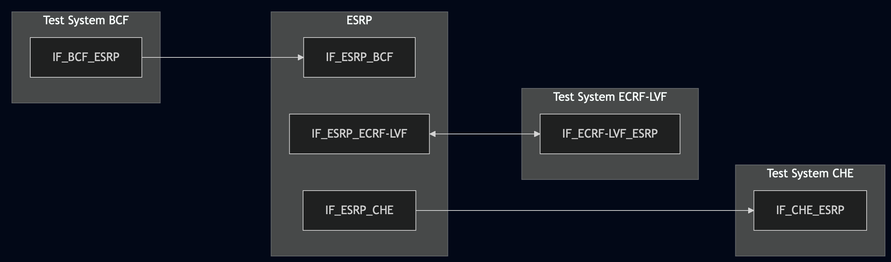
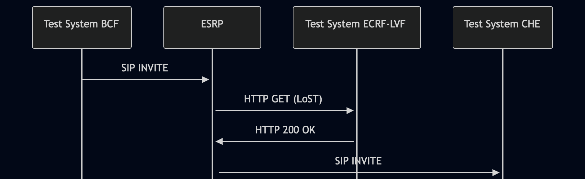

# Test Description: TD_ESRP_006

## !! RQ_ESRP_044 is under clarification !!

## Overview
### Summary
SIP INVITE exiting ESRP

### Description
Test verifies SIP INVITE messages exiting ESRP:
- Via header field specifying ESRP
- Route header field containing URI of downstream queue receiving a call (adding or replacing)
- if Emergency Call Identifier is added
- if Incident Tracking ID is added
- if ESRP do not remove header fields received from upstream interface
- if ESRP has implemented LoST interface
- Request-URI remains "urn:service:sos" when present in incoming call
- ESRP treats non-emergency calls (without "urn:service:sos") as an emergency calls


### SIP transport types
Test can be performed with 2 different SIP transport types. Steps describing actions for specific one are marked as following:
- (TLS transport) - used by default inside ESInet on production environment
- (TCP transport) - used in lab for testing purposes only if default TLS is not possible

### References
* Requirements : RQ_ESRP_042, RQ_ESRP_043, RQ_ESRP_044, RQ_ESRP_045, RQ_ESRP_046, RQ_ESRP_048, RQ_ESRP_049, 
* Test Case    : TC_ESRP_006

### Requirements
IXIT config file for ESRP

## Configuration
### Implementation Under Test Interface Connections
* Test System BCF
  * IF_BCF_ESRP - connected to IF_ESRP_BCF
* ESRP
  * IF_ESRP_BCF - connected to Test System BCF IF_BCF_ESRP
  * IF_ESRP_CHFE - connected to Test System CHFE IF_CHFE_ESRP
  * IF_ESRP_ECRF-LVF - connected to Test System ECRF-LVF IF_ECRF-LVF_ESRP
* Test System ECRF-LVF
  * IF_ECRF-LVF_ESRP - connected to IF_ESRP_ECRF-LVF
* Test System CHFE
  * IF_CHFE_ESRP - connected to IF_ESRP_CHFE


### Test System Interfaces
<!-- Identify each of the test system interfaces and whether it will be in active or monitor mode -->
* Test System BCF
  * IF_BCF_ESRP - Active
* ESRP
  * IF_ESRP_BCF - Active
  * IF_ESRP_CHFE - Active
  * IF_ESRP_ECRF-LVF - Active
* Test System ECRF-LVF
  * IF_ECRF-LVF_ESRP - Active
* Test System CHFE
  * IF_CHFE_ESRP - Active
 
 
### Connectivity Diagram
<!--
https://mermaid.live/edit#pako:eNp9UlFrgzAQ_ityz7aoi1HD2MNcZYUORjv6MISSaVrLqpEY2brS_75UF6eW7Z7uvvvuuy_hTpDwlAGB7YF_JBkV0lgs48JQMY8292G0ma2WzxMVd_M2v4AdoQFm4TKaLNbRrWb91E13SA0fZ1pLpT1CVb_tBC0z44VV0lgdK8lyo9s0stOCrEhHs7-9_s6xijZyDWrjf-n3vQ25WuX65f-rjG0MP0XNggk7sU-BSFEzE3Imcnop4XShxCAzlrMYiEpTKt5jiIuzmilp8cp5rscEr3cZkC09VKqqy5RK9rCnyk_eoUJtYyLkdSGB-EGjAeQEn0Ac250iHASO5yLX8pF_Y8IRCPamPvZsGwd-YGHbds4mfDVbramHLOQ6HsbI9pHrmUBryVfHItGWWLqXXDy1x9fc4PkboZS9DQ
-->




## Pre-Test Conditions
### Test System BCF
* Interfaces are connected to network
* Interfaces have IP addresses assigned by DHCP
* Device is active
* No active calls
* Test System has its own certificate signed by PCA

### ESRP
* Interfaces are connected to network
* Interfaces have IP addresses assigned by DHCP
* Device is active
* Device is in normal operating state
* Device is initialized with steps from IXIT config file
* No active calls
* Logging enabled
* Device is configured to use Test System ECRF-LVF for LoST requests on '/lost' URL entrypoint
* Device is configured to use Test System CHFE as a next hop host

### Test System ECRF-LVF
* Interfaces are connected to network
* Interfaces have IP addresses assigned by DHCP
* Device is active
* Test System has its own certificate signed by PCA

### Test System CHFE
* Interfaces are connected to network
* Interfaces have IP addresses assigned by DHCP
* Device is active
* No active calls
* Test System has its own certificate signed by PCA

## Test Sequence

### Test Preamble

#### Test System BCF
* Install SIPp by following steps from documentation[^1]
* Copy following XML scenario files to local storage:
  ```
  SIP_INVITE_location_PIDF-LO_Boundary1_without_identifiers.xml
  SIP_INVITE_regular_URI_admin_line.xml
  SIP_INVITE_with_existing_Route_header.xml
  ```
* Install Wireshark[^2]
* (TLS transport) Copy to local storage PCA-signed TLS certificate and private key files:
  ```
  PCA-cacert.pem
  PCA-cakey.pem
  ```
* (TLS transport) Copy to local storage TLS certificate and private key files used by ESRP:
  ```
  ESRP-cacert.pem
  ESRP-cakey.pem
  ```
* (TLS transport) Configure Wireshark to decode SIP over TLS packets from Test System and ESRP as well[^3]
* Using Wireshark on 'Test System' start packet tracing on IF_BCF_ESRP interface - run following filter:
   * (TLS transport)
     > ip.addr == IF_BCF_ESRP_IP_ADDRESS and tls
   * (TCP transport)
     > ip.addr == IF_BCF_ESRP_IP_ADDRESS and sip

#### Test System CHFE
* Install SIPp by following steps from documentation[^1]
* Copy following XML scenario files to local storage:
  ```
  SIP_INVITE_RECEIVE.xml
  ```
* Install Wireshark[^2]
* (TLS transport) Copy to local storage PCA-signed TLS certificate and private key files:
  ```
  PCA-cacert.pem
  PCA-cakey.pem
  ```
* (TLS transport) Copy to local storage TLS certificate and private key files used by ESRP:
  ```
  ESRP-cacert.pem
  ESRP-cakey.pem
  ```
* (TLS transport) Configure Wireshark to decode SIP over TLS packets from Test System and ESRP as well[^3]
* Using Wireshark on 'Test System' start packet tracing on IF_CHFE_ESRP interface - run following filter:
   * (TLS transport)
     > ip.addr == IF_CHFE_ESRP_IP_ADDRESS and tls
   * (TCP transport)
     > ip.addr == IF_CHFE_ESRP_IP_ADDRESS and sip


 #### Test System ECRF-LVF
* Install Wireshark[^2]
* Copy following scenario files to local storage:
  ```
  findServiceResponse.xml
  ```
* (TLS transport) Copy to local storage PCA-signed TLS certificate and private key files:
  ```
  PCA-cacert.pem
  PCA-cakey.pem
  ```
* (TLS transport) Copy to local storage TLS certificate and private key files used by ESRP:
  ```
  ESRP-cacert.pem
  ESRP-cakey.pem
  ```
* (TLS transport) Configure Wireshark to decode HTTP over TLS packets from Test System and ESRP as well[^3]
* Using Wireshark on 'Test System' start packet tracing on IF_ECRF-LVF_ESRP interface - run following filter:
   * (TLS transport)
     > ip.addr == IF_ECRF-LVF_ESRP_IP_ADDRESS and tls
   * (TCP transport)
     > ip.addr == IF_ECRF-LVF_ESRP_IP_ADDRESS and sip
* Rename PCA-signed certificate files for Test System ECRF-LVF to server.pem and server.key
* Start https server responding for HTTPS GET requests:
   ```
   echo -e "HTTP/1.1 200 OK\r\nContent-Type: application/lost+xml\r\nContent-Length: 1167\r\n\r\n$(cat findServiceResponse | sed -n  '/<?xml/,/findServiceResponse>/p')\r\n" | \
   openssl s_server -quiet -accept LOCAL_PORT -cert server.pem -key server.key
   ```

### Test Body

#### Variations
1. SIP INVITE with "urn:service:sos" Request-URI - emergency call
2. SIP INVITE with regular SIP URI (non-emergency call to admin line)
3. SIP INVITE with "urn:service:sos" Request-URI and existing Route header

#### Stimulus
Send SIP packet to ESRP - run following SIPp command on Test System 1, example:

**Variation 1** (Emergency call with "urn:service:sos"):
* (TCP transport)
  ```
  sudo sipp -t t1 -sf SIP_INVITE_location_PIDF-LO_Boundary1_without_identifiers.xml -i IF_BCF_ESRP_IP_ADDRESS:5060 IF_ESRP_BCF_IP_ADDRESS:5060 -max_recv_loops 1 -m 1
  ```
* (TLS transport)
  ```
  sudo sipp -t l1 -tls_cert PCA-cacert.pem -tls_key PCA-cakey.pem -sf SIP_INVITE_location_PIDF-LO_Boundary1_without_identifiers.xml -i IF_BCF_ESRP_IP_ADDRESS:5060 IF_ESRP_BCF_IP_ADDRESS:5060 -max_recv_loops 1 -m 1
  ```

**Variation 2** (Non-emergency call):
* (TCP transport)
  ```
  sudo sipp -t t1 -sf SIP_INVITE_regular_URI_admin_line.xml -i IF_BCF_ESRP_IP_ADDRESS:5060 IF_ESRP_BCF_IP_ADDRESS:5060 -max_recv_loops 1 -m 1
  ```
* (TLS transport)
  ```
  sudo sipp -t l1 -tls_cert PCA-cacert.pem -tls_key PCA-cakey.pem -sf SIP_INVITE_regular_URI_admin_line.xml -i IF_BCF_ESRP_IP_ADDRESS:5060 IF_ESRP_BCF_IP_ADDRESS:5060 -max_recv_loops 1 -m 1
  ```

**Variation 3** (Emergency call with existing Route header):
* (TCP transport)
  ```
  sudo sipp -t t1 -sf SIP_INVITE_with_existing_Route_header.xml -i IF_BCF_ESRP_IP_ADDRESS:5060 IF_ESRP_BCF_IP_ADDRESS:5060 -max_recv_loops 1 -m 1
  ```
* (TLS transport)
  ```
  sudo sipp -t l1 -tls_cert PCA-cacert.pem -tls_key PCA-cakey.pem -sf SIP_INVITE_with_existing_Route_header.xml -i IF_BCF_ESRP_IP_ADDRESS:5060 IF_ESRP_BCF_IP_ADDRESS:5060 -max_recv_loops 1 -m 1
  ```

#### Response

**Variation 1** (Emergency call with "urn:service:sos"):
* ESRP sends HTTP LoST query to Test System ECRF-LVF with findService request
* findService request contains geolocation from received SIP INVITE
* SIP INVITE has 'Via' header field specifying ESRP
* Request-URI remains "urn:service:sos" (unchanged from incoming call)
* SIP INVITE has 'Route' header field containing Test System CHFE queue URI received from Test System ECRF-LVF
* SIP INVITE has 'Route' header field containing 'lr' parameter
* Verify Emergency Call Identifier included in "Call-Info" header field from SIP INVITE:
  * if header field contains "urn:emergency:uid:callid:"
  * if "urn:emergency:uid:callid:" is followed by 10 to 32 alphanumeric characters (String ID)
  * if String ID is followed by ":" and ESRP domain name
* Verify if Call-Info header field with CallId contains 'emergency-CallId' purpose
* Verify Incident Tracking Identifier included in "Call-Info" header field from SIP INVITE:
  * if header field contains "urn:emergency:uid:incidentid:"
  * if "urn:emergency:uid:incidentid:" is followed by 10 to 32 alphanumeric characters (String ID)
  * if String ID is followed by ":" and ESRP domain name
* Verify if Call-Info header field with IncidentId contains 'emergency-IncidentId' purpose
* verify if all header fields from SIP INVITE received from Test System BCF are included in SIP INVITE addressed to Test System CHFE

**Variation 2** (Non-emergency call to admin line):
* ESRP sends HTTP LoST query to Test System ECRF-LVF with findService request
* findService request contains geolocation from received SIP INVITE
* SIP INVITE has 'Via' header field specifying ESRP
* Request-URI remains unchanged from incoming call
* SIP INVITE has 'Route' header field containing Test System CHFE queue URI received from Test System ECRF-LVF
* SIP INVITE has 'Route' header field containing 'lr' parameter
* Verify Emergency Call Identifier included in "Call-Info" header field from SIP INVITE:
  * if header field contains "urn:emergency:uid:callid:"
  * if "urn:emergency:uid:callid:" is followed by 10 to 32 alphanumeric characters (String ID)
  * if String ID is followed by ":" and ESRP domain name
* Verify if Call-Info header field with CallId contains 'emergency-CallId' purpose
* Verify Incident Tracking Identifier included in "Call-Info" header field from SIP INVITE:
  * if header field contains "urn:emergency:uid:incidentid:"
  * if "urn:emergency:uid:incidentid:" is followed by 10 to 32 alphanumeric characters (String ID)
  * if String ID is followed by ":" and ESRP domain name
* Verify if Call-Info header field with IncidentId contains 'emergency-IncidentId' purpose
* verify if all header fields from SIP INVITE received from Test System BCF are included in SIP INVITE addressed to Test System CHFE
* Verify that the call occurrence is logged (as per requirement for non-emergency calls treated as emergency calls)

**Variation 3** (Emergency call with existing Route header):
* ESRP sends HTTP LoST query to Test System ECRF-LVF with findService request
* findService request contains geolocation from received SIP INVITE
* SIP INVITE has 'Via' header field specifying ESRP
* Request-URI remains "urn:service:sos" (unchanged from incoming call)
* SIP INVITE has replaced 'Route' header field from the stimulus with the one containing Test System CHFE queue URI received from Test System ECRF-LVF
* SIP INVITE has 'Route' header field containing 'lr' parameter
* Verify Emergency Call Identifier included in "Call-Info" header field from SIP INVITE:
  * if header field contains "urn:emergency:uid:callid:"
  * if "urn:emergency:uid:callid:" is followed by 10 to 32 alphanumeric characters (String ID)
  * if String ID is followed by ":" and ESRP domain name
* Verify if Call-Info header field with CallId contains 'emergency-CallId' purpose
* Verify Incident Tracking Identifier included in "Call-Info" header field from SIP INVITE:
  * if header field contains "urn:emergency:uid:incidentid:"
  * if "urn:emergency:uid:incidentid:" is followed by 10 to 32 alphanumeric characters (String ID)
  * if String ID is followed by ":" and ESRP domain name
* Verify if Call-Info header field with IncidentId contains 'emergency-IncidentId' purpose
* verify if all header fields from SIP INVITE received from Test System BCF are included in SIP INVITE addressed to Test System CHFE

VERDICT:
* PASSED - if all checks passed for each variation
* FAILED - if any check failed for a variation
<!--
* INCONCLUSIVE - 
* ERROR - 
-->

### Test Postamble
#### Test System BCF
* stop Sipp process (if still running)
* archive all logs generated
* stop Wireshark (if still running)
* remove all scenario files
* disconnect interfaces from ESRP
* (TLS transport) remove certificates

#### ESRP
* disconnect interfaces from Test Systems
* reconnect interfaces back to default
* restore previous configuration

#### Test System ECRF-LVF
* stop http server
* archive all logs generated
* stop Wireshark (if still running)
* remove all scenario files
* disconnect interfaces from ESRP
* (TLS transport) remove certificates

#### Test System CHFE
* stop Sipp process (if still running)
* archive all logs generated
* stop Wireshark (if still running)
* remove all scenario files
* disconnect interfaces from ESRP
* (TLS transport) remove certificates

## Post-Test Conditions
### Test System BCF
* Test tools stopped
* interfaces disconnected from ESRP

### ESRP
* device connected back to default
* device in normal operating state

### Test System ECRF-LVF
* Test tools stopped
* interfaces disconnected from ESRP

### Test System CHFE
* Test tools stopped
* interfaces disconnected from ESRP

## Sequence Diagram
<!--
https://mermaid.live/edit#pako:eNp9Uc9vgjAU_lead9oyMIBQoAeTjeE0080I8bBwaaAi2dq6UpI54_8-wDA9LHunvtfvx8v7jpDLggEB0zQzkUuxrUqSCYR4pZRU97mWqiZoSz9qlokeVLPPhomcPVa0VJR34HOlrNYoOdSacfQQTc3J5C5O1iuCkvkKzV828zS-gLufDnFNiqP11FxspgTN0nSFnuIU3Sxkkt7-7THAL0Y9zbEs9Pr8v1M0i6_XAgNKVRVAtGqYAZwpTrsWjp1MBnrHOMuAtM-CqvcMMnFqOXsq3qTkA03JptwB6W9lQLMvqB6O9DtVTBRMRbIRGsjY7zWAHOELiGN7IxeHoeN7rmcFbjA24AAE-6MA-7aNwyC0sG07JwO-e1dr5LuW6zk-xq4duF6rRhstk4PIh5VYUbUBLs8R90mffgBOp5OM
-->




## Comments

Version:  010.3d.5.1.13

Date:     20260309

## Footnotes
[^1]: SIPp - tool for SIP packet simulations. Official documentation: https://sipp.sourceforge.net/doc/reference.html#Getting+SIPp
[^2]: Wireshark - tool for packet tracing and anaylisis. Official website: https://www.wireshark.org/download.html
[^3]: Wireshark configuration to decrypt SIP over TLS packets: https://www.zoiper.com/en/support/home/article/162/How%20to%20decode%20SIP%20over%20TLS%20with%20Wireshark%20and%20Decrypting%20SDES%20Protected%20SRTP%20Stream
