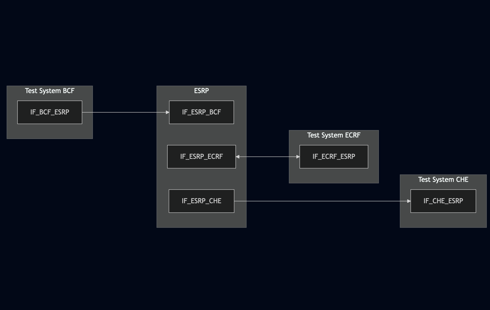
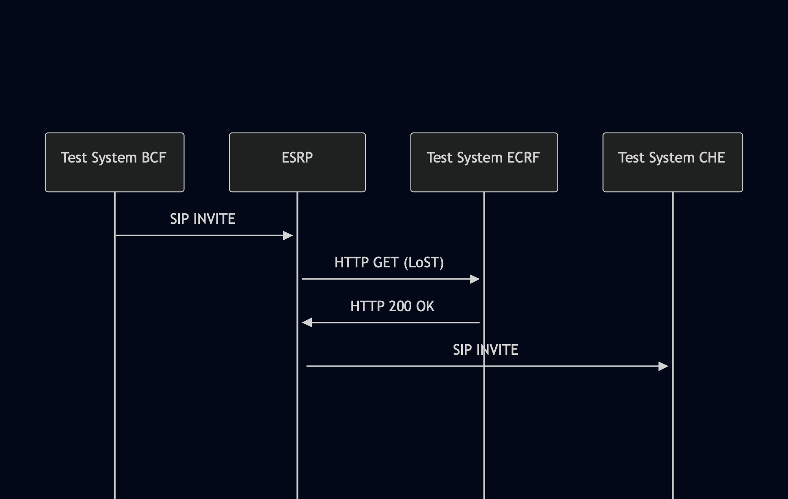

# Test Description: TD_ESRP_006
## Overview
### Summary
SIP INVITE exiting ESRP

### Description
Test verifies SIP INVITE messages exiting ESRP:
- Via header field specifying ESRP
- Route header field containing URI of downstream queue receiving a call
- if Emergency Call Identifier is added
- if Incident Tracking ID is added
- if ESRP do not remove header fields received from upstream interface
- if ESRP has implemented LoST interface


### SIP transport types
Test can be performed with 2 different SIP transport types. Steps describing actions for specific one are marked as following:
- (TLS transport) - used by default inside ESInet on production environment
- (TCP transport) - used in lab for testing purposes only if default TLS is not possible

### References
* Requirements : RQ_ESRP_042, RQ_ESRP_043, RQ_ESRP_045, RQ_ESRP_046, RQ_ESRP_048, RQ_ESRP_049
* Test Case    : TC_ESRP_006

### Requirements
IXIT config file for ESRP

## Configuration
### Implementation Under Test Interface Connections
* Test System BCF (Upstream ESRP)
  * IF_TS1_ESRP - connected to IF_ESRP_TS1
* ESRP
  * IF_ESRP_BCF - connected to Test System BCF IF_BCF_ESRP
  * IF_ESRP_CHE - connected to Test System CHE IF_CHE_ESRP
  * IF_ESRP_ECRF - connected to Test System ECRF IF_ECRF_ESRP
* Test System ECRF
  * IF_ECRF_ESRP - connected to IF_ESRP_ECRF
* Test System CHE (Downstream ESRP)
  * IF_CHE_ESRP - connected to IF_ESRP_CHE


### Test System Interfaces
<!-- Identify each of the test system interfaces and whether it will be in active or monitor mode -->
* Test System BCF (Upstream ESRP)
  * IF_BCF_ESRP - Active
* ESRP
  * IF_ESRP_BCF - Active
  * IF_ESRP_CHE - Monitor
  * IF_ESRP_ECRF - Active
* Test System ECRF
  * IF_ECRF_ESRP - Active
* Test System CHE (Downstream ESRP)
  * IF_CHE_ESRP - Active
 
 
### Connectivity Diagram
<!--
[](https://mermaid.live/edit#pako:eNp9Ul1rgzAU_Styn13xK5qEsYe5ygobDLunIZSsprWsGomRrSv-90XFVh1bnu49Oeeek3DPsBUpBwq7o_jcZkwq4ylOCkOfVbS5D6PNch2_3Ohzt-rrFrwQOmAZxtHtwNB1h04p4eNymKHLEaGq3_eSlZnxyitlrE-V4rlxcZjF6EFepDPt9W7sOZ8yBPkNtqH_mj3OdeUN6ulr_1fPracfobVgwl4eUqBK1tyEnMuctS2cW0oCKuM5T4DqMmXyI4GkaLSmZMWbEPkgk6LeZ0B37Fjpri5TpvjDgek8-QWV2o3LUNSFAuoQtxsC9AxfQD17YbsO8QjCgYttz_JMOGkWQgsU-CiwsE2IF_i4MeG787UWGBPfc23iOMR2EMEmsFqJ9anYDql4elBCPve71q1c8wPt87hI)
-->




## Pre-Test Conditions
### Test System BCF
* Interfaces are connected to network
* Interfaces have IP addresses assigned by DHCP
* Device is active
* No active calls
* Test System has it's own certificate signed by PCA

### ESRP
* Interfaces are connected to network
* Interfaces have IP addresses assigned by DHCP
* Device is active
* Device is in normal operating state
* Device is initialized with steps from IXIT config file
* No active calls
* Logging enabled
* Device is configured to use Test System ECRF for LoST requests on '/lost' URL entrypoint
* Device is configured to use Test System CHE as a next hop host

### Test System ECRF
* Interfaces are connected to network
* Interfaces have IP addresses assigned by DHCP
* Device is active
* Test System has it's own certificate signed by PCA

### Test System CHE
* Interfaces are connected to network
* Interfaces have IP addresses assigned by DHCP
* Device is active
* No active calls
* Test System has it's own certificate signed by PCA

## Test Sequence

### Test Preamble

#### Test System BCF
* Install SIPp by following steps from documentation[^1]
* Copy following XML scenario files to local storage:
  ```
  SIP_INVITE_location_PIDF-LO_Boundary1_without_identifiers.xml
  ```
* Install Wireshark[^2]
* (TLS transport) Copy to local storage PCA-signed TLS certificate and private key files:
  ```
  PCA-cacert.pem
  PCA-cakey.pem
  ```
* (TLS transport) Copy to local storage TLS certificate and private key files used by ESRP:
  ```
  ESRP-cacert.pem
  ESRP-cakey.pem
  ```
* (TLS transport) Configure Wireshark to decode SIP over TLS packets from Test System and ESRP as well[^3]
* Using Wireshark on 'Test System' start packet tracing on IF_BCF_ESRP interface - run following filter:
   * (TLS transport)
     > ip.addr == IF_BCF_ESRP_IP_ADDRESS and tls
   * (TCP transport)
     > ip.addr == IF_BCF_ESRP_IP_ADDRESS and sip

#### Test System CHE
* Install SIPp by following steps from documentation[^1]
* Copy following XML scenario files to local storage:
  ```
  SIP_INVITE_RECEIVE.xml
  ```
* Install Wireshark[^2]
* (TLS transport) Copy to local storage PCA-signed TLS certificate and private key files:
  ```
  PCA-cacert.pem
  PCA-cakey.pem
  ```
* (TLS transport) Copy to local storage TLS certificate and private key files used by ESRP:
  ```
  ESRP-cacert.pem
  ESRP-cakey.pem
  ```
* (TLS transport) Configure Wireshark to decode SIP over TLS packets from Test System and ESRP as well[^3]
* Using Wireshark on 'Test System' start packet tracing on IF_CHE_ESRP interface - run following filter:
   * (TLS transport)
     > ip.addr == IF_CHE_ESRP_IP_ADDRESS and tls
   * (TCP transport)
     > ip.addr == IF_CHE_ESRP_IP_ADDRESS and sip


 #### Test System ECRF
* Install Wireshark[^2]
* Copy following scenario files to local storage:
  ```
  findServiceResponse
  ```
* (TLS transport) Copy to local storage PCA-signed TLS certificate and private key files:
  ```
  PCA-cacert.pem
  PCA-cakey.pem
  ```
* (TLS transport) Copy to local storage TLS certificate and private key files used by ESRP:
  ```
  ESRP-cacert.pem
  ESRP-cakey.pem
  ```
* (TLS transport) Configure Wireshark to decode HTTP over TLS packets from Test System and ESRP as well[^3]
* Using Wireshark on 'Test System' start packet tracing on IF_ECRF_ESRP interface - run following filter:
   * (TLS transport)
     > ip.addr == IF_ECRF_ESRP_IP_ADDRESS and tls
   * (TCP transport)
     > ip.addr == IF_ECRF_ESRP_IP_ADDRESS and sip
* Rename PCA-signed certificate files for Test System ECRF to server.pem and server.key
* Start https server responding for HTTPS GET requests:
   ```
   echo -e "HTTP/1.1 200 OK\r\nContent-Type: application/lost+xml\r\nContent-Length: 1167\r\n\r\n$(cat findServiceResponse | sed -n  '/<?xml/,/findServiceResponse>/p')\r\n" | \
   openssl s_server -quiet -accept LOCAL_PORT -cert server.pem -key server.key
   ```

### Test Body

#### Stimulus
Send SIP packet to ESRP - run following SIPp command on Test System 1, example:
* (TCP transport)
  ```
  sudo sipp -t t1 -sf SIP_INVITE_location_PIDF-LO_Boundary1_without_identifiers.xml -i IF_BCF_ESRP_IP_ADDRESS:5060 IF_ESRP_BCF_IP_ADDRESS:5060 -max_recv_loops 1 -m 1
  ```
* (TLS transport)
  ```
  sudo sipp -t l1 -tls_cert PCA-cacert.pem -tls_key PCA-cakey.pem -sf SIP_INVITE_location_PIDF-LO_Boundary1_without_identifiers.xml -i IF_BCF_ESRP_IP_ADDRESS:5060 IF_ESRP_BCF_IP_ADDRESS:5060 -max_recv_loops 1 -m 1
  ```

#### Response
* ESRP sends HTTP LoST query to Test System ECRF with findService request
* findService request contains geolocation from received SIP INVITE
* SIP INVITE has 'Via' header field specifying ESRP
* SIP INVITE has 'Route' header field containing Test System 2 queue URI received from Test System ECRF
* SIP INVITE has 'Route' header field containing 'lr' parameter
* Verify Emergency Call Identifier included in "Call-Info" header field from SIP INVITE:
  * if header field contains "urn:emergency:uid:callid:"
  * if "urn:emergency:uid:callid:" is followed by 10 to 32 alphanumeric characters (String ID)
  * if String ID is followed by ":" and ESRP domain name
* Verify if Call-Info header field with CallId contains 'emergency-CallId' purpose
* Verify Incident Tracking Identifier included in "Call-Info" header field from SIP INVITE:
  * if header field contains "urn:emergency:uid:incidentid:"
  * if "urn:emergency:uid:incidentid:" is followed by 10 to 32 alphanumeric characters (String ID)
  * if String ID is followed by ":" and ESRP domain name
* Verify if Call-Info header field with IncidentId contains 'emergency-IncidentId' purpose
* verify if all header fields from SIP INVITE received from Test System 1 are included in SIP INVITE addressed to Test System 2

VERDICT:
* PASSED - if all checks passed for variation
* FAILED - all other cases
<!--
* INCONCLUSIVE - 
* ERROR - 
-->

### Test Postamble
#### Test System BCF
* stop Sipp process (if still running)
* archive all logs generated
* stop Wireshark (if still running)
* remove all scenario files
* disconnect interfaces from ESRP
* (TLS transport) remove certificates

#### ESRP
* disconnect interfaces from Test Systems
* reconnect interfaces back to default
* restore previous configuration

#### Test System ECRF
* stop http server
* archive all logs generated
* stop Wireshark (if still running)
* remove all scenario files
* disconnect interfaces from ESRP
* (TLS transport) remove certificates

#### Test System CHE
* stop Sipp process (if still running)
* archive all logs generated
* stop Wireshark (if still running)
* remove all scenario files
* disconnect interfaces from ESRP
* (TLS transport) remove certificates

## Post-Test Conditions
### Test System BCF
* Test tools stopped
* interfaces disconnected from ESRP

### ESRP
* device connected back to default
* device in normal operating state

### Test System ECRF
* Test tools stopped
* interfaces disconnected from ESRP

### Test System CHE
* Test tools stopped
* interfaces disconnected from ESRP

## Sequence Diagram
<!--
[](https://mermaid.live/edit#pako:eNp9Uc9PwjAU_lead9K4kW1srO2BROcQoihhiwfTS7OVseha7LpEJPzv0hGEg_Gd3mu_Hy_v20GhSgEUXNdlslByVVeUSYSaWmulbwujdEvRin-0gske1IrPTshC3Ne80ryx4GPlojUo27ZGNOgumbjj8U2aLRcUZbMFmj2_zvL0DLY_FnFJSpPlhKJpni_QQ5qjqyeV5dd_61vo2aCnBJ6HXh7_d0im6eU64ECl6xKo0Z1woBG64XaEnZVhYNaiEQzooS25fmfA5P7A2XD5plRzomnVVWug_Y0c6DYlN6fj_L5qIUuhE9VJAzT0ew2gO_iy08AfBiQkEY6H2A-90IEt0CCKBlE8imIP-4SE8QjvHfjubb0BxmQUDn0SBMQPIoId4J1R2VYWp6VEWR-imx_D7TPe_wAJqJHU)
-->




## Comments

Version:  010.3d.3.0.9

Date:     20250827

## Footnotes
[^1]: SIPp - tool for SIP packet simulations. Official documentation: https://sipp.sourceforge.net/doc/reference.html#Getting+SIPp
[^2]: Wireshark - tool for packet tracing and anaylisis. Official website: https://www.wireshark.org/download.html
[^3]: Wireshark configuration to decrypt SIP over TLS packets: https://www.zoiper.com/en/support/home/article/162/How%20to%20decode%20SIP%20over%20TLS%20with%20Wireshark%20and%20Decrypting%20SDES%20Protected%20SRTP%20Stream
