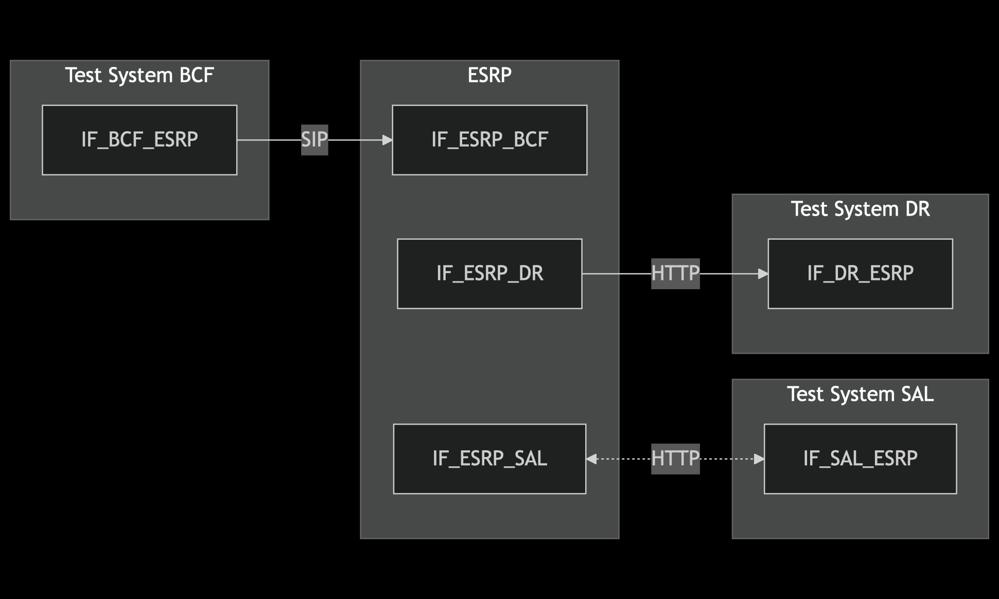
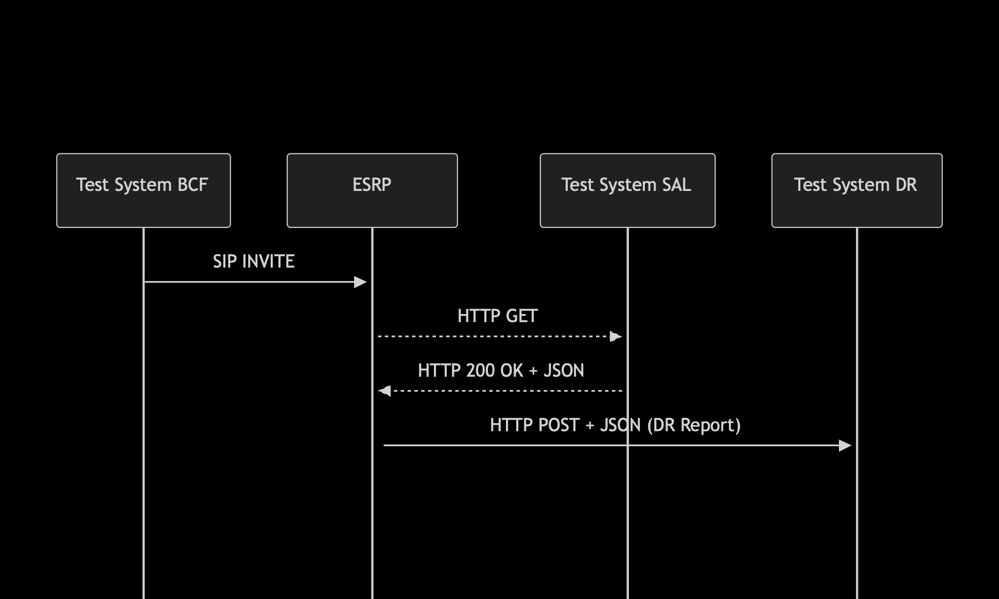

# Test Description: TD_ESRP_007
## Overview
### Summary
Discrepancy Reporting by ESRP on incorrect SIP message from BCF

### Description
This test checks Discrepancy Report sent by ESRP when incorrect SIP message is received from BCF

### SIP and HTTP transport types
Test can be performed with 2 different SIP and HTTP transport types. Steps describing actions for specific one are marked as following:
- (TLS transport) - used by default inside ESInet on production environment
- (TCP transport) - used in lab for testing purposes only if default TLS is not possible

### References
* Requirements : RQ_ESRP_186
* Test Case    : 

### Requirements
IXIT config file for ESRP

## Configuration
### Implementation Under Test Interface Connections
<!-- Identify each of the FEs that are part of the configuration and how they are connected -->
* Test System BCF
  * IF_BCF_ESRP - connected to ESRP IF_ESRP_BCF

* ESRP
  * IF_ESRP_BCF - connected to Test System BCF IF_BCF_ESRP
  * IF_ESRP_DR - connected to Test System DR IF_DR_ESRP
  * IF_ESRP_SAL - connected to Test System SAL IF_SAL_ESRP

* Test System DR
  * IF_DR_ESRP - connected to IF_ESRP_DR

* Test System SAL
  * IF_SAL_ESRP - connected to IF_ESRP_SAL

### Test System Interfaces
<!-- Identify each of the test system interfaces and whether it will be in active or monitor mode -->
* Test System BCF
  * IF_BCF_ESRP - Active

* ESRP
  * IF_ESRP_BCF - Active
  * IF_ESRP_DR - Active
  * IF_ESRP_SAL - Active

* Test System DR
  * IF_DR_ESRP - Active

* Test System SAL
  * IF_SAL_ESRP - Monitor

 
### Connectivity Diagram
<!--
[](https://mermaid.live/edit#pako:eNp9kl1rgzAYhf-KvNdW_GqiYQy2urJCB0W9GkLJNK1l1UiMbF3b_75oV1dbqFd5T56TcyLZQ8ozBgRWW_6V5lRIbR4mpaa-2XT5PJkuX6JwMRo9HqLZ4jA7ja3eM50QhC3yGscdE4SdOkSip_nDyLiglHCB1c3HWtAq12JWSy3a1ZIVWp9z1ecksjK741XHD7zDuFvv_95l6-sGf7e91fq4-62urIM_pZygw1psMiBSNEyHgomCtiPsWyQBmbOCJUDUMqPiM4GkPCpPRct3zouzTfBmnQNZ0W2tpqbKqGTBhqo2Ra8KlcbEhDelBIKR1R0CZA_fQFzfsEzkIg-jsWs6GI912AHxHANbjuV7nu0j5NvWUYefLtY0PM90Fexi37QR9l0daCN5tCvTcymWbSQXb6fX1j264y8A1btS)
-->




## Pre-Test Conditions

### Test System BCF
* Interfaces are connected to network
* Interfaces have IP addresses assigned by DHCP
* Device is active
* No active calls

### Test System SAL
* Interfaces are connected to network
* Interfaces have IP addresses assigned by DHCP
* Device is active

### ESRP
* Interfaces are connected to network
* Interfaces have IP addresses assigned by DHCP
* Default configuration is loaded
* Device is initialized with steps from IXIT config file
* Device is active
* Device is in normal operating state
* No active calls

### Test System DR
* Interfaces are connected to network
* Interfaces have IP addresses assigned by DHCP
* Device is active


## Test Sequence
### Test Preamble
#### Test System BCF
* Install SIPp by following steps from documentation[^2]
* Copy following XML scenario files to local storage:
  ```
  SIP_INVITE_from_BCF_incorrect.xml
  ```
* (TLS transport) Copy to local storage SIP TLS certificate and private key files used to decrypt SIP packets within ESInet:
  > cacert.pem
  > cakey.pem

#### Test System SAL
* Install Netcat (NC)[^1]
* Copy following JSON files to local storage:
  ```
  SAL_response_DR_server_v010.3f.4.0.2.json
  ```
* Edit a JSON file to use addresses of Test System DR (replace TEST_SYSTEM_DR_URI with HTTP URI)
* (TLS transport) Copy to local storage SIP TLS certificate and private key files used to decrypt SIP packets within ESInet:
  > cacert.pem
  > cakey.pem

#### ESRP
* Configure default Service/Agency Locator server server to 'Test System SAL'
* Reload configuration (or reboot device)

#### Test System DR
* Install SIPp by following steps from documentation[^2]
* Install Netcat (NC)[^1]
* Install Wireshark[^3]
* (TLS transport) Copy to local storage SIP TLS certificate and private key files used to decrypt SIP packets within ESInet:
  > cacert.pem
  > cakey.pem
* (TLS transport) Configure Wireshark to decode SIP over TLS packets[^4]
* On 'Test System ESRP' Start simple HTTP server basing on netcat. Used to receive HTTP request and respond with 201 code
   * (TLS transport)
     > echo -e 'HTTP/1.1 201 Discrepancy Resolution successfully created\r\nContent-Length: 0\r\n' | nc -lp 443
   * (TCP transport)
     > echo -e 'HTTP/1.1 201 Discrepancy Resolution successfully created\r\nContent-Length: 0\r\n' | nc -lp 80

* Using Wireshark on 'Test System DR' start packet tracing on IF_DR_ESRP interface - run following filter:
   * (TLS transport)
     > ip.addr == IF_DR_ESRP_IP_ADDRESS and tls
   * (TCP transport)
     > ip.addr == IF_DR_ESRP_IP_ADDRESS and http


### Test Body

#### Stimulus
Send SIP packet to ESRP - run SIPp command with scenario file on Test System BCF, example:
* (TCP transport)
  ```
  sudo sipp -t t1 -sf SIP_INVITE_from_BCF_incorrect.xml IF_BCF_ESRP_IPv4:5060
  ```
* (TLS transport)
  ```
  sudo sipp -t l1 -sf SIP_INVITE_from_BCF_incorrect.xml IF_BCF_ESRP_IPv4:5061
  ```

#### Response
* Using Wireshark open Discrepancy Report (HTTP packet) received from BCF on IF_ESRP_DR for verification, following header fields and values should be included in JSON message:
  ```
  "request": "SIP_INVITE_MESSAGE"  <-- SIP INVITE message of stimulus sent (from file SIP_INVITE_from_BCF_incorrect.xml)
  "problem": "BadSIP"
  "sosSource": "f.e. <a7123gc42@sbc22.example.net>;purpose=emergency-source" <-- Call-Info header field value with parameter 'purpose=emergency-source' from stimulus SIP INVITE
  "eventTimestamp": "CORRECT TIMESTAMP f.e. 2015-08-21T12:58:03.01-05:00"
  "packetHeader": "OPTIONAL string"
  ```


VERDICT:
* PASSED - if all checks passed for variation
* INCONCLUSIVE - other cases

**TEST CANNOT BE FAILED !**
**This test is based on requirement which is SHOULD - if any of steps has failed, then final verdict cannot be marked as failed!**


### Test Postamble
#### Test System BCF
* stop all SIPp processes (if still running)
* archive all logs generated
* remove all SIPp scenarios
* disconnect interfaces from ESRP
* (TLS transport) remove certificates

#### Test System SAL
* disconnect interfaces from ESRP
* (TLS transport) remove certificates

#### ESRP
* disconnect IF_ESRP_BCF
* disconnect IF_ESRP_DR
* disconnect IF_ESRP_SAL
* reconnect interfaces back to default

#### Test System DR
* stop all SIPp processes (if still running)
* stop Wireshark (if still running)
* archive traced packets in Wireshark
* disconnect interfaces from ESRP
* (TLS transport) remove certificates


## Post-Test Conditions
### Test System BCF
* Test tools stopped
* interfaces disconnected from ESRP

### Test System SAL
* Test tools stopped
* interfaces disconnected from ESRP

### ESRP
* device connected back to default
* device in normal operating state

### Test System DR
* Test tools stopped
* interfaces disconnected from ESRP

## Sequence Diagram
<!--
[](https://mermaid.live/edit#pako:eNplkctuwjAQRX9lNKtWJCgv8vACiQJt6QOiJOqiysZKTIja2NRxpFLEvzcJ0KJ2Z8-cObbm7jETOUOCuq6nPBN8XRYk5QBVKaWQk0wJWRNY0_eapbyHavbRMJ6xWUkLSasOBkhYrSDe1YpVcDO91cfjwTyOQgLxIoTF8mWRzI9gV9W79uVEPHkicJ8kIdzNk__Ctq3_GnvOMgxYPcIAHuLV8sL8RzyLTny4ipMTDVezCCK2FVJdpxw1LGSZI1GyYRpWTFa0u-K-s6aoNqxiKZL2mFP5lmLKD-3MlvJXIarzmBRNsUHSr0nDZptTdd7PT1UynjM5FQ1XSMyR3UuQ7PETiRMMTcN1XN9zR45he95Iwx0S3x56pm0Gvm8FrhtY5kHDr_5ZY-j7htPCjhcYlusFjoa0USLe8ez8KZaXbXrPx3z7mA_fAiaVIg)
-->




## Comments

Version:  010.3d.5.3.8

Date:     20260128


## Footnotes
[^1]: Netcat for Linux https://linux.die.net/man/1/nc
[^2]: SIPp - tool for SIP packet simulations. Official documentation: https://sipp.sourceforge.net/doc/reference.html#Getting+SIPp
[^3]: Wireshark - tool for packet tracing and anaylisis. Official website: https://www.wireshark.org/download.html
[^4]: Wireshark configuration to decrypt SIP over TLS packets: https://www.zoiper.com/en/support/home/article/162/How%20to%20decode%20SIP%20over%20TLS%20with%20Wireshark%20and%20Decrypting%20SDES%20Protected%20SRTP%20Stream
