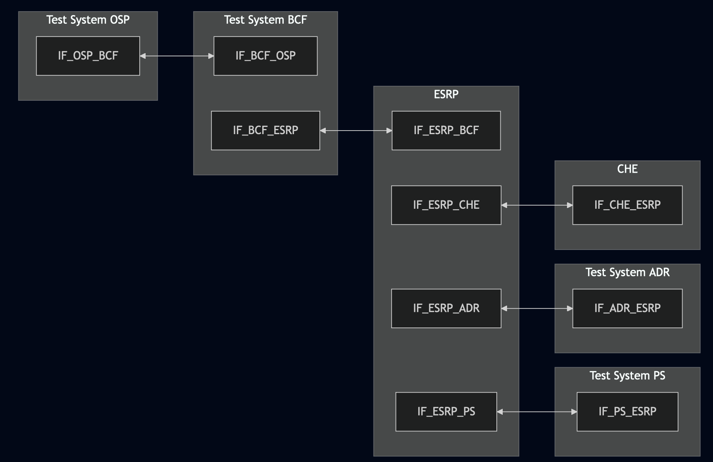
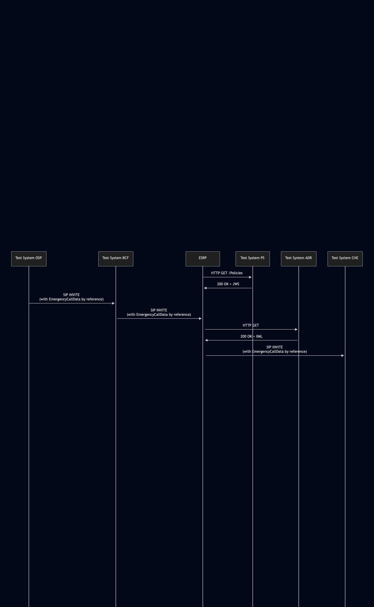

# Test Description: TD_ESRP_008
## Overview
### Summary
Retrieving Additional Data

### Description
This test checks if ESRP has implemented mechanisms for retrieving Additional Data:
- dereferencing URIs from Call-Info header fields
- dereferencing URIs from PIDF-LO body
<!-- - querying IS-ADR - not supported yet, no need to cover this mechanism-->
<!-- - by location based query to the ECRF - not required (MAY), can be covered in future, 
useful info in sections 4.2.2.3 and 4.3.3.4 -->

### SIP and HTTP transport types
Test can be performed with 2 different SIP and HTTP transport types. Steps describing actions for specific one are marked as following:
- (TLS transport) - used by default inside ESInet on production environment
- (TCP transport) - used in lab for testing purposes only if default TLS is not possible

### References
* Requirements : RQ_ESRP_055
* Test Case    : 

### Requirements
IXIT config file for ESRP

## Configuration
### Implementation Under Test Interface Connections
<!-- Identify each of the FEs that are part of the configuration and how they are connected -->
* Test System OSP
  * IF_OSP_BCF - connected to IF_BCF_OSP

* Test System BCF
  * IF_BCF_OSP - connected to IF_OSP_BCF
  * IF_BCF_ESRP - connected to IF_ESRP_BCF

* ESRP
  * IF_ESRP_BCF - connected to IF_BCF_ESRP
  * IF_ESRP_PS - connected to IF_PS_ESRP
  * IF_ESRP_ADR - connected to IF_ADR_ESRP
  * IF_ESRP_CHFE - connected to IF_CHFE_ESRP

* Test System PS
  * IF_PS_ESRP - connected to IF_ESRP_PS

* Test System ADR
  * IF_ADR_ESRP - connected to IF_ESRP_ADR

* Test System CHFE
  * IF_CHFE_ESRP - connected to IF_ESRP_CHFE

### Test System Interfaces
<!-- Identify each of the test system interfaces and whether it will be in active or monitor mode -->
* Test System OSP
  * IF_OSP_BCF - Active

* Test System BCF
  * IF_BCF_OSP - Active
  * IF_BCF_ESRP - Active

* ESRP
  * IF_ESRP_BCF - Active
  * IF_ESRP_PS - Active
  * IF_ESRP_ADR - Active
  * IF_ESRP_CHFE - Monitor

* Test System PS
  * IF_PS_ESRP - Active

* Test System ADR
  * IF_ADR_ESRP - Active

* Test System CHFE
  * IF_CHFE_ESRP - Monitor

 
### Connectivity Diagram
<!--
https://mermaid.live/edit#pako:eNqFU11rwjAU_SvlPlep7VJNGIOtKhtsrNg9jYJkbbQy20iasjnxvy9tY7XVuUDg3nPuuV8hO4h4zIDAYs2_ooQKaTzPwsxQ52k6fw38-YM3ve317pSnrBJp2NKfBDNf06VZYg1fAX6gaT-ogDZ7P55pWlkXeO9xonllab6OyIuPpaCbxHhjuTSCbS5ZajTdtfuvMZbFV6RN2Mlw3XSHgf_Kd-ROZ-hm1ms5x9QKzkE190m5KwN0MrbW_Z-2W7n9GJfUTVtacXwerQATlmIVA5GiYCakTKS0dGFXhoQgE5ayEIgyYyo-QwizvdJsaPbOeXqQCV4sEyALus6VV2xiKtl4RVUPaYMKVY0JjxeZBIKsUZUEyA6-gYycPh5ZrrrIHlqua8IWyBD1bRvZLraR5Vg2dvYm_FRFrb6LseMgNEA3GA8GyARaSB5ss-jQEYtXkouX-tNUf2f_C0ut8W4
-->




## Pre-Test Conditions

### Test System OSP, Test System BCF, Test System CHFE
* Interfaces are connected to network
* Interfaces have IP addresses assigned by DHCP
* Device is active
* No active calls

### Test System ADR, Test System PS
* Interfaces are connected to network
* Interfaces have IP addresses assigned by DHCP
* Device is active

### ESRP
* Interfaces are connected to network
* Interfaces have IP addresses assigned by DHCP
* Default configuration is loaded
* Device is initialized with steps from IXIT config file
* Device is active
* Device is in normal operating state
* No active calls


## Test Sequence
### Test Preamble
#### Test System OSP
* Install SIPp by following steps from documentation[^2]
* Copy following XML scenario files to local storage:
  ```
  SIP_INVITE_from_OSP_with_ADR_reference.xml
  ```
* (TLS transport) Copy to local storage SIP TLS certificate and private key files used to decrypt SIP packets within ESInet:
  > cacert.pem
  > cakey.pem

#### Test System BCF
* Install SIP service by following steps from documentation[^1]
* Copy following XML scenario files to local storage:
  ```
  SIP_INVITE_from_OSP_with_ADR_reference.xml
  ```
* (TLS transport) Copy to local storage SIP TLS certificate and private key files used to decrypt SIP packets within ESInet:
  > cacert.pem
  > cakey.pem

#### Test System CHFE
* Install SIPp by following steps from documentation[^2]
* Install Wireshark[^3]
* (TLS transport) Configure Wireshark to decode SIP over TLS packets[^4]
* Copy following XML scenario files to local storage:
  ```
  SIP_INVITE_RECEIVE.xml
  ```
* (TLS transport) Copy to local storage SIP TLS certificate and private key files used to decrypt SIP packets within ESInet:
  > cacert.pem
  > cakey.pem
* Using Wireshark on 'Test System CHFE' start packet tracing on IF_CHFE_ESRP interface - run following filter:
   * (TLS transport)
     > ip.addr == IF_CHFE_ESRP_IP_ADDRESS and tls
   * (TCP transport)
     > ip.addr == IF_CHFE_ESRP_IP_ADDRESS and http

#### Test System PS
* Install Netcat (NC)[^5]
* (TLS transport) Install OpenSSL[^6]
* (TLS transport) Copy to local storage SIP TLS certificate and private key files used to decrypt SIP packets within ESInet:
  > cacert.pem
  > cakey.pem
* Copy following JSON files to local storage:
  ```
  Policy_object_AdditionalDataCondition_v010.3f.5.0.1.json
  ```
* go to test_suite directory, run script to generate JWS object for JSON file, example:
```
python -m main generate_jws Policy_object_AdditionalDataCondition_v010.3f.5.0.1.json --cert cacert.pem --key cakey.pem
-- output_file /tmp/ESRP_008_policy_object_adr.json
```
* Start http server responding for HTTPS GET requests:
    * (TCP transport)
      ```
      echo -e "HTTP/1.1 200 OK\r\nContent-Type: application/json\r\n\r\n$(cat /tmp/ESRP_008_policy_object_adr.json | \
      nc -lp 8080
      ```
    * (TLS transport)
      ```
      echo -e "HTTP/1.1 200 OK\r\nContent-Type: application/json\r\n\r\n$(cat /tmp/ESRP_008_policy_object_adr.json | \
      openssl s_server -quiet -accept LOCAL_PORT -cert cacert.pem -key cakey.pem
      ```


#### ESRP
* Configure default Policy Store to Test System PS
* Configure default Additional Data Repository to Test System ADR
* Reload configuration (or reboot device)

#### Test System ADR
* Install Netcat (NC)[^1]
* Install Wireshark[^3]
* (TLS transport) Configure Wireshark to decode HTTP over TLS packets[^4]
* (TLS transport) Install OpenSSL[^6]
* (TLS transport) Copy to local storage SIP TLS certificate and private key files used to decrypt SIP packets within ESInet:
  > cacert.pem
  > cakey.pem
* Using Wireshark on 'Test System ADR' start packet tracing on IF_ADR_ESRP interface - run following filter:
   * (TLS transport)
     > ip.addr == IF_ADR_ESRP_IP_ADDRESS and tls
   * (TCP transport)
     > ip.addr == IF_ADR_ESRP_IP_ADDRESS and http
* Start http server responding for HTTP GET requests:
    * (TCP transport)
      ```
      echo -e "HTTP/1.1 200 OK\r\nContent-Type: application/xml\r\n\r\n$(cat ADR_response.xml | \
      nc -lp 8080
      ```
    * (TLS transport)
      ```
      echo -e "HTTP/1.1 200 OK\r\nContent-Type: application/xml\r\n\r\n$(cat ADR_response.xml | \
      openssl s_server -quiet -accept LOCAL_PORT -cert cacert.pem -key cakey.pem
      ```


### Test Body
#### Variations

1. Reference URI in Call-Info header field
2. Reference URI in PIDF-LO body
<!-- 3. Querying IS-ADR -->


#### Stimulus
Send SIP packet to Test System BCF - run SIPp command with scenario file on Test System OSP, example:
* (TCP transport)
  ```
  sudo sipp -t t1 -sf SIP_INVITE_from_OSP_with_ADR_reference.xml IF_OSP_BCF_IPv4:5060
  ```
* (TLS transport)
  ```
  sudo sipp -t l1 -sf SIP_INVITE_from_OSP_with_ADR_reference.xml -tls_cert cacert.pem -tls_key cakey.pem IF_OSP_BCF_IPv4:5061
  ```

#### Response

Using Wireshark verify if ESRP:
- after receiving SIP INVITE with ADR reference sends HTTP GET request to Test System ADR
- if SIP INVITE sent to Test System CHFE contain unchanged ADR references - comparing to incoming SIP INVITE

VERDICT:
* PASSED - if all checks passed for variation
* INCONCLUSIVE - other cases


### Test Postamble
#### Test System OSP,Test System  BCF, Test System CHFE
* stop all SIPp processes (if still running)
* archive all logs generated
* remove all SIPp scenarios
* disconnect interfaces from ESRP
* stop Wireshark (if still running)
* (TLS transport) remove certificates

#### ESRP
* reconnect interfaces back to default

#### Test System ADR, Test System PS
* stop all NC processes (if still running)
* (TLS transport) stop all OpenSSL processes (if still running)
* stop Wireshark (if still running)
* archive traced packets in Wireshark
* disconnect interfaces from ESRP
* (TLS transport) remove certificates


## Post-Test Conditions
### Test System OSP,Test System  BCF, Test System CHFE, Test System ADR, Test System PS
* Test tools stopped
* interfaces disconnected from ESRP

### ESRP
* device connected back to default
* device in normal operating state

## Sequence Diagram
<!--
https://mermaid.live/edit#pako:eNqdk1FvmzAUhf_K1X1qVZICTUywpkhdwtZsTYsK2qaJFxccghbs1BhtNMp_ryFKqy5dJvUNrr97zuXgu8FUZhwp9nq9RKRSLIqcJgKgLJSS6jLVUlUUFmxV8UR0UMUfai5SPi1YrljZwgBrpnSRFmsmNMS80hA1leYl3EbhceDj5NMhEER3_2kLo-Pnl9O748DkKtgBrVdvPD57rU7hKo5D-BzEcB7KlVHg1Y5_zbWdrQIF17bh9iucwZfv0SFpcvjbxHw5hWgWwuzm2ywOPtyr8_HJ70IvISi5yk3EzYStVlOmGdw3oPiCqzb300N1I_UyyPsl34rCBPmSxaGzOX4jgh_z638rmuTfNyRamKsiQ6pVzS00cMnaV9y0ZgnqJS95gtQ8Zkz9SjARW9Njfv1PKct9m5J1vkTa3WgL63XG9P4qP1eNX8bVRNZCI3Vt1-lUkG7wD1Jn0Hd9xxt59tB3CfGIZ2FjymTQd4jjXxB7NBoOTXlr4WNn7PRNMq7jj4hPnAsy8IYWslrLqBHpfiyeFWbV5rtl7HZy-wQa8iQY
-->




## Comments

Version:  010.3d.5.0.3

Date:     20251113


## Footnotes
[^1]: SIP Python service: 

[^2]: SIPp - tool for SIP packet simulations. Official documentation: https://sipp.sourceforge.net/doc/reference.html#Getting+SIPp

[^3]: Wireshark - tool for packet tracing and anaylisis. Official website: https://www.wireshark.org/download.html

[^4]: Wireshark configuration to decrypt SIP over TLS packets: https://www.zoiper.com/en/support/home/article/162/How%20to%20decode%20SIP%20over%20TLS%20with%20Wireshark%20and%20Decrypting%20SDES%20Protected%20SRTP%20Stream

[^5]: Netcat for Linux https://linux.die.net/man/1/nc

[^6]: OpenSSL for Linux https://openssl-library.org/source/