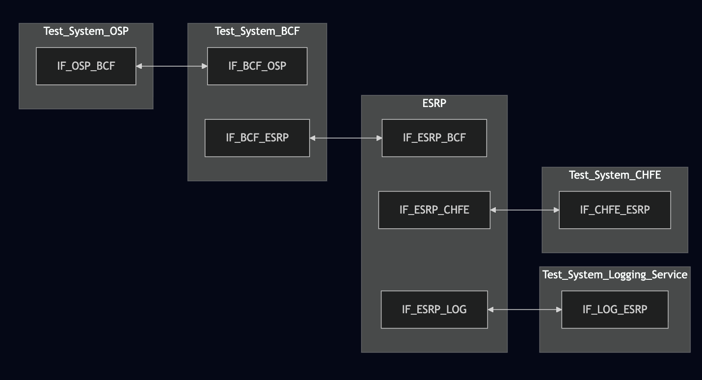
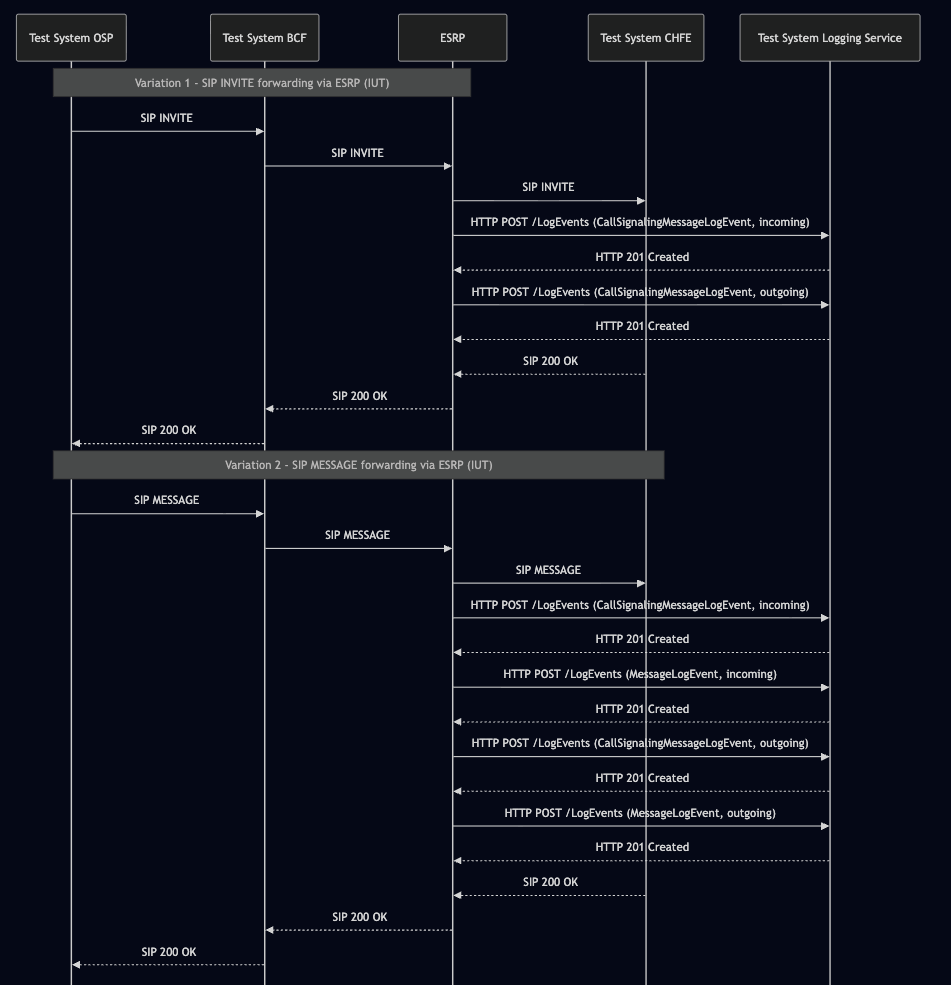

# Test Description: TD_ESRP_009
## Overview
### Summary
Validation of logging MessageLogEvent and CallSignalingMessageLogEvent for outgoing SIP signaling messages.

### Description
This test ensures the ESRP correctly generates MessageLogEvent and CallSignalingMessageLogEvent every time it forwards
a SIP message (INVITE, MESSAGE) to another FE (e.g., BCF, Bridge, CHFE).

### SIP and HTTP transport types
Test can be performed with 2 different SIP and HTTP transport types. Steps describing actions for specific one are marked as following:
- (TLS transport) - used by default inside ESInet on production environment
- (TCP transport) - used in lab for testing purposes only if default TLS is not possible

### References
* Requirements : RQ_ESRP_117, RQ_ESRP_118, RQ_ESRP_146
* Test Case    : TC_ESRP_*

### Requirements
IXIT config file for ESRP

## Configuration
### Implementation Under Test Interface Connections
<!-- Identify each of the FEs that are part of the configuration and how they are connected -->
* Test System OSP
  * IF_OSP_BCF - connected to BCF IF_BCF_OSP

* ESRP
  * IF_ESRP_BCF – connected to BCF IF_BCF_ESRP
  * IF_ESRP_LOG – connected to Logging Service IF_LOG_ESRP 
  * IF_ESRP_CHFE - connected to IF_CHFE_ESRP

* Test System BCF
  * IF_BCF_OSP - connected to Test System IF_OSP_BCF
  * IF_BCF_ESRP – connected to ESRP IF_ESRP_BCF

* Test System Logging Service (LOG)
  * IF_LOG_ESRP – connected to ESRP IF_ESRP_LOG
  
* Test System CHFE
  * IF_CHFE_ESRP - connected to IF_ESRP_CHFE


### Test System Interfaces
<!-- Identify each of the test system interfaces and whether it will be in active or monitor mode -->
* Test System OSP
  * IF_OSP_BCF - Active

* Test System BCF
  * IF_BCF_OSP - Active
  * IF_BCF_ESRP - Active

* ESRP
  * IF_ESRP_BCF - Active
  * IF_ESRP_CHFE - Monitor
  * IF_ESRP_LOG - Active

* Test System CHFE
  * IF_CHFE_ESRP - Monitor

 
### Connectivity Diagram
<!--
https://mermaid.live/edit#pako:eNqNU11vgjAU_SvmJntDA4jAyLZEGX4kbhpxLwuJ6aACmVBTyzZn_O9rEVCcy2xf7j3nnvvVdAc-CTBYsFyRTz9ClDXGMy9t8HNz07i_eCp69Dx3Zv2u7bhXKUb9xcSdLnp2_67ZfOAetwRSscJ33Nm0oIUpsIrPgfFkUPDcyqE6bw_7ThEgzCJC3OuGcl96g1l3Orxupk32FlK0jhpzvGELd7thODnOVJ_6gOE0KJu5KK4CT5ZynrBc1N8Zj-zpbs5zlwv9DYrVXdfvmIRhnIYLF9OP2Me1VPUX-i_TsWYhP3m_Sg8ShDQOwGI0wxIkmCZIuLATQR6wCCfYA4ubAaLvHnjpnmvWKH0lJClllGRhBNYSrTbcy9YBYvgxRrynpEIpr4epTbKUgaWonTwJWDv44q7SbmmyYRqKpmmGJuu3EmwFbLQU3ZRVw-yopqrpewm-87Jyy5TNtqyZmq6aumG0DQlQxoi7Tf2yKRzEjNCnw3_Mv-X-BwsxB4w
-->




## Pre-Test Conditions

### Test System OSP, Test System BCF, Test System CHFE
* Interfaces are connected to network
* Interfaces have IP addresses assigned by DHCP
* Device is active
* No active calls
* Logging service enabled

### Test System Logging Service
* Interfaces connected

### ESRP
* Interfaces are connected to network
* Interfaces have IP addresses assigned by DHCP
* Default configuration is loaded
* Device is initialized with steps from IXIT config file
* Device is active
* Device is in normal operating state
* No active calls


## Test Sequence
### Test Preamble
#### Test System OSP
* Install SIPp by following steps from documentation[^2]
* Copy following XML scenario files to local storage:
  ```
  SIP_basic_call.xml
  g711ulaw_rtp_stream.pcap
  ```
* (TLS transport) Copy to local storage SIP TLS certificate and private key files used to decrypt SIP packets within ESInet:
  > cacert.pem
  > cakey.pem

#### Test System BCF
* Install SIP service by following steps from documentation[^1]
* Copy following XML scenario files to local storage:
  ```
  BCF_simple.xml
  BCF_simple_SIP_MESSAGE.xml
  ```
* (TLS transport) Copy to local storage SIP TLS certificate and private key files used to decrypt SIP packets within ESInet:
  > cacert.pem
  > cakey.pem

#### Test System CHFE
* Install SIPp by following steps from documentation[^2]
* Install Wireshark[^3]
* (TLS transport) Configure Wireshark to decode SIP over TLS packets[^4]
* Copy following XML scenario files to local storage:
  ```
  SIP_RECEIVE_basic_call_and_answer.xml
  SIP_RECEIVE_MESSAGE_and_answer.xml
  ```
* (TLS transport) Copy to local storage SIP TLS certificate and private key files used to decrypt SIP packets within ESInet:
  > cacert.pem
  > cakey.pem
* Using Wireshark on 'Test System CHFE' start packet tracing on IF_CHFE_ESRP interface - run following filter:
   * (TLS transport)
     > ip.addr == IF_CHFE_ESRP_IP_ADDRESS and tls
   * (TCP transport)
     > ip.addr == IF_CHFE_ESRP_IP_ADDRESS and http

#### Test System Logging Service
* Install Wireshark[^1]
* (TLS v1.2) Configure Wireshark to decode HTTP over TLS, use tests system and PS certificate keys [^2]
* (TLS v1.3) Configure logging of session keys and configure Wireshark to decode HTTP over TLS [^3]
* Using Wireshark on 'Test System LOG' start packet tracing on IF_LOG_ESRP interface - run following filter:
   * (TLS)
     > ip.addr == IF_LOG_ESRP_IP_ADDRESS and tls
   * (TCP)
     > ip.addr == IF_LOG_ESRP_IP_ADDRESS and http
* The Logging Service must be configured to accept and process HTTP POST requests.
  * To verify this manually, you can simulate a listening HTTP endpoint on port 8080 using command in the terminal:
  * for TLS:
    * `python3 http_entry.py --ip IF_LOG_ESRP --port 8080 --role RECEIVER --path /LogEvents --method POST --body "HTTP/1.1 201 Log Event Successfully Logged\r\nContent-Length: 0\r\n\r\n" --server_cert /tmp/cert.crt --server_key /tmp/cert.key`
    * In another terminal, send a POST request to verify it is working:
      * `curl -k -X POST https://localhost:8080 -d '{"log":"test"}'`
  * non TLS:
    * `while true; do echo -e "HTTP/1.1 201 Log Event Successfully Logged\r\n\r\n" | nc -l -p 8080 -q 1; done`
    * In another terminal, send a POST request to verify it is working:
      * `curl -X POST http://localhost:8080 -d '{"log":"test"}'`   


### Test Body
#### Variations

1. SIP INVITE - ESRP logging for outgoing SIP INVITE
2. SIP MESSAGE - ESRP logging for outgoing SIP MESSAGE


#### Stimulus
Send SIP packet to ESRP, via BCF - run SIPp command with scenario file on Test System OSP, example:
Variation 1
    * (TCP transport)
      ```
      sudo sipp -t t1 -sf SIP_basic_call.xml -i IF_OSP_BCF -p 5060 -m 1 IF_BCF_OSP:5060
      ```
    * (TLS transport)
      ```
      sudo sipp -t l1 -sf SIP_basic_call.xml -tls_cert cacert.pem -tls_key cakey.pem -i IF_OSP_BCF -p 5061 IF_BCF_OSP_IPv4:5061
      ```
Variation 2
    * (TCP transport)
      ```
      sudo sipp -t t1 -sf SIP_MESSAGE_from_OSP.xml -i IF_OSP_BCF -p 5060 -m 1 IF_BCF_OSP:5060
      ```
    * (TLS transport)
      ```
      sudo sipp -t l1 -sf SIP_MESSAGE_from_OSP.xml -tls_cert cacert.pem -tls_key cakey.pem -i IF_OSP_BCF -p 5061 IF_BCF_OSP_IPv4:5061
      ```

#### Response

Variation 1 + Variation 2
 - For each stimulus SIP INVITE/MESSAGE (or any other) sent to or received: ESRP generates a 'CallSignalingMessageLogEvent' record.
 - For each stimulus with 'CallSignalingMessageLogEvent' logEvent, with 'direction: "incoming"' sent to ESRP:
   - there must be corresponding 'CallSignalingMessageLogEvent' with 'direction: "outgoing"' sent from ESRP, with the same Call-ID.
 - Each HTTP POST to /LogEvents must contain a JWS body (JSON payload) conforming to NENA-STA-010.3 (5.10 JSON Web signatures)

Each CallSignalingMessageLogEvent record includes:
 - `logEventType`:`"CallSignalingMessageLogEvent"` --> Identifies this as a call-signaling message event
 - `timestamp`: ISO 8601 UTC --> Time of signaling message capture
 - `elementId`: FQDN of element --> FQDN of the ESRP
 - `agencyId`: Agency domain --> FQDN
 - `direction`: `"incoming"` or `"outgoing"` --> Message direction
 - `protocol`: (Optional) String from LogEvent Protocol Registry (e.g., "SIP")
 - `callId`: Same value as in Call-ID header field of SIP INVITE/SIP MESSAGE (received or sent by ESRP)
 - `incidentId`: Same value as incidentid from SIP INVITE/SIP MESSAGE (received or sent by ESRP)
 - `callIdSIP`: SIP Call-ID header --> Same correlation
 - `ipAddressPort`: `"A.B.C.D:port"` --> Source/destination transport info        
 - `text`: Full SIP message body (INVITE, MESSAGE, etc.), contain text of corresponding message e.g. text of SIP INVITE from Test System OSP --> Must include all headers and CRLF line endings.

Variation 2:
 - ESRP should also send 2x HTTP POST messages containing JWS with `logEventType`:`"MessageLogEvent"`, 1x with `direction`: `"incoming"` and 1x `"outgoing"`

VERDICT:
* PASSED - if all checks passed for variation.
* FAILED - if ESRP won't route and receive messages, and not produce Log Events.


### Test Postamble
#### Test System OSP,Test System  BCF, Test System CHFE
* stop all SIPp processes (if still running)
* archive all logs generated
* remove all SIPp scenarios
* disconnect interfaces from ESRP
* stop Wireshark (if still running)
* (TLS transport) remove certificates

#### ESRP
* reconnect interfaces back to default


## Post-Test Conditions
### Test System OSP,Test System  BCF, Test System CHFE, Test System ADR, Test System PS
* Test tools stopped
* interfaces disconnected from ESRP

### ESRP
* device connected back to default
* device in normal operating state

## Sequence Diagram
<!--
https://mermaid.live/edit#pako:eNrNVVtv2jAY_SufLFVqpaQL4RKItEqM0RWNm-qMhykvVmJSa8TuHIeNIf777ARoQ_ZQuouWF8J3jr_L8YFviyIRU-Qj27ZDHgm-ZIkfcoCUSSlkP1JCZj4sySqjIS9IGf2aUx7R94wkkqSGDHBxAXMiFYvYI-EqK4OPTxGY4TmQDAKaKcCbTNHUhOq84N3g9pSoQ3XiEN8XGc1nHR3c3Q5P05hYnTnGp7yxSBLGE8BUrlmkxz6O-PaXzxFe9O9H_WA0m0IDbMCjOYymi1EwfNH5qVAUxJpKo4tlpvJhQSQjigl-khCWQn4jMjZdrhkptbgcfQquDs3qHPbNjRHTrzViohosS5yCJqpBo1UVPGTeE8bYh7sgmMN8hgN4ozUbrqm-ebgckNUKs4STlW5vQrOMJPQAW8C0yVINXJXZxtg-tlKkc50GDCQlisZ_pJ7IVSJeWq_kmNntikCu48Ds47N-Kto-RwttNar1r4Lne8jdX_lkiHH_w2tMVF7ik4lOMp7vokorNRtV0JqPjuh_aqPfK_Hvvfq6oc4u8dd-EshCiWQx8pXMqYVSKlNivqKtORYi9UBTGiJfv8ZEfglRyHf6jP7P_ixEejgmRZ48IL_YTxbKH2Pd-X4xHSmUx1QORM4V8ttFBuRv0XfkN9zedaflee2257bavWZLoxvN6V53nWa36zW8TqvbdHo7C_0oajoa8Fq9ttvsNHsdr9vrWIjkSuANjw7laMz0zpyUW7VYrrufhiEq8A
-->




## Comments

Version:  010.3f.5.0.5

Date:     20260209


## Footnotes
[^1]: SIPp - tool for SIP packet simulations. Official documentation: https://sipp.sourceforge.net/doc/reference.html#Getting+SIPp
[^2]: Wireshark - tool for packet tracing and anaylisis. Official website: https://www.wireshark.org/download.html
[^3]: Wireshark configuration to decrypt SIP over TLS packets: https://www.zoiper.com/en/support/home/article/162/How%20to%20decode%20SIP%20over%20TLS%20with%20Wireshark%20and%20Decrypting%20SDES%20Protected%20SRTP%20Stream
[^4]: Netcat for Linux https://linux.die.net/man/1/nc
[^5]: OpenSSL for Linux https://openssl-library.org/source/
