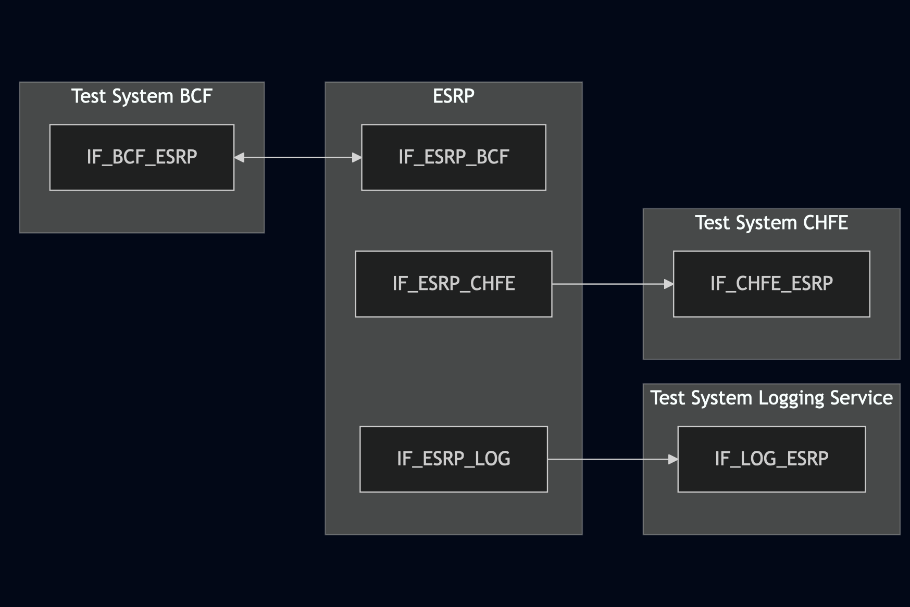
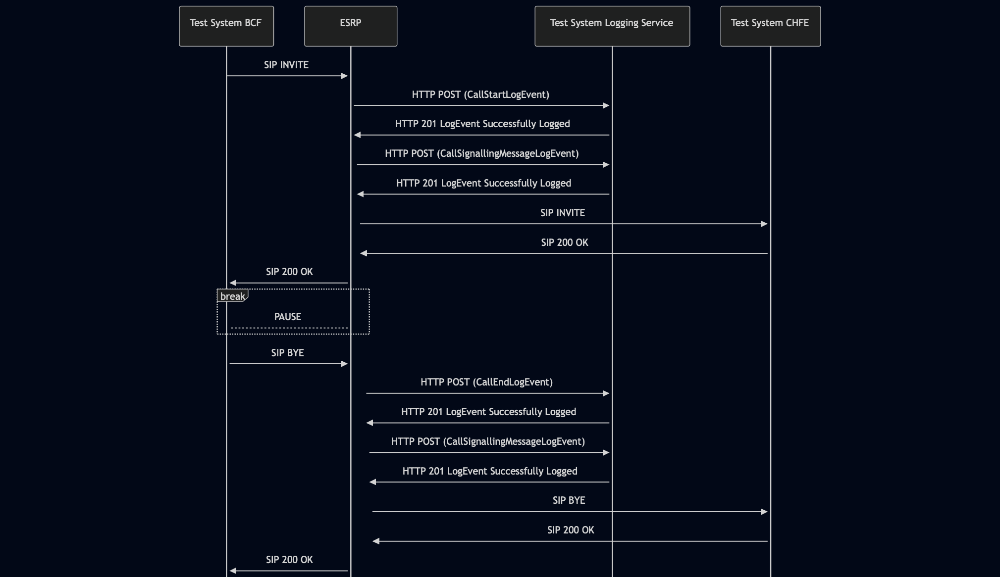

# Test Description: TD_ESRP_010
## Overview
### Summary
Logging the call status

### Description
Test covers logging of CallStartLogEvent, CallEndLogEvent and CallSignallingMessageLogEvent

### References
* Requirements :  RQ_ESRP_116, RQ_ESRP_124, RQ_ESRP_125, RQ_ESRP_126
* Test Case    :  TC_ESRP_010

### Requirements
IXIT config file for IUT

### HTTP transport types
Test can be performed with 2 different SIP and HTTP transport types. Steps describing actions for specific one are marked as following:
- (TLS) - used by default inside ESInet on production environment
- (TCP) - used if default TLS is not possible

## Configuration
### Implementation Under Test Interface Connections
<!-- Identify each of the FEs that are part of the configuration and how they are connected -->
* Test System BCF
  * IF_BCF_ESRP - connected to IF_ESRP_BCF
* ESRP
  * IF_ESRP_BCF - connected to IF_BCF_ESRP
  * IF_ESRP_LOG - connected to IF_LOG_ESRP
  * IF_ESRP_CHFE - connected to IF_CHFE_ESRP
* Test System Logging Service
  * IF_LOG_ESRP - connected to IF_ESRP_LOG
* Test System CHFE
  * IF_CHFE_ESRP - connected to IF_ESRP_CHFE

### Test System Interfaces
<!-- Identify each of the test system interfaces and whether it will be in active or monitor mode -->
* Test System BCF
  * IF_BCF_ESRP - Active
* ESRP
  * IF_ESRP_BCF - Active
  * IF_ESRP_LOG - Active
  * IF_ESRP_CHFE - Active
* Test System Logging Service
  * IF_LOG_ESRP - Active
* Test System CHFE
  * IF_CHFE_ESRP - Active
 
### Connectivity Diagram
<!--
https://mermaid.live/edit#pako:eNp9Ul1PgzAU_SvkPrNl0DFLY3xwbrpkRjP2ZEiWCndAHO1SijqX_XcLyD4w2qd7z-k597S5e4hkjMBgvZEfUcqVtuaLUFjmzKar2_F0NQkWz9e93s2sKSvsyNfA_Om-oU1RI5f0-GE6afiqOrtQlK-J4tvUWmKhrWBXaMyto3snQQOiiDvaE3c-s-vS5vwNVpn-8j7PNZdJkonEClC9ZxFeGF2--3-f07wfcedTjBpsSFQWA9OqRBtyVDmvWthXV0LQKeYYAjNlzNVbCKE4GM2Wixcp81amZJmkwNZ8U5iu3MZc413GTaL8iCozDdVYlkIDc8lVbQJsD5_AhqO-M3KoR13XJwNiww6Y4_j9IaG-R1xD0BE52PBVzxz0KfUJoZ7n-p5DHde3gZdaBjsRtYkwzrRUj8261Vt3-AZpcbuJ
-->




## Pre-Test Conditions
### Test System BCF/Test System Logging Service/Test System CHFE
* Interfaces are connected to network
* Interfaces have IP addresses assigned by DHCP
* Device is active
* ng911 repository cloned to local storage
* (TLS) Generated own PCA-signed certificate and private key files (test_system.crt, test_system.key)
* (TLS) Certificate and key used by ESRP copied to local storage
* (TLS) PCA certificate copied to local storage

### ESRP
* Interfaces are connected to network
* Interfaces have IP addresses assigned by DHCP
* Device configured to use Logging Service Test System as a Logging Service
* IUT is initialized with steps from IXIT config file
* Device is active
* Device is in normal operating state
* IUT is initialized using IXIT config file

## Test Sequence

### Test Preamble

#### Test System BCF
* Install SIPp by following steps from documentation[^1]
* Copy following XML scenario file to local storage:
  `SIP_basic_call.xml`
  `g711ulaw_rtp_stream.pcap`
* Install Wireshark[^2]
* (TLS v1.2) Configure Wireshark to decode SIP over TLS, use tests system and IUT certificate keys [^3]
* (TLS v1.3) Configure logging of session keys and configure Wireshark to decode SIP over TLS [^4]
* Using Wireshark on 'Test System' start packet tracing on IF_BCF_ESRP interface - run following filter:
   * (TLS)
     > ip.addr == IF_BCF_ESRP_IP_ADDRESS and tls
   * (TCP)
     > ip.addr == IF_BCF_ESRP_IP_ADDRESS and sip

#### Test System Logging Service
* Install Wireshark[^2]
* (TLS v1.2) Configure Wireshark to decode HTTP over TLS, use tests system and ESRP certificate keys [^3]
* (TLS v1.3) Configure logging of session keys and configure Wireshark to decode HTTP over TLS [^4]
* Using Wireshark on 'Test System' start packet tracing on IF_LOG_ESRP interface - run following filter:
   * (TLS)
     > ip.addr == IF_LOG_ESRP_IP_ADDRESS and tls
   * (TCP)
     > ip.addr == IF_LOG_ESRP_IP_ADDRESS and http

#### Test System CHFE
* Install SIPp by following steps from documentation[^1]
* Copy following XML scenario file to local storage:
  ```
  SIP_RECEIVE_basic_call_and_answer.xml
  ```
* Install Wireshark[^2]
* (TLS transport) Copy to local storage SIP TLS certificate and private key files:
  ```
  cacert.pem
  cakey.pem
  ```
* (TLS transport) Configure Wireshark to decode SIP over TLS packets[^3]
* Prepare 'Test System ESRP' to receive SIP message - run SIPp tool with one of following commands:
     * (TCP transport)
       ```
       sudo sipp -t t1 -sf SIP_RECEIVE_basic_call_and_answer.xml -i IF_CHFE_ESRP_IP_ADDRESS:5060 -timeout 10 -max_recv_loops 1
       ```
     * (TLS transport)
       ```
       sudo sipp -t l1 -sf SIP_RECEIVE_basic_call_and_answer.xml -i IF_CHFE_ESRP_IP_ADDRESS:5061 -timeout 10 -max_recv_loops 1
       ```

### Test Body

#### Stimulus
Simulate basic call from Test System BCF to ESRP - run SIPp scenario by using following command on Test System BCF, example:
* (TCP transport)
  ```
  sudo sipp -t t1 -sf SIP_basic_call.xml IF_BCF_ESRP_IPv4:5060
  ```
* (TLS transport)
  ```
  sudo sipp -t l1 -tls_cert test_system.crt -tls_key test_system.key -sf SIP_basic_call.xml IF_BCF_ESRP_IPv4:5060
  ```

#### Response
Using traced packets on Wireshark verify:
* If ESRP sends HTTP POST to Logging Service Test System with signed JWS body containing:
  * "logEventType": "CallStartLogEvent"
  * "timestamp" with correct date-time format (f.e. 2020-03-10T11:00:01-05:00) and date-time match the time when SIP INVITE message has been received
  * "elementId" which has value with FQDN of ESRP
  * "agencyId" which has value with FQDN of an agency
  * "callId" which has value f.e.: `urn:emergency:uid:callid:1234567890:bcf.ng911.example`. Check:
    * if header field contains "urn:emergency:uid:callid:"
    * if "urn:emergency:uid:callid:" is followed by 10 to 32 alphanumeric characters (String ID)
    * if String ID is followed by ":" and domain name
  * "incidentId" which has value f.e.: `urn:emergency:uid:incidentid:1234567890:bcf.ng911.example`. Check:
    * if header field contains "urn:emergency:uid:incidentid:"
    * if "urn:emergency:uid:incidentid:" is followed by 10 to 32 alphanumeric characters (String ID)
    * if String ID is followed by ":" and domain name
  * "callIdSIP" which has value f.e.: `1234567890qwertyuiop@caller.example.com` 
  * "direction" which has value: `incoming`
  * (optionally) zero or one "standardPrimaryCallType" with one of string values:
    - "emergency"
    - "nonEmergency"
    - "silentMonitoring"
    - "intervene"
    - "legacyWireline"
    - "legacyWireless"
    - "legacyVoip"
  * (optionally) zero or one "standardSecondaryCallType" with one of string values mentioned for "standardPrimaryCallType"
  * (optionally) zero or one "localCallType" with string value
  * (optionally) zero or one "localUse" with string value
  * (optionally) zero or one "clientAssignedIdentifier" with string value
  * (optionally) zero or one "extension" with string value
* If ESRP sends HTTP POST to Logging Service Test System with signed JWS body containing:
  * "logEventType": "CallSignalingMessageLogEvent"
  * "timestamp" with correct date-time format (f.e. 2020-03-10T11:00:01-05:00) and date-time match the time when SIP INVITE message has been received
  * "elementId" which has value with FQDN of ESRP
  * "agencyId" which has value with FQDN of an agency
  * "callId" which has value f.e.: `urn:emergency:uid:callid:1234567890:bcf.ng911.example`. Check:
    * if header field contains "urn:emergency:uid:callid:"
    * if "urn:emergency:uid:callid:" is followed by 10 to 32 alphanumeric characters (String ID)
    * if String ID is followed by ":" and domain name
  * "incidentId" which has value f.e.: `urn:emergency:uid:incidentid:1234567890:bcf.ng911.example`. Check:
    * if header field contains "urn:emergency:uid:incidentid:"
    * if "urn:emergency:uid:incidentid:" is followed by 10 to 32 alphanumeric characters (String ID)
    * if String ID is followed by ":" and domain name
  * "callIdSIP" which has value f.e.: `1234567890qwertyuiop@caller.example.com` 
  * "direction" which has value: `incoming`
  * "text" which has string value containing SIP INVITE message received by ESRP from Test System BCF
  * (Optional) "protocol" which has string value: `sip`
* If ESRP sends HTTP POST to Logging Service Test System with signed JWS body containing:
  * "logEventType": "CallEndLogEvent"
  * "timestamp" with correct date-time format (f.e. 2020-03-10T11:00:01-05:00) and date-time match SIP BYE message received by ESRP from Test System BCF
  * "elementId" which has value with FQDN of ESRP
  * "agencyId" which has value with FQDN of an agency
  * "callId" which has value f.e.: `urn:emergency:uid:callid:1234567890:bcf.ng911.example`. Check:
    * if header field contains "urn:emergency:uid:callid:"
    * if "urn:emergency:uid:callid:" is followed by 10 to 32 alphanumeric characters (String ID)
    * if String ID is followed by ":" and domain name
  * "incidentId" which has value f.e.: `urn:emergency:uid:incidentid:1234567890:bcf.ng911.example`. Check:
    * if header field contains "urn:emergency:uid:incidentid:"
    * if "urn:emergency:uid:incidentid:" is followed by 10 to 32 alphanumeric characters (String ID)
    * if String ID is followed by ":" and domain name
  * "callIdSIP" which has value f.e.: `1234567890qwertyuiop@caller.example.com` 
  * "direction" which has value: `incoming`
  * (optionally) zero or one "standardPrimaryCallType" with one of string values:
    - "emergency"
    - "nonEmergency"
    - "silentMonitoring"
    - "intervene"
    - "legacyWireline"
    - "legacyWireless"
    - "legacyVoip"
  * (optionally) zero or one "standardSecondaryCallType" with one of string values mentioned for "standardPrimaryCallType"
  * (optionally) zero or one "localCallType" with string value
  * (optionally) zero or one "localUse" with string value
  * (optionally) zero or one "clientAssignedIdentifier" with string value
  * (optionally) zero or one "extension" with string value
* If ESRP sends HTTP POST to Logging Service Test System with signed JWS body containing:
  * "logEventType": "CallSignalingMessageLogEvent"
  * "timestamp" with correct date-time format (f.e. 2020-03-10T11:00:01-05:00) and date-time match SIP BYE message received by ESRP from Test System BCF
  * "elementId" which has value with FQDN of ESRP
  * "agencyId" which has value with FQDN of an agency
  * "callId" which has value f.e.: `urn:emergency:uid:callid:1234567890:bcf.ng911.example`. Check:
    * if header field contains "urn:emergency:uid:callid:"
    * if "urn:emergency:uid:callid:" is followed by 10 to 32 alphanumeric characters (String ID)
    * if String ID is followed by ":" and domain name
  * "incidentId" which has value f.e.: `urn:emergency:uid:incidentid:1234567890:bcf.ng911.example`. Check:
    * if header field contains "urn:emergency:uid:incidentid:"
    * if "urn:emergency:uid:incidentid:" is followed by 10 to 32 alphanumeric characters (String ID)
    * if String ID is followed by ":" and domain name
  * "callIdSIP" which has value f.e.: `1234567890qwertyuiop@caller.example.com` 
  * "direction" which has value: `incoming`
  * "text" which has string value containing SIP BYE message received by ESRP from Test System BCF
  * (Optional) "protocol" which has string value: `sip`

VERDICT:
* PASSED - if Logging Service responded as expected
* FAILED - any other cases


### Test Postamble
#### Test System BCF/Test System CHFE
* stop SIPp (if still running)
* stop Wireshark (if still running)
* archive all logs generated
* disconnect interfaces from IUT
* (TLS) remove certificates

#### Test System Logging Service
* stop Wireshark (if still running)
* archive all logs generated
* disconnect interfaces from IUT
* (TLS) remove certificates

#### ESRP
* restore default configuration
* disconnect interfaces from Test Systems
* reconnect interfaces back to default

## Post-Test Conditions
### Test System BCF/Test System Logging Service/Test System CHFE
* Test tools stopped
* interfaces disconnected from IUT

### ESRP
* device connected back to default
* device in normal operating state

## Sequence Diagram
<!--
https://mermaid.live/edit#pako:eNrtVF1r2zAU_SviPm3MDv6og62HQJu5NGxdzeQVNvyi2jeqqS11slyWhfz3yS5p-hHGRil9qcHY1z7n6CAdzhpKVSFQcF23kKWSy1rQQhLS1lorfVgapTtKlrzpsJAjqMOfPcoSP9ZcaN4O4Nsrx84QtuoMtuRofuzOZh9S9jWjhC0ysvhyvsjTHXj4MyDukz4rIWopCEN9U5dIyUmeZyQ7Yzl5N-dNwwzXxoLSG5Tm_f6FH2nsTIxageeTrQBhfVli1y37plmNPKye6a8W0j4s5NTqcoGv6HV-cpzu3_nHqIfnFHgeOfv0d217uPvBFxr51W6847uzJ_Ts8Bu7Zwpl9Y9BOvr-zBSlsnrL0H9m6MGmv0CAwAGh6wqo0T060KJu-TDCehAqwFxiiwVQ-1pxfVVAITeWc83lD6XaLU2rXlwCHcvKgf664mbbUndftU0a6rnqpQHqh6MG0DX8spPvTfypHx8kXjQNo2iaOLACGiSTgzBOhtv3Ij-Igo0Dv8dlvUkcJ2EYR1GQRH7sB1MHeG8UW8lyawqr2nbo6W3LjmW7-QPD7aZQ
-->




## Comments

Version:  010.3f.5.0.3

Date:     20260402

## Footnotes
[^1]: SIPp - tool for SIP packet simulations. Official documentation: https://sipp.sourceforge.net/doc/reference.html#Getting+SIPp
[^2]: Wireshark - tool for packet tracing and anaylisis. Official website: https://www.wireshark.org/download.html
[^3]: Wireshark configuration to decrypt TLS packets: https://www.zoiper.com/en/support/home/article/162/How%20to%20decode%20SIP%20over%20TLS%20with%20Wireshark%20and%20Decrypting%20SDES%20Protected%20SRTP%20Stream
[^4]: TLS v1.3 session keys logging + Wireshark configuration to decrypt traffic: https://my.f5.com/manage/s/article/K50557518
