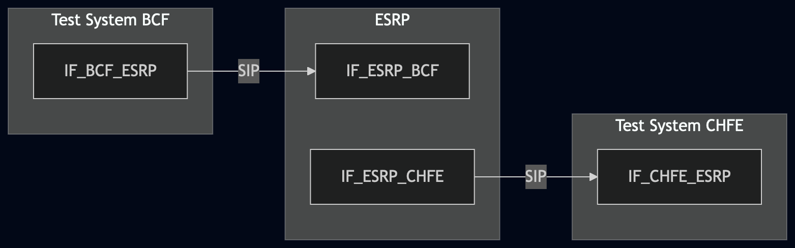
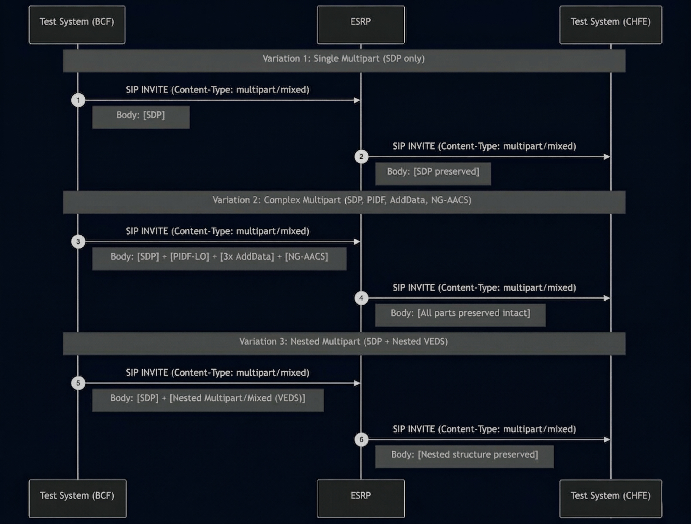

# Test Description: TD_ESRP_011
## Overview
### Summary
Validation of Multipart MIME support within the ESRP for complex SIP signaling.

### Description
This test ensures the ESRP correctly processes and preserves Multipart MIME bodies as defined in RFC 2046. 
The ESRP must forward INVITE messages containing nested or multiple body parts (SDP, PIDF-LO, Additional Data, VEDS) 
without loss of integrity.

### SIP transport types
Test can be performed with 2 different SIP transport types. Steps describing actions for specific one are marked as following:
- (TLS transport) - used by default inside ESInet on production environment
- (TCP transport) - used in lab for testing purposes only if default TLS is not possible

### References
* Requirements : RQ_ESRP_196
* Test Case    : TC_ESRP_011

### Requirements
IXIT config file for ESRP

## Configuration
### Implementation Under Test Interface Connections
<!-- Identify each of the FEs that are part of the configuration and how they are connected -->
* Test System BCF
  * IF_BCF_ESRP - connected to IF_ESRP_BCF
* ESRP
  * IF_ESRP_BCF - connected to Test System BCF IF_BCF_ESRP
  * IF_ESRP_CHFE - connected to Test System CHFE IF_CHFE_ESRP
* Test System CHFE
  * IF_CHFE_ESRP - connected to IF_ESRP_CHFE

### Test System Interfaces
<!-- Identify each of the test system interfaces and whether it will be in active or monitor mode -->
* Test System BCF
  * IF_BCF_ESRP - Active
* ESRP
  * IF_ESRP_BCF - Active
  * IF_ESRP_CHFE - Active
* Test System CHFE
  * IF_CHFE_ESRP - Active

 
### Connectivity Diagram
<!--
https://mermaid.live/edit#pako:eNp1Us9PgzAU_lead4YFC7SsBw_iiEs0WYYnQ7JU6IA4KCklOpf97xZwbJLYU9_3vl-Hd4JUZgIY7A_yMy240uh5m9TIvHW0ewij3SrebmwbxesNsu379Qj0m4k1AOFTtPpD64FhNfLa7j1XvCnQq2g1io-tFhWaXGZ5IyjqbKa97m6j5y5Tn_9sbitceb_qWW-jBgtyVWbAtOqEBZVQFe9HOPWUBHQhKpEAM9-Mq48EkvpsNA2v36SsLjIlu7wAtueH1kxdk3EtHktuGlUTqkyaUKHsag0MLwcPYCf4AkbIguLA9x0vIAR7NLDgCMx1FsulE1DXp57jYkrJ2YLvIdVsfIcEgYfvKCYYE6PgnZbxsU4vnURWaqlexgsYDuH8A4-Mmkc
-->




## Pre-Test Conditions
### Test System BCF
* Interfaces are connected to network
* Interfaces have IP addresses assigned by DHCP
* Device is active
* No active calls
* (TLS transport) Test System has it's own certificate signed by PCA


### Test System CHFE
* Interfaces are connected to network
* Interfaces have IP addresses assigned by DHCP
* Device is active
* No active calls
* (TLS transport) Test System has it's own certificate signed by PCA

### ESRP
* Interfaces are connected to network
* Interfaces have IP addresses assigned by DHCP
* Default configuration is loaded
* Device is initialized with steps from IXIT config file
* Device configured to use Test System CHFE as a next hop host
* Device is active
* Device is in normal operating state
* No active calls

## Test Sequence

### Test Preamble

#### Test System BCF
* Install SIPp by following steps from documentation[^1]
* Copy following XML scenario files to local storage:
  ```
    SIP_INVITE_from_OSP_with_multipart_mixed_SDP_only.xml
    SIP_INVITE_from_OSP_with_SDP_PIDF-LO_NG-AACS.xml
    SIP_INVITE_from_OSP_with_nested_multipart_body.xml
  ```
* (TLS transport) Copy to local storage PCA-signed certificate and private key files:
  > cacert.pem
  > cakey.pem
* (TLS transport) Copy to local storage PCA-signed certificate and private key files for ESRP:
  > ESRP-cacert.pem
  > ESRP-cakey.pem
  

### Test Body
#### Variations

1. SIP_INVITE_from_OSP_with_multipart_mixed_SDP_only.xml
2. SIP_INVITE_from_OSP_with_SDP_PIDF-LO_NG-AACS.xml
3. SIP_INVITE_from_OSP_with_nested_multipart_body.xml

#### Stimulus
Send SIP packet to ESRP - run following SIPp command on Test System OSP, example:
* (TCP transport)
  ```
  sudo sipp -t t1 -sf SCENARIO_FILE -i IF_BCF_ESRP IF_ESRP_BCF:5060
  ```
* (TLS transport)
  ```
  sudo sipp -t l1 -tls_cert cacert.pem -tls_key cakey.pem -sf SCENARIO_FILE -i IF_BCF_ESRP IF_ESRP_BCF:5061
  ```

#### Response
- The ESRP must receive the INVITE and forward it to the CHFE.
- The forwarded INVITE at the ESRP interface must contain the exact same MIME structure and content as the original stimulus.
- Content-Type headers must correctly reflect the boundary strings and multipart subtypes.

VERDICT:
* PASSED - if all checks passed for variation
* FAILED - all other cases


### Test Postamble
#### Test System BCF
* stop Sipp process (if still running)
* archive all logs generated
* stop Wireshark (if still running)
* remove all scenario files
* disconnect interfaces from ESRP
* (TLS transport) remove certificates

#### Test System CHFE
* stop Sipp process (if still running)
* archive all logs generated
* stop Wireshark (if still running)
* remove all scenario files
* disconnect interfaces from ESRP
* (TLS transport) remove certificates

#### ESRP
* disconnect interfaces from Test Systems
* reconnect interfaces back to default
* restore previous configuration

## Post-Test Conditions
### Test System BCF/CHFE
* Test tools stopped
* interfaces disconnected from ESRP

### ESRP
* device connected back to default
* device in normal operating state


## Sequence Diagram
<!--
https://mermaid.live/edit#pako:eNq9VM9v2jAU_leefKJqoARCAj5UokAnpEHRgjis9ODFr2AtsTPHqcgQ__ucQNYNLpUmlkv8nt_3Q5-styeR4kgoyfBHjjLCsWAbzZK1BPux3CiZJ99QH-uUaSMikTJp4ClcAMtgiZmBsMgMJtCwvZvLyYfRYzlpf5d3k_DLJU3ZtDzH6bkyCOoNdanoVAAKK6YFM0JJcCmEQm5ihFkeG1FyQyMcL0DJuDiZscDm_b3Vt7PTBUznq-lyAo2RkgalaS6LFCkkNfwuETvkN3-oa7HZGlCvJRGFB8ULCs9W4-U4Y4kt_dHYv_FXFt_5IdWYoX5D_vLBNDoURipJY9ydxeHAYjp-dGDI-ZgZ5sD8U3M4HIXXTghu4blUbn5-qs7dXW2hKk8urhrkMI6rJ5e9xwlCGhaZKtUP5dqlMLcv1CLPXtlt3V9Nxv8lzHMbd7MSDo1K_6o5npQzo_PI5Br_ep3EIRstOKH2Fh2SoE5YWZJ9SbsmZosJrgm1R8709zVZy4PF2B3wVamkhmmVb7aEvrI4s1WecmbqhfS7q1Fy1COVS0NoN6g4CN2THaEdt9fy_MGgE_S8Xrvv9bsOKQj1g1bfD1zXH_QHbd91OweH_KxU263Aa3u9TuD7ntv3epatXHlhIaPaEnJhlJ4dl2S1Kw-_ACjeo-Q
-->



## Comments

Version:  010.3f.5.0.3

Date:     20260319

## Footnotes
[^1]: SIPp - tool for SIP packet simulations. Official documentation: https://sipp.sourceforge.net/doc/reference.html#Getting+SIPp
[^2]: Wireshark - tool for packet tracing and anaylisis. Official website: https://www.wireshark.org/download.html
[^3]: Wireshark configuration to decrypt SIP over TLS packets: https://www.zoiper.com/en/support/home/article/162/How%20to%20decode%20SIP%20over%20TLS%20with%20Wireshark%20and%20Decrypting%20SDES%20Protected%20SRTP%20Stream
[^4]: TLS v1.3 session keys logging + Wireshark configuration to decrypt traffic: https://my.f5.com/manage/s/article/K50557518
