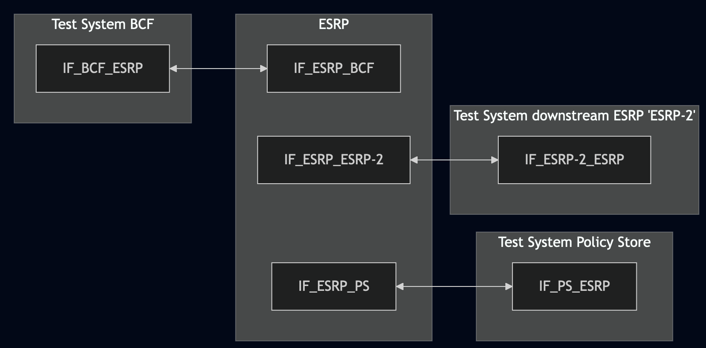
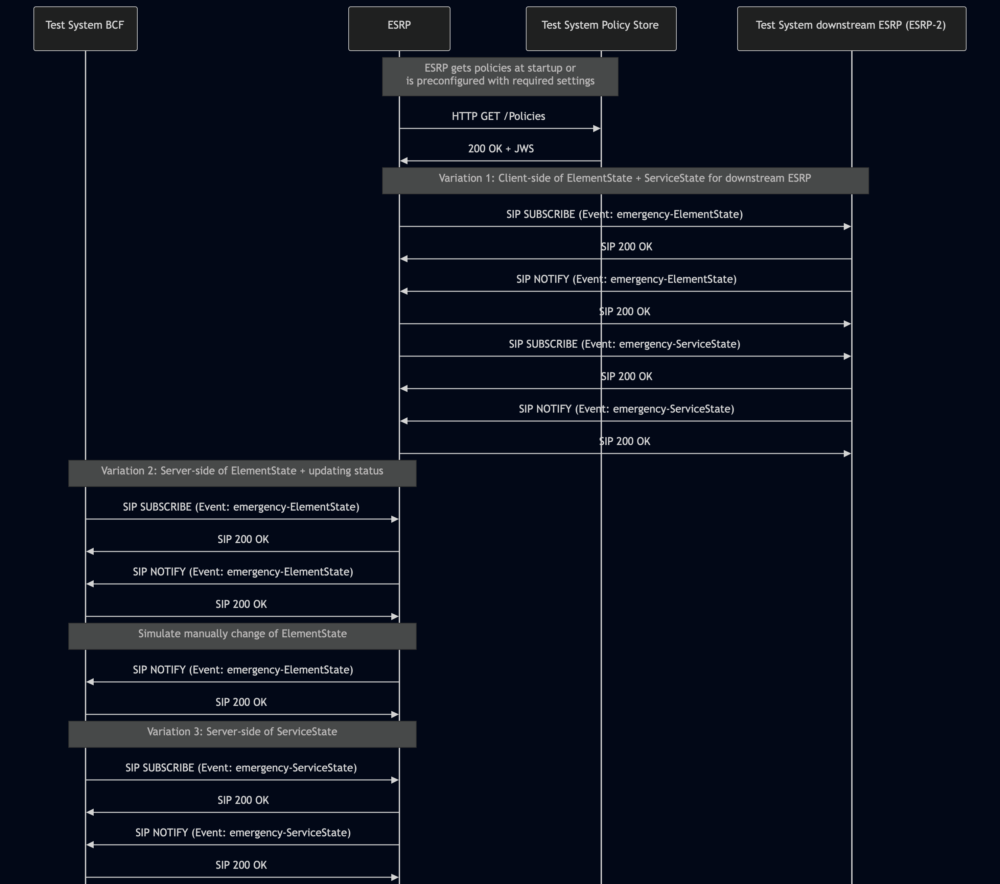

# Test Description: TD_ESRP_012

## Overview
### Summary
Server and client side of ElementState and ServiceState

### Description
This test checks:
- server-side of ElementState and ServiceState
- client-side of ElementState and ServiceState for a downstream services
- updating status of ElementState

### References
* Requirements : RQ_ESRP_058, RQ_ESRP_060, RQ_ESRP_062
* Test Case    : 

### Requirements
IXIT config file for ESRP specifying configuration of:

Variant 1:
- default Policy Store URL
- manually changing ElementState

Variant 2:
- URI of downstream ESRP
- enabling ElementState and ServiceState subscription for Test System BCF
- manually changing ElementState

### SIP transport types
Test can be performed with 2 different SIP transport types. Steps describing actions for specific one are marked as following:
- (TLS transport) - should be used by default
- (TCP transport) - used in lab for testing purposes only if default TLS is not possible

## Configuration
### Implementation Under Test Interface Connections
<!-- Identify each of the FEs that are part of the configuration and how they are connected -->
* Test System BCF
  * IF_BCF_ESRP - connected to IF_ESRP_BCF
* ESRP
  * IF_ESRP_BCF - connected to IF_BCF_ESRP 
  * IF_ESRP_ESRP-2 - connected to IF_ESRP-2_ESRP
  * IF_ESRP_PS - connected to IF_PS_ESRP 
* Test System Policy Store
  * IF_PS_ESRP - connected to IF_ESRP_PS
* Test System downstream ESRP (ESRP-2)
  * IF_ESRP-2_ESRP - connected to IF_ESRP_ESRP-2 

### Test System Interfaces
<!-- Identify each of the test system interfaces and whether it will be in active or monitor mode -->
* Test System BCF
  * IF_BCF_ESRP - Active
* ESRP
  * IF_ESRP_BCF - Active
  * IF_ESRP_ESRP-2 - Active
  * IF_ESRP_PS - Active
* Test System Policy Store
  * IF_PS_ESRP - Active
* Test System downstream ESRP (ESRP-2)
  * IF_ESRP-2_ESRP - Active 

### Connectivity Diagram
<!--
https://mermaid.live/edit#pako:eNp9UstqwzAQ_BWzl17sECWWbIvSQ9MGAi2YuKdiCKqtxKaRFGSZ1A359_oVNw9aHcTu7O7MSOwBEpVyoLDeqn2SMW2sl2Usrfos5qvH2Xz1HC3De8d5WHRhgw31FgijvhxGLXBZbS5nckbgTPqurq8oPzaa7TLrjRfGiqrCcGENGlc-OpDL9Gr2t3Yufc3Su73FOlt_kZ8bC9U2TyorMkrzC56Lt__Pkaq9LIzmTLS-rbtO_u7G1_BTPSfYsNF5CtToktsguBasSeHQtMRgMi54DLQOU6Y_Y4jlsZ7ZMfmulDiNaVVuMqBrti3qrNylzPCnnNU-xYDqWo3rmSqlARq4fksC9ABfQAkeuSQIpj7BPsLIIzZUQJGHRz7xEJoGGPmBh_2jDd-t7HjkuWMXTzxCXOS72LOBlUZFlUxOnnia1z_62m1iu5DHHwX4w88
-->




## Pre-Test Conditions
### Test System BCF, Test System Policy Store, Test System downstream ESRP (ESRP-2)
* Interfaces are connected to network
* Interfaces have IP addresses assigned by DHCP
* Device is active
* ng911 repository cloned to local storage
* (TLS) Generated own PCA-signed certificate and private key files (test_system.crt, test_system.key)
* (TLS) Certificate and key used by ESRP copied to local storage
* (TLS) PCA certificate copied to local storage

### ESRP
* Interfaces are connected to network
* Interfaces have IP addresses assigned by DHCP
* IUT is active
* IUT is in normal operating state
* Default configuration is loaded
* IUT is initialized using IXIT config file
* Bridge is provisioned with policy allowing to subscribe for ElementState and ServiceState from Test System BCF
  
## Test Sequence

### Test Preamble

### Test System BCF
* Install SIPp by following steps from documentation[^1]
* Install Wireshark[^2]
* Copy following XML scenario files to local storage:
```
SIP_SUBSCRIBE_ElementState.xml
SIP_SUBSCRIBE_ServiceState.xml
```
* (TLS v1.2) Configure Wireshark to decode SIP over TLS, use tests system and FE certificate keys [^3]
* (TLS v1.3) Configure logging of session keys and configure Wireshark to decode SIP over TLS [^4]
* Using Wireshark start packet tracing on local interface connected with ESRP - example filter:
   * (TLS transport)
     > ip.addr == IF_BCF_ESRP_IP_ADDRESS and tls
   * (TCP transport)
     > ip.addr == IF_BCF_ESRP_IP_ADDRESS and sip

### Test System downstream ESRP (ESRP-2)
* Install SIPp by following steps from documentation[^1]
* Install Wireshark[^2]
* clone ng911 repository to the local storage
* (TLS v1.2) Configure Wireshark to decode SIP over TLS, use tests system and FE certificate keys [^3]
* (TLS v1.3) Configure logging of session keys and configure Wireshark to decode SIP over TLS [^4]
* Using Wireshark start packet tracing on local interface connected with ESRP - example filter:
   * (TLS transport)
     > ip.addr == IF_ESRP-2_ESRP_IP_ADDRESS and tls
   * (TCP transport)
     > ip.addr == IF_ESRP-2_ESRP_IP_ADDRESS and sip
* prepare for handling SUBSCRIBE requests from ESRP. Start sip_service from ng911 repository (test_suite/services/stub_server/sip_service/sip_entry.py), example command:
   * (TLS transport)
     > python3 sip_entry.py --bind-ip IF_ESRP-2_ESRP_IP_ADDRESS --bind-port 5061 --remote-ip IF_ESRP_ESRP-2_IP_ADDRESS --remote-port 5061 --protocol TCP --scenario SIP_SUBSCRIBE_RECEIVE_ElementState_ServiceState.xml --message-timeout 5000 --transaction-timeout 5000 --tls-cert ESRP-2_CERTIFICATE_FILE --tls-key ESRP-2_KEY_FILE --tls-ca PCA_CERTIFICATE_FILE
   * (TCP transport)
     > python3 sip_entry.py --bind-ip IF_ESRP-2_ESRP_IP_ADDRESS --bind-port 5060 --remote-ip IF_ESRP_ESRP-2_IP_ADDRESS --remote-port 5060 --protocol TCP --scenario SIP_SUBSCRIBE_RECEIVE_ElementState_ServiceState.xml --message-timeout 5000 --transaction-timeout 5000


### Test System Policy Store
* Install Curl [^5]
* Install Wireshark[^2]
* (TLS v1.2) Configure Wireshark to decode HTTP over TLS, use tests system and FE certificate keys [^3]
* (TLS v1.3) Configure logging of session keys and configure Wireshark to decode HTTP over TLS [^4]
* Using Wireshark start packet tracing on local interface - use following filter:
   * (TLS transport)
     > ip.addr == IF_PS_ESRP_IP_ADDRESS and tls
   * (TCP transport)
     > ip.addr == IF_PS_ESRP_IP_ADDRESS and sip
* The Policy Store must be configured to accept and process HTTP GET requests.
   * generate JWS object and save to file jws.json, e.g.
  ```
  python3 -m main generate_jws Policy_object_force_ESRP_to_dereference_ADR_v010.3f.5.0.0.json --cert test_system.crt --key test_system.key --output_file jws.json
  ```
* start HTTP server on port 8080 using command in the terminal:
(TLS):
python3 http_entry.py --ip IF_PS_ESRP --port 8080 --role RECEIVER --path /Policies --method GET --body jws.json --server_cert PS_CERTIFICATE_FILE --server_key PS_KEY_FILE
(TCP):
while true; do cat jws.json | nc -l -p 8080 -q 1; done


### Test Body

#### Variations
1. Client-side of ElementState + ServiceState for downstream ESRP
2. Server-side of ElementState + updating status
3. Server-side of ServiceState

#### Stimulus

Variation 1 - restart the ESRP

Variation 2:
- Using XML scenario file SIP_SUBSCRIBE_ElementState.xml run following SIPp command on Test System BCF, example:
  * (TLS transport)
    > sudo sipp -t l1 -tls_cert cacert.pem -tls_key cakey.pem -sf SIP_SUBSCRIBE_ElementState.xml -s user IF_BCF_ESRP_IP_ADDRESS:5061
  * (TCP transport)
    > sudo sipp -t t1 -sf SIP_SUBSCRIBE_ElementState.xml -s user IF_BCF_ESRP_IP_ADDRESS:5060
- manually change state of ElementState (use procedure from IXIT config file)

Variation 3:
- Using XML scenario file SIP_SUBSCRIBE_ServiceState.xml run following SIPp command on Test System BCF, example:
  * (TLS transport)
    > sudo sipp -t l1 -tls_cert cacert.pem -tls_key cakey.pem -sf SIP_SUBSCRIBE_ServiceState.xml -s user IF_BCF_ESRP_IP_ADDRESS:5061
  * (TCP transport)
    > sudo sipp -t t1 -sf SIP_SUBSCRIBE_ServiceState.xml -s user IF_BCF_ESRP_IP_ADDRESS:5060


#### Response

Variation 1
* ESRP sends SIP SUBSCRIBE with Event: emergency-ElementState to Test System downstream ESRP
* ESRP sends SIP SUBSCRIBE with Event: emergency-ServiceState to Test System downstream ESRP
* ESRP responds with SIP 200 OK for each received SIP NOTIFY

Variation 2
* ESRP responds with 200 OK for SIP SUBSCRIBE
* ESRP sends SIP NOTIFY with the same event as requested in SIP SUBSCRIBE (emergency-ElementState)
* SIP NOTIFY contains following fields in JSON body:
- elementId which is FQDN
- state which is one of:
  ```
   Normal
   ScheduledMaintenance
   ServiceDisruption 
   Overloaded
   GoingDown
   Down
   Unreachable
  ```
- reason (optional) which is a string

EXAMPLE JSON:
```
{
  "elementId": "ng911.example.org",
  "state": "Normal",
  "reason": "test"
}
```
* after manual change of ElementState ESRP sends SIP NOTIFY with Event: emergency-ElementState with changed value of 'state' in the JSON body

Variation 3
* ESRP responds with 200 OK for SIP SUBSCRIBE
* ESRP sends SIP NOTIFY with the same event as requested in SIP SUBSCRIBE (emergency-ServiceState)
* SIP NOTIFY contains following fields in JSON body:
- service which contains:
    - name which is `ESRP`
    - serviceId (optional) which is FQDN the same as in 'domain'
    - domain which is FQDN
- serviceState which contains:
    - state which is one of:
      ```
       Normal
       Unstaffed
       ScheduledMaintenanceDown
       ScheduledMaintenanceAvailable
       MajorIncidentInProgress
       Partial
       Overloaded
       GoingDown
       Down
       Unreachable
      ```
    - reason which is string or empty
- securityPosture (optional) which contains:
    - posture which is one of:
        ```
          Green
          Yellow
          Orange
          Red
        ```
EXAMPLE JSON:
```
{
  "service": {
    "name": "ESRP",
    "serviceId": "ng911.example.org",
    "domain": "ng911.example.org"
  },
  "serviceState": {
    "state": "Unstaffed",
    "reason": "test"
  },
  "securityPosture": {
    "posture": "Orange"
  }
}
```

VERDICT:
* PASSED - if ESRP responded as expected
* FAILED - any other cases

### Test Postamble
#### Test System BCF, Test System downstream ESRP (ESRP-2), Test System Policy Store
* stop all SIPp processes (if still running)
* archive all logs generated
* stop Wireshark (if still running)
* remove ng911 repository files
* disconnect interfaces from ESRP

#### ESRP
* reconnect interfaces back to default

## Post-Test Conditions 
### Test System BCF, Test System downstream ESRP (ESRP-2), Test System Policy Store
* Test tools stopped
* interfaces disconnected from ESRP

### ESRP
* device connected back to default
* device in normal operating state

## Sequence Diagram
<!--
https://mermaid.live/edit#pako:eNq1VV1v0zAU_StXfmJaumVpm2QWqsRKBxtii-YCAuXFJG5qkdjFdjrKtP-OndCpaxtp4-Mpse-55577kdw7lMmcIYx6vV4qMilmvMCpAKi4UlK9yoxUGsOMlpqlogFp9r1mImOvOS0UrVLh4AALqgzP-IIKA2fjc6AapkwbICttWOWudnETcpM4oHvuWhOyTZLIkmcrIFYU28_WC7Z9cnkrtFGMVm24Fy3sYK37ShoGcslUY_ZsVNwCC2Y0LFxEzjRQA9rYYPUCpHr5VR2PuLUq1pasViyHW27moGx1uDtpZgwXhW6jNEFHI0f-djpN4M1kCsfJmrzFJMQiHBBD4Ptw_Q4O4fITaY37xba5YPhIFaeGSwEnGMYlZ8L0NM8tdgaTklX2TAy1vodAmFryjLXHmVTbBXqkd81PLhIgH87I-ObibGJLuLSEGCyvKuworHqbMQ42GIKHjBxDm1Wn-ep6enH--Rnsj_XtsD9d_mZN_r38LvZu-fubbT-hzU47P8vMVFen60VO3Qi6wTX170G0JI9U_0lXR6NGSkfRH2zP6ee2rE3evXUgvKpLl2dFRU3LcgXZnIpipw7_T9qTmtTfadLmNDy_Jd2z9Hct2cPblTfyUKF4jrBRNfOQpaioO6I755ciM7e0KcL2NafqW4pScW997C_6i5TV2k3Jupgj3CwWDzWjut4oD7eKiZypsayFQbg_iP2GBeE79APhMDyKgng49AdxGAaDKPbQyqL8o9NTP476w2jg94MoCu899LOJay1DP4zjQXASBWEQhKceorWRZCWytSqWc7tb3rcrsdmM978AHeAw2w
-->




## Comments

Version:  010.3f.5.0.2

Date:     20260324

## Footnotes
[^1]: SIPp - tool for SIP packet simulations. Official documentation: https://sipp.sourceforge.net/doc/reference.html#Getting+SIPp
[^2]: Wireshark - tool for packet tracing and anaylisis. Official website: https://www.wireshark.org/download.html
[^3]: Wireshark configuration to decrypt TLS packets: https://www.zoiper.com/en/support/home/article/162/How%20to%20decode%20SIP%20over%20TLS%20with%20Wireshark%20and%20Decrypting%20SDES%20Protected%20SRTP%20Stream
[^4]: TLS v1.3 session keys logging + Wireshark configuration to decrypt traffic: https://my.f5.com/manage/s/article/K50557518
[^5]: Curl: https://curl.se/download.html