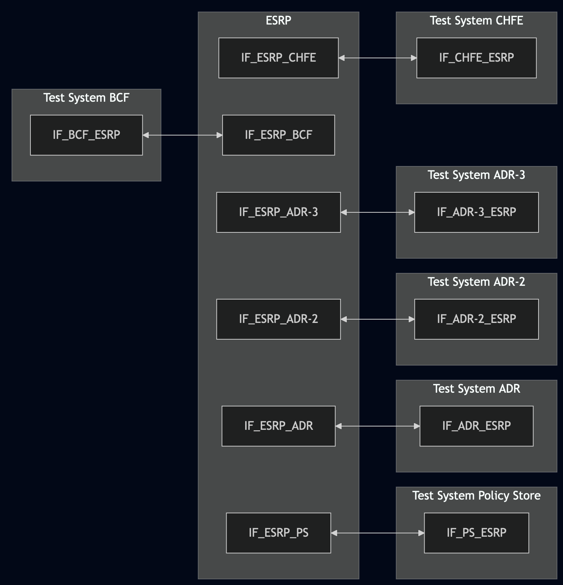
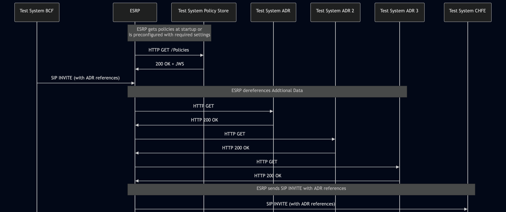

# Test Description: TD_ESRP_013

## Overview
### Summary
Accommodating multiple additional data structures

### Description
Test covers ESRP dereferencing of multiple additional data structures

### References
* Requirements :  RQ_ESRP_056
* Test Case    : TC_ESRP_013

### Requirements
IXIT config file for ESRP specifying configuration of:

Variant 1:
- default Policy Store URL

Variant 2:
- enabling ADR URL's dereferencing by default
- setting URI of downstream ESRP

### HTTP transport types
Test can be performed with 2 different SIP and HTTP transport types. Steps describing actions for specific one are marked as following:
- (TLS) - used by default inside ESInet on production environment
- (TCP) - used if default TLS is not possible

## Configuration
### Implementation Under Test Interface Connections
<!-- Identify each of the FEs that are part of the configuration and how they are connected -->
* Test System BCF
  * IF_BCF_ESRP - connected to IF_ESRP_BCF
* ESRP
  * IF_ESRP_BCF - connected to IF_BCF_ESRP
  * IF_ESRP_PS - connected to IF_PS_ESRP
  * IF_ESRP_ADR - connected to IF_ADR_ESRP
  * IF_ESRP_ADR-2 - connected to IF_ADR-2_ESRP
  * IF_ESRP_ADR-3 - connected to IF_ADR-3_ESRP
  * IF_ESRP_CHFE - connected to IF_CHFE_ESRP
* Test System Policy Store
  * IF_PS_ESRP - connected to IF_ESRP_PS
* Test System ADR
  * IF_ADR_ESRP - connected to IF_ESRP_ADR
* Test System ADR-2
  * IF_ADR-2_ESRP - connected to IF_ESRP_ADR-2
* Test System ADR-3
  * IF_ADR-3_ESRP - connected to IF_ESRP_ADR-3
* Test System CHFE
  * IF_CHFE_ESRP - connected to IF_ESRP_CHFE

### Test System Interfaces
<!-- Identify each of the test system interfaces and whether it will be in active or monitor mode -->
* Test System BCF
  * IF_BCF_ESRP - Active
* ESRP
  * IF_ESRP_BCF - Active
  * IF_ESRP_PS - Active
  * IF_ESRP_ADR - Active
  * IF_ESRP_ADR-2 - Active
  * IF_ESRP_ADR-3 - Active
  * IF_ESRP_CHFE - Active
* Test System Policy Store
  * IF_PS_ESRP - Active
* Test System ADR
  * IF_ADR_ESRP - Active
* Test System ADR-2
  * IF_ADR-2_ESRP - Active
* Test System ADR-3
  * IF_ADR-3_ESRP - Active
* Test System CHFE
  * IF_CHFE_ESRP - Active
 
### Connectivity Diagram
<!--
https://mermaid.live/edit#pako:eNqNU9tqg0AQ_RWZZw2uG-OFUmhzoYUWJPapCGGrmyiNblhXWhvy792oSdQkTX1YZs6cM5cddwshiyi4sFyzrzAmXCgv8yBT5Pc8W0z9ubfw_DtNu5ee51fAMfo4rhlNuCJLrKt-mMybuLS6-kNcM04MzbjCwS0OvsAZP82mDWVvNoyakxcfK042sfJGc6H4ZS5oqhw77U1TgzSLetpTrF22n6W5sXNM9n0R1IzLMD6H93Nd6649mcfWSVgqvmCcdrJ0Fvh3jn673eXd1Pam6i_2th6f6fG_9ad7auStH6JRgwornkTgCl5QFVLKU7J3YbunBCBimtIAXGlGhH8GEGQ7qdmQ7J2x9CDjrFjF4C7JOpdesYmIoJOEyI7SI8plNcrHrMgEuMh0zCoLuFv4BtdwBsiyh9i0TQuZaOSoUEqWPUCGhYaWLU9HRw7eqfBT1dUHDnYchIeSbKGRrmMVSCGYX2bhoSsaJXLzr_Wzrl737hc4mh5F
-->




## Pre-Test Conditions
### Test System BCF/Test System Policy Store/Test System CHFE/Test System ADR/Test System ADR-2/Test System ADR-3
* Interfaces are connected to network
* Interfaces have IP addresses assigned by DHCP
* Device is active
* ng911 repository cloned to local storage
* (TLS) Generated own PCA-signed certificate and private key files (test_system.crt, test_system.key)
* (TLS) Certificate and key used by ESRP copied to local storage
* (TLS) PCA certificate copied to local storage

### ESRP
* Interfaces are connected to network
* Interfaces have IP addresses assigned by DHCP
* Device configured to use Logging Service Test System as a Logging Service
* IUT is initialized with steps from IXIT config file
* Device is active
* Device is in normal operating state
* IUT is initialized using IXIT config file

## Test Sequence

### Test Preamble

#### Test System BCF
* Install SIPp by following steps from documentation[^1]
* Copy following XML scenario file to local storage:
  `SIP_INVITE_from_BCF_3x_ADR_references.xml`
* Install Wireshark[^2]
* (TLS v1.2) Configure Wireshark to decode SIP over TLS, use tests system and IUT certificate keys [^3]
* (TLS v1.3) Configure logging of session keys and configure Wireshark to decode SIP over TLS [^4]
* Using Wireshark on 'Test System' start packet tracing on IF_BCF_ESRP interface - run following filter:
   * (TLS)
     > ip.addr == IF_BCF_ESRP_IP_ADDRESS and tls
   * (TCP)
     > ip.addr == IF_BCF_ESRP_IP_ADDRESS and sip

#### Test System CHFE
* Install SIPp by following steps from documentation[^1]
* Copy following XML scenario file to local storage:
  `SIP_INVITE_RECEIVE.xml`
* Install Wireshark[^2]
* (TLS v1.2) Configure Wireshark to decode SIP over TLS, use tests system and IUT certificate keys [^3]
* (TLS v1.3) Configure logging of session keys and configure Wireshark to decode SIP over TLS [^4]
* Using Wireshark on 'Test System' start packet tracing on IF_CHFE_ESRP interface - run following filter:
   * (TLS)
     > ip.addr == IF_CHFE_ESRP_IP_ADDRESS and tls
   * (TCP)
     > ip.addr == IF_CHFE_ESRP_IP_ADDRESS and sip

#### Test System Policy Store
* Install Wireshark[^2]
* (TLS v1.2) Configure Wireshark to decode HTTP over TLS, use tests system and ESRP certificate keys [^3]
* (TLS v1.3) Configure logging of session keys and configure Wireshark to decode HTTP over TLS [^4]
* Using Wireshark on 'Test System' start packet tracing on IF_PS_ESRP interface - run following filter:
   * (TLS)
     > ip.addr == IF_PS_ESRP_IP_ADDRESS and tls
   * (TCP)
     > ip.addr == IF_PS_ESRP_IP_ADDRESS and http
* The Policy Store must be configured to accept and process HTTP GET requests.
  * generate JWS object and save to file jws.json, e.g.
  ```
  python3 -m main generate_jws Policy_object_force_ESRP_to_dereference_ADR_v010.3f.5.0.0.json --cert test_system.crt --key test_system.key --output_file jws.json
  ```
  * simulate a listening HTTP endpoint on port 8080 using command in the terminal:
  * (TLS):
    * `python3 http_entry.py --ip IF_PS_ESRP --port 8080 --role RECEIVER --path /Policies --method GET --body jws.json --server_cert /tmp/cert.crt --server_key /tmp/cert.key`
  * (TCP):
    * `while true; do cat jws.json | nc -l -p 8080 -q 1; done`

#### Test System ADR
* Install Wireshark[^2]
* (TLS v1.2) Configure Wireshark to decode HTTP over TLS, use tests system and ESRP certificate keys [^3]
* (TLS v1.3) Configure logging of session keys and configure Wireshark to decode HTTP over TLS [^4]
* Using Wireshark on 'Test System' start packet tracing on IF_ADR_ESRP interface - run following filter e.g.:
   * (TLS)
     > ip.addr == IF_ADR_ESRP_IP_ADDRESS and tls
   * (TCP)
     > ip.addr == IF_ADR_ESRP_IP_ADDRESS and http
* The ADR must be configured to accept and process HTTP GET requests.
  * simulate a listening HTTP endpoint on port 8080 using command in the terminal:
  * (TLS):
    * `python3 http_entry.py --ip IF_ADR_ESRP --port 8080 --role RECEIVER --path /ADR --method GET --body test_suite/test_files/HTTP_messages/HTTP_ADR/EmergencyCallData.DeviceInfo --server_cert /tmp/cert.crt --server_key /tmp/cert.key`
  * (TCP):
    * `while true; do cat test_suite/test_files/HTTP_messages/HTTP_ADR/EmergencyCallData.DeviceInfo | nc -l -p 8080 -q 1; done`

#### Test System ADR-2
* Install Wireshark[^2]
* (TLS v1.2) Configure Wireshark to decode HTTP over TLS, use tests system and ESRP certificate keys [^3]
* (TLS v1.3) Configure logging of session keys and configure Wireshark to decode HTTP over TLS [^4]
* Using Wireshark on 'Test System' start packet tracing on IF_ADR-2_ESRP interface - run following filter e.g.:
   * (TLS)
     > ip.addr == IF_ADR-2_ESRP_IP_ADDRESS and tls
   * (TCP)
     > ip.addr == IF_ADR-2_ESRP_IP_ADDRESS and http
* The ADR-2 must be configured to accept and process HTTP GET requests.
  * simulate a listening HTTP endpoint on port 8080 using command in the terminal:
  * (TLS):
    * `python3 http_entry.py --ip IF_ADR-2_ESRP --port 8080 --role RECEIVER --path /ADR --method GET --body test_suite/test_files/HTTP_messages/HTTP_ADR/EmergencyCallData.ProviderInfo --server_cert /tmp/cert.crt --server_key /tmp/cert.key`
  * (TCP):
    * `while true; do cat test_suite/test_files/HTTP_messages/HTTP_ADR/EmergencyCallData.ProviderInfo | nc -l -p 8080 -q 1; done`


#### Test System ADR-3
* Install Wireshark[^2]
* (TLS v1.2) Configure Wireshark to decode HTTP over TLS, use tests system and ESRP certificate keys [^3]
* (TLS v1.3) Configure logging of session keys and configure Wireshark to decode HTTP over TLS [^4]
* Using Wireshark on 'Test System' start packet tracing on IF_ADR-3_ESRP interface - run following filter e.g.:
   * (TLS)
     > ip.addr == IF_ADR-3_ESRP_IP_ADDRESS and tls
   * (TCP)
     > ip.addr == IF_ADR-3_ESRP_IP_ADDRESS and http
* The ADR-3 must be configured to accept and process HTTP GET requests.
  * simulate a listening HTTP endpoint on port 8080 using command in the terminal:
  * (TLS):
    * `python3 http_entry.py --ip IF_ADR-3_ESRP --port 8080 --role RECEIVER --path /ADR --method GET --body test_suite/test_files/HTTP_messages/HTTP_ADR/EmergencyCallData.ServiceInfo --server_cert /tmp/cert.crt --server_key /tmp/cert.key`
  * (TCP):
    * `while true; do cat test_suite/test_files/HTTP_messages/HTTP_ADR/EmergencyCallData.ServiceInfo | nc -l -p 8080 -q 1; done`


### Test Body

#### Stimulus
Simulate basic call from Test System BCF to ESRP - run SIPp scenario by using following command on Test System BCF, example:
* (TCP transport)
  ```
  sudo sipp -t t1 -sf SIP_INVITE_from_BCF_3x_ADR_references.xml IF_BCF_ESRP_IPv4:5060
  ```
* (TLS transport)
  ```
  sudo sipp -t l1 -tls_cert test_system.crt -tls_key test_system.key -sf SIP_INVITE_from_BCF_3x_ADR_references.xml IF_BCF_ESRP_IPv4:5061
  ```

#### Response
Using traced packets on Wireshark verify:
* If ESRP sends HTTP GET to Test System ADR, ADR-2 and ADR-3 to dereference ADR
* If ESRP sends SIP INVITE to Test System CHFE with unchanged ADR references (the same as received from Test System BCF)

VERDICT:
* PASSED - if ESRP dereferenced ADR and sent SIP INVITE as expected
* FAILED - any other cases


### Test Postamble
#### Test System BCF/Test System CHFE
* stop SIPp (if still running)
* stop Wireshark (if still running)
* archive all logs generated
* disconnect interfaces from IUT
* (TLS) remove certificates

#### Test System Policy Store/Test System ADR/Test System ADR-2/Test System ADR-3
* stop Wireshark (if still running)
* stop nc/python processes listening for HTTP requests
* archive all logs generated
* disconnect interfaces from IUT
* (TLS) remove certificates

#### ESRP
* restore default configuration
* disconnect interfaces from Test Systems
* reconnect interfaces back to default

## Post-Test Conditions
### Test System BCF/Test System CHFE/Test System Policy Store/Test System ADR/Test System ADR-2/Test System ADR-3
* Test tools stopped
* interfaces disconnected from IUT

### ESRP
* device connected back to default
* device in normal operating state

## Sequence Diagram
<!--
https://mermaid.live/edit#pako:eNqNlF1v0zAUhv_Kka9ApF3i9DNClUrbsYEY0VKBhHJjktPUorGL7QCl6n_HTpaNtZHgJol9nvd8xj6STOZIItLr9VKRSbHhRZQKgJIrJdU8M1LpCDZspzEVNaTxe4UiwyVnhWJlKhwOsGfK8IzvmTDwZnENTMMatYHkoA2WbuuSWyX3sQPd-9IaJ-dOYrnj2QESmxRe8vPl_bnAbnVyPdpBAu1mwy42vGQXN9erc9TttR26kwZB_kBV1-vZ-qKmAwUaDXtXG0cNzIA21m21B6lef1VXM26tCpvhVApz-MnNFpSdA3crjcZwUegmivPYm82c85v1Ooa3qzVcxa3zhokTSzgwAur78PE9vIJ3n5PG2DztvB6Z5DaG27tPt-sVvKhDuwYo3KBy_4F-2V1e3bqHCnN8wmGe54ZLwXawZIY9y9pqntJuLM5Nm0htaTI-l_Vol5D-lzTskobd0u5a3ZgfStUocv13yzo69iyDRvvvHqeCeKRQPCeRURV6pERVMrckR-cwJWaLJaYksp85U99SkoqT1dif84uUZStTsiq2JKqPtEeqfc5Me5Yfd21QO7KFrIQhEaVBWHsh0ZH8suv-kA6mIzoYhjQMJmPqkQOJAjrpD0b-xJ-EY39KB_7g5JHfddygH9CATgc0GI9p4A-HI4-wysjkILI2K8y5PdUfmsuovpNOfwD7iWf6
-->




## Comments

Version:  010.3f.5.0.2

Date:     20260324

## Footnotes
[^1]: SIPp - tool for SIP packet simulations. Official documentation: https://sipp.sourceforge.net/doc/reference.html#Getting+SIPp
[^2]: Wireshark - tool for packet tracing and anaylisis. Official website: https://www.wireshark.org/download.html
[^3]: Wireshark configuration to decrypt TLS packets: https://www.zoiper.com/en/support/home/article/162/How%20to%20decode%20SIP%20over%20TLS%20with%20Wireshark%20and%20Decrypting%20SDES%20Protected%20SRTP%20Stream
[^4]: TLS v1.3 session keys logging + Wireshark configuration to decrypt traffic: https://my.f5.com/manage/s/article/K50557518
