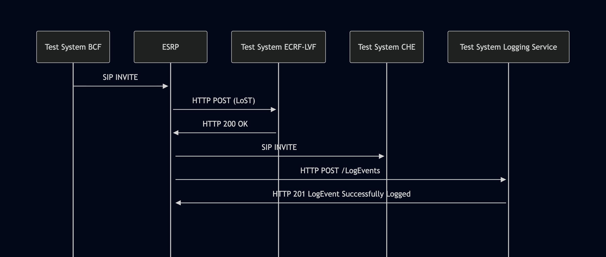

# Test Description: TD_ESRP_014
## Overview
### Summary
Validation of logging LostQueryLogEvent message.

### Description
This test ensures the ESRP correctly generates LostQueryLogEvent.

### HTTP and SIP transport types
Test can be performed with 2 different SIP and HTTP transport types. Steps describing actions for specific one are marked as following:
- (TLS transport) - should be used by default
- (TCP transport) - used in lab for testing purposes only if default TLS is not possible

### References
* Requirements : RQ_ESRP_173
* Test Case    : TC_ESRP_014

### Requirements
IXIT config file for ESRP

## Configuration
### Implementation Under Test Interface Connections
<!-- Identify each of the FEs that are part of the configuration and how they are connected -->
* Test System BCF
  * IF_BCF_ESRP - connected to IF_ESRP_BCF
* ESRP
  * IF_ESRP_BCF - connected to Test System BCF IF_BCF_ESRP
  * IF_ESRP_ECRF-LVF - connected to Test System ECRF-LVF IF_ECRF-LVF_ESRP
  * IF_ESRP_LOG – connected to Test System Logging Service IF_LOG_ESRP 
  * IF_ESRP_CHFE - connected to IF_CHFE_ESRP

* Test System ECRF-LVF
  * IF_ECRF-LVF_ESRP - connected to IF_ESRP_ECRF-LVF

* Test System Logging Service (LOG)
  * IF_LOG_ESRP – connected to ESRP IF_ESRP_LOG
  
* Test System CHFE
  * IF_CHFE_ESRP - connected to IF_ESRP_CHFE

### Test System Interfaces
<!-- Identify each of the test system interfaces and whether it will be in active or monitor mode -->
* Test System BCF
  * IF_BCF_ESRP - Active

* Test System ECRF-LVF
  * IF_ECRF-LVF_ESRP - Monitor

* ESRP
  * IF_ESRP_BCF - Active
  * IF_ESRP_ECRF-LVF - Monitor
  * IF_ESRP_CHFE - Monitor
  * IF_ESRP_LOG - Active

* Test System CHFE
  * IF_CHFE_ESRP - Monitor
 
 
### Connectivity Diagram
<!--
https://mermaid.live/edit#pako:eNp9UlFrgzAQ_ityz7aoi1HD2MNcZYUORjv6MISSaVrLqpEY2brS_75UF6eW7Z7uvvvuuy_hTpDwlAGB7YF_JBkV0lgs48JQMY8292G0ma2WzxMVd_M2v4AdoQFm4TKaLNbRrWb91E13SA0fZ1pLpT1CVb_tBC0z44VV0lgdK8lyo9s0stOCrEhHs7-9_s6xijZyDWrjf-n3vQ25WuX65f-rjG0MP0XNggk7sU-BSFEzE3Imcnop4XShxCAzlrMYiEpTKt5jiIuzmilp8cp5rscEr3cZkC09VKqqy5RK9rCnyk_eoUJtYyLkdSGB-EGjAeQEn0Ac250iHASO5yLX8pF_Y8IRCPamPvZsGwd-YGHbds4mfDVbramHLOQ6HsbI9pHrmUBryVfHItGWWLqXXDy1x9fc4PkboZS9DQ
-->


## Pre-Test Conditions

### Test System BCF, Test System CHFE
* Interfaces are connected to network
* Interfaces have IP addresses assigned by DHCP
* Device is active
* No active calls
* (TLS transport) Test System has it's own certificate signed by PCA

### Test System ECRF-LVF, Test System Logging Service
* Interfaces are connected to network
* Interfaces have IP addresses assigned by DHCP
* Device is active
* (TLS transport) Test System has it's own certificate signed by PCA

### ESRP
* Interfaces are connected to network
* Interfaces have IP addresses assigned by DHCP
* Default configuration is loaded
* Device is initialized with steps from IXIT config file
* Device configured to use `Test System ECRF-LVF` by default as ECRF server
* Device configured to use `Test System Logging Service` by default as Logging Service server
* Device is active
* Device is in normal operating state
* No active calls


## Test Sequence
### Test Preamble

#### Test System BCF
* Install SIPp by following steps from documentation[^1]
* Copy following XML scenario files to local storage:
  ```
  SIP_INVITE_location_PIDF-LO_Boundary1.xml
  ```
* Install Wireshark[^2]
* (TLS transport) Copy to local storage PCA-signed TLS certificate and private key files:
  ```
  PCA-cacert.pem
  PCA-cakey.pem
  ```
* (TLS transport) Copy to local storage TLS certificate and private key files used by ESRP:
  ```
  ESRP-cacert.pem
  ESRP-cakey.pem
  ```
* (TLS transport) Configure Wireshark to decode SIP over TLS packets from Test System and ESRP as well[^3]
* Using Wireshark on 'Test System' start packet tracing on IF_BCF_ESRP interface - run following filter:
   * (TLS transport)
     > ip.addr == IF_BCF_ESRP_IP_ADDRESS and tls
   * (TCP transport)
     > ip.addr == IF_BCF_ESRP_IP_ADDRESS and sip

     
#### Test System ECRF-LVF
* Install Wireshark[^2]
* (TLS v1.2) Configure Wireshark to decode HTTP over TLS, use tests system and PS certificate keys [^2]
* (TLS v1.3) Configure logging of session keys and configure Wireshark to decode HTTP over TLS [^3]
* Copy following XML scenario files to local storage:
  ```
  findServiceResponse.xml
  ```
* (TLS transport) Copy to local storage PCA-signed TLS certificate and private key files:
  ```
  PCA-cacert.pem
  PCA-cakey.pem
  ```
* (TLS transport) Copy to local storage TLS certificate and private key files used by ESRP:
  ```
  ESRP-cacert.pem
  ESRP-cakey.pem
  ```
* (TLS transport) Configure Wireshark to decode HTTP over TLS packets from Test System and ESRP as well[^3]
* Using Wireshark on 'Test System' start packet tracing on IF_ECRF-LVF_ESRP interface - run following filter:
   * (TLS transport)
     > ip.addr == IF_ECRF-LVF_ESRP_IP_ADDRESS and tls
   * (TCP transport)
     > ip.addr == IF_ECRF-LVF_ESRP_IP_ADDRESS and sip
* Start http server responding for HTTP POST requests:
    * (TCP transport)
      ```
      echo -e "HTTP/1.1 200 OK\r\n | nc -lp 80
      ```
    * (TLS transport)
      ```
      echo -e "HTTP/1.1 200 OK\r\n | openssl s_server -quiet -accept LOCAL_PORT -cert PCA-cacert.pem -key PCA-cakey.pem
      ```

* start HTTP server on port 80 using command in the terminal (example for /lost entrypoint):
(TLS):
python3 http_entry.py --ip IF_ECRF-LVF_ESRP --port 80 --role RECEIVER --path /lost --method POST --body findServiceResponse.xml --server_cert PCA-cacert.pem --server_key PCA-cakey.pem
(TCP):
python3 http_entry.py --ip IF_ECRF-LVF_ESRP --port 80 --role RECEIVER --path /lost --method POST --body findServiceResponse.xml

#### Test System CHFE
* Install SIPp by following steps from documentation[^2]
* Install Wireshark[^3]
* (TLS transport) Configure Wireshark to decode SIP over TLS packets[^4]
* Copy following XML scenario files to local storage:
  ```
  SIP_INVITE_RECEIVE.xml
  ```
* (TLS transport) Copy to local storage SIP TLS certificate and private key files used to decrypt SIP packets within ESInet:
  > cacert.pem
  > cakey.pem
* Using Wireshark on 'Test System CHFE' start packet tracing on IF_CHFE_ESRP interface - run following filter:
   * (TLS transport)
     > ip.addr == IF_CHFE_ESRP_IP_ADDRESS and tls
   * (TCP transport)
     > ip.addr == IF_CHFE_ESRP_IP_ADDRESS and http
* Prepare Test System to receive SIP INVITE - run following SIPp command on Test System, example:
    * (TLS transport)
      > sudo sipp -t l1 -sf SIP_INVITE_RECEIVE.xml -tls_cert cacert.pem -tls_key cakey.pem -i IF_CHFE_ESRP_IP_ADDRESS -p 5061
    * (TCP transport)
      > sudo sipp -t t1 -sf SIP_INVITE_RECEIVE.xml -i IF_CHFE_ESRP_IP_ADDRESS -p 5060

#### Test System Logging Service
* Install Wireshark[^1]
* (TLS v1.2) Configure Wireshark to decode HTTP over TLS, use tests system and PS certificate keys [^2]
* (TLS v1.3) Configure logging of session keys and configure Wireshark to decode HTTP over TLS [^3]
* Using Wireshark on 'Test System LOG' start packet tracing on IF_LOG_ESRP interface - run following filter:
   * (TLS)
     > ip.addr == IF_LOG_ESRP_IP_ADDRESS and tls
   * (TCP)
     > ip.addr == IF_LOG_ESRP_IP_ADDRESS and http
* The Logging Service must be configured to accept and process HTTP POST requests.
  * To verify this manually, you can simulate a listening HTTP endpoint on port 8080 using command in the terminal:
  * (TLS):
    * `python3 http_entry.py --ip IF_LOG_ESRP --port 8080 --role RECEIVER --path /LogEvents --method POST --body "HTTP/1.1 201 Log Event Successfully Logged\r\nContent-Length: 0\r\n\r\n" --server_cert /tmp/cert.crt --server_key /tmp/cert.key`
    * In another terminal, send a POST request to verify it is working:
      * `curl -k -X POST https://localhost:8080 -d '{"log":"test"}'`
  * (TCP):
    * `while true; do echo -e "HTTP/1.1 201 Log Event Successfully Logged\r\n\r\n" | nc -l -p 8080 -q 1; done`
    * In another terminal, send a POST request to verify it is working:
      * `curl -X POST http://localhost:8080 -d '{"log":"test"}'`  


### Test Body

#### Stimulus
Send SIP packet to ESRP - run following SIPp command on Test System BCF, example:

* (TCP transport)
   ```
   sudo sipp -t t1 -sf SIP_INVITE_location_PIDF-LO_Boundary1.xml IF_ESRP_BCF_IP_ADDRESS:5060
   ```
* (TLS transport)
   ```
   sudo sipp -t l1 -sf SIP_INVITE_location_PIDF-LO_Boundary1.xml -tls_cert cacert.pem -tls_key cakey.pem IF_ESRP_BCF_IP_ADDRESS:5061
  


#### Response

Using traced packets on Wireshark verify if ESRP sent HTTP POST to 'Test System Logging Service' (/LogEvents entrypoint) containing:
- JWS body conforming to NENA-STA-010.3 (5.10 JSON Web signatures)
- decoded `payload` of the JWS body should contain JSON with:
  - `logEventType`:`"LostQueryLogEvent"`
  - `queryAdapter` with string value consisting of the entire LoST query (XML body of HTTP POST sent by ESRP to ECRF-LVF)
  - `direction`: `"outgoing"`
  - one `queryId` with a string value
 
VERDICT:
* PASSED - if all checks passed for variation.
* FAILED - if ESRP won't route and receive messages, and not produce Log Events.


### Test Postamble
#### Test System BCF, Test System CHFE, Test System ECRF-LVF, Test System Logging Service
* stop all SIPp processes (if still running)
* stop all python HTTP server processes (if still running)
* archive all logs generated
* remove all XML scenarios (SIPp, HTTP)
* disconnect interfaces from ESRP
* stop Wireshark (if still running)
* (TLS transport) remove certificates

#### ESRP
* reconnect interfaces back to default

## Post-Test Conditions
### Test System BCF, Test System CHFE, Test System ECRF-LVF, Test System Logging Service
* Test tools stopped
* interfaces disconnected from ESRP

### ESRP
* device connected back to default
* device in normal operating state

## Sequence Diagram
<!--
https://mermaid.live/edit#pako:eNqNkk9vgkAQxb_KZk5tCpY_orAHk5ZiNLWVCPHQcCEwIqns2mUxtcbvXsBaTWua7mmz83vz3mZmBwlPESioqhqxhLNFntGIEVLkQnBxl0guSkoW8arEiLVQiW8VsgQf8jgTcdHAhxNiKUmwLSUW5N4dqoPBjRfMfEqCsU_Gz_Nx6J3gptIQ5yLPnQ3VyXxIySgMfeJPg5BcTXgQXl82OfInp1ZnaBqZPv5t5Y68_-ea8CzLWUYCFJs8wfN4t3XN2yCT5eWIP6S_kurk2IAEVZJgWS6q1Wrb6jAFBQoURZyn9YR2jUMEcokFRkDraxqL1wgitq-5uJI82LIEqBQVKiB4lS2BtoNToFqnsTxO7Pt1HbMXzoujBNO8nvbTYR_atWgRoDt4B-oYHbNrWv2e5piO0Td0BbZA-2bHsm3T0CzH6Rm2bu8V-Gh7ah3b6Vmarhumo1m6rTsKZKL5yVdAZCkKl1dMAu3q2v4TOVTEDw
-->




## Comments

Version:  010.3f.5.0.0

Date:     20260420

## Footnotes
[^1]: SIPp - tool for SIP packet simulations. Official documentation: https://sipp.sourceforge.net/doc/reference.html#Getting+SIPp
[^2]: Wireshark - tool for packet tracing and anaylisis. Official website: https://www.wireshark.org/download.html
[^3]: Wireshark configuration to decrypt TLS packets: https://www.zoiper.com/en/support/home/article/162/How%20to%20decode%20SIP%20over%20TLS%20with%20Wireshark%20and%20Decrypting%20SDES%20Protected%20SRTP%20Stream
[^4]: TLS v1.3 session keys logging + Wireshark configuration to decrypt traffic: https://my.f5.com/manage/s/article/K50557518
