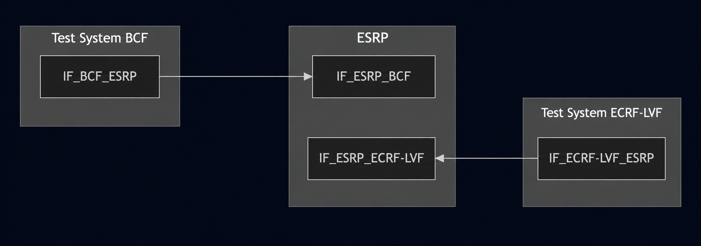
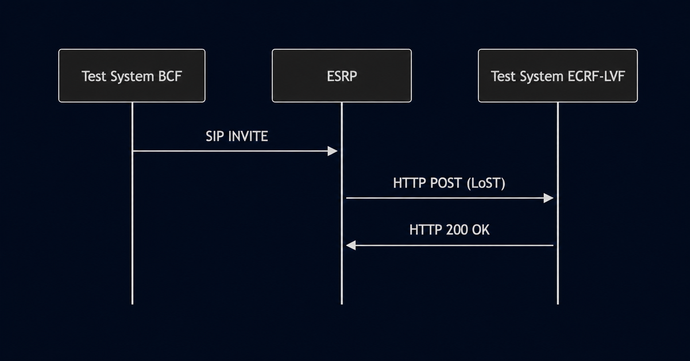

# Test Description: TD_ESRP_016
## Overview
### Summary
Validate the ESRP MUST use a TCP/TLS transport for LoST requests

### Description
Validation the ESRP use a TCP/TLS transport and provisioned with the credentials for the ECRF

### References
* Requirements : RQ_ESRP_050
* Test Case    : TC_ESRP_016

### Requirements
IXIT config file for ESRP

## Configuration
### Implementation Under Test Interface Connections
<!-- Identify each of the FEs that are part of the configuration and how they are connected -->
* Test System BCF
  * IF_BCF_ESRP - connected to IF_ESRP_BCF
* ESRP
  * IF_ESRP_BCF - connected to Test System BCF IF_BCF_ESRP
  * IF_ESRP_ECRF-LVF - connected to Test System ECRF-LVF IF_ECRF-LVF_ESRP
* Test System ECRF-LVF
  * IF_ECRF-LVF_ESRP - connected to IF_ESRP_ECRF-LVF

### Test System Interfaces
<!-- Identify each of the test system interfaces and whether it will be in active or monitor mode -->
* Test System BCF
  * IF_BCF_ESRP - Active

* Test System ECRF-LVF
  * IF_ECRF-LVF_ESRP - Active

* ESRP
  * IF_ESRP_BCF - Active
  * IF_ESRP_ECRF-LVF - Active


### Connectivity Diagram



## Pre-Test Conditions

### Test System BCF
* Interfaces are connected to network
* Interfaces have IP addresses assigned by DHCP
* Device is active
* No active calls
* (Variation 2 - TLS transport) Test System has its own certificate signed by PCA

### Test System ECRF-LVF
* Interfaces are connected to network
* Interfaces have IP addresses assigned by DHCP
* Device is active
* (Variation 2 - TLS transport) Test System has its own certificate signed by PCA

### ESRP
* Interfaces are connected to network
* Interfaces have IP addresses assigned by DHCP
* Default configuration is loaded
* Device is initialized with steps from IXIT config file
* Device configured to use `Test System ECRF-LVF` by default as ECRF server
* Device is active
* Device is in normal operating state
* No active calls


## Test Sequence
### Test Preamble

#### Test System BCF
* Install SIPp by following steps from documentation[^1]
* Copy following XML scenario files to local storage:
  ```
  SIP_INVITE_location_PIDF-LO_Boundary1.xml
  ```
* Install Wireshark[^2]
* (TLS transport) Copy to local storage PCA-signed TLS certificate and private key files:
  ```
  PCA-cacert.pem
  PCA-cakey.pem
  ```
* (TLS transport) Copy to local storage TLS certificate and private key files used by ESRP:
  ```
  ESRP-cacert.pem
  ESRP-cakey.pem
  ```
* (TLS transport) Configure Wireshark to decode SIP over TLS packets from Test System and ESRP as well[^3]
* Using Wireshark on 'Test System' start packet tracing on IF_BCF_ESRP interface - run following filter:
   * (TLS transport)
     > ip.addr == IF_BCF_ESRP_IP_ADDRESS and tls
   * (TCP transport)
     > ip.addr == IF_BCF_ESRP_IP_ADDRESS and sip

#### Test System ECRF-LVF
* Install Wireshark[^2]
* (TLS v1.2) Configure Wireshark to decode HTTP over TLS, use tests system and PS certificate keys [^2]
* (TLS v1.3) Configure logging of session keys and configure Wireshark to decode HTTP over TLS [^3]
* Copy following XML scenario files to local storage:
  ```
  findServiceResponse.xml
  ```
* (TLS transport) Copy to local storage PCA-signed TLS certificate and private key files:
  ```
  PCA-cacert.pem
  PCA-cakey.pem
  ```
* (TLS transport) Copy to local storage TLS certificate and private key files used by ESRP:
  ```
  ESRP-cacert.pem
  ESRP-cakey.pem
  ```
* (TLS transport) Configure Wireshark to decode HTTP over TLS packets from Test System and ESRP as well[^3]
* Using Wireshark on 'Test System' start packet tracing on IF_ECRF-LVF_ESRP interface - run following filter:
   * (TLS transport)
     > ip.addr == IF_ECRF-LVF_ESRP_IP_ADDRESS and tls
   * (TCP transport)
     > ip.addr == IF_ECRF-LVF_ESRP_IP_ADDRESS and sip

     ```
     
* start HTTP server on port 443 using command in the terminal (example for /lost entrypoint):
(TLS):
python3 http_entry.py --ip IF_ECRF-LVF_ESRP --port 443 --role RECEIVER --path /lost --method POST --body findServiceResponse.xml --server_cert PCA-cacert.pem --server_key PCA-cakey.pem

* start HTTP server on port 80 using command in the terminal (example for /lost entrypoint):
(TCP):
python3 http_entry.py --ip IF_ECRF-LVF_ESRP --port 80 --role RECEIVER --path /lost --method POST --body findServiceResponse.xml


### Test Body

#### Variations
1. HTTP (TCP transport)
2. HTTP (TLS transport)

#### Stimulus
Send SIP INVITE to ESRP - run following SIPp command on Test System BCF, example:

**Variation 1** (TCP transport):
1. Change ESRP configuration to force sending LoST requests using TCP and port 80 to Test System ECRF-LVF
2. Send SIP INVITE to ESRP - run following SIPp command on Test System BCF, example:
  ```
  sudo sipp -t t1 -sf SIP_INVITE_location_PIDF-LO_Boundary1.xml -i IF_BCF_ESRP_IP_ADDRESS -p 5060 -bind_local IF_ESRP_BCF_IP_ADDRESS:5060 -max_recv_loops 1 -m 1
  ```

**Variation 2** (TLS transport):
1. Change ESRP configuration to force sending LoST requests using TLS and port 443 to Test System ECRF-LVF
2. Send SIP INVITE to ESRP - run following SIPp command on Test System BCF, example:
  ```
  sudo sipp -t l1 -tls_cert PCA-cacert.pem -tls_key PCA-cakey.pem -sf SIP_INVITE_location_PIDF-LO_Boundary1.xml -i IF_BCF_ESRP_IP_ADDRESS -p 5060 -bind_local IF_ESRP_BCF_IP_ADDRESS:5060 -max_recv_loops 1 -m 1
  ```

#### Response

Variation 1 (HTTP/TCP):
* ESRP sends HTTP LoST query to Test System ECRF-LVF with findService request
* findService request contains geolocation from received SIP INVITE
* HTTP POST is sent via TCP on port 80

Variation 2 (HTTP/TLS):
* ESRP sends HTTP/TLS LoST query to Test System ECRF-LVF with findService request
* findService request contains geolocation from received SIP INVITE
* HTTP POST is sent via TLS on port 443

VERDICT:
* PASSED - if all checks passed for variation.
* FAILED - if ESRP did not send a LoST query to ECRF-LVF, or ECRF-LVF did not receive a correctly formed request.


### Test Postamble
#### Test System BCF
* stop all SIPp processes (if still running)
* archive all logs generated
* remove all XML scenarios
* disconnect interfaces from ESRP
* stop Wireshark (if still running)
* (Variation 2 - TLS transport) remove certificates

#### Test System ECRF-LVF
* stop all python HTTP server processes (if still running)
* archive all logs generated
* remove all XML scenarios (HTTP)
* disconnect interfaces from ESRP
* stop Wireshark (if still running)
* (Variation 2 - TLS transport) remove certificates

#### ESRP
* reconnect interfaces back to default

## Post-Test Conditions
### Test System BCF
* Test tools stopped
* interfaces disconnected from ESRP

### Test System ECRF-LVF
* Test tools stopped
* interfaces disconnected from ESRP

### ESRP
* device connected back to default
* device in normal operating state

## Sequence Diagram




## Comments

Version:  010.3f.5.0.2

Date:     20260603

## Footnotes
[^1]: SIPp - tool for SIP packet simulations. Official documentation: https://sipp.sourceforge.net/doc/reference.html#Getting+SIPp
[^2]: Wireshark - tool for packet tracing and anaylisis. Official website: https://www.wireshark.org/download.html
[^3]: Wireshark configuration to decrypt TLS packets: https://www.zoiper.com/en/support/home/article/162/How%20to%20decode%20SIP%20over%20TLS%20with%20Wireshark%20and%20Decrypting%20SDES%20Protected%20SRTP%20Stream
[^4]: TLS v1.3 session keys logging + Wireshark configuration to decrypt traffic: https://my.f5.com/manage/s/article/K50557518