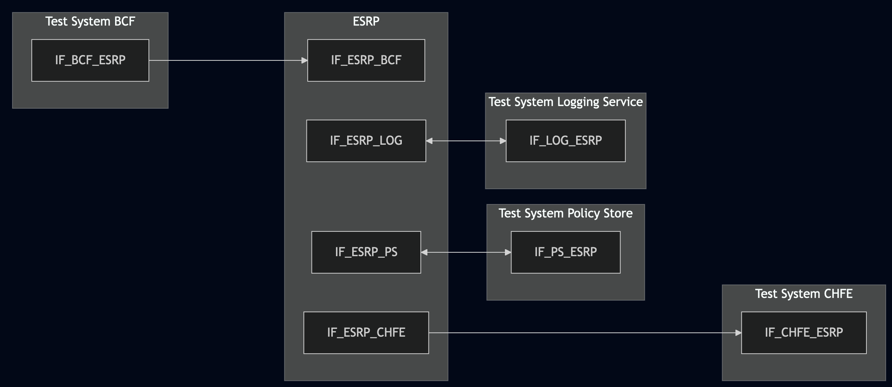
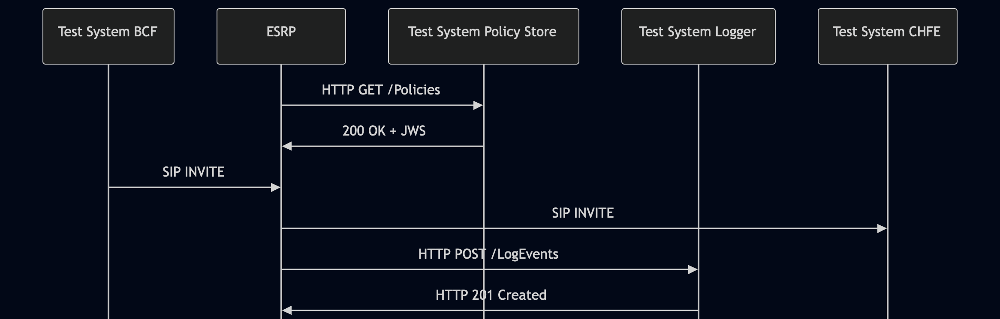

# Test Description: TD_ESRP_017
## Overview
### Summary
Logging of RouteLogEvent

### Description
This test ensures that the ESRP, when acting as a proxy server and making a routing decision, correctly generates and sends an HTTP POST to the Logging Service containing a RouteLogEvent with all required members and correct conditional members based on the `policyType` value.

### HTTP and SIP transport types
Test can be performed with 2 different SIP and HTTP transport types. Steps describing actions for specific one are marked as following:
- (TLS transport) - should be used by default
- (TCP transport) - used in lab for testing purposes only if default TLS is not possible

### References
* Requirements : RQ_ESRP_152
* Test Case    : TC_ESRP_017

### Requirements
IXIT config file for ESRP specifying configuration of:

Variation 1:
- ESRP configured with a routing policy of type "NormalNextHopRoutePolicy" including a `policyQueueName`

Variation 2:
- ESRP configured with a routing policy of type "OriginationRoutePolicy" including a `policyQueueName`

Variation 3:
- ESRP configured with a routing policy of type "OtherRoutePolicy" including a `policyId`

## Configuration
### Implementation Under Test Interface Connections
<!-- Identify each of the FEs that are part of the configuration and how they are connected -->
* Test System BCF
  * IF_BCF_ESRP - connected to IF_ESRP_BCF
* ESRP
  * IF_ESRP_BCF - connected to Test System BCF IF_BCF_ESRP
  * IF_ESRP_PS - connected to Test System Policy Store IF_PS_ESRP
  * IF_ESRP_CHFE - connected to Test System CHFE IF_CHFE_ESRP
  * IF_ESRP_LOG - connected to Test System Logging Service IF_LOG_ESRP
* Test System Policy Store
  * IF_PS_ESRP - connected to IF_ESRP_PS
* Test System CHFE
  * IF_CHFE_ESRP - connected to IF_ESRP_CHFE
* Test System Logging Service (LOG)
  * IF_LOG_ESRP - connected to IF_ESRP_LOG

### Test System Interfaces
<!-- Identify each of the test system interfaces and whether it will be in active or monitor mode -->
* Test System BCF
  * IF_BCF_ESRP - Active
* ESRP
  * IF_ESRP_BCF - Active
  * IF_ESRP_PS - Active
  * IF_ESRP_CHFE - Active
  * IF_ESRP_LOG - Active
* Test System Policy Store
  * IF_PS_ESRP - Active
* Test System CHFE
  * IF_CHFE_ESRP - Active
* Test System Logging Service
  * IF_LOG_ESRP - Active

### Connectivity Diagram
<!--
https://mermaid.live/edit#pako:eNp9UltvgjAU_ivkPDMjV22z7GFONxOXEfFpITEdVCCT1pSyjRn_-wqIE9zs0-l3znfh0D2EPKKAYbPln2FChNQWy4Bp6sxn6_vJbD31l96NOnfzpq7A00ANeP5t0_b8Guh2J0-zacuv6j9GFi-PRwVVnfXz4i0WZJdoK5pLzS9zSTPtZN_L2ICURT3ub-_csq9y_JBLrIp8iaqc__mdZ_X4Ng1LzZdc0I5IZ1PXNS4C9JZ4nb3gcZyyWPOp-EjDbojuspUO6BCLNAIsRUF1yKjISHWFfTUSgExoRgPAqoyIeA8gYAfF2RH2ynnW0gQv4gTwhmxzdSt2EZH0ISUqW3ZChXKjYsILJgHbY7MWAbyHL8COO7DGlm0jC9nINa2Rq0MJGA0HQ8c0DcOwDdd2R-ZBh-_adjhAlgJc00TIUeMO0oEUkvslC9tQNErVT3hu3nr95Nto07pzTHb4AT1a5xg
-->



## Pre-Test Conditions
### Test System BCF, Test System CHFE
* Interfaces are connected to network
* Interfaces have IP addresses assigned by DHCP
* Device is active
* No active calls
* (TLS transport) Test System has its own certificate signed by PCA

### Test System Policy Store, Test System Logging Service
* Interfaces are connected to network
* Interfaces have IP addresses assigned by DHCP
* Device is active
* (TLS transport) Test System has its own certificate signed by PCA

### ESRP
* Interfaces are connected to network
* Interfaces have IP addresses assigned by DHCP
* Default configuration is loaded
* Device is initialized with steps from IXIT config file
* Device configured to use Test System Policy Store as Policy Store server
* Device configured to use Test System Logging Service as Logging Service server
* Device is active
* Device is in normal operating state
* No active calls


## Test Sequence
### Test Preamble

#### Test System BCF
* Install SIPp by following steps from documentation[^1]
* Copy following XML scenario files to local storage:
  ```
  SIP_basic_call.xml
  ```
* Install Wireshark[^2]
* (TLS transport) Copy to local storage PCA-signed TLS certificate and private key files:
  ```
  PCA-cacert.pem
  PCA-cakey.pem
  ```
* (TLS transport) Copy to local storage TLS certificate and private key files used by ESRP:
  ```
  ESRP-cacert.pem
  ESRP-cakey.pem
  ```
* (TLS transport) Configure Wireshark to decode SIP over TLS packets from Test System and ESRP[^3]
* Using Wireshark on 'Test System' start packet tracing on IF_BCF_ESRP interface - run following filter:
   * (TLS transport)
     > ip.addr == IF_BCF_ESRP_IP_ADDRESS and tls
   * (TCP transport)
     > ip.addr == IF_BCF_ESRP_IP_ADDRESS and sip

#### Test System Policy Store
* Install Wireshark[^2]
* (TLS v1.2) Configure Wireshark to decode HTTP over TLS, use test system and ESRP certificate keys[^3]
* (TLS v1.3) Configure logging of session keys and configure Wireshark to decode HTTP over TLS[^4]
* Using Wireshark start packet tracing on IF_PS_ESRP interface - run following filter:
   * (TLS transport)
     > ip.addr == IF_PS_ESRP_IP_ADDRESS and tls
   * (TCP transport)
     > ip.addr == IF_PS_ESRP_IP_ADDRESS and http
* The Policy Store must be configured to accept and process HTTP GET requests.
  * Use one of following JSON files with policies, depending on variation:
    * Variation 1: `Policy_object_RoutePolicy_NormalNextHop_v010.3f.5.0.0.json`
    * Variation 2: `Policy_object_RoutePolicy_Origination_v010.3f.5.0.0.json`
    * Variation 3: `Policy_object_RoutePolicy_Other_v010.3f.5.0.0.json`
  * Edit the file and replace following string values:
    * `POLICY_QUEUE_NAME` - replace with ESRP's default queue
    * `sip:DOWNSTREAM_SIP_URI` - replace with sip uri of the Test System CHFE
  * Generate a JWS object from the variant-specific policy file and save to `jws.json`:
    ```
    python3 -m main generate_jws <POLICY_FILE> --cert test_system.crt --key test_system.key --output_file jws.json
    ```
  * Simulate a listening HTTP endpoint on port 8080:
    * (TLS):
      * `python3 http_entry.py --ip IF_PS_ESRP --port 8080 --role RECEIVER --path /Policies --method GET --body jws.json --server_cert /tmp/cert.crt --server_key /tmp/cert.key`
    * (TCP):
      * `while true; do cat jws.json | nc -l -p 8080 -q 1; done`

#### Test System CHFE
* Install SIPp by following steps from documentation[^1]
* Copy following XML scenario files to local storage:
  ```
  SIP_RECEIVE_basic_call_and_answer.xml
  ```
* Install Wireshark[^2]
* (TLS transport) Configure Wireshark to decode SIP over TLS packets[^3]
* (TLS transport) Copy to local storage TLS certificate and private key files:
  ```
  cacert.pem
  cakey.pem
  ```
* Using Wireshark start packet tracing on IF_CHFE_ESRP interface - run following filter:
   * (TLS transport)
     > ip.addr == IF_CHFE_ESRP_IP_ADDRESS and tls
   * (TCP transport)
     > ip.addr == IF_CHFE_ESRP_IP_ADDRESS and sip
* Prepare Test System to receive SIP INVITE - run following SIPp command:
    * (TLS transport)
      > sudo sipp -t l1 -sf SIP_RECEIVE_basic_call_and_answer.xml -tls_cert cacert.pem -tls_key cakey.pem -i IF_CHFE_ESRP_IP_ADDRESS -p 5061
    * (TCP transport)
      > sudo sipp -t t1 -sf SIP_RECEIVE_basic_call_and_answer.xml -i IF_CHFE_ESRP_IP_ADDRESS -p 5060

#### Test System Logging Service
* Install Wireshark[^2]
* (TLS v1.2) Configure Wireshark to decode HTTP over TLS, use test system and ESRP certificate keys[^3]
* (TLS v1.3) Configure logging of session keys and configure Wireshark to decode HTTP over TLS[^4]
* Using Wireshark start packet tracing on IF_LOG_ESRP interface - run following filter:
   * (TLS)
     > ip.addr == IF_LOG_ESRP_IP_ADDRESS and tls
   * (TCP)
     > ip.addr == IF_LOG_ESRP_IP_ADDRESS and http
* The Logging Service must be configured to accept and process HTTP POST requests.
  * To verify this manually, you can simulate a listening HTTP endpoint on port 8080 using command in the terminal:
  * (TLS):
    * `python3 http_entry.py --ip IF_LOG_ESRP --port 8080 --role RECEIVER --path /LogEvents --method POST --body "HTTP/1.1 201 Log Event Successfully Logged\r\nContent-Length: 0\r\n\r\n" --server_cert /tmp/cert.crt --server_key /tmp/cert.key`
    * In another terminal, send a POST request to verify it is working:
      * `curl -k -X POST https://localhost:8080 -d '{"log":"test"}'`
  * (TCP):
    * `while true; do echo -e "HTTP/1.1 201 Log Event Successfully Logged\r\n\r\n" | nc -l -p 8080 -q 1; done`
    * In another terminal, send a POST request to verify it is working:
      * `curl -X POST http://localhost:8080 -d '{"log":"test"}'`  


### Test Body

#### Variations
1. `policyType` is set to "NormalNextHopRoutePolicy"
2. `policyType` is set to "OriginationRoutePolicy"
3. `policyType` is set to "OtherRoutePolicy"

#### Stimulus
1. Restart ESRP or trigger fetching policies from the Test System Policy Store manually
2. Send SIP INVITE to ESRP - run following SIPp command on Test System BCF, example:

* (TCP transport)
  ```
  sudo sipp -t t1 -sf SIP_basic_call.xml -i IF_BCF_ESRP_IP_ADDRESS -p 5060 -bind_local IF_ESRP_BCF_IP_ADDRESS:5060 -m 1
  ```
* (TLS transport)
  ```
  sudo sipp -t l1 -tls_cert PCA-cacert.pem -tls_key PCA-cakey.pem -sf SIP_basic_call.xml -i IF_BCF_ESRP_IP_ADDRESS -p 5061 -bind_local IF_ESRP_BCF_IP_ADDRESS:5061 -m 1
  ```

#### Response
Using traced packets on Wireshark verify if ESRP sent HTTP POST to Test System Logging Service (`/LogEvents` entrypoint) containing:

  * "logEventType": "RouteLogEvent"
  * "timestamp" with correct date-time format (e.g. 2020-03-10T11:00:01-05:00) and date-time match the time when SIP INVITE message has been received
  * "elementId" which has value with FQDN of ESRP
  * "agencyId" which has value with FQDN of an agency
  * "callId" which has value e.g.: `urn:emergency:uid:callid:1234567890:bcf.ng911.example`. Check:
    * if header field contains "urn:emergency:uid:callid:"
    * if "urn:emergency:uid:callid:" is followed by 10 to 32 alphanumeric characters (String ID)
    * if String ID is followed by ":" and domain name
  * "callId" should have the same value as callId in the SIP INVITE from BCF (Call-Info header field), example:
    for following Call-Info header field in the SIP INVITE:
    ```
    Call-Info: <urn:emergency:uid:callid:123ABCdefg123ABCdefg123ABCdefg12:test.com>;purpose=emergency-CallId
    ```
    "callId" should contain value:
    ```
    urn:emergency:uid:callid:123ABCdefg123ABCdefg123ABCdefg12:test.com
    ```
  * "incidentId" which has value e.g.: `urn:emergency:uid:incidentid:1234567890:bcf.ng911.example`. Check:
    * if header field contains "urn:emergency:uid:incidentid:"
    * if "urn:emergency:uid:incidentid:" is followed by 10 to 32 alphanumeric characters (String ID)
    * if String ID is followed by ":" and domain name
  * "incidentId" should have the same value as incidentId in the SIP INVITE from BCF (Call-Info header field), example:
    for following Call-Info header field in the SIP INVITE:
    ```
    Call-Info: <urn:emergency:uid:incidentid:123ABCdefg123ABCdefg123ABCdefg12:test.com>;purpose=IncidentId
    ```
    "callId" should contain value:
    ```
    urn:emergency:uid:incidentid:123ABCdefg123ABCdefg123ABCdefg12:test.com
    ```
  * "callIdSip" which has value e.g.: `1234567890qwertyuiop@caller.example.com` 
  * "callIdSip" should have the same value as Call-ID in the SIP INVITE from BCF, example:
  for following Call-ID header field in the SIP INVITE:
    ```
    Call-ID: test@ng911.example.com
    ```
    "callIdSip" should contain value:
    ```
    test@ng911.example.com
    ```
  * "recipientUri" with string value containing SIP URI of the Test System CHFE 
  * "policyOwner" with string value containing FQDN or URI with FQDN, e.g. `user@test.example`
  * "policyType" member that is a string consisting of the contents of the "Type" field of one entry in the Policy Types registry (NENA-STA-010.3, Section 10.33)
  * (Variation1, Variation2) "policyQueueName" with string value consisting of a queue name (a SIP URI), for Variation3 MUST NOT be present
  * (Variation3) "policyId" with string value, MUST NOT be present for Variation1 and Variation2
  * (optional) "ruleId" with string value
  * (optional) "cause" with string value consisting of the "Value" field of an entry in the RouteCause Registry (NENA-STA-010.3, Section 10.20)
  * (optional) "clientAssignedIdentifier" field with string value
  * (optional) "agencyAgentId" field with string value
  * (optional) "agencyPositionId" field with string value
  * (optional) field "ipAddressPort" with string value representing normalized IP address and port number, or FQDN of 
   another element that participated in the transaction that triggered this LogEvent element 
  * (optional) "extension" field with JSON object


VERDICT:
* PASSED - if all checks passed for the variant.
* FAILED - any other cases.


### Test Postamble
#### Test System BCF, Test System CHFE
* stop all SIPp processes (if still running)
* archive all logs generated
* remove all XML scenarios
* disconnect interfaces from ESRP
* stop Wireshark (if still running)
* (TLS transport) remove certificates

#### Test System Policy Store, Test System Logging Service
* stop all python HTTP server processes (if still running)
* archive all logs generated
* disconnect interfaces from ESRP
* stop Wireshark (if still running)
* (TLS transport) remove certificates

#### ESRP
* disconnect interfaces from Test Systems
* reconnect interfaces back to default
* restore previous configuration

## Post-Test Conditions
### Test System BCF, Test System CHFE, Test System Policy Store, Test System Logging Service
* Test tools stopped
* interfaces disconnected from ESRP

### ESRP
* device connected back to default
* device in normal operating state

## Sequence Diagram
<!--
https://mermaid.live/edit#pako:eNp1kttu2zAMhl-F4O2czKe4tS4KbJnbZusWYzI2YPCNYLOusVrKZHlYGuTdJ9lJgCbojQ_8P5I_Je6wUjUhw9lsVspKyce2YaUE6Fqtlf5QGaV7Bo_iuadSjlBPfwaSFX1qRaNFV0qHA2yENm3VboQ08HF5C6KHgnoDfNsb6lzoksv499yB7n2p5vy8SK6e22oL3JqiS_5hfXee8KCahvQlury_zc5ZFzsO4wzNbm5yzuC-KHK4ywp4P3ZvqYeJybklHMgg9H1Yf4F38Pknn8TpaYc-MXyVw-rbj1WRvWrhur4p2okOBvI1tw7sONlfkqafKCufyo9U6Aew1CQM1W4S9LDRbY3M6IE87Eh3wv3izuWXaJ6ooxKZ_ayF_l1iKfc2x57QL6W6Y5pWQ_OEbFwBD4dNbcsf7v4U1SRr0ks1SIMsSK_HIsh2-A_ZIplH11Ecp1Eap0kYXSUebpGl_txfhGEQBHGQxMlVuPfwZWzrz9PIBpIwTNOFxReph2Iwim9ldTRFdWuX4Ou0u-MKH61lo3Jwtv8PxYLixA
-->



## Comments

Version:  010.3f.5.0.2

Date:     20260807

## Footnotes
[^1]: SIPp - tool for SIP packet simulations. Official documentation: https://sipp.sourceforge.net/doc/reference.html#Getting+SIPp
[^2]: Wireshark - tool for packet tracing and anaylisis. Official website: https://www.wireshark.org/download.html
[^3]: Wireshark configuration to decrypt TLS packets: https://www.zoiper.com/en/support/home/article/162/How%20to%20decode%20SIP%20over%20TLS%20with%20Wireshark%20and%20Decrypting%20SDES%20Protected%20SRTP%20Stream
[^4]: TLS v1.3 session keys logging + Wireshark configuration to decrypt traffic: https://my.f5.com/manage/s/article/K50557518