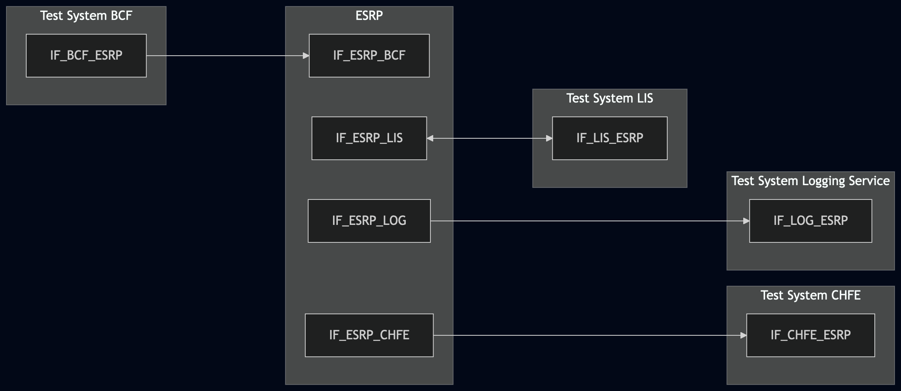
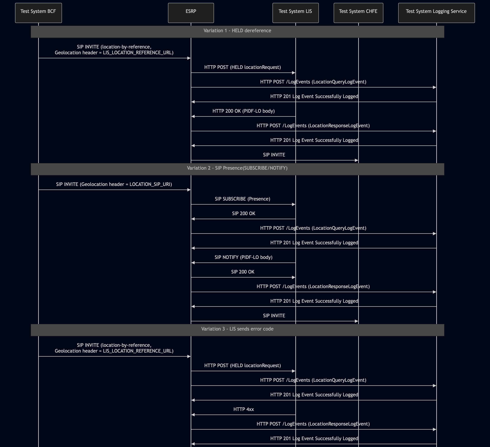

# Test Description: TD_ESRP_019
## Overview
### Summary
Validation of logging event messages: LocationQueryLogEvent, LocationResponseLogEvent.

### Description
This test ensures the ESRP correctly generates LocationQueryLogEvent/LocationResponseLogEvent messages with 
mandatory and optional members.

### HTTP and SIP transport types
Test can be performed with 2 different SIP and HTTP transport types. Steps describing actions for specific one are marked as following:
- (TLS transport) - should be used by default
- (TCP transport) - used in lab for testing purposes only if default TLS is not possible

### References
* Requirements : RQ_ESRP_156, RQ_ESRP_158, RQ_ESRP_159
* Test Case    : TC_ESRP_019

### Requirements
IXIT config file for ESRP

## Configuration
### Implementation Under Test Interface Connections
<!-- Identify each of the FEs that are part of the configuration and how they are connected -->
* Test System BCF
  * IF_BCF_ESRP - connected to IF_ESRP_BCF
* ESRP
  * IF_ESRP_BCF - connected to Test System BCF IF_BCF_ESRP
  * IF_ESRP_LIS - connected to Test System LIS IF_LIS_ESRP
  * IF_ESRP_LOG – connected to Test System Logging Service IF_LOG_ESRP 
  * IF_ESRP_CHFE - connected to Test System CHFE IF_CHFE_ESRP

* Test System LIS
  * IF_LIS_ESRP - connected to IF_ESRP_LIS

* Test System Logging Service (LOG)
  * IF_LOG_ESRP – connected to IF_ESRP_LOG
  
* Test System CHFE
  * IF_CHFE_ESRP - connected to IF_ESRP_CHFE

### Test System Interfaces
<!-- Identify each of the test system interfaces and whether it will be in active or monitor mode -->
* Test System BCF
  * IF_BCF_ESRP - Active

* Test System LIS
  * IF_LIS_ESRP - Active

* ESRP
  * IF_ESRP_BCF - Active
  * IF_ESRP_LIS - Monitor
  * IF_ESRP_CHFE - Active
  * IF_ESRP_LOG - Active

* Test System CHFE
  * IF_CHFE_ESRP - Monitor

* Test System Logging Service (LOG)
  * IF_LOG_ESRP – active
 
 
### Connectivity Diagram
<!--
https://mermaid.live/edit#pako:eNqFUtFOgzAU_RVyn3FhlNHRGB-c21wyMzN8MiRLhQ6Igy6lqHPZv1tAENjU-0BuT8-553DTI_g8YEBgu-PvfkSF1JZrL9VULWab28lsM3XXj1eqbhZVX4ANoQSWC_f6m6DaEusSJvezaT2i6C9Qlqt5zVBti1B9s_wlFHQfaU8sk5p7yCRLtCZIL20FsjToaX_u2s79KU3ic1T93QVwNf_NsB22r-1u6m_tWZreEv9x5mEYp6HmMvEW-6yborNrNQd0CEUcAJEiZzokTCS0OMKxoHggI5YwD4hqAypePfDSk9LsafrMeVLLBM_DCMiW7jJ1yvcBlewupipb0qBCuTEx4XkqgWAbl0OAHOEDiIUGzhihsWWNR6YqdXkAMjTxwECmg9DQxniEbXTS4bO0NQYYYRNjwzFGlmPZjg40l9w9pH6diQWx5OKheu3loz99Aav93jo
-->




## Pre-Test Conditions

### Test System BCF, Test System CHFE
* Interfaces are connected to network
* Interfaces have IP addresses assigned by DHCP
* Device is active
* No active calls
* (TLS transport) Test System has it's own certificate signed by PCA

### Test System LIS, Test System Logging Service
* Interfaces are connected to network
* Interfaces have IP addresses assigned by DHCP
* Device is active
* (TLS transport) Test System has it's own certificate signed by PCA

### ESRP
* Interfaces are connected to network
* Interfaces have IP addresses assigned by DHCP
* Default configuration is loaded
* Device is initialized with steps from IXIT config file
* Device configured to use `Test System LIS` by default as LIS server
* Device configured to use `Test System CHFE` by default as a next hop server for SIP messages
* Device configured to use `Test System Logging Service` by default as Logging Service server
* Device is active
* Device is in normal operating state
* No active calls


## Test Sequence
### Test Preamble

#### Test System BCF
* Install SIPp by following steps from documentation[^1]
* Copy following XML scenario files to local storage:
  ```
  SIP_INVITE_geolocation_HELD.xml
  SIP_INVITE_geolocation_SIP.xml
  ```
* For SIP_INVITE_geolocation_HELD.xml replace LIS_LOCATION_REFERENCE_URL with URL to the Test System LIS, e.g. 
https://lis.ng911.dev.lab:4443/location
* For SIP_INVITE_geolocation_SIP.xml replace LOCATION_SIP_URI with SIP URI to the Test System LIS, e.g. sip:location@lis.ng911.dev.lab:5060  
* Install Wireshark[^2]
* (TLS transport) Copy to local storage PCA-signed TLS certificate and private key files:
  ```
  PCA-cacert.pem
  PCA-cakey.pem
  ```
* (TLS transport) Copy to local storage TLS certificate and private key files used by ESRP:
  ```
  ESRP-cacert.pem
  ESRP-cakey.pem
  ```
* (TLS transport) Configure Wireshark to decode SIP over TLS packets from Test System and ESRP as well[^3]
* Using Wireshark on 'Test System' start packet tracing on IF_BCF_ESRP interface - run following filter:
   * (TLS transport)
     > ip.addr == IF_BCF_ESRP_IP_ADDRESS and tls
   * (TCP transport)
     > ip.addr == IF_BCF_ESRP_IP_ADDRESS and sip

     
#### Test System LIS
* Install SIPp by following steps from documentation[^1]
* Install Wireshark[^2]
* (TLS v1.2) Configure Wireshark to decode HTTP/SIP over TLS, use tests system and PS certificate keys [^2]
* (TLS v1.3) Configure logging of session keys and configure Wireshark to decode HTTP/SIP over TLS [^3]
* Copy following XML files to local storage:
  ```
  Location_response
  SIP_SUBSCRIBE_LIS.xml
  ```
* (TLS transport) Copy to local storage PCA-signed TLS certificate and private key files:
  ```
  PCA-cacert.pem
  PCA-cakey.pem
  ```
* (TLS transport) Copy to local storage TLS certificate and private key files used by ESRP:
  ```
  ESRP-cacert.pem
  ESRP-cakey.pem
  ```
* (TLS transport) Configure Wireshark to decode HTTP over TLS packets from Test System and ESRP as well[^3]
* Using Wireshark on 'Test System' start packet tracing on IF_LIS_ESRP interface - run following filter:
   * (TLS transport)
     > ip.addr == IF_LIS_ESRP_IP_ADDRESS and tls
   * (TCP transport)
     > ip.addr == IF_LIS_ESRP_IP_ADDRESS and sip

* Depending on current variation use one of following scenario files:
  * Variation 1 (HELD dereference)
    Start HTTP server responding to the ESRP's HTTP POST with the `Location_response` (PIDF-LO) body.
    `--path` MUST match the path component of `LIS_LOCATION_REFERENCE_URL` in `SIP_INVITE_geolocation_HELD.xml`
    Replace the example below with your configured value(e.g. if that URL is `https:// IF_LIS_ESRP_IP_ADDRESS:443/heldLocationRequest`, then `--path /heldLocationRequest`):
    * (TLS):
    ```
    python3 http_entry.py --ip IF_LIS_ESRP --port 443 --role RECEIVER --path /heldLocationRequest --method POST \
    --body Location_response --content_type application/held+xml --response_code 200 --server_cert PCA-cacert.pem --server_key PCA-cakey.pem
    ``` 
    * (TCP):
    ```
    python3 http_entry.py --ip IF_LIS_ESRP --port 80 --role RECEIVER --path /heldLocationRequest --method POST \
    --body Location_response --content_type application/held+xml --response_code 200
    ```
  * Variation 2 (SIP Presence dereference)
    Prepare Test System to receive SIP SUBSCRIBE - run following SIPp command on Test System, example:
    * (TLS transport)
      > sudo sipp -t l1 -sf SIP_SUBSCRIBE_LIS.xml -tls_cert cacert.pem -tls_key cakey.pem -i IF_LIS_ESRP_IP_ADDRESS -p 5061
    * (TCP transport)
      > sudo sipp -t t1 -sf SIP_SUBSCRIBE_LIS.xml -i IF_LIS_ESRP_IP_ADDRESS -p 5060
  
  * Variation 3 (LIS respond with one of error messages from Status Code Registry (Section 10.29), e.g. status code 454)
    Start HTTP server responding to the ESRP's HTTP POST with the `Location_response` (PIDF-LO) body.
    `--path` MUST match the path component of `LIS_LOCATION_REFERENCE_URL` in `SIP_INVITE_geolocation_HELD.xml`
    Replace the example below with your configured value(e.g. if that URL is `https:// IF_LIS_ESRP_IP_ADDRESS:443/heldLocationRequest`, then `--path /heldLocationRequest`):
    * (TLS):
    ```
    python3 http_entry.py --ip IF_LIS_ESRP --port 443 --role RECEIVER --path /heldLocationRequest --method POST \
    --body Location_response --content_type application/held+xml --response_code 454 --server_cert PCA-cacert.pem 
    --server_key PCA-cakey.pem
    ``` 
    * (TCP):
    ```
    python3 http_entry.py --ip IF_LIS_ESRP --port 80 --role RECEIVER --path /heldLocationRequest --method POST \
    --body Location_response --content_type application/held+xml --response_code 454
 


#### Test System CHFE
* Install SIPp by following steps from documentation[^2]
* Install Wireshark[^3]
* (TLS transport) Configure Wireshark to decode SIP over TLS packets[^4]
* Copy following XML scenario files to local storage:
  ```
  SIP_INVITE_RECEIVE.xml
  ```
* (TLS transport) Copy to local storage SIP TLS certificate and private key files used to decrypt SIP packets within ESInet:
  > cacert.pem
  > cakey.pem
* Using Wireshark on 'Test System CHFE' start packet tracing on IF_CHFE_ESRP interface - run following filter:
   * (TLS transport)
     > ip.addr == IF_CHFE_ESRP_IP_ADDRESS and tls
   * (TCP transport)
     > ip.addr == IF_CHFE_ESRP_IP_ADDRESS and http
* Prepare Test System to receive SIP INVITE - run following SIPp command on Test System, example:
    * (TLS transport)
      > sudo sipp -t l1 -sf SIP_INVITE_RECEIVE.xml -tls_cert cacert.pem -tls_key cakey.pem -i IF_CHFE_ESRP_IP_ADDRESS -p 5061
    * (TCP transport)
      > sudo sipp -t t1 -sf SIP_INVITE_RECEIVE.xml -i IF_CHFE_ESRP_IP_ADDRESS -p 5060

#### Test System Logging Service
* Install Wireshark[^2]
* (TLS v1.2) Configure Wireshark to decode HTTP over TLS, use tests system and ESRP certificate keys [^3]
* (TLS v1.3) Configure logging of session keys and configure Wireshark to decode HTTP over TLS [^4]
* Using Wireshark on 'Test System' start packet tracing on IF_LOG_ESRP interface - run following filter:
   * (TLS)
     > ip.addr == IF_LOG_ESRP_IP_ADDRESS and tls
   * (TCP)
     > ip.addr == IF_LOG_ESRP_IP_ADDRESS and http
* The Logging Service must be configured to accept and process HTTP POST requests. To verify this manually, you can simulate a listening HTTP endpoint on port 8080 using command in the terminal:
    * Step 1 - Prepare logEventId and JSON body
      ```
      ID="urn:emergency:uid:logid:$(date +%s%N):logger.state.pa.us"
      BODY="{\"logEventId\":\"$ID\"}"
      ```
    * Step 2 - Run server:
      * (TLS)
      ```
      python3 http_entry.py --ip IF_LOG_ESRP --port 443 --role RECEIVER --path /LogEvents --method POST \
      --body "$BODY" --content_type application/json --response_code 201 --server_cert /tmp/cert.crt --server_key /tmp/cert.key
      ```
      * (TCP)
      ```
      python3 http_entry.py --ip IF_LOG_ESRP --port 8080 --role RECEIVER --path /LogEvents --method POST \
      --body "$BODY" --content_type application/json --response_code 201
      ```
    * Step 3 - In another terminal, send a POST request to verify it is working:
      * (TLS)
      ```
      curl -k -X POST http://localhost:8080 -d '{"log":"test"}'
      ```   
      * (TCP)
      ```
      curl -X POST http://localhost:8080 -d '{"log":"test"}'


### Test Body
#### Variations
1. Variation 1 - Location dereference via HELD (`SIP_INVITE_geolocation_HELD.xml` stimulus, `Location_response` used for Test System LIS response)
2. Variation 2 - Location dereference via SIP Presence SUBSCRIBE/NOTIFY (`SIP_INVITE_geolocation_SIP.xml` stimulus,`SIP_SUBSCRIBE_LIS.xml` used for Test System LIS response)
3. Variation 3 - LIS respond with one of error messages from Status Code Registry (Section 10.29)  
   (`SIP_INVITE_geolocation_HELD.xml` stimulus, `Location_response` used for Test System LIS response)


#### Stimulus
Send SIP packet to ESRP - run following SIPp command on Test System BCF, example:
    * (TCP transport)
       ```
       sudo sipp -t t1 -sf SIPP_XML_SCENARIO_FILE IF_ESRP_BCF_IP_ADDRESS:5060
       ```
    * (TLS transport)
       ```
       sudo sipp -t l1 -sf SIPP_XML_SCENARIO_FILE -tls_cert PCA-cacert.pem -tls_key PCA-cakey.pem IF_ESRP_BCF_IP_ADDRESS:5061
      ```

#### Response
Using traced packets on Wireshark verify:
* If ESRP sends HTTP POST to Test System Logging Service with JWS body containing:
  * "logEventType": "LocationQueryLogEvent"
  * "timestamp" with correct date-time format (e.g. 2020-03-10T11:00:01-05:00)
  * "elementId" which has value with FQDN of ESRP
  * "agencyId" which has value with FQDN of an agency
  * "callId" which has value e.g.: `urn:emergency:uid:callid:1234567890:bcf.ng911.example`. Check:
    * if header field contains "urn:emergency:uid:callid:"
    * if "urn:emergency:uid:callid:" is followed by 10 to 32 alphanumeric characters (String ID)
    * if String ID is followed by ":" and domain name
  * "callId" should have the same value as callId in the SIP INVITE from BCF (Call-Info header field), example:
    for following Call-Info header field in the SIP INVITE:
    ```
    Call-Info: <urn:emergency:uid:callid:123ABCdefg123ABCdefg123ABCdefg12:test.com>;purpose=emergency-CallId
    ```
    "callId" should contain value:
    ```
    urn:emergency:uid:callid:123ABCdefg123ABCdefg123ABCdefg12:test.com
    ```
  * "incidentId" which has value e.g.: `urn:emergency:uid:incidentid:1234567890:bcf.ng911.example`. Check:
    * if header field contains "urn:emergency:uid:incidentid:"
    * if "urn:emergency:uid:incidentid:" is followed by 10 to 32 alphanumeric characters (String ID)
    * if String ID is followed by ":" and domain name
  * "incidentId" should have the same value as incidentId in the SIP INVITE from BCF (Call-Info header field), example:
    for following Call-Info header field in the SIP INVITE:
    ```
    Call-Info: <urn:emergency:uid:incidentid:123ABCdefg123ABCdefg123ABCdefg12:test.com>;purpose=emergency-IncidentId
    ```
    "callId" should contain value:
    ```
    urn:emergency:uid:incidentid:123ABCdefg123ABCdefg123ABCdefg12:test.com
    ```
  * "callIdSip" which has value e.g.: `1234567890qwertyuiop@caller.example.com` 
  * "callIdSip" should have the same value as Call-ID in the SIP INVITE from BCF, example:
  for following Call-ID header field in the SIP INVITE:
    ```
    Call-ID: test@ng911.example.com
    ```
    "callIdSip" should contain value:
    ```
    test@ng911.example.com
    ```
  * "direction" which has value: `incoming` or `outgoing`
  * the "queryId" member is a string(e.g.`urn:emergency:uid:queryid:globally_unique_id`), "queryId" must be equal "responseId" from LocationResponseLogEvent;

  * the "uri" member is a string consisting of URL or SIP URI used for location dereference, depending on variation expected values are:
    * **Variation 1 and 3** - URL the same as value of the Geolocation header field from SIP INVITE sent to the ESRP, e.g. 
      `https://lis.ng911.dev.lab:4443/location`
    * **Variation 2** - SIP URI the same value of the Geolocation header field from SIP INVITE sent to the ESRP, e.g. 
      `sip:location@lis.ng911.dev.lab:5060`

  * the "text" member is a string set the body of:
  
    ***Variation 1 and 3*** - the HELD location request, which is XML body of the HTTP POST sent by ESRP to the Test System LIS

    ***Variation 2*** - contain the message body of the outbound SIP Presence SUBSCRIBE request or is an empty string `""` if SIP SUBSCRIBE does not have message body

  * (optional) "clientAssignedIdentifier" field with string value
  * (optional) "agencyAgentId" field with string value
  * (optional) "agencyPositionId" field with string value
  * (optional) field "ipAddressPort" with string value representing normalized IP address and port number, or FQDN of 
   another element that participated in the transaction that triggered this LogEvent element 
  * (optional) "extension" field should contain a JSON object


* If ESRP sends HTTP POST to Test System Logging Service with JWS body containing:
  * "logEventType": "LocationResponseLogEvent"
  * "timestamp" with correct date-time format (e.g. 2020-03-10T11:00:01-05:00)
  * "elementId" which has value with FQDN of ESRP
  * "agencyId" which has value with FQDN of an agency
  * "callId" which has value e.g.: `urn:emergency:uid:callid:1234567890:bcf.ng911.example`. Check:
    * if header field contains "urn:emergency:uid:callid:"
    * if "urn:emergency:uid:callid:" is followed by 10 to 32 alphanumeric characters (String ID)
    * if String ID is followed by ":" and domain name
  * "callId" should have the same value as callId in the SIP INVITE from BCF (Call-Info header field), example:
    for following Call-Info header field in the SIP INVITE:
    ```
    Call-Info: <urn:emergency:uid:callid:123ABCdefg123ABCdefg123ABCdefg12:test.com>;purpose=emergency-CallId
    ```
    "callId" should contain value:
    ```
    urn:emergency:uid:callid:123ABCdefg123ABCdefg123ABCdefg12:test.com
    ```
  * "incidentId" which has value e.g.: `urn:emergency:uid:incidentid:1234567890:bcf.ng911.example`. Check:
    * if header field contains "urn:emergency:uid:incidentid:"
    * if "urn:emergency:uid:incidentid:" is followed by 10 to 32 alphanumeric characters (String ID)
    * if String ID is followed by ":" and domain name
  * "incidentId" should have the same value as incidentId in the SIP INVITE from BCF (Call-Info header field), example:
    for following Call-Info header field in the SIP INVITE:
    ```
    Call-Info: <urn:emergency:uid:incidentid:123ABCdefg123ABCdefg123ABCdefg12:test.com>;purpose=emergency-IncidentId
    ```
    "callId" should contain value:
    ```
    urn:emergency:uid:incidentid:123ABCdefg123ABCdefg123ABCdefg12:test.com
    ```
  * "callIdSip" which has value e.g.: `1234567890qwertyuiop@caller.example.com` 
  * "callIdSip" should have the same value as Call-ID in the SIP INVITE from BCF, example:
     for following Call-ID header field in the SIP INVITE:
    ```
    Call-ID: test@ng911.example.com
    ```
    "callIdSip" should contain value:
    ```
    test@ng911.example.com
    ```
  * "direction" which has value: `incoming` or `outgoing`
  * the "responseId" member is a string(e.g.`urn:emergency:uid:queryid:globally_unique_id`), "responseId" must be equal "queryId" from LocationQueryLogEvent;

  * the "text" member is a string set the body of:
  
    ***Variation 1*** - the HELD dereference response which is an XML body from the 200 OK response (for earlier HTTP POST) sent by Test System LIS back to the ESRP;
  
    ***Variation 2*** - the body of the SIP Presence NOTIFY message(PIDF-LO in xml-format from LIS);
  
    ***Variation 3*** - body from LIS response

  * "responseStatus" value should match response code received from LIS:
    * ***Variation 1-2***(successful HELD / SIP Presence response) - NOT presented, since `responseStatus` is only used to log malformed, invalid, or missing responses 
    * ***Variation 3*** - contains a status code from the Status Codes Registry (Section 10.29).
  * (optional) "clientAssignedIdentifier" field with string value
  * (optional) "agencyAgentId" field with string value
  * (optional) "agencyPositionId" field with string value
  * (optional) field "ipAddressPort" with string value representing normalized IP address and port number, or FQDN of 
   another element that participated in the transaction that triggered this LogEvent element 
  * (optional) "extension" field should contain a JSON object


* The `responseId` member in "LocationResponseLogEvent" is used to associate the response or notification with the 
corresponding request or subscription and MUST match the `queryId` member used in the corresponding "LocationQueryLogEvent".


VERDICT:
* PASSED - if all checks passed
* FAILED - all other cases


### Test Postamble
#### Test System BCF, Test System CHFE, Test System LIS, Test System Logging Service
* stop all SIPp processes (if still running)
* stop all python HTTP server processes (if still running)
* archive all logs generated
* remove all XML scenarios (SIPp, HTTP)
* disconnect interfaces from ESRP
* stop Wireshark (if still running)
* (TLS transport) remove certificates

#### ESRP
* reconnect interfaces back to default

## Post-Test Conditions
### Test System BCF, Test System CHFE, Test System LIS, Test System Logging Service
* Test tools stopped
* interfaces disconnected from ESRP

### ESRP
* device connected back to default
* device in normal operating state

## Sequence Diagram
<!--
https://mermaid.live/edit#pako:eNrtVn9rm0AY_iov91cC2moSk_TYCm1qWlkWM7WFDaFYvVhZvMvOM9SVfvfdmehKE7YVBmUwQoh5fZ7358N794hilhCEka7rIY0ZXWYpDilAnnHO-FksGC8wLKNVQUJagwryrSQ0JhdZlPIoV2CAdcRFFmfriAo4n0whKiAghQC_KgTJlWkfZ_veQgHV7_7bmeO_9CJN-7jJ1dR-CVS2Ax7dyz2PLE0zmoJP-CaLZYWwpc2ZIMA2hKvMNUnEcBPxLBIZo2CCDlf27AISwslSfukzpsTrp6eqJAy-swBnfuMENnRWLK7Z-l2ltywN3t3x49NLwprXcE8i6Rbeq2JvZ-7kLHDc-a1nT23Pnk_s22tv1t1GUjFkKInDcBUEC1i4fgCdOrPGnadmVYhum15DUhX9JB3LPtgbQkUBndmO-qkkvGrsu5CS1hZXs3uGqXoINQj8Mo5JUSzL1aqqW0uSNrBM8yXVAPcDdBbOxVSfuXDHkqr72iQ9UqyZVOTfy3MXWyno-QBD-gfC6ElhKMqCk0KNt-Nfn_sTzzm3j-du4Ew_d38rk8NSaGQgkVIAzgEBKB9tNNnUXQbd_eYr5Lb3byiKw2ltm_RLSTS1thX8w3LpS7moLScnlRRA1L4FtY3_75LX7pLBwwO8oRa2H6ShlGcJwoKXREM54Xmk_qJH5TlE4p7kJERYPiYR_xqikD5JjjyavjCWNzTOyvQe4frA1VC5TiLRnLStVc5bznXCSioQ7o_M2gnCj-gBYevkqG_1Rz3LsEbWaDgcDDVUIWwa46Nxz7SMgWGMh5Z58qSh73VYQ9oN0zBG40HfMCVnrKGoFMyvaNwkRZJM3gM-bm8K9YXh6Qcoaofz
-->




## Comments

Version:  010.3f.5.0.1

Date:     20260730

## Footnotes
[^1]: SIPp - tool for SIP packet simulations. Official documentation: https://sipp.sourceforge.net/doc/reference.html#Getting+SIPp
[^2]: Wireshark - tool for packet tracing and anaylisis. Official website: https://www.wireshark.org/download.html
[^3]: Wireshark configuration to decrypt TLS packets: https://www.zoiper.com/en/support/home/article/162/How%20to%20decode%20SIP%20over%20TLS%20with%20Wireshark%20and%20Decrypting%20SDES%20Protected%20SRTP%20Stream
[^4]: TLS v1.3 session keys logging + Wireshark configuration to decrypt traffic: https://my.f5.com/manage/s/article/K50557518
