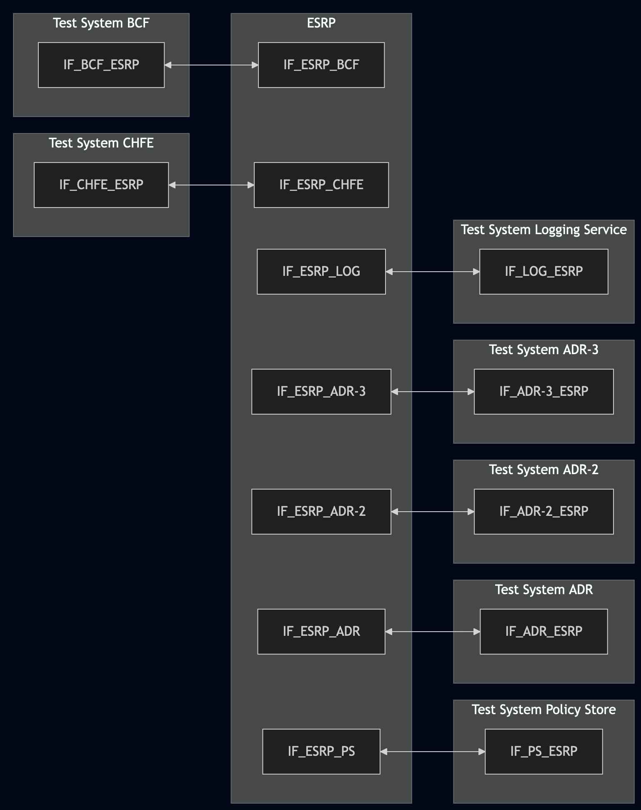
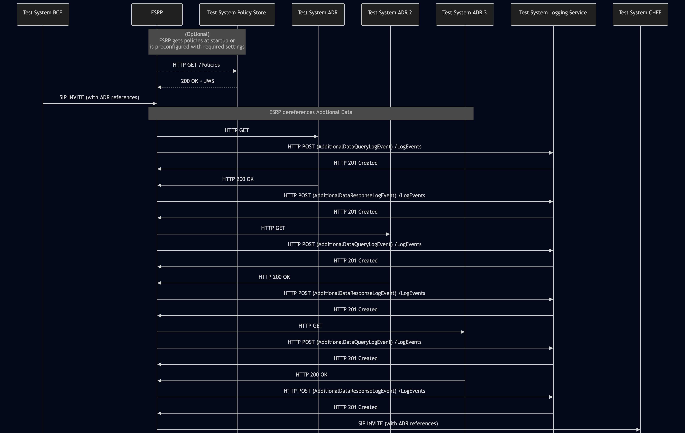

# Test Description: TD_ESRP_020
## Overview
### Summary
Logging of AdditionalDataQueryLogEvent and AdditionalDataResponseLogEvent

### Description
This test ensures the ESRP correctly sends AdditionalDataQueryLogEvent and AdditionalDataResponseLogEvent while dereferencing all Additional Data found in the incoming SIP INVITE.

### HTTP and SIP transport types
Test can be performed with 2 different SIP and HTTP transport types. Steps describing actions for specific one are marked as following:
- (TLS transport) - should be used by default
- (TCP transport) - used in lab for testing purposes only if default TLS is not possible

### References
* Requirements : RQ_ESRP_154, RQ_ESRP_161, RQ_ESRP_167, RQ_ESRP_168, RQ_ESRP_169
* Test Case    : TC_ESRP_020

### Requirements
IXIT config file for ESRP specifying configuration of:

Variant 1:
- default Policy Store URL
- default Logging Service URL

Variant 2:
- enabling ADR URL's dereferencing by default
- setting URI of downstream ESRP
- default Logging Service URL


## Configuration
### Implementation Under Test Interface Connections
<!-- Identify each of the FEs that are part of the configuration and how they are connected -->
* Test System BCF
  * IF_BCF_ESRP - connected to IF_ESRP_BCF
* ESRP
  * IF_ESRP_BCF - connected to IF_BCF_ESRP
  * IF_ESRP_CHFE - connected to IF_CHFE_ESRP
  * IF_ESRP_PS - connected to IF_PS_ESRP
  * IF_ESRP_ADR - connected to IF_ADR_ESRP
  * IF_ESRP_ADR-2 - connected to IF_ADR-2_ESRP
  * IF_ESRP_ADR-3 - connected to IF_ADR-3_ESRP
  * IF_ESRP_LOG – connected to Test System Logging Service IF_LOG_ESRP 
* Test System CHFE
  * IF_CHFE_ESRP - connected to IF_ESRP_CHFE
* Test System Policy Store
  * IF_PS_ESRP - connected to IF_ESRP_PS
* Test System ADR
  * IF_ADR_ESRP - connected to IF_ESRP_ADR
* Test System ADR-2
  * IF_ADR-2_ESRP - connected to IF_ESRP_ADR-2
* Test System ADR-3
  * IF_ADR-3_ESRP - connected to IF_ESRP_ADR-3
* Test System Logging Service (LOG)
  * IF_LOG_ESRP – connected to ESRP IF_ESRP_LOG


### Test System Interfaces
<!-- Identify each of the test system interfaces and whether it will be in active or monitor mode -->
* Test System BCF
  * IF_BCF_ESRP - Active
* ESRP
  * IF_ESRP_BCF - Active
  * IF_ESRP_CHFE - Monitor
  * IF_ESRP_PS - Active
  * IF_ESRP_ADR - Active
  * IF_ESRP_ADR-2 - Active
  * IF_ESRP_ADR-3 - Active
  * IF_ESRP_LOG - Active
* Test System CHFE
  * IF_CHFE_ESRP - Monitor
* Test System Policy Store
  * IF_PS_ESRP - Active
* Test System ADR
  * IF_ADR_ESRP - Active
* Test System ADR-2
  * IF_ADR-2_ESRP - Active
* Test System ADR-3
  * IF_ADR-3_ESRP - Active
* Test System Logging Service
  * IF_LOG_ESRP - Active

### Connectivity Diagram
<!--
https://mermaid.live/edit#pako:eNqNVFtvgjAU_ivkPItxrYKSZcnmZTNxmZE9LSSmgwpkQk0p25zxv69cRLl44en0u5yefjTdgc0cCgas1uzH9ggXymxhhYr8ppPl03CyHJuL-b2qPkyzMsEKfvgyGdcECVgoUmRu5vzcTIEy-zha5LSsmnkVHRUqOqPBJxrcoJm9PecKWeV8pojiT5eTjae800go5jYSNFCKc1ayyEAaOhe8xwiqQZ1zH7nTkaszVPItZ1zHZBKNoIqaYVyHZVS3HHjO1r69VUzBOC01Kf3xyz2q05Zvw1Vv5VDVm3Ldj2t-fLN_xlzXD13FpPzbt8sRHG9b3gda4HLfAUPwmLYgoDwgyRJ2icQC4dGAWmDI0iH8ywIr3EvPhoQfjAUHG2ex64GxIutIruKNQwQd-UTOFhQol7tRPmRxKMBAdyhtAsYOfsHA_Tbu466OcV_XOz2kaS3YSlW3LRfort_DOkY6GqB9C_7SfTvtAe5quobQYCDZxEBiwcxtaB-Goo4vr8Br9qSkL8thtHHK5JPt_wGOVEpr
-->



## Pre-Test Conditions
### Test System BCF/Test System CHFE/Test System Policy Store/Test System ADR/Test System ADR-2/Test System ADR-3/Test System Logging Service
* Interfaces are connected to network
* Interfaces have IP addresses assigned by DHCP
* Device is active
* ng911 repository cloned to local storage
* (TLS transport) Generated own PCA-signed certificate and private key files (test_system.crt, test_system.key)
* (TLS transport) Certificate and key used by ESRP copied to local storage
* (TLS transport) PCA certificate copied to local storage

### ESRP
* Interfaces are connected to network
* Interfaces have IP addresses assigned by DHCP
* Default configuration is loaded
* Device is initialized with steps from IXIT config file
* Device configured to use `Test System Policy Store` by default as policies source, or following configuration must be applied manually:
  * Device configured to enable ADR URL's dereferencing by default
* Device configured to use `Test System Logging Service` by default as Logging Service server
* Device is active
* Device is in normal operating state
* No active calls

## Test Sequence

### Test Preamble

#### Test System BCF
* Install SIPp by following steps from documentation[^1]
* Copy following XML scenario file to local storage:
  `SIP_INVITE_from_BCF_3x_ADR_references.xml`
* Install Wireshark[^2]
* (TLS v1.2) Configure Wireshark to decode SIP over TLS, use tests system and IUT certificate keys [^3]
* (TLS v1.3) Configure logging of session keys and configure Wireshark to decode SIP over TLS [^4]
* Using Wireshark on 'Test System BCF' start packet tracing on IF_BCF_ESRP interface - run following filter:
   * (TLS transport)
     > ip.addr == IF_BCF_ESRP_IP_ADDRESS and tls
   * (TCP transport)
     > ip.addr == IF_BCF_ESRP_IP_ADDRESS and sip
     

#### Test System Policy Store
* Install Wireshark[^2]
* (TLS v1.2) Configure Wireshark to decode HTTP over TLS, use tests system and ESRP certificate keys [^3]
* (TLS v1.3) Configure logging of session keys and configure Wireshark to decode HTTP over TLS [^4]
* Using Wireshark on 'Test System Policy Store' start packet tracing on IF_PS_ESRP interface - run following filter:
   * (TLS transport)
     > ip.addr == IF_PS_ESRP_IP_ADDRESS and tls
   * (TCP transport)
     > ip.addr == IF_PS_ESRP_IP_ADDRESS and http
* The Policy Store must be configured to accept and process HTTP GET requests.
  * generate JWS object and save to file jws.json, e.g.
  ```
  python3 -m main generate_jws Policy_object_force_ESRP_to_dereference_ADR_v010.3f.5.0.0.json --cert test_system.crt --key test_system.key --output_file jws.json
  ```
  * simulate a listening HTTP endpoint on port 8080 using command in the terminal:
  * (TLS):
    * `python3 http_entry.py --ip IF_PS_ESRP --port 4443 --role RECEIVER --path /Policies --method GET --body jws.json --server_cert /tmp/cert.crt --server_key /tmp/cert.key`
  * (TCP):
    * `while true; do cat jws.json | nc -l -p 8080 -q 1; done`

#### Test System ADR
* Install Wireshark[^2]
* (TLS v1.2) Configure Wireshark to decode HTTP over TLS, use tests system and ESRP certificate keys [^3]
* (TLS v1.3) Configure logging of session keys and configure Wireshark to decode HTTP over TLS [^4]
* Using Wireshark on 'Test System ADR' start packet tracing on IF_ADR_ESRP interface - run following filter e.g.:
   * (TLS transport)
     > ip.addr == IF_ADR_ESRP_IP_ADDRESS and tls
   * (TCP transport)
     > ip.addr == IF_ADR_ESRP_IP_ADDRESS and http
* The ADR must be configured to accept and process HTTP GET requests.
  * Use following scenario files depending on variation:
    * Variation 1 - test_suite/test_files/HTTP_messages/HTTP_ADR/EmergencyCallData.DeviceInfo
    * Variation 2 - test_suite/test_files/HTTP_messages/HTTP_ADR/Malformed_EmergencyCallData.DeviceInfo
  * simulate a listening HTTP endpoint on port 8080 using command in the terminal:
  * (TLS):
    * `python3 http_entry.py --ip IF_ADR_ESRP --port 8080 --role RECEIVER --path /ADR --method GET --body SCENARIO_FILE --server_cert /tmp/cert.crt --server_key /tmp/cert.key`
  * (TCP):
    * `while true; do cat SCENARIO_FILE | nc -l -p 8080 -q 1; done`

#### Test System ADR-2
* Install Wireshark[^2]
* (TLS v1.2) Configure Wireshark to decode HTTP over TLS, use tests system and ESRP certificate keys [^3]
* (TLS v1.3) Configure logging of session keys and configure Wireshark to decode HTTP over TLS [^4]
* Using Wireshark on 'Test System ADR-2' start packet tracing on IF_ADR-2_ESRP interface - run following filter e.g.:
   * (TLS transport)
     > ip.addr == IF_ADR-2_ESRP_IP_ADDRESS and tls
   * (TCP transport)
     > ip.addr == IF_ADR-2_ESRP_IP_ADDRESS and http
* The ADR-2 must be configured to accept and process HTTP GET requests.
  * Use following scenario files depending on variation:
    * Variation 1 - test_suite/test_files/HTTP_messages/HTTP_ADR/EmergencyCallData.ProviderInfo
    * Variation 2 - test_suite/test_files/HTTP_messages/HTTP_ADR/Malformed_EmergencyCallData.ProviderInfo
  * simulate a listening HTTP endpoint on port 8080 using command in the terminal:
  * (TLS):
    * `python3 http_entry.py --ip IF_ADR-2_ESRP --port 8080 --role RECEIVER --path /ADR --method GET --body SCENARIO_FILE --server_cert /tmp/cert.crt --server_key /tmp/cert.key`
  * (TCP):
    * `while true; do cat SCENARIO_FILE | nc -l -p 8080 -q 1; done`

#### Test System ADR-3
* Install Wireshark[^2]
* (TLS v1.2) Configure Wireshark to decode HTTP over TLS, use tests system and ESRP certificate keys [^3]
* (TLS v1.3) Configure logging of session keys and configure Wireshark to decode HTTP over TLS [^4]
* Using Wireshark on 'Test System ADR-3' start packet tracing on IF_ADR-3_ESRP interface - run following filter e.g.:
   * (TLS transport)
     > ip.addr == IF_ADR-3_ESRP_IP_ADDRESS and tls
   * (TCP transport)
     > ip.addr == IF_ADR-3_ESRP_IP_ADDRESS and http
* The ADR-3 must be configured to accept and process HTTP GET requests.
  * Use following scenario files depending on variation:
    * Variation 1 - test_suite/test_files/HTTP_messages/HTTP_ADR/EmergencyCallData.ServiceInfo
    * Variation 2 - test_suite/test_files/HTTP_messages/HTTP_ADR/Malformed_EmergencyCallData.ServiceInfo
  * simulate a listening HTTP endpoint on port 8080 using command in the terminal:
  * (TLS):
    * `python3 http_entry.py --ip IF_ADR-3_ESRP --port 8080 --role RECEIVER --path /ADR --method GET --body SCENARIO_FILE --server_cert /tmp/cert.crt --server_key /tmp/cert.key`
  * (TCP):
    * `while true; do cat SCENARIO_FILE | nc -l -p 8080 -q 1; done`

#### Test System Logging Service
* Install Wireshark[^2]
* (TLS v1.2) Configure Wireshark to decode HTTP over TLS, use tests system and ESRP certificate keys [^3]
* (TLS v1.3) Configure logging of session keys and configure Wireshark to decode HTTP over TLS [^4]
* Using Wireshark on 'Test System LOG' start packet tracing on IF_LOG_ESRP interface - run following filter:
   * (TLS)
     > ip.addr == IF_LOG_ESRP_IP_ADDRESS and tls
   * (TCP)
     > ip.addr == IF_LOG_ESRP_IP_ADDRESS and http
* The Logging Service must be configured to accept and process HTTP POST requests.
  * To verify this manually, you can simulate a listening HTTP endpoint on port 8080 using command in the terminal:
  * (TLS):
    * `python3 http_entry.py --ip IF_LOG_ESRP --port 8080 --role RECEIVER --path /LogEvents --method POST --body "HTTP/1.1 201 Log Event Successfully Logged\r\nContent-Length: 0\r\n\r\n" --server_cert /tmp/cert.crt --server_key /tmp/cert.key`
    * In another terminal, send a POST request to verify it is working:
      * `curl -k -X POST https://localhost:8080 -d '{"log":"test"}'`
  * (TCP):
    * `while true; do echo -e "HTTP/1.1 201 Log Event Successfully Logged\r\n\r\n" | nc -l -p 8080 -q 1; done`
    * In another terminal, send a POST request to verify it is working:
      * `curl -X POST http://localhost:8080 -d '{"log":"test"}'`


### Test Body

#### Variations

1. Variation 1 - Correct responses from ADR servers
2. Variation 2 - Malformed responses from ADR servers


#### Stimulus
Simulate basic call from Test System BCF to ESRP - run SIPp scenario by using following command on Test System BCF, example:
* (TCP transport)
  ```
  sudo sipp -t t1 -sf SIP_INVITE_from_BCF_3x_ADR_references.xml IF_BCF_ESRP_IPv4:5060
  ```
* (TLS transport)
  ```
  sudo sipp -t l1 -tls_cert test_system.crt -tls_key test_system.key -sf SIP_INVITE_from_BCF_3x_ADR_references.xml IF_BCF_ESRP_IPv4:5061
  ```

#### Response
Using traced packets on Wireshark verify:
* If ESRP sends HTTP GET to Test System ADR, ADR-2 and ADR-3 to dereference ADR blocks
* If ESRP sends HTTP POST to 'Test System Logging Service' (/LogEvents entrypoint) for EACH requested Additional Data condition (i.e. one AdditionalDataQueryLogEvent per requested ADR dereference), containing:
  - JWS body conforming to NENA-STA-010.3 (5.10 JSON Web signatures)
  - decoded `payload` of the JWS body should contain JSON with:

    ##### AdditionalDataQueryLogEvent
    - `logEventType`:`"AdditionalDataQueryLogEvent"`
    - `text` with an empty string or with string value containing body of the HTTP GET sent to ADR/ADR-2/ADR-3
    - `uri` string containing URI of the HTTP GET request sent to ADR/ADR-2/ADR-3
    - `queryId` field with string value using suggested format “urn:emergency:uid:queryid:’globally unique id’”
    - `direction`: string set to `"outgoing"` (since Additional Data query has been sent by ESRP to an ADR server)
    - `timestamp` with correct date-time format (f.e. 2020-03-10T11:00:01-05:00) and date-time match the time when HTTP 200 OK response with Additional Data XML block has been received by ESRP from the corresponding ADR server
    - `elementId` which has value with FQDN of ESRP
    - `agencyId` which has value with FQDN of an agency
    - `callId` which has value f.e.: `urn:emergency:uid:callid:1234567890:bcf.ng911.example`. Check:
      * if header field contains "urn:emergency:uid:callid:"
      * if "urn:emergency:uid:callid:" is followed by 10 to 32 alphanumeric characters (String ID)
      * if String ID is followed by ":" and domain name
    - `incidentId` which has value f.e.: `urn:emergency:uid:incidentid:1234567890:bcf.ng911.example`. Check:
      * if header field contains "urn:emergency:uid:incidentid:"
      * if "urn:emergency:uid:incidentid:" is followed by 10 to 32 alphanumeric characters (String ID)
      * if String ID is followed by ":" and domain name
    - `callIdSip` which has value f.e.: `1234567890qwertyuiop@caller.example.com`
    - (optionally) `agencyAgentId` field with string value
    - (optionally) `agencyPositionId` field with string value
    - (optionally) zero or one `extension` with JSON object
    - (optionally) `ipAddressPort` - with string value


* ESRP sends HTTP POST to 'Test System Logging Service' (/LogEvents entrypoint) for EACH retrieved Additional Data condition (i.e. one AdditionalDataResponseLogEvent per successful ADR dereference), containing:
  - JWS body conforming to NENA-STA-010.3 (5.10 JSON Web signatures)
  - decoded `payload` of the JWS body should contain JSON with:

    ##### AdditionalDataResponseLogEvent
    - `logEventType`:`"AdditionalDataResponseLogEvent"`
    - `text` with string value set to the body of the Additional Data block in XML format (i.e. the entire XML body of the HTTP 200 OK response received by ESRP from the corresponding Test System ADR/ADR-2/ADR-3)
    - `responseStatus` 
        - Variation 1 - not present 
        - Variation 2 - string consisting of a status code from the Status Codes Registry (NENA-STA-010.3 Section 10.29)
    - `responseId` with a string value matching the `queryId` from the corresponding AdditionalDataQueryLogEvent (i.e. it MUST relate the response to its request logged as AdditionalDataQueryLogEvent)
    - `direction`: string set to `"incoming"` (since Additional Data has been received by ESRP from an ADR server)
    - `timestamp` with correct date-time format (f.e. 2020-03-10T11:00:01-05:00) and date-time match the time when HTTP 200 OK response with Additional Data XML block has been received by ESRP from the corresponding ADR server
    - `elementId` which has value with FQDN of ESRP
    - `agencyId` which has value with FQDN of an agency
    - `callId` which has value f.e.: `urn:emergency:uid:callid:1234567890:bcf.ng911.example`. Check:
      * if header field contains "urn:emergency:uid:callid:"
      * if "urn:emergency:uid:callid:" is followed by 10 to 32 alphanumeric characters (String ID)
      * if String ID is followed by ":" and domain name
    - `incidentId` which has value f.e.: `urn:emergency:uid:incidentid:1234567890:bcf.ng911.example`. Check:
      * if header field contains "urn:emergency:uid:incidentid:"
      * if "urn:emergency:uid:incidentid:" is followed by 10 to 32 alphanumeric characters (String ID)
      * if String ID is followed by ":" and domain name
    - `callIdSip` which has value f.e.: `1234567890qwertyuiop@caller.example.com`
    - (optionally) `agencyAgentId` field with string value
    - (optionally) `agencyPositionId` field with string value
    - (optionally) zero or one `extension` with JSON object
    - (optionally) `ipAddressPort` - with string value


* Additionally verify that:
  - the number of AdditionalDataResponseLogEvent messages sent to the Logging Service equals the number of Additional Data condition successfully retrieved by ESRP (3 in this test)

VERDICT:
* NOT RUN - if any Test System ADR/ADR-2/ADR-3/Policy Store did not respond for HTTP GET/POST sent by the ESRP
* PASSED - if all checks passed and ESRP produced one AdditionalDataQueryLogEvent/AdditionalDataResponseLogEvent per retrieved Additional Data condition with all mandatory members correctly populated.
* FAILED - any other cases

### Test Postamble
#### Test System BCF/Test System CHFE/Test System Policy Store/ Test System ADR/ Test System ADR-2/ Test System ADR-3/ Test System Logging Service
* stop Wireshark (if still running)
* stop nc/python processes listening for HTTP requests
* archive all logs generated
* disconnect interfaces from IUT
* (TLS transport) remove certificates

#### ESRP
* restore default configuration
* disconnect interfaces from Test Systems
* reconnect interfaces back to default

## Post-Test Conditions
#### Test System BCF/Test System CHFE/Test System Policy Store/ Test System ADR/ Test System ADR-2/ Test System ADR-3/ Test System Logging Service
* Test tools stopped
* interfaces disconnected from IUT

### ESRP
* device connected back to default
* device in normal operating state

## Sequence Diagram

#### Variation 1

<!--
https://mermaid.live/edit#pako:eNrNVU1z0zAQ_Ss7OrVD3NhOmtgeJjMhTT-gNCbOwAzji7A3roZaMpIcCJ3-dyQ7aUuSA3ApF3_svn379Nay7kkmciQRcRwn5ZngS1ZEKQcomZRCjjMtpIpgSe8UprwBKfxWI8_wjNFC0jLlFg5QUalZxirKNbyZnANVsEClIVkrjaUN7eOmyTy2QHvfz8bJLkks7li2hsSIwn38-Gy-W2BCB3GOfwAJ_mFs7xC2t4-9nl3sIq9FUTBeQIJyxbIDmieX59PdIhvbunojNIJYoWw86hhPIjiaVZoJTu-OX3-Ro9bEArWCytrDUAHVoLTpUlcgpAF1R8xkJbbzrSXm8J3pW5BmlMy-KdTa6FRtU8voOKORbXa5WMRwMV1AN96yt6A4sRALjcB3XZi9g1fw9lPSZturGfojJrmK4erm49ViCkdNc-uixCVK-zGp48PrbfyP2jXm-ASHcZ63JsAZ1fSZ7tHI1Dzp_i1jJrTJxLNkAUeGhLUsluRDjXJtJjZdIdfH0N0-blwxxY-LaTh814OJRKoxbxFW7A7C-vIXEuaoKmF22L-q2PXB8V_OCf-FvXj6DJ_50Xs5P3r_gR-bRvYP8yc7MuWkQwrJchJpWWOHlChLal_JvSVMib7FElMSmcecyq8pSfmDqTH_ts9ClNsyKerilkTNKdIhdZUbRZvj4zFqmpoNPhE11yQKw4aDRPfkB4kcz3VPgiAIh8NBGAx63sCk1ybuhyeDYTDon3qDoef1Pf-hQ342fb2TU68feqHb90-DoR-4vQ6htRbJmmdbVWjcFfJ9e_41x-BW27TJbKQ9_AJasTKd
-->


#### Variation 2
<!--
https://mermaid.live/edit#pako:eNrNVctu2zAQ_JUFTwlqJRZlJ7ZQGEgd5dU0ViO3BQpdWGmtEI1IlaTcukH-vaRk52H70PaSXGxpd3Z2NMvHHclkjiQknuelIpNixoswFQAlV0qqo8xIpUOYsVuNqWhAGn_UKDI85qxQrEyFgwNUTBme8YoJA-_GJ8A0TFEbSBbaYOlCm7gouY4d0P1vZuNknSSWtzxbQGJF4Sb-6Ph6vcCGtuI8ugUJdDs22IYNNrGXk9N15KUsCi4KSFDNebZF8_jsJFovcrGVq1fSIMg5qsajjvUkhJ1JZbgU7Hb37Tc1ajws0GionDscNTAD2tgmdQVSWcz-iNuswna8tcIcfnJzA8pOkrs3jcZYmbrt6Rg9bzRyvc6m0xhOoynsxyv2FhQnDuKgIdBuFybv4Q1cfEnabPtrZ_6ASc5jOL_6fD6NYKdp7kxUOEPl1pLe3f65jf1hu05yfITDUZ63HsAxM-yJ7tHI1jzqfpaxA1pm4kkyhR1LwlsWR_KxRrWwA4vmKMwu7K8el67Y4oePaTho14exQmYwbxFO7DNEr9-DT0JXmPEZtzZHbkv9g6Jr1JW0--1_Ra3b4tGXM4a-LmseF-kTe4KXsyd4ffYsG7nT6G-2bypIhxSK5yQ0qsYOKVGVzL2SO0eYEnODJaYktI85U99Tkop7W2PPwa9SlqsyJevihoTNjdMhdZVbRcur5iFqm9rTYCxrYUhIh8OGhIR35BcJD_p7vt8d0sAPgoNDm1rYWLAXUD-ggx4dDmgQ-Pcd8rvp6e_1_d7QH3Z7tD84pINuv0NYbWSyENlKEVpnpfrQ3pPNdbnSFTWZpaz7PwTpQ7M
-->


## Comments

Version:  010.3f.5.0.6

Date:     20260819

## Footnotes
[^1]: SIPp - tool for SIP packet simulations. Official documentation: https://sipp.sourceforge.net/doc/reference.html#Getting+SIPp
[^2]: Wireshark - tool for packet tracing and anaylisis. Official website: https://www.wireshark.org/download.html
[^3]: Wireshark configuration to decrypt TLS packets: https://www.zoiper.com/en/support/home/article/162/How%20to%20decode%20SIP%20over%20TLS%20with%20Wireshark%20and%20Decrypting%20SDES%20Protected%20SRTP%20Stream
[^4]: TLS v1.3 session keys logging + Wireshark configuration to decrypt traffic: https://my.f5.com/manage/s/article/K50557518