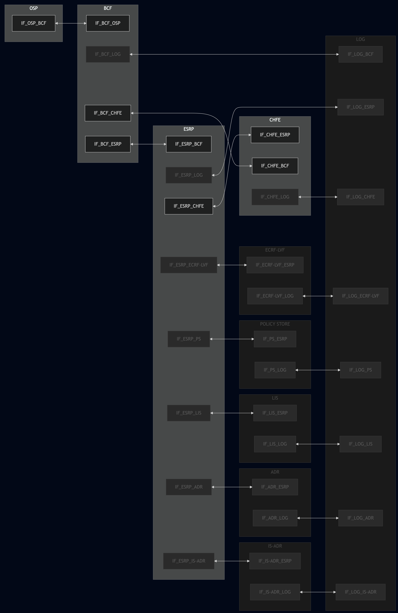
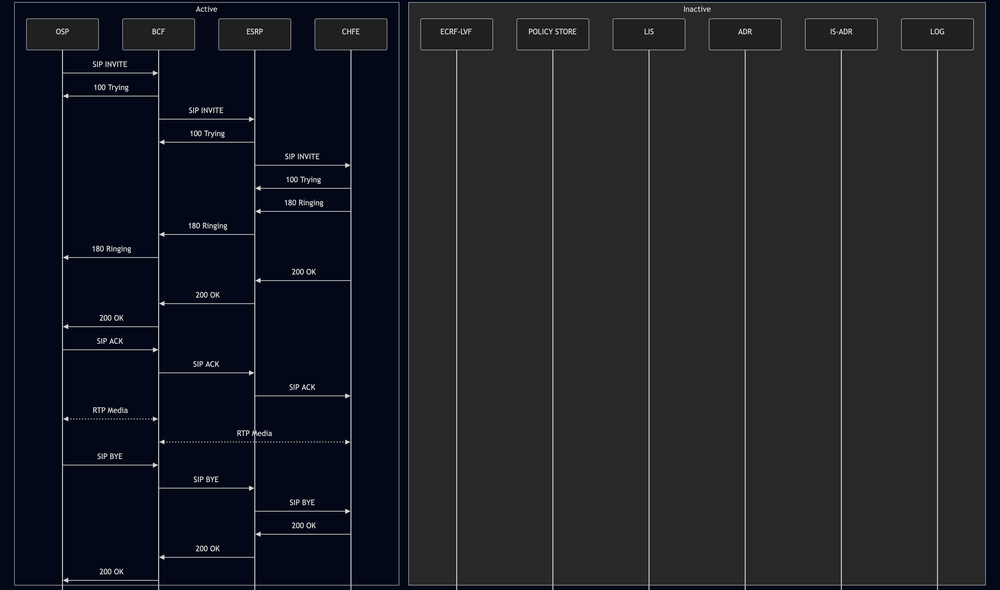

# Test Description: TD_INTEROP_001

## Overview

### Proof of Concept
Test procedure is a Proof of Concept and is limited to verify only basic requirements. 
Also test setup is limited to following functional elements:
- OSP
- BCF (Originating)
- ESRP (Originating)
- CHFE (all PSAP functions are merged to CHFE - PSAP infrastructure is out of scope for NG-911)

### Summary
Cellular 9-1-1

### Description
Test covers 9-1-1 call from a cell phone

### References
* Requirements : Interop Criteria for Use Cases [v1.1 2024-12-06.v2] - LAST EDIT 2026-01-27 18:52 - 2.4 Cellular 9-1-1 
* Test Case    : 

### Requirements
IXIT config files for:
- OSP
- BCF
- ESRP
- PSAP
- PSAP CHFE (disabled)
- LOG (disabled)
- ECRF-LVF (disabled)
- POLICY STORE (disabled)
- LIS (disabled)
- ADR (disabled)
- IS-ADR (disabled)

### SIP transport types
Test can be performed with 2 different SIP transport types. Steps describing actions for specific one are marked as following:
- (TLS transport) - used by default inside ESInet on production environment
- (TCP transport) - used in lab for testing purposes only if default TLS is not possible

## Configuration
### Implementation Under Test Interface Connections
<!-- Identify each of the FEs that are part of the configuration and how they are connected -->
* OSP
  * IF_OSP_BCF - connected to IF_BCF_OSP
* BCF
  * IF_BCF_OSP - connected to IF_OSP_BCF
  * IF_BCF_ESRP - connected to IF_ESRP_BCF
  * IF_BCF_CHFE - connected to IF_CHFE_BCF
  * IF_BCF_LOG - (disabled)
* ESRP
  * IF_ESRP_BCF - connected to IF_BCF_ESRP
  * IF_ESRP_CHFE - connected to IF_CHFE_ESRP
  * IF_ESRP_PS - (disabled)
  * IF_ESRP_ECRF-LVF - (disabled)
  * IF_ESRP_LIS - (disabled)
  * IF_ESRP_ADR - (disabled)
  * IF_ESRP_IS-ADR - (disabled)
  * IF_ESRP_LOG - (disabled)
* CHFE
  * IF_CHFE_ESRP - connected to IF_ESRP_CHFE
  * IF_CHFE_BCF - connected to IF_BCF_CHFE
  * IF_CHFE_LOG - (disabled)
* LOG (disabled)
  * IF_LOG_BCF - (disabled)
  * IF_LOG_ESRP - (disabled)
  * IF_LOG_CHFE - (disabled)
  * IF_LOG_ECRF-LVF - (disabled)
  * IF_LOG_PS - (disabled)
  * IF_LOG_LIS - (disabled)
  * IF_LOG_ADR - (disabled)
  * IF_LOG_IS-ADR - (disabled)
* ECRF-LVF (disabled)
  * IF_ECRF-LVF_ESRP - (disabled)
  * IF_ECRF-LVF_LOG - (disabled)
* POLICY STORE (disabled)
  * IF_PS_ESRP - (disabled)
  * IF_PS_LOG - (disabled)
* LIS (disabled)
  * IF_LIS_ESRP - (disabled)
  * IF_LIS_LOG - (disabled)
* ADR (disabled)
  * IF_ADR_ESRP - (disabled)
  * IF_ADR_LOG - (disabled)
* IS-ADR (disabled)
  * IF_IS-ADR_ESRP - (disabled)
  * IF_IS-ADR_LOG - (disabled)

### Test System Interfaces
<!-- Identify each of the test system interfaces and whether it will be in active or monitor mode -->
* OSP
  * IF_OSP_BCF - Active
* BCF
  * IF_BCF_OSP - Active
  * IF_BCF_ESRP - Active
  * IF_BCF_CHFE - Active
  * IF_BCF_LOG - (disabled)
* ESRP
  * IF_ESRP_BCF - Active
  * IF_ESRP_CHFE - Active
  * IF_ESRP_PS - (disabled)
  * IF_ESRP_ECRF-LVF - (disabled)
  * IF_ESRP_LIS - (disabled)
  * IF_ESRP_ADR - (disabled)
  * IF_ESRP_IS-ADR - (disabled)
  * IF_ESRP_LOG - (disabled)
* CHFE
  * IF_CHFE_ESRP - Active
  * IF_CHFE_BCF - Active
  * IF_CHFE_LOG - (disabled)
* LOG (disabled)
  * IF_LOG_BCF - (disabled)
  * IF_LOG_ESRP - (disabled)
  * IF_LOG_CHFE - (disabled)
  * IF_LOG_ECRF-LVF - (disabled)
  * IF_LOG_PS - (disabled)
  * IF_LOG_LIS - (disabled)
  * IF_LOG_ADR - (disabled)
  * IF_LOG_IS-ADR - (disabled)
* ECRF-LVF (disabled)
  * IF_ECRF-LVF_ESRP - (disabled)
  * IF_ECRF-LVF_LOG - (disabled)
* POLICY STORE (disabled)
  * IF_PS_ESRP - (disabled)
  * IF_PS_LOG - (disabled)
* LIS (disabled)
  * IF_LIS_ESRP - (disabled)
  * IF_LIS_LOG - (disabled)
* ADR (disabled)
  * IF_ADR_ESRP - (disabled)
  * IF_ADR_LOG - (disabled)
* IS-ADR (disabled)
  * IF_IS-ADR_ESRP - (disabled)
  * IF_IS-ADR_LOG - (disabled)

 
### Connectivity Diagram
<!--
https://mermaid.live/edit#pako:eNqdl2tr2zAUhv-KUb8qJc61MWOwps0WyEiIy2CbR_Fi5UITuTgOW1b63ydZtyNFTrfYUHLk50ivpfdI7gta5BlBEVpu81-LdVqUwWSe0IBdi22639-RZbAqyJFkwXKz3UZXrZTfeF8W-ROJrtopv_Ei3-ZFdNWtroSKDvaHn6sifV4H03j2PUHsb4J-iEf8yjYFWZSbnAYPt6Z1PHpk4OPtcMRSTKAzCc1O-hcwpM72z8BHIckEVqZsvo_nAOKRjxp-Gt0bikc-ajL9aCAWnH0fOfDJiLVvxEkzZSpydVTtRq4OvdwsBtQs9jL3w_lo8gWOylsarMmLT8awTxZ5qQ93c0CxyEuNY5sbx406VE-9is7OvZyfk3mpnXtOAqvo0NVSPdBrpCIvpRWr6KxiQUPqrF4GGhkycFXwZvNKKvJRxk4q8vYFjaIafD7hz5TzxG8foY0kAx-j7SEDHwNMJELLQ97K1C_ifYP6AhV5YFJVvndmFW6sq-i3zDCbTsbDryxJ_Ajih-n8H40sMoDEWewVJzmtjWFvWrRaMHel6i06jqH9xn4dvF2LkMFZFWKxXS_UqmAgUKEiVwVv1ypkcFaFNt3pjlUrpcoBYkSuV49AtSJJ1ogy52vwrtF4Dw5H_VwdfRrQpwt1jxWNmD2QOgeljVS92P3MYo0AP9qMrA6jCBSXTTJXaErbiDqnjSb0lNKTk0YzZiWAcnmmm6HkrkqdY8gCrJHURm8R1W5KT7cEuxvRrjlTnRbGNlJq1431mJcmtR1tPedOpa7DLKJq1WYvj1vCDyb50Rim_DYfjdWlPho71QUT1QJflCw3votyuV8uSuQWuShRuOs_UsG3ObAaBqbCwD7YdgnWbsBm4bFZYwwXU373OwPCYsOOL70JoIyx7U8vrsoUA6d6QVWHGFjWC5qSxZZ7Fezgqpj9by8rGZv9CjvbEgabDwbbDLY3FG_3ehsQTxFGq2KToagsDgSjHSl2KQ_RC89LULkmO5KgiP3M0uIpQQl9ZTnPKf2W5zuVVuSH1RpFy3S7Z9HhOUtLcrdJ2Wm0060FOxRIMcwPtERRq91rV72g6AX9RlG73bnutbrhoNML2_1-OMDoiKJwcN1uhd1OdxAOup1mv_OK0Z9q2Ob1oNvs3zTZPWh1e62bG4zSQ5nHR7pQoki2KfPis_jfs_oX9PUvGGYfmw
-->



### Entity types
Any pre-test conditions, preamble steps and test sequence itself for different entities depend on their type.
All entities in this document can be configured with one of the following types:
- IUT - Implementation Under Test which a real functional element
- Test System - functional element is simulated to make IUTs working as normal

Some steps are obligatory only for one of the entity type, they are marked as `(IUT)` or `(Test System)`

## Pre-Test Conditions
### ALL (IUT) and (Test System)
* Interfaces are connected to network
* Interfaces have IP addresses assigned by DHCP
* Device is active
* Device is in normal operating state
* (TLS) Generated own PCA-signed certificate and private key files (ENTITY_NAME.crt, ENTITY_NAME.key)

### (IUT)
* IUT is initialized with steps from IXIT config file

### (Test System)
* ng911 repository cloned to local storage
* (TLS) Certificate and key used by all entities copied to local storage
* (TLS) PCA certificate copied to local storage

### (IUT) BCF
* IUT is provisioned with ESRP as a next hop

### (IUT) ESRP
* IUT is provisioned with CHFE as a next hop
* IUT is provisioned with default queue it manages
* IUT is provisioned with default location

## Test Sequence

### Test Preamble

#### (Test System) OSP
* Install SIPp by following steps from documentation[^1]
* Install Wireshark[^2]
* (TLS v1.2) Configure Wireshark to decode HTTP over TLS, use tests system and PS certificate keys [^3]
* (TLS v1.3) Configure logging of session keys and configure Wireshark to decode HTTP over TLS [^4]
* Using Wireshark start packet tracing on all local interfaces
* Copy following XML scenario files to local storage:
  ```
  SIP_basic_911_call_from_OSP_with_RTP.xml
  g711ulaw_rtp_stream.pcap
  ```
* (TLS transport) Copy to local storage PCA-signed certificate and private key files:
  > OSP.crt
  > OSP.key


#### (Test System) BCF
* Install and configure NG911 Test Suite[^5]
* Install Wireshark[^2]
* (TLS v1.2) Configure Wireshark to decode HTTP over TLS, use tests system and PS certificate keys [^3]
* (TLS v1.3) Configure logging of session keys and configure Wireshark to decode HTTP over TLS [^4]
* Using Wireshark start packet tracing on all local interfaces
* Copy following XML scenario files to local storage:
  ```
  BCF_INTEROP_001.xml
  ```
* (TLS transport) Copy to local storage PCA-signed certificate and private key files:
  > BCF.crt
  > BCF.key
* Prepare Test System to operate as a normal FE, run SIP Service using following command:
   * (TLS transport)
     > python3 sip_entry.py --bind-ip IF_BCF_OSP_IP_ADDRESS --bind-port 5061 --remote-ip IF_ESRP_BCF_IP_ADDRESS --remote-port 5061 --protocol TLS --scenario BCF_INTEROP_001.xml --message-timeout 5000 --transaction-timeout 5000 --tls-cert BCF.crt --tls-key BCF.key --tls-ca PCA.crt
   * (TCP transport)
     > python3 sip_entry.py --bind-ip IF_BCF_OSP_IP_ADDRESS --bind-port 5060 --remote-ip IF_ESRP_BCF_IP_ADDRESS --remote-port 5060 --protocol TCP --scenario BCF_INTEROP_001.xml --message-timeout 5000 --transaction-timeout 5000


#### (Test System) ESRP
* Install and configure NG911 Test Suite[^5]
* Install Wireshark[^2]
* (TLS v1.2) Configure Wireshark to decode HTTP over TLS, use tests system and PS certificate keys [^3]
* (TLS v1.3) Configure logging of session keys and configure Wireshark to decode HTTP over TLS [^4]
* Using Wireshark start packet tracing on all local interfaces
* Copy following XML scenario files to local storage:
  ```
  ESRP_INTEROP_001.xml
  ```
* (TLS transport) Copy to local storage PCA-signed certificate and private key files:
  > ESRP.crt
  > ESRP.key
* Prepare Test System to operate as a normal FE, run SIP Service using following command:
   * (TLS transport)
     > python3 sip_entry.py --bind-ip IF_ESRP_BCF_IP_ADDRESS --bind-port 5061 --remote-ip IF_CHFE_ESRP_IP_ADDRESS --remote-port 5061 --protocol TLS --scenario ESRP_INTEROP_001.xml --message-timeout 5000 --transaction-timeout 5000 --tls-cert ESRP.crt --tls-key ESRP.key --tls-ca PCA.crt
   * (TCP transport)
     > python3 sip_entry.py --bind-ip IF_ESRP_BCF_IP_ADDRESS --bind-port 5060 --remote-ip IF_CHFE_ESRP_IP_ADDRESS --remote-port 5060 --protocol TCP --scenario ESRP_INTEROP_001.xml --message-timeout 5000 --transaction-timeout 5000


#### (Test System) CHFE
* Install and configure NG911 Test Suite[^5]
* Install Wireshark[^2]
* (TLS v1.2) Configure Wireshark to decode HTTP over TLS, use tests system and PS certificate keys [^3]
* (TLS v1.3) Configure logging of session keys and configure Wireshark to decode HTTP over TLS [^4]
* Using Wireshark start packet tracing on all local interfaces
* Copy following XML scenario files to local storage:
  ```
  CHFE_INTEROP_001.xml
  ```
* (TLS transport) Copy to local storage PCA-signed certificate and private key files:
  > CHFE.crt
  > CHFE.key
* Prepare Test System to operate as a normal FE, run SIP Service using following command:
   * (TLS transport)
     > python3 sip_entry.py --bind-ip IF_CHFE_ESRP_IP_ADDRESS --bind-port 5061 --remote-ip IF_ESRP_CHFE_IP_ADDRESS --remote-port 5061 --protocol TLS --scenario CHFE_INTEROP_001.xml --message-timeout 5000 --transaction-timeout 5000 --tls-cert CHFE.crt --tls-key CHFE.key --tls-ca PCA.crt
   * (TCP transport)
     > python3 sip_entry.py --bind-ip IF_CHFE_ESRP_IP_ADDRESS --bind-port 5060 --remote-ip IF_ESRP_CHFE_IP_ADDRESS --remote-port 5060 --protocol TCP --scenario CHFE_INTEROP_001.xml --message-timeout 5000 --transaction-timeout 5000

#### (Test System) LOG
disabled
#### (Test System) POLICY STORE
disabled
#### (Test System) ADR
disabled
#### (Test System) IS-ADR
disabled
#### (Test System) LIS
disabled
#### (Test System) ECRF-LVF


### Test Body

#### Variations
- INTEROP_2.4_VAR_11: The Request-URI is a SIP URI with a 911 telephone number.

#### Stimulus

Send SIP packet to BCF - run following SIPp command on OSP, example:
* (TCP transport)
  ```
  sudo sipp -t t1 -sf SIP_basic_911_call_from_OSP_with_RTP.xml -i IF_OSP_BCF IF_BCF_OSP:5060
  ```
* (TLS transport)
  ```
  sudo sipp -t l1 -tls_cert OSP.crt -tls_key OSP.key -sf SIP_basic_911_call_from_OSP_with_RTP.xml -i IF_OSP_BCF IF_BCF_OSP:5061
  ```

#### Response

##### Message sequence checks

- RQ_INTEROP_2: The ESInet BCF receives the INVITE.
- RQ_INTEROP_4: The ESInet BCF sends a 100 Trying provisional response to the OSP.
- RQ_INTEROP_6: The OSP receives the 100 Trying provisional response sent by the BCF.
- RQ_INTEROP_7: The BCF scrubs the INVITE to remove inappropriate Resource-Priority and “verstat” values
- RQ_INTEROP_8: The BCF sends the INVITE to an ESRP (Originating ESRP).
- RQ_INTEROP_10: The ESRP receives the INVITE from the BCF.
- RQ_INTEROP_12: The ESRP sends a 100 Trying provisional response to the BCF.
- RQ_INTEROP_14: The BCF receives the 100 Trying provisional response from the ESRP.
- RQ_INTEROP_53: The ESRP sends the call to the SIP URI specified in the RouteAction. (PoC: should be sent to the CHFE, ESRP has RouteAction manually preconfigured)
- The PSAP’s CHFE may send a 180 Ringing or other non-100 provisional response to the ESRP or BCF that sent it the INVITE. If so:
    - RQ_INTEROP_54: The ESRP receives this provisional response + The ESRP sends that response to the BCF
    - RQ_INTEROP_55: BCF receives this provisional response + The BCF sends that response to the OSP
- RQ_INTEROP_70: The PSAP’s CHFE sends a 200 OK final response to the ESRP
- RQ_INTEROP_72: The ESRP receives the 200 OK final response.
- RQ_INTEROP_74: The ESRP sends the 200 OK to the BCF from which it received the INVITE.
- RQ_INTEROP_75: The BCF sends 200 OK to the OSP.
- RQ_INTEROP_76: The OSP receives the 200 OK sent by the Originating BCF.
- RQ_INTEROP_77: The OSP sends an ACK to the Originating BCF.
- RQ_INTEROP_78: The BCF receives the ACK sent by the OSP.
- RQ_INTEROP_80: The BCF sends the ACK to the Originating ESRP.
- RQ_INTEROP_81: The Originating ESRP receives the ACK from the BCF.
- RQ_INTEROP_84: That ESRP sends the ACK to the CHFE
- RQ_INTEROP_89: The call taker answers the call; interactive media is established between caller and call taker OSP<->CHFE (media is anchored at each call-anchoring point - BCF).

##### Message checks

- RQ_INTEROP_100: Verify that at each step in the Test Message Sequence the input and output messages contain correct content.
  - Verify if for SIP INVITE/SIP BYE messages at the output of the BCF:
    * "Route" header field was added on top of the "Route" headers section with FQDN/IP of the ESRP and `lr` parameter
    * "Via" header field was added on top of the "Via" headers section with FQDN/IP and port of the BCF
    * "Record-Route" header field was added on top of the "Record-Route" headers section with FQDN/IP and port of the BCF
    * All header fields and their values from the incoming message must remain unchanged in the outgoing message except:
      * "Route"
      * "Max-Forwards"
      * "CSeq"
      * "Content-Length"
      * "Content-Type"
      * "To" and Request URI - if in the input was different from `urn:service:sos`
      * "Contact"
      * "Resource-Priority" - if in the input was different from `esnet.X` where X=0-2
      * "From" - if in the input had incorrect "verstat" param value (different from “TN-Validation-Passed”, “TN-
Validation-Failed” or “No-TN-Validation”)
  - Verify if for SIP INVITE at the output of the BCF:
    * Request URI and "To" header field must be changed to `urn:service:sos`
    *  Emergency Call Identifier included in "Call-Info" header field:
      * if header field contains "urn:emergency:uid:callid:"
        * if "urn:emergency:uid:callid:" is followed by 10 to 32 alphanumeric characters (String ID)
        * if String ID is followed by ":" and O-BCF domain name
        * if header field contains added param `purpose=CallId`
      * Incident Tracking Identifier included in "Call-Info" header field:
        * if header field contains "urn:emergency:uid:incidentid:"
        * if "urn:emergency:uid:incidentid:" is followed by 10 to 32 alphanumeric characters (String ID)
        * if String ID is followed by ":" and O-BCF domain name
        * if header field contains added param `purpose=IncidentId`
      * Resource-Priority header field, with one of following values:
        * `esnet.0`
        * `esnet.1` (default)
        * `esnet.2`
      * "Call-Info" was added with value pattern `ALPHANUMERIC_UNIQUE_ID@BCF_FQDN` with parameter `purpose=emergency-source`
      * Geolocation existing by value or by reference, one of following variants must be present: 
        * "Geolocation" header field containing URL 
        * "Geolocation" header field containing CID to content from the message body, example for value `<cid:default@example.com>` the same message must contain `Content-ID: <cid:default@example.com>` and in the message body there must be correct PIDF-LO XML
      * "Contact" header field must be changed to SIP URI with the BCF FQDN/IP
      * all message bodies from the incoming message remain unchanged in the outgoing message except SDP
      * SDP message body must be changed to anchor media through the BCF (FQDN/IP of the OSP cannot be present, only FQDN/IP of the BCF)
  - Verify for SIP INVITE/SIP BYE messages at the output of the ESRP:
     * "Route" header field was added on top of the "Route" headers section with FQDN/IP of the CHFE and `lr` parameter
     * "Via" header field was added on top of the "Via" headers section with FQDN/IP and port of the ESRP
     * "Record-Route" header field was added on top of the "Record-Route" headers section with FQDN/IP and port of the ESRP
     * All header fields and their values from the incoming message must remain unchanged in the outgoing message except:
       * "Route"
       * "Max-Forwards"
       * "CSeq"
       * "Content-Length"
       * "Content-Type"
       * "To" and Request URI - if in the input was different from `urn:service:sos`
       * "Resource-Priority" - if in the input was different from `esnet.X` where X=0-2
       * "From" - if in the input had incorrect "verstat" param value (different from “TN-Validation-Passed”, “TN-
 Validation-Failed” or “No-TN-Validation”)
   - Verify if for SIP INVITE at the output of the ESRP:
     * Request URI and "To" header field must remain `urn:service:sos` (if BCF failed to change, then ESRP must change with the same conditions)
     * Emergency Call Identifier (callid) added by the BCF must remain unchanged (if BCF failed to add, then ESRP must add with the same conditions)
     * Incident Tracking Identifier (incidentid) added by the BCF must remain unchanged (if BCF failed to add, then ESRP must add with the same conditions)
     * Resource-Priority header field added by the BCF must remain unchanged (if BCF failed to add/change, then ESRP must add/change with the same conditions)
     * Geolocation existing by value or by reference, one of following variants must be present: 
       * "Geolocation" header field containing URL 
       * "Geolocation" header field containing CID to content from the message body, example for value `<cid:default@example.com>` the same message must contain `Content-ID: <cid:default@example.com>` and in the message body there must be correct PIDF-LO XML
     * all message bodies from the incoming message remain unchanged in the outgoing message
- RQ_INTEROP_600: Originating BCFs anchor media (the RTP media goes through the BCF)
- RQ_INTEROP_700: <!-- DISABLED for PoC: Encrypted --> media stream(s) successfully established between OSP and Originating BCF <!-- when SDP from OSP requested encrypted media -->
- RQ_INTEROP_800: <!-- DISABLED for PoC: Encrypted --> media stream(s) successfully established between PSAP CHFE and OSP <!-- when SDP from OSP requested encrypted media, and between PSAP CHFE and Originating BCF when SDP from OSP did not request encrypted media. -->
<!-- - INTEROP_2.4_CTES_5: Verify that the INVITE sent by the OSP conveys location by value or by reference. -->

##### VERDICT:
* PASSED - all checks passed
* FAILED - any other cases

### Test Postamble
#### ALL (Test System)
* stop Wireshark (if still running)
* archive all logs generated
* disconnect interfaces from IUT
* (TLS) remove certificates

#### ALL (IUT)
* disconnect interfaces from Test System
* reconnect interfaces back to default

## Post-Test Conditions
### ALL (Test System)
* Test tools stopped
* interfaces disconnected from IUT

### ALL (IUT)
* device connected back to default
* device in normal operating state


## Sequence Diagram
<!--
https://mermaid.live/edit#pako:eNqtlGFvmzAQhv-K5U-bBBEEEhKvqpTStENNB4KoUie-uOBStGEyB6ZmUf77ziZhlJBvi5AO7nnv9XFBt8dJmTJMsK7rMU9K_ppnJOYIFbkQpVgkVSm2BL3Sn1sm09UbKxhBKRU_Yq5qtuxXzXjCbnOaCVpIEUIv5TuqBOXbDRWMVwh88t_sSwPlD_JVnuQbCtCPAkS3MgzzG_dOcgjDfBmFykDGYYX79W4pFTI2CsbTf52K7OWTbWjq-ow8TlW3Fw5zQ9WNjPrq6UJLQSQ1gb_y3GcUrf1wOaxbeUoIYZgvbkPJIQxzLzoqvEi_KFr59-oQ_77z7s0tzFy_vobJEhR5AfK-PXnrY6uQBAQCgkzDQGuxy3nWRXLc52Uye7Ls1x2Z_BfOC2W2de1XfoQzA4WA-r7NmX3YfY8--2A7hjP9h3PHbr5j1k33xrhwH4YH1YKzSbQErK6u9JNbuA7QI0tz2vo1sCns0V4XN8_L4S5acNZFS_7HYLCGM5GnmFSiZhoumCiofMR7WRJjtUpiTOBWrRMc8wPUwCf7vSyLU5ko6-wNE7WANFxvUlqdVk0rgQ-aCbeseYXJzFQWmOzxOzzNR_bUnDuGYY8d27QtDe8wsayRNbes8dScmrZhWtODhv-oM43RzHYmk8nYmTuW6UyMiYZpXZXRjien42DgsBQfm7WptufhLwXze08
-->





## Comments

Version:  010.3f.6.0.8

Date:     20260617

## Footnotes
[^1]: SIPp - tool for SIP packet simulations. Official documentation: https://sipp.sourceforge.net/doc/reference.html#Getting+SIPp

[^2]: Wireshark - tool for packet tracing and anaylisis. Official website: https://www.wireshark.org/download.html

[^3]: Wireshark configuration to decrypt SIP over TLS packets: https://www.zoiper.com/en/support/home/article/162/How%20to%20decode%20SIP%20over%20TLS%20with%20Wireshark%20and%20Decrypting%20SDES%20Protected%20SRTP%20Stream

[^4]: TLS v1.3 session keys logging + Wireshark configuration to decrypt traffic: https://my.f5.com/manage/s/article/K50557518

[^5]: NG9-1-1 Conformance and Interoperability Program Wiki: https://github.com/tamu-edu/ng911-dev/wiki
