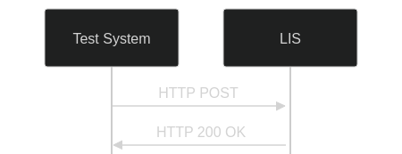

# Test Description: TD_LIS_002

## IMPORTANT!
**Current implementation of getting location URI will not work!**
Normally it is provided by OSP which is 3rd party for NG911 tests. Currently there is no way to stimulate OSP to send SIP INVITE with 'Geolocation' which includes location URI.

## Overview
### Summary
Getting locationURI from LIS

### Description
This test checks on LIS which supports location by reference:
* getting locationURI
* correct locationURI expiration time

### HTTP and SIP transport types
Test can be performed with 2 different SIP and HTTP transport types. Steps describing actions for specific one are marked as following:
- (TLS transport) - should be used by default
- (TCP transport) - used in lab for testing purposes only if default TLS is not possible

### References
* Requirements : RQ_LIS_006
* Test Case    : 

### Requirements
IXIT config file for LIS

## Configuration
### Implementation Under Test Interface Connections
<!-- Identify each of the FEs that are part of the configuration and how they are connected -->
* Test System
  * IF_TS_LIS - connected to IF_LIS_TS
* LIS
  * IF_LIS_TS - connected to IF_TS_LIS 

### Test System Interfaces
<!-- Identify each of the test system interfaces and whether it will be in active or monitor mode -->
* Test System
  * IF_TS_LIS - Active
* LIS
  * IF_LIS_TS - Active

### Connectivity Diagram
<!--

-->

## Pre-Test Conditions

### Test System
* Interfaces are connected to network
* Interfaces have IP addresses assigned by DHCP
* Device is active

### LIS
* location is supplied by reference
* Interfaces are connected to network
* Interfaces have IP addresses assigned by DHCP
* Default configuration is loaded
* IUT is initialized with steps from IXIT config file
* IUT is active
* IUT is in normal operating state

## Test Sequence

### Test Preamble

#### Test System
* Install CURL[^1]
* Install Wireshark[^2]
* Copy following HTTP scenario files to local storage:
  > Location_request_for_locationURI
* (TLS transport) Copy to local storage TLS certificate and private key files:
  > cacert.pem
  > cakey.pem
* (TLS transport) Configure Wireshark to decode HTTP over TLS packets[^3]
* Using Wireshark on 'Test System' start packet tracing on IF_TS_LIS interface - run following filter:
   * (TLS transport)
     > ip.addr == IF_TS_LIS_IP_ADDRESS and tls
   * (TCP transport)
     > ip.addr == IF_TS_LIS_IP_ADDRESS and http
* On 'Test System' change configuration in scenario file:
   > Location_request_for_locationURI
   * Change LOCATION_URI to '/Location'
   * Configure LIS_FQDN to IF_LIS_TS_IP_ADDRESS
   * (TCP transport) configure PORT to '80'
   * (TLS transport) configure PORT to '443'

### Test Body

**Stimulus**

From 'Test System' send HTTP message with HTTP GET to LIS:
   * (TLS transport)
     > curl -X POST https://LIS_URL -d @Location_request_for_locationURI
   * (TCP transport)
     > curl -X POST http://LIS_URL -d @Location_request_for_locationURI
 
 **Response**
 
Using Wireshark verify 200 OK response from LIS:
* if includes correct PIDF-LO XML body
* if includes HELD locationURI (if supported), example:
    > <locationURI>https://ls.example.com:9768/357yc6s64ceyoiuy5ax3o</locationURI>
* if includes SIP locationURI (if supported), example:
    > <locationURI>sip:9769+357yc6s64ceyoiuy5ax3o@ls.example.com</locationURI>
* if includes 'expires' parameter, example:
    > <locationUriSet expires="2006-01-01T13:00:00.0Z">
* if expire time is minimum 30 min and maximum 24h
* if expire time is in format defined in https://www.w3.org/TR/2004/REC-xmlschema-2-20041028/

**VERDICT:**
* PASSED - if all checks passed for variation
* FAILED - all other cases

### Test Postamble
#### Test System
* stop all NC processes (if still running)
* archive all logs generated
* remove all HTTP scenarios
* disconnect interfaces from LIS

#### LIS
* disconnect IF_LIS_TS
* reconnect interfaces back to default

## Post-Test Conditions 
### Test System 
* Test tools stopped
* interfaces disconnected from LIS

### LIS
* device connected back to default
* device in normal operating state

## Sequence Diagram
<!--

-->

## Comments

Version:  010.3d.3.1.5

Date:     20250428

## Footnotes
[^1]: CURL for Linux https://linux.die.net/man/1/curl
[^2]: Wireshark - tool for packet tracing and anaylisis. Official website: https://www.wireshark.org/download.html
[^3]: Wireshark configuration to decrypt SIP over TLS packets: https://www.zoiper.com/en/support/home/article/162/How%20to%20decode%20SIP%20over%20TLS%20with%20Wireshark%20and%20Decrypting%20SDES%20Protected%20SRTP%20Stream

