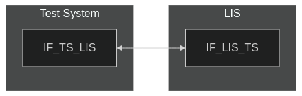
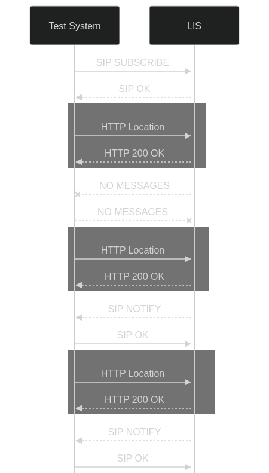
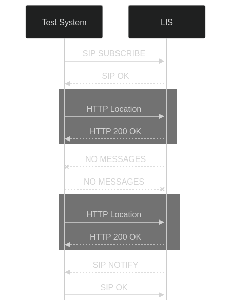

# Test Description: TD_LIS_003

## IMPORTANT !
Test requires simulation of moving object sent to LIS. Procedure is not clarified yet

## Overview
### Summary
SIP location filters


### Description
This test checks support of SIP location filters on LIS:
* if different type of filters are accepted
* if LIS sends SIP NOTIFY only when filter conditions are met

### HTTP and SIP transport types
Test can be performed with 2 different SIP and HTTP transport types. Steps describing actions for specific one are marked as following:
- (TLS transport) - should be used by default
- (TCP transport) - used in lab for testing purposes only if default TLS is not possible

### References
* Requirements : RQ_LIS_003
* Test Case    : TC_LIS_003

### Requirements
IXIT config file for LIS

## Configuration
### Implementation Under Test Interface Connections
<!-- Identify each of the FEs that are part of the configuration and how they are connected -->
* Test System
  * IF_TS_LIS - connected to IF_LIS_TS
* LIS
  * IF_LIS_TS - connected to IF_TS_LIS


### Test System Interfaces
<!-- Identify each of the test system interfaces and whether it will be in active or monitor mode -->
* Test System
  * IF_TS_LIS - Active
* LIS
  * IF_LIS_TS - Active


### Connectivity Diagram
<!--
[](https://mermaid.live/edit#pako:eNpdUNsKgkAQ_RWZZ_0BiZ4iEOwlfYoFmdzxQu6u7IUQ8d-b0oqapzPnnLnOUBtJkEIzmHvdofVRfhY64siOVVlUeVbskmTPCSMmhF5VF66txbGLSnI-KibnSa3KT-1KkZZ_VR9pc7-bb26IQZFV2EtebX7SAnxHigSkDCXamwChF_Zh8KaYdA2pt4FiCKNET4ceeZCCtMHBMTuivhjzzUn23tjTevvrBTFYE9pucywPiKlY2g)
-->




## Pre-Test Conditions

### Test System
* Interfaces are connected to network
* Interfaces have IP addresses assigned by DHCP
* Device is active

### LIS
* Interfaces are connected to network
* Interfaces have IP addresses assigned by DHCP
* Default configuration is loaded
* IUT is initialized using IXIT config file
* IUT is active
* IUT is in normal operating state
* Object location reference SIP URI is available
* Manual simulation of object location change is possible
* Object geolocation shape type is "Point"

## Test Sequence

### Test Preamble

#### Test System
* Install Wireshark[^1]
* Install Netcat[^3]
* Copy following XML scenario files to local storage:
  ```
  SIP_SUBSCRIBE_distance_filter_with_NOTIFY_receive.xml
  SIP_SUBSCRIBE_speed_filter_with_NOTIFY_receive.xml
  SIP_SUBSCRIBE_civic_address_filter_with_NOTIFY_receive.xml
  SIP_SUBSCRIBE_enter_area_filter_with_NOTIFY_receive.xml
  SIP_SUBSCRIBE_location_type_change_filter_with_NOTIFY_receive.xml
  ```

* (TLS transport) Copy to local storage TLS certificate and private key files:
  > cacert.pem
  > cakey.pem

* (TLS transport) Configure Wireshark to decode SIP over TLS packets[^2]
* Using Wireshark on 'Test System' start packet tracing on IF_TS_LIS interface - run following filter:
   * (TLS transport)
     > ip.addr == IF_TS_LIS_IP_ADDRESS and tls
   * (TCP transport)
     > ip.addr == IF_TS_LIS_IP_ADDRESS and sip

### Test Body

**Variations**

1. Distance_filter
Scenario file: SIP_SUBSCRIBE_distance_filter_with_NOTIFY_receive.xml

2. Speed_filter
Scenario file: SIP_SUBSCRIBE_speed_filter_with_NOTIFY_receive.xml

3. Element_value_change_filter
Scenario file: SIP_SUBSCRIBE_civic_address_filter_with_NOTIFY_receive.xml

4. Entering_area_filter
Scenario file: SIP_SUBSCRIBE_enter_area_filter_with_NOTIFY_receive.xml

5. Location_type_filter
Scenario file: SIP_SUBSCRIBE_location_type_filter_with_NOTIFY_receive.xml

**Stimulus**
1. Send SIP SUBSCRIBE and receive SIP NOTIFY, run following SIPp command by using SCENARIO_FILE according to test variation:
   * (TCP transport)
     > sudo sipp -t t1 -sf SCENARIO_FILE -i IF_TS_LIS_IP_ADDRESS:5060 -timeout 300 -max_recv_loops 1 -s SIP_OBJECT_LOCATION_URI
   * (TLS transport)
     > sudo sipp -t l1 -tls_cert cacert.pem -tls_key cakey.pem -sf SCENARIO_FILE -i IF_TS_LIS_IP_ADDRESS:5061 -timeout 300 -max_recv_loops 1 -s SIP_OBJECT_LOCATION_URI
2. According to test variation do following simulations on subscribed object location:
- Variation 1 - wait 10 seconds then please simulate movement of the subscribed object first by 100 meters and then by 300 meters
- Variation 2 - wait 10 seconds then please simulate speed change of the subscribed object first by 1 meter/second and then by 3 meters/second
- Variation 3 - wait 10 seconds then please simulate change of country to FR in the subscribed object civic address and then to PL
- Variation 4 - wait 10 seconds then please simulate change of subscribed object geolocation to 39.10238720701651, -76.8652199152211 and then to 39.08170952274149, -76.85188316111969
- Variation 5 - wait 10 seconds then please simulate change of subscribed object geolocation, then change its location type to civic

**Response**
Variation 1 - verify geolocations of first and second SIP NOTIFY PIDF-LO body received, distance should be more than 300 meters
Variation 2 - verify values of "speed" parameter of first and second SIP NOTIFY PIDF-LO bodies, change of speed shall be higher than 3 meters/second
Variation 3 - verify if first SIP NOTIFY received contain "PL" country civic address value in PIDF-LO body
Variation 4 - verify if first SIP NOTIFY received contain PIDF-LO body with Point geolcoation with coordinates 39.08170952274149 -76.85188316111969
Variation 5- verify if all SIP NOTIFY received contain PIDF-LO body with civic address

**VERDICT:**
* PASSED - if all checks passed for variation
* FAILED - all other cases


### Test Postamble
#### Test System
* stop all NC processes (if still running)
* stop all SIPp processes (if still running)
* archive all logs generated
* remove all HTTP scenarios
* remove all SIP scenarios
* disconnect interfaces from LIS
* (TLS transport) remove certificates

#### LIS
* disconnect IF_LIS_TS
* reconnect interfaces back to default


## Post-Test Conditions 
### Test System 
* Test tools stopped
* interfaces disconnected from LIS

### LIS
* device connected back to default
* device in normal operating state

## Sequence Diagram

**Distance and speed filter scenarios:**
<!--
[](https://mermaid.live/edit#pako:eNrFk8FOAjEQhl-lmZPGbQLGUw8koKtuBJbY9aDppXaHZaNtsdtNIIR3t-yiYFBOJhyatPN_yT8znVmBsjkCA0qpMMqaaVkwYQjRpXPW9ZW3rmJkKt8rFKaBKvyo0Si8KWXhpN7AhGRYecKXlUdNe72LYcIZ4cmE8KcBv35MBnGLhTgN-h7dYulDqztUnrji9azbvYq257yV_nK5z7IJGVolfWnNDv3NqUEvO51vOzS5MHuZLX7g45SMYs77dzE_LJIuGvcD5hQVHOvsOM2S2-fjn3TK7v9H7hCBRqdlmYdBXm14AX6GGgWwcM2lexMgzDpwsvaWL40C5l2NEdTzXPqvUQbWzHkEc2lerN29MS_DHozaTWkWJgJn62K2Jdaf3f_5DQ)
-->




**Other filter scenarios:**
<!--
[](https://mermaid.live/edit#pako:eNrFks9PwjAUx_-V5p00bgkYTz2QgE5d-DFix0HTS20fY9G22HUJhPC_WzYUDMrVQ5O275N832s_G5BWIVCI45gbac28LCg3hOjSOev60ltXUTIX7xVy00AVftRoJN6VonBC72BCcqw8YevKo457vatRyihh6ZSw2YDdPqWDpMXCfRzqR3SLZcO27lB64orXi273Jtqvy7b0V8pjnk_JyErhS2sO6G9JDXrd6XzHoVHcHHW2-oFPMjJOGOs_JOx0yHjVpJ8w_zHBuZedZHl6_3z-k7IhRKDRaVGqoMJmR3PwC9TIgYatEu6NAzfbwInaW7Y2Eqh3NUZQL5XwXzIAbUyJYCnMi7WHM6oymDRuXWuUi8DZuljsie0nuDTDnA)
-->




## Comments

Version:  010.3d.3.1.5

Date:     20250611


## Footnotes
[^1]: Wireshark - tool for packet tracing and anaylisis. Official website: https://www.wireshark.org/download.html
[^2]: Wireshark configuration to decrypt SIP over TLS packets: https://www.zoiper.com/en/support/home/article/162/How%20to%20decode%20SIP%20over%20TLS%20with%20Wireshark%20and%20Decrypting%20SDES%20Protected%20SRTP%20Stream
[^3]: Netcat for Linux https://linux.die.net/man/1/nc

