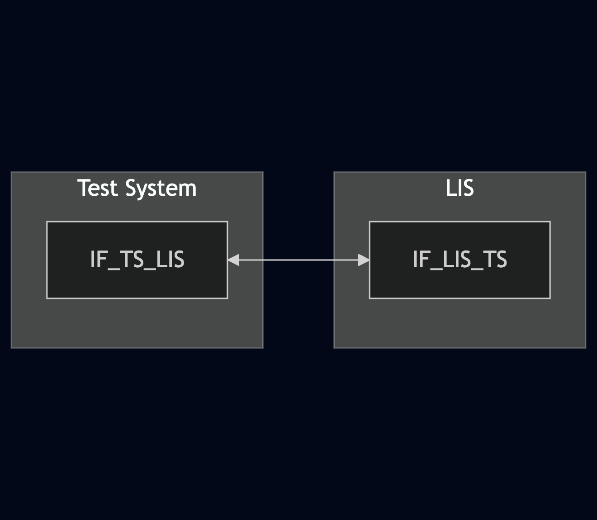
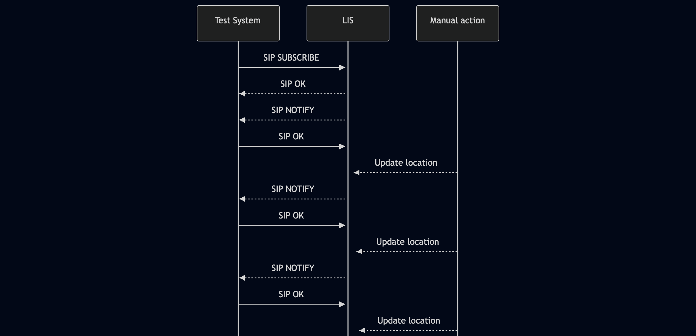

# Test Description: TD_LIS_004

## IMPORTANT !
Test requires simulation of moving object sent to LIS. Procedure is not clarified yet

## Overview
### Summary
SIP event rate control

### Description
This test checks support of SIP event rate control on LIS:
- min-rate
- max-rate
- adaptive-min-rate

### HTTP and SIP transport types
Test can be performed with 2 different SIP and HTTP transport types. Steps describing actions for specific one are marked as following:
- (TLS transport) - should be used by default
- (TCP transport) - used in lab for testing purposes only if default TLS is not possible

### References
* Requirements : RQ_LIS_009
* Test Case    : TC_LIS_004

### Requirements
IXIT config file for LIS

## Configuration
### Implementation Under Test Interface Connections
<!-- Identify each of the FEs that are part of the configuration and how they are connected -->
* Test System
  * IF_TS_LIS - connected to IF_LIS_TS
* LIS
  * IF_LIS_TS - connected to IF_TS_LIS

### Test System Interfaces
<!-- Identify each of the test system interfaces and whether it will be in active or monitor mode -->
* Test System
  * IF_TS_LIS - Active
* LIS
  * IF_LIS_TS - Active

### Connectivity Diagram
<!--

-->

## Pre-Test Conditions

### Test System
* Interfaces are connected to network
* Interfaces have IP addresses assigned by DHCP
* Device is active

### LIS
* Interfaces are connected to network
* Interfaces have IP addresses assigned by DHCP
* Default configuration is loaded
* IUT is initialized using IXIT config file
* IUT is active
* IUT is in normal operating state

## Test Sequence

### Test Preamble

#### Test System
* Install Wireshark[^1]
* Copy following XML scenario files to local storage:
  > SIP_SUBSCRIBE_minimum_rate_with_NOTIFY_receive.xml
  > SIP_SUBSCRIBE_maximum_rate_with_NOTIFY_receive.xml
  > SIP_SUBSCRIBE_adaptive_min_rate_with_NOTIFY_receive.xml

* (TLS transport) Copy to local storage TLS certificate and private key files:
  > cacert.pem
  > cakey.pem

* (TLS transport) Configure Wireshark to decode SIP over TLS packets[^2]
* Using Wireshark on 'Test System' start packet tracing on IF_TS_LIS interface - run following filter:
   * (TLS transport)
     > ip.addr == IF_TS_LIS_IP_ADDRESS and tls
   * (TCP transport)
     > ip.addr == IF_TS_LIS_IP_ADDRESS and sip

### Test Body

#### Variations
1. SIP_SUBSCRIBE_from_LIS_min_rate_0.xml
2. SIP_SUBSCRIBE_from_LIS_min_rate_100.xml
3. SIP_SUBSCRIBE_from_LIS_max_rate_0.xml
4. SIP_SUBSCRIBE_from_LIS_max_rate_100.xml
5. SIP_SUBSCRIBE_from_LIS_adaptive_min_rate_0.xml
6. SIP_SUBSCRIBE_from_LIS_adaptive_min_rate_100.xml
7. SIP_SUBSCRIBE_from_LIS_min_rate.xml
8. SIP_SUBSCRIBE_from_LIS_max_rate.xml
9. SIP_SUBSCRIBE_from_LIS_adaptive_min_rate.xml

#### Stimulus
1. Run SIPp XML scenario, execute following SIPp command on Test System, example:
    * (TCP transport)
      > sudo sipp -t t1 -sf SCENARIO_FILE -i IF_TS_LIS -p 5060 IF_LIS_TS -m 1 -timeout 10
    * (TLS transport)
      > sudo sipp -t l1 -sf SCENARIO_FILE -i IF_TS_LIS -p 5061 IF_LIS_TS -m 1 -timeout 30

2. Right after starting SIPp update object's location within 10 seconds:
- Variation 7 - 1x time
- Variation 8 - more than 15x times
- Variation 9 - in first 5 seconds update 1 time, then don't update

#### Response
Variation 1-6
LIS responds with 4xx error for SIP SUBSCRIBE

Variation 7
Minimum_rate - LIS sends at least 2x SIP NOTIFY per second (min-rate=2)

Variation 8
Maximum_rate - LIS sends maximum 1x SIP NOTIFY per 2 seconds (max-rate=0.5)

Variation 9
Adaptive_min_rate - LIS sends at least 10x SIP NOTIFY per second (adaptive-min-rate=10)

VERDICT:
* PASSED - if LIS responded as expected
* FAILED - any other cases

### Test Postamble
#### Test System
* stop all NC processes (if still running)
* stop all SIPp processes (if still running)
* stop Wireshark (if still running)
* archive all logs generated
* remove all HTTP scenarios
* remove all SIP scenarios
* disconnect interfaces from LIS
* (TLS transport) remove certificates

#### LIS
* disconnect IF_LIS_TS
* reconnect interfaces back to default

## Post-Test Conditions 
### Test System 
* Test tools stopped
* interfaces disconnected from LIS

### LIS
* device connected back to default
* device in normal operating state

## Sequence Diagram

<!--

-->

## Comments

Version:  010.3f.3.1.5

Date:     20250714

## Footnotes
[^1]: Wireshark - tool for packet tracing and anaylisis. Official website: https://www.wireshark.org/download.html
[^2]: Wireshark configuration to decrypt SIP over TLS packets: https://www.zoiper.com/en/support/home/article/162/How%20to%20decode%20SIP%20over%20TLS%20with%20Wireshark%20and%20Decrypting%20SDES%20Protected%20SRTP%20Stream
