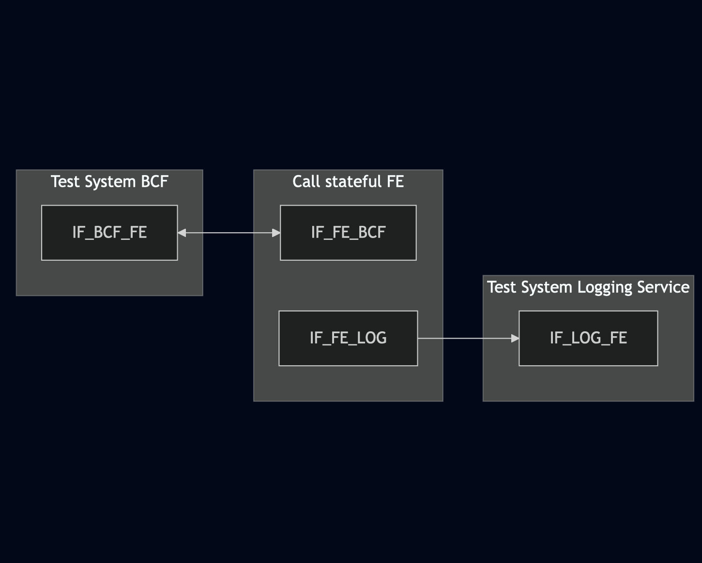
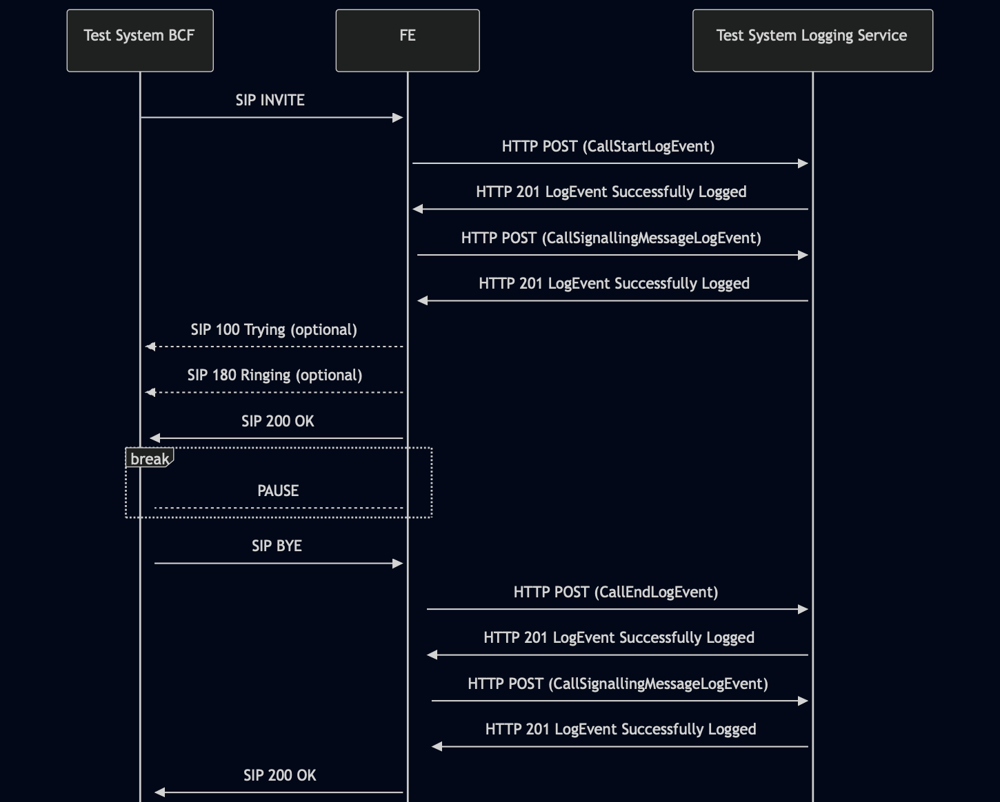

# Test Description: TD_LOG-FE_001
## Overview
### Summary
Logging call status by call stateful functional elements

### Description
Test covers logging of CallStartLogEvent, CallEndLogEvent and CallSignallingMessageLogEvent by all functional elements which are processing a calls

### References
* Requirements : RQ_BCF_128, RQ_BCF_136, RQ_BCF_137, RQ_BCF_138, RQ_BRG_092, RQ_BRG_100, RQ_BRG_101, RQ_BRG_102, 
RQ_CHFE_312, RQ_CHFE_318, RQ_CHFE_319, RQ_CHFE_320, RQ_ESRP_116, RQ_ESRP_124, RQ_ESRP_125, RQ_ESRP_126
* Test Case    : TC_LOG-FE_001

### Requirements
IXIT config file for IUT

### HTTP transport types
Test can be performed with 2 different HTTP transport types. Steps describing actions for specific one are marked as following:
- (TLS) - used by default inside ESInet on production environment
- (TCP) - used if default TLS is not possible

## Configuration
### Implementation Under Test Interface Connections
<!-- Identify each of the FEs that are part of the configuration and how they are connected -->
* Test System BCF
  * IF_BCF_FE - connected to Call Stateful Functional Element IF_FE_BCF
* Call Stateful Functional Element (FE)
  * IF_FE_BCF - connected to Test System BCF IF_BCF_FE
  * IF_FE_LOG - connected to Test System Logging Service IF_LOG_FE
* Test System Logging Service
  * IF_LOG_FE - connected to FE IF_FE_LOG

### Test System Interfaces
<!-- Identify each of the test system interfaces and whether it will be in active or monitor mode -->
* Test System BCF
  * IF_BCF_FE - Active
* Call Stateful Functional Element (FE)
  * IF_FE_BCF - Active
  * IF_FE_LOG - Active
* Test System Logging Service
  * IF_LOG_FE - Active
 
### Connectivity Diagram
<!--
https://mermaid.live/edit#pako:eNp1UV1rwjAU_SvhPldpY6tNGHtYN4fgGMw9jYJk7e0HaxNJk21O_O9LLToVlqd77rnn3HPJDjKVI3AoGvWVVUIbsnxJJXFvMV_fJfP1_OFmNLpd9EWPT5yDy-fHgXKFwwPV2fdSi01FXrEzZLXtDLbkJLwwHloo8ytlIpqGdEYYLGxDjnN_e6_dhij_uZ3nWKqyrGVJVqg_6wwvXM6PcC7gQanrHLjRFj1oUbeih7DrR1IwFbaYAndlLvRHCqncO81GyDel2qNMK1tWwAvRdA7ZTe6Ouq-FS9aeutptQ50oKw3wII4OJsB38A18ysbMn0V-yEI6DWfMkVvgUTimPgviCaWMhnEQ7D34OWwNxpMgiiM3S_2ITeiUeiCsUautzI6ZMK-N0k_Dvx--f_8LgbaaLA
-->




## Pre-Test Conditions
### Test System BCF/Logging Service
* Interfaces are connected to network
* Interfaces have IP addresses assigned by DHCP
* Device is active
* ng911 repository cloned to local storage
* (TLS) Generated own PCA-signed certificate and private key files (test_system.crt, test_system.key)
* (TLS) Certificate and key used by FE copied to local storage
* (TLS) PCA certificate copied to local storage

### Call Stateful Functional Element (FE)
* Interfaces are connected to network
* Interfaces have IP addresses assigned by DHCP
* Device configured to use Logging Service Test System as a Logging Service
* IUT is initialized with steps from IXIT config file
* Device is active
* Device is in normal operating state
* IUT is initialized using IXIT config file

## Test Sequence

### Test Preamble

#### Test System BCF
* Install SIPp by following steps from documentation[^1]
* Copy following XML scenario file to local storage:
  `SIP_basic_call.xml`
* Install Wireshark[^2]
* (TLS v1.2) Configure Wireshark to decode HTTP over TLS, use tests system and FE certificate keys [^3]
* (TLS v1.3) Configure logging of session keys and configure Wireshark to decode HTTP over TLS [^4]
* Using Wireshark on 'Test System' start packet tracing on IF_BCF_FE interface - run following filter:
   * (TLS)
     > ip.addr == IF_BCF_FE_IP_ADDRESS and tls
   * (TCP)
     > ip.addr == IF_BCF_FE_IP_ADDRESS and sip

#### Test System Logging Service
* Install Wireshark[^2]
* (TLS v1.2) Configure Wireshark to decode HTTP over TLS, use tests system and FE certificate keys [^3]
* (TLS v1.3) Configure logging of session keys and configure Wireshark to decode HTTP over TLS [^4]
* Using Wireshark on 'Test System' start packet tracing on IF_LOG_FE interface - run following filter:
   * (TLS)
     > ip.addr == IF_LOG_FE_IP_ADDRESS and tls
   * (TCP)
     > ip.addr == IF_LOG_FE_IP_ADDRESS and http

### Test Body

#### Stimulus
Simulate basic call from SIP Test System to FE - run SIPp scenario by using following command on SIP Test System, example:
* (TCP transport)
  ```
  sudo sipp -t t1 -sf SIP_basic_call.xml IF_FE_SIPTS_IPv4:5060
  ```
* (TLS transport)
  ```
  sudo sipp -t l1 -tls_cert test_system.crt -tls_key test_system.key -sf SIP_basic_call.xml IF_FE_SIPTS_IPv4:5060
  ```

#### Response
Using traced packets on Wireshark from SIP and Logging Service Tests Systems verify:
* If FE sends HTTP POST to Logging Service Test System with signed JWS body containing:
  * "logEventType": "CallStartLogEvent"
  * "timestamp" with correct date-time format (f.e. 2020-03-10T11:00:01-05:00) and date-time match the time when SIP INVITE message has been received
  * "elementId" which has value with FQDN of FE
  * "agencyId" which has value with FQDN of an agency
  * "callId" which has value f.e.: `urn:emergency:uid:callid:1234567890:bcf.ng911.example`. Check:
    * if header field contains "urn:emergency:uid:callid:"
    * if "urn:emergency:uid:callid:" is followed by 10 to 32 alphanumeric characters (String ID)
    * if String ID is followed by ":" and domain name
  * "incidentId" which has value f.e.: `urn:emergency:uid:incidentid:1234567890:bcf.ng911.example`. Check:
    * if header field contains "urn:emergency:uid:incidentid:"
    * if "urn:emergency:uid:incidentid:" is followed by 10 to 32 alphanumeric characters (String ID)
    * if String ID is followed by ":" and domain name
  * "callIdSIP" which has value f.e.: `1234567890qwertyuiop@caller.example.com` 
  * "direction" which has value: `incoming`
  * (optionally) zero or one "standardPrimaryCallType" with one of string values:
    - "emergency"
    - "nonEmergency"
    - "silentMonitoring"
    - "intervene"
    - "legacyWireline"
    - "legacyWireless"
    - "legacyVoip"
  * (optionally) zero or one "standardSecondaryCallType" with one of string values mentioned for "standardPrimaryCallType"
  * (optionally) zero or one "localCallType" with string value
  * (optionally) zero or one "localUse" with string value
  * (optionally) zero or one "clientAssignedIdentifier" with string value
  * (optionally) zero or one "extension" with string value
* If FE sends HTTP POST to Logging Service Test System with signed JWS body containing:
  * "logEventType": "CallSignalingMessageLogEvent"
  * "timestamp" with correct date-time format (f.e. 2020-03-10T11:00:01-05:00) and date-time match the time when SIP INVITE message has been received
  * "elementId" which has value with FQDN of FE
  * "agencyId" which has value with FQDN of an agency
  * "callId" which has value f.e.: `urn:emergency:uid:callid:1234567890:bcf.ng911.example`. Check:
    * if header field contains "urn:emergency:uid:callid:"
    * if "urn:emergency:uid:callid:" is followed by 10 to 32 alphanumeric characters (String ID)
    * if String ID is followed by ":" and domain name
  * "incidentId" which has value f.e.: `urn:emergency:uid:incidentid:1234567890:bcf.ng911.example`. Check:
    * if header field contains "urn:emergency:uid:incidentid:"
    * if "urn:emergency:uid:incidentid:" is followed by 10 to 32 alphanumeric characters (String ID)
    * if String ID is followed by ":" and domain name
  * "callIdSIP" which has value f.e.: `1234567890qwertyuiop@caller.example.com` 
  * "direction" which has value: `incoming`
  * "text" which has string value containing SIP INVITE message received by FE from SIP Test System
  * "protocol" which has string value: `sip`
* If FE sends HTTP POST to Logging Service Test System with signed JWS body containing:
  * "logEventType": "CallEndLogEvent"
  * "timestamp" with correct date-time format (f.e. 2020-03-10T11:00:01-05:00) and date-time match SIP BYE message received by FE from SIP Test System
  * "elementId" which has value with FQDN of FE
  * "agencyId" which has value with FQDN of an agency
  * "callId" which has value f.e.: `urn:emergency:uid:callid:1234567890:bcf.ng911.example`. Check:
    * if header field contains "urn:emergency:uid:callid:"
    * if "urn:emergency:uid:callid:" is followed by 10 to 32 alphanumeric characters (String ID)
    * if String ID is followed by ":" and domain name
  * "incidentId" which has value f.e.: `urn:emergency:uid:incidentid:1234567890:bcf.ng911.example`. Check:
    * if header field contains "urn:emergency:uid:incidentid:"
    * if "urn:emergency:uid:incidentid:" is followed by 10 to 32 alphanumeric characters (String ID)
    * if String ID is followed by ":" and domain name
  * "callIdSIP" which has value f.e.: `1234567890qwertyuiop@caller.example.com` 
  * "direction" which has value: `incoming`
  * (optionally) zero or one "standardPrimaryCallType" with one of string values:
    - "emergency"
    - "nonEmergency"
    - "silentMonitoring"
    - "intervene"
    - "legacyWireline"
    - "legacyWireless"
    - "legacyVoip"
  * (optionally) zero or one "standardSecondaryCallType" with one of string values mentioned for "standardPrimaryCallType"
  * (optionally) zero or one "localCallType" with string value
  * (optionally) zero or one "localUse" with string value
  * (optionally) zero or one "clientAssignedIdentifier" with string value
  * (optionally) zero or one "extension" with string value
* If FE sends HTTP POST to Logging Service Test System with signed JWS body containing:
  * "logEventType": "CallSignalingMessageLogEvent"
  * "timestamp" with correct date-time format (f.e. 2020-03-10T11:00:01-05:00) and date-time match SIP BYE message received by FE from SIP Test System
  * "elementId" which has value with FQDN of FE
  * "agencyId" which has value with FQDN of an agency
  * "callId" which has value f.e.: `urn:emergency:uid:callid:1234567890:bcf.ng911.example`. Check:
    * if header field contains "urn:emergency:uid:callid:"
    * if "urn:emergency:uid:callid:" is followed by 10 to 32 alphanumeric characters (String ID)
    * if String ID is followed by ":" and domain name
  * "incidentId" which has value f.e.: `urn:emergency:uid:incidentid:1234567890:bcf.ng911.example`. Check:
    * if header field contains "urn:emergency:uid:incidentid:"
    * if "urn:emergency:uid:incidentid:" is followed by 10 to 32 alphanumeric characters (String ID)
    * if String ID is followed by ":" and domain name
  * "callIdSIP" which has value f.e.: `1234567890qwertyuiop@caller.example.com` 
  * "direction" which has value: `incoming`
  * "text" which has string value containing SIP BYE message received by FE from SIP Test System
  * "protocol" which has string value: `sip`

VERDICT:
* PASSED - if Logging Service responded as expected
* FAILED - any other cases


### Test Postamble
#### Test System BCF
* stop SIPp (if still running)
* stop Wireshark (if still running)
* archive all logs generated
* disconnect interfaces from IUT
* (TLS) remove certificates

#### Test System Logging Service
* stop Wireshark (if still running)
* archive all logs generated
* disconnect interfaces from IUT
* (TLS) remove certificates

#### Call Stateful Functional Element (FE)
* restore default configuration
* disconnect interfaces from Test System
* reconnect interfaces back to default

## Post-Test Conditions
### Test System BCF/Logging Service
* Test tools stopped
* interfaces disconnected from IUT

### Call Stateful Functional Element (FE)
* device connected back to default
* device in normal operating state

## Sequence Diagram
<!--
https://mermaid.live/edit#pako:eNrtVFFvmzAY_CvW99RqJAIH0uCHSm1GtGjrGg02aRUvHv5CUcHOjKnKovz3GSKaqtuqVpX6NF7A-O6-k326LWRKIDAYjUapzJRcFzlLJSFVobXSZ5lRumZkzcsaU9mDavzZoMzwfcFzzasOvH8SrA2J29pgRc7ni9Hp6btFxEi8XJHl52_LJDpAF1G3-5DwSeV5IXMSo74tMmTkQ5KsyOoyTsjRnJdlbLg2FhTdojTHfx_6SGMw0CtR1yMDncRNlmFdr5uybHsWild5K3JpXxZyYVV5jm_l87FRe-r78_ZclyS67YYcqY0plPV3_EzqzCVfLPEJ7r-o1E69_HiA_tDIbw7L-8l_kFdnX-MH6UApnpWq8--vilQkxf9AiRfdLDiQ60IAM7pBByrUFe-WsO1kUjDXWGEKzH4Krm9SSOXOcjZcXilVDTStmvwaWF8qDjQbwc3QJvd_tQ0B6rlqpAE2C2gvAmwLd8Cm4Th0TwLXD3069U_CwIEWWOCPqRt6swmlIfVnnrdz4Fc_1RtPvMBqTH3qBuGETq0ab4yKW5kNnlAUtuou9mXYd-LuNw5Uj0c
-->




## Comments

Version:  010.3f.5.0.7

Date:     20251119

## Footnotes
[^1]: SIPp - tool for SIP packet simulations. Official documentation: https://sipp.sourceforge.net/doc/reference.html#Getting+SIPp
[^2]: Wireshark - tool for packet tracing and anaylisis. Official website: https://www.wireshark.org/download.html
[^3]: Wireshark configuration to decrypt TLS packets: https://www.zoiper.com/en/support/home/article/162/How%20to%20decode%20SIP%20over%20TLS%20with%20Wireshark%20and%20Decrypting%20SDES%20Protected%20SRTP%20Stream
[^4]: TLS v1.3 session keys logging + Wireshark configuration to decrypt traffic: https://my.f5.com/manage/s/article/K50557518
