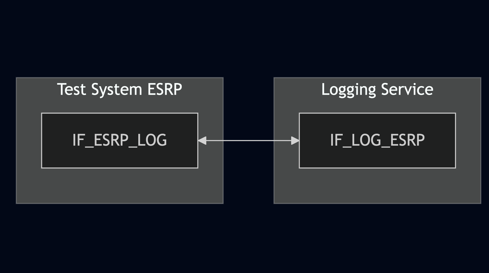
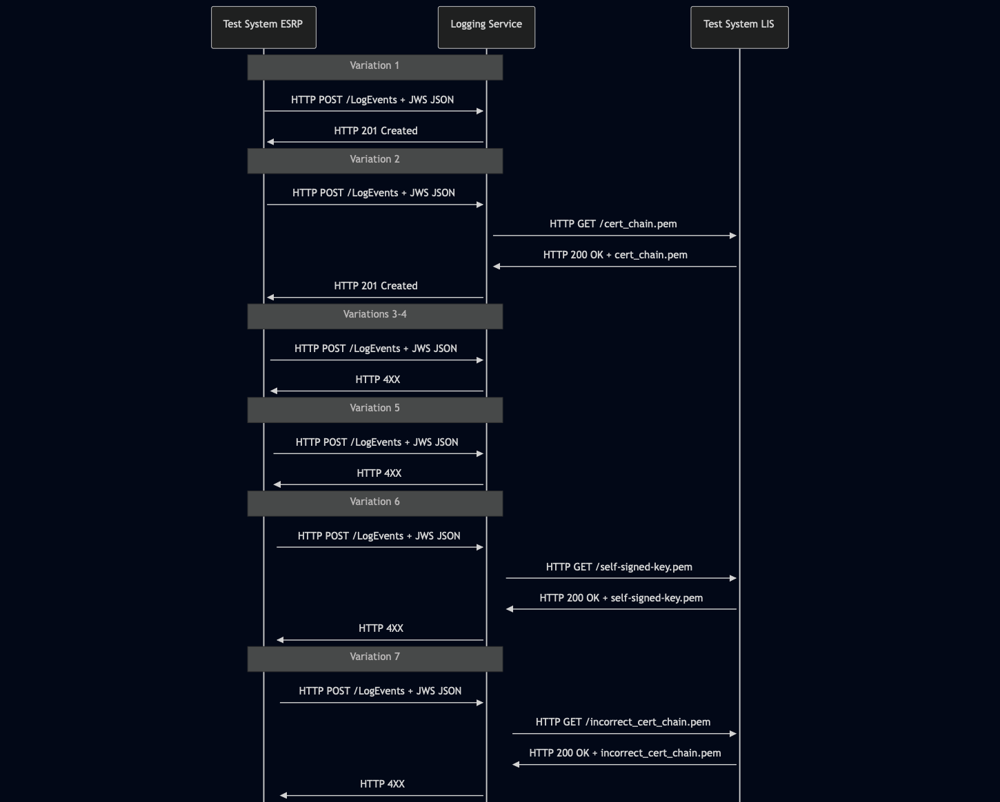

# Test Description: TD_LOG_008
## Overview
### Summary
Support of JWS certificates provided by value or reference

### Description
Test covers support of LogEvent JWS certificates provided by value or by reference

### References
* Requirements : RQ_LOG_218
* Test Case    : 

### Requirements
IXIT config file for Logging Service

### HTTP transport types
Test can be performed with 2 different HTTP transport types. Steps describing actions for specific one are marked as following:
- (TLS) - used by default inside ESInet on production environment
- (TCP) - used if default TLS is not possible

## Configuration
### Implementation Under Test Interface Connections
<!-- Identify each of the FEs that are part of the configuration and how they are connected -->
* Logging Service (LOG)
  * IF_LOG_ESRP - connected to Test System ESRP IF_ESRP_LOG
* Test System ESRP
  * IF_ESRP_LOG - connected to IUT IF_LOG_ESRP

### Test System Interfaces
<!-- Identify each of the test system interfaces and whether it will be in active or monitor mode -->
* Logging Service (LOG)
  * IF_LOG_ESRP - Active
* Test System ESRP
  * IF_ESRP_LOG - Active
 
### Connectivity Diagram
<!--
https://mermaid.live/edit#pako:eNpdUV1rg0AQ_CvHPhvRi6fJUfrSLwqWltinIoSrblQa7-Q821rxv_dU0pLs08zszs7CDpCpHIHD4ai-slJoQ-JdKomtx_v9XbJ72cfPD1er1bWlFs3S0m-790KLpiSv2BqS9K3Bmvy3L1YsIsr8whyroqhkQRLUn1WGZ97zPOsFBwpd5cCN7tCBGnUtJgrDNJKCKbHGFLiFudAfKaRytJ5GyDel6pNNq64ogR_EsbWsa3Jh8LYS9p76T9U2DfWN6qQB7ofreQnwAb6BM7Z1Q-ozz1_T0A8pc6CfhgKX-p6tiAUbj1I2OvAzx3puEHmbkEU0tGAbRDRyQHRGJb3MTldhXhmln5ZvzE8ZfwHwG3xC
-->




## Pre-Test Conditions
### Test System ESRP
* Interfaces are connected to network
* Interfaces have IP addresses assigned by DHCP
* Device is active
* ng911 repository cloned to local storage
* Generated own PCA-signed certificate and private key files (test_system.crt, test_system.key)
* (TLS) Certificate and key used by Logging Service copied to local storage
* (TLS) PCA certificate copied to local storage

### Logging Service (LOG)
* Interfaces are connected to network
* Interfaces have IP addresses assigned by DHCP
* Default configuration is loaded
* IUT is initialized with steps from IXIT config file
* IUT is configured to accept signed log events
* Device is active
* Device is in normal operating state

## Test Sequence

### Test Preamble

#### Test System ESRP
* Install Wireshark[^1]
* (TLS v1.2) Configure Wireshark to decode HTTP over TLS, use tests system and LOG certificate keys [^2]
* (TLS v1.3) Configure logging of session keys and configure Wireshark to decode HTTP over TLS [^3]
* Install Openssl[^4]
* Using Wireshark on 'Test System' start packet tracing on IF_ESRP_LOG interface - run following filter:
   * (TLS)
     > ip.addr == IF_ESRP_LOG_IP_ADDRESS and tls
   * (TCP)
     > ip.addr == IF_ESRP_LOG_IP_ADDRESS and http
* merge contents of ESRP PCA-signed certificate file (test_system.crt) with PCA certificate into one text file, save as cert_chain.pem
* generate self-signed certificate, run following commands:
```
openssl genpkey -algorithm Ed448 -out self-signed-key.pem
openssl req -x509 -new -key self-signed-key.pem -out self-signed-cert.pem -days 1 -subj "/C=US/ST=State/L=City/O=Organization/OU=OrgUnit/CN=localhost"
```
* merge contents of generated self-signed certificate (sel-signed-cert.pem) with PCA certificate into one text file, save as incorrect_cert_chain.pem
* prepare JWS JSON message bodies for all variations:
1. Generate JWS:
```
python3 -m main generate_jws CallStartLogEvent_object_example_v010.3f.3.0.X.json --cert cert_chain.pem --key test_system.key --output_file var1.json
```

2. Generate JWS replacing IF_ESRP_LOG_IP_OR_FQDN with IP address of IF_ESRP_LOG interface or FQDN of Test System ESRP:
```
python3 -m main generate_jws CallStartLogEvent_object_example_v010.3f.3.0.X.json --cert cert_chain.pem --key test_system.key --cert_url https://IF_ESRP_LOG_IP_OR_FQDN:8443/cert_chain.pem --output_file var2.json
```
3. Generate JWS:
```
python3 -m main generate_jws CallStartLogEvent_object_example_v010.3f.3.0.X.json --cert test_system.crt --key test_system.key --output_file var3.json
```
Then edit var1.json file. Change first element in "x5c" array with string from self-signed-key.pem

4. Generate JWS:
```
python3 -m main generate_jws CallStartLogEvent_object_example_v010.3f.3.0.X.json --cert test_system.crt --key test_system.key --output_file var4.json
```
Then edit var2.json file. Change second element in "x5c" array with string from self-signed-key.pem

5. Generate JWS:
```
python3 -m main generate_jws CallStartLogEvent_object_example_v010.3f.3.0.X.json --cert test_system.crt --key test_system.key --cert_url https://test.incorrect.example.123.com --output_file var5.json
```

6. Generate JWS replacing IF_ESRP_LOG_IP_OR_FQDN with IP address of IF_ESRP_LOG interface or FQDN of Test System ESRP:
```
python3 -m main generate_jws CallStartLogEvent_object_example_v010.3f.3.0.X.json --cert test_system.crt --key test_system.key --cert_url https://IF_ESRP_LOG_IP_OR_FQDN:8443/self-signed-key.pem --output_file var6.json
```

7. Generate JWS replacing IF_ESRP_LOG_IP_OR_FQDN with IP address of IF_ESRP_LOG interface or FQDN of Test System ESRP:
```
python3 -m main generate_jws CallStartLogEvent_object_example_v010.3f.3.0.X.json --cert test_system.crt --key test_system.key --cert_url https://IF_ESRP_LOG_IP_OR_FQDN:8443/incorrect_cert_chain.pem --output_file var7.json
```

* go to location where all certificates generated for Test System ESRP are located
* run simple http server:
```
openssl s_server -accept 8443 -cert test_system.crt -key test_system.key -WWW
```

### Test Body

#### Variations

1. Validate 201 Created response for CallStartLogEvent request with correct certificate chain provided by value 
2. Validate 201 Created response for CallStartLogEvent request with correct certificate chain provided by reference
3. Validate 4xx error response for CallStartLogEvent request with incorrect certificate provided by value
4. Validate 4xx error response for CallStartLogEvent request with incorrect certificate chain provided by value
5. Validate 4xx error response for CallStartLogEvent request with incorrect certificate reference
6. Validate 4xx error response for CallStartLogEvent request with incorrect certificate provided by reference
7. Validate 4xx error response for CallStartLogEvent request with incorrect certificate chain provided by reference 


#### Stimulus
Send HTTP POST to /LogEvents entrypoint of Logging Service with generated JWS object (replace X with current variation number):

- (TLSv1.2):
  
  `curl --cert test_system.crt --key test_system.key --cacert PCA.crt --tlsv1.2 -X POST https://IF_LOG_ESRP_IP_ADDRESS:PORT/LogEvents -H "Content-Type: application/json" -d @varX.json`

- (TLSv1.3):
  
  `curl --cert test_system.crt --key test_system.key --cacert PCA.crt --tlsv1.3 -X POST https://IF_PS_TS_IP_ADDRESS:PORT/LogEvents -H "Content-Type: application/json" -d @varX.json`

- (TCP):
  
  `curl -X POST http://IF_PS_TS_IP_ADDRESS:PORT/LogEvents -H "Content-Type: application/json" -d @varX.json`

#### Response
* Variation  1
    - Logging Service responds with 201 Created
* Variation  2
    - Logging Service responds with 201 Created
    - Logging Service sends dereferencing HTTP GET to the URL matching value of "x5u" header field from stimulus JWS JSON body
* Variations  3-5
    - Logging Service responds with 4xx error message
* Variations  6-7
    - Logging Service responds with 4xx error message
    - Logging Service sends dereferencing HTTP GET to the URL matching value of "x5u" header field from stimulus JWS JSON body


VERDICT:
* PASSED - if Logging Service responded as expected
* FAILED - any other cases


### Test Postamble
#### Test System ESRP
* stop Wireshark (if still running)
* archive all logs generated
* disconnect interfaces from IUT
* (TLS) remove certificates

#### Logging Service
* disconnect interfaces from Test System
* reconnect interfaces back to default

## Post-Test Conditions
### Test System ESRP
* Test tools stopped
* interfaces disconnected from IUT

### Logging Service
* device connected back to default
* device in normal operating state

## Sequence Diagram
<!--
https://mermaid.live/edit#pako:eNrdlWFv0zAQhv-KdV-XFMdN0sYfJqFRAWOsFam2CUVCVnJNrS12sZ2KUvW_42YdkwoDoSI6kU9Ocu_ju9Pp3jWUukLgEIZhoUqtZrLmhSKkkcZo87J02lhOZuLOYqG6IIufW1QlvpKiNqLZBt8_l9oh0Us0ZIrWkXxlHTZklH-YBORC17VUNcnRLGWJnFwJI4WTWpHokbCvC09PT35QvplOJ2Qyzqfkhf83WqJylpyQ8-ucnOfjy0fannIL279gR2M0ImcGhcPq4HLYkcq5eJvvYK9HnlWicZ_KuZCqt8Dm5zl5ydMpMUrJ-J3P5CnSUdprST-Mjz8w8c3NwYOS_B9lpM9j3i3ezUIra4VVeIurQ4f-l7h_2-DB82iw9O5gDJZ-F_y11fJ75h-2GgKojayAO9NiAA2aRmxfYb1FFuDm2GAB3B8rYW4LKNTGaxZCfdS6eZAZ3dZz4J3pBdAuKr-5dm73_atBVaE5061ywFOadRDga_gCfBj3MjpIB_0oS1iU0GEAKx_UYzRjMWUs8wc6HGwC-NrdGvX6UTJMWBozmmR9lrIAROt0vlLlQ05YSW_F7-_NuvPszTejK2g8
-->




## Comments

Version:  010.3f.5.0.4

Date:     20251125

## Footnotes
[^1]: Wireshark - tool for packet tracing and anaylisis. Official website: https://www.wireshark.org/download.html
[^2]: Wireshark configuration to decrypt TLS packets: https://www.zoiper.com/en/support/home/article/162/How%20to%20decode%20SIP%20over%20TLS%20with%20Wireshark%20and%20Decrypting%20SDES%20Protected%20SRTP%20Stream
[^3]: TLS v1.3 session keys logging + Wireshark configuration to decrypt traffic: https://my.f5.com/manage/s/article/K50557518
[^4]: Openssl for Linux https://www.openssl.org/docs/