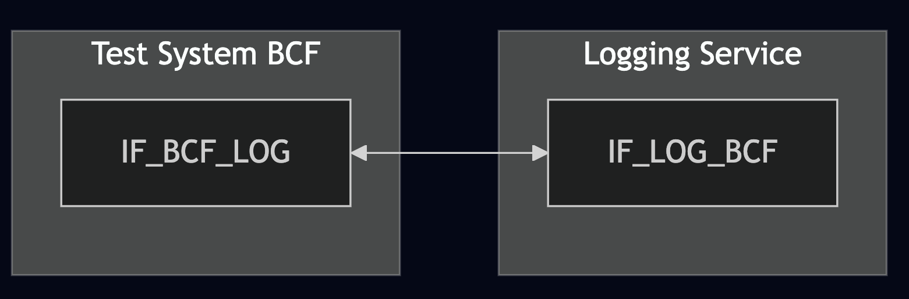
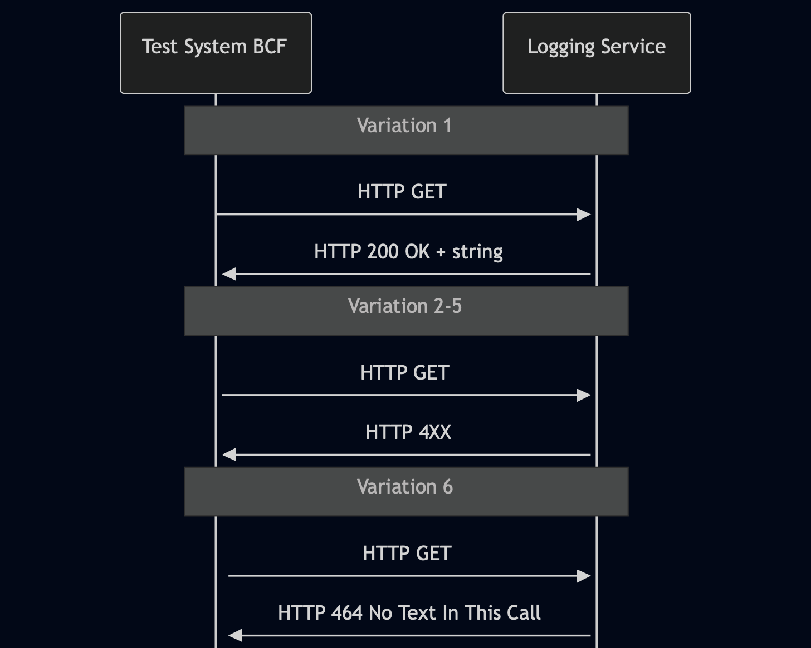

# Test Description: TD_LOG_009

## Overview
### Summary
Response validation for HTTP GET on /Conversations/{CallIdentifier}

### Description
Test verifies Logging Service HTTP GET responses for valid and invalid CallIdentifier requests.
A valid request MUST return success (200 OK or another 2xx) with Content-Type application/json
and the response body MUST be a JSON string representing the stored conversation text.
Negative cases validate error handling.

### References
* Requirements : RQ_LOG_037, RQ_LOG_038
* Test Case    : TC_LOG_009

### Requirements
IXIT config file for Logging Service

### HTTP transport types
Test can be performed with 2 different HTTP transport types. Steps describing actions for specific one are marked as following:
- (TLS) - used by default inside ESInet on production environment
- (TCP) - used if default TLS is not possible

## Configuration
### Implementation Under Test Interface Connections
<!-- Identify each of the FEs that are part of the configuration and how they are connected -->
* Logging Service (LOG)
  * IF_LOG_BCF - connected to Test System IF_BCF_LOG
* Test System BCF
  * IF_BCF_LOG - connected to FE IF_LOG_BCF

### Test System Interfaces
<!-- Identify each of the test system interfaces and whether it will be in active or monitor mode -->
* Test System BCF
  * IF_BCF_LOG - Active
* Logging Service (LOG)
  * IF_LOG_BCF - Active
 
### Connectivity Diagram
<!--
https://mermaid.live/edit#pako:eNpdkd1qg0AQhV9F5trIquvfUnrRlJSApVB7VYSw1YlK466sa1srvns3SgLpXM2cmW_OwExQyBKBwfEkv4uaK22lr7mwTOx3h4ft7pC-PN1tNvf7JTsra7cfPirFu9p6w15b2dhrbK1r95ZfNRTlPzSVVdWIyspQfTUF3qA3ZgYFGyrVlMC0GtCGFlXLzyVM55EcdI0t5sBMWnL1mUMuZsN0XLxL2V4wJYeqBnbkp95UQ1dyjY8NN-e0V1UZN1RbOQgNzCXBsgTYBD_AqOd4gReFQeJHfuK7IbVhBOa7xIlp6IWEuj5xSUxnG34XX-IkhCZBmCQhpSSOI7OPD1pmoyguV2HZaKme10cs_5j_ALEsejI
-->



## Pre-Test Conditions
### Test System BCF
* Interfaces are connected to network
* Interfaces have IP addresses assigned by DHCP
* Device is active
* ng911 repository cloned to local storage
* (TLS) Generated own PCA-signed certificate and private key files (test_system.crt, test_system.key)
* (TLS) Certificate and key used by Logging Service copied to local storage
* (TLS) PCA certificate copied to local storage

### Logging Service (LOG)
* Interfaces are connected to network
* Interfaces have IP addresses assigned by DHCP
* Default configuration is loaded
* IUT is initialized with steps from IXIT config file
* Device is active
* Device is in normal operating state


## Test Sequence

### Test Preamble

#### Test System BCF
* Install Wireshark[^1]
* (TLS v1.2) Configure Wireshark to decode HTTP over TLS, use tests system and LOG certificate keys [^2]
* (TLS v1.3) Configure logging of session keys and configure Wireshark to decode HTTP over TLS [^3]
* Using Wireshark on 'Test System' start packet tracing on IF_BCF_LOG interface - run following filter:
   * (TLS)
     > ip.addr == IF_BCF_LOG_IP_ADDRESS and tls
   * (TCP)
     > ip.addr == IF_BCF_LOG_IP_ADDRESS and http
* Pre-record text conversation on LOG, run following command:
```
python3 test_suite/services/stub_server/sip_service/sip_entry.py --bind-ip IF_BCF_LOG_IP_ADDRESS --bind-port 5060 --remote-ip IF_LOG_BCF_IP_ADDRESS --remote-port 5060 --protocol TCP --scenario-type auto --set SIP_call_id textcall1@IF_BCF_LOG_IP_ADDRESS --set LOG_SRS_username SRS_recorder --set Call_ID urn:emergency:uid:callid:a56e556d871:bcf.state.pa.us --set Incident_ID urn:emergency:uid:incidentid:a56e556d871:bcf.state.pa.us --set Text_host1 Host1_test --set Text_host2 Host2_test --message-timeout 30 --scenario test_suite/test_files/SIPp_scenarios/sip_service/CALLS/Text_call_recording_session.xml
```
* Make copy and modify following JSON files:
    ```
    "CallStartLogEvent_object_example_v010.3f.3.0.1.json",
    "CallSignalingMessageLogEvent_example_v010.3f.3.0.1.json",
    "CallEndLogEvent_object_example_v010.3f.3.0.1.json"
    ```
  * Modify all files with values:
      ```
      "callId": "urn:emergency:uid:callid:a56e556d871notext:bcf.state.pa.us",
      "incidentId": "urn:emergency:uid:incidentid:a56e556d871notext:bcf.state.pa.us",
      "startTime": "2025-02-27T11%3A58%3A01.01%2D05%3A00",
      "endTime": "2025-02-27T11%3A58%3A11.01%2D05%3A00"
      ```
* For all modified file copies generate JWS JSON, example command:
   * (TLS)
     > python3 -m main generate_jws CallStartLogEvent_object_example_v010.3f.3.0.1_copy1.json --cert cert.pem --key key.pem --output_file CallStartLogEvent_object_example_v010.3f.3.0.1_copy1_jws.json
   * (TCP)
     > python3 -m main generate_jws CallStartLogEvent_object_example_v010.3f.3.0.1_copy1.json --output_file CallStartLogEvent_object_example_v010.3f.3.0.1_copy1_jws.json
* Send HTTP POST to /LogEvents entrypoint of Logging Service with generated JWS object, example:
  * (TLSv1.2):
     > curl --cert test_system.crt --key test_system.key --cacert PCA.crt --tlsv1.2 -X POST https://IF_LOG_ESP_IP_ADDRESS:PORT/LogEvents -H "Content-Type: application/json" -d @CallStartLogEvent_object_example_v010.3f.3.0.1_copy1_jws.json`
  * (TLSv1.3):
     > curl --cert test_system.crt --key test_system.key --cacert PCA.crt --tlsv1.3 -X POST https://IF_LOG_ESP_IP_ADDRESS:PORT/LogEvents -H "Content-Type: application/json" -d @CallStartLogEvent_object_example_v010.3f.3.0.1_copy1_jws.json`
  * (TCP):
     > curl -X POST http://IF_LOG_ESP_IP_ADDRESS:PORT/LogEvents -H "Content-Type: application/json" -d @CallStartLogEvent_object_example_v010.3f.3.0.1_copy1_jws.json`

* Make another copy and modify following JSON files:
    ```
    "CallStartLogEvent_object_example_v010.3f.3.0.1.json",
    "CallSignalingMessageLogEvent_example_v010.3f.3.0.1.json",
    "CallEndLogEvent_object_example_v010.3f.3.0.1.json"
    ```
  * Modify all files with values:
      ```
      "callId": "urn:emergency:uid:callid:a56e556d871:bcf.state.pa.us",
      "incidentId": "urn:emergency:uid:incidentid:a56e556d871:bcf.state.pa.us",
      "startTime": "2025-02-27T12%3A58%3A01.01%2D05%3A00",
      "endTime": "2025-02-27T12%3A58%3A11.01%2D05%3A00"
      ```
  * Copy first SIP INVITE message text from file `Text_call_recording_session.xml` and replace for all occurrences:
    * [local_ip] - with IF_BCF_LOG_IP_ADDRESS
    * [remote_ip] - with IF_LOG_BCF_IP_ADDRESS
    * [local_port] and [remote_port] - with 5060 (TCP) or 5061 (TLS)
    * [$LOG_SRS_username] - with e.g. "SRS_recorder"
    * [$Call_ID] - with "urn:emergency:uid:callid:a56e556d871:bcf.state.pa.us"
    * [$Incident_ID] - with "urn:emergency:uid:incidentid:a56e556d871:bcf.state.pa.us"
    * [$SIP_call_id] - with textcall1@IF_BCF_LOG_IP_ADDRESS
  * Change value for param "text" in `CallSignalingMessageLogEvent_example_v010.3f.3.0.1.json` file with SIP INVITE text prepared above

* For all modified file copies generate JWS JSON, example command:
   * (TLS)
     > python3 -m main generate_jws CallStartLogEvent_object_example_v010.3f.3.0.1_copy1.json --cert cert.pem --key key.pem --output_file CallStartLogEvent_object_example_v010.3f.3.0.1_copy1_jws.json
   * (TCP)
     > python3 -m main generate_jws CallStartLogEvent_object_example_v010.3f.3.0.1_copy1.json --output_file CallStartLogEvent_object_example_v010.3f.3.0.1_copy1_jws.json
* Send HTTP POST to /LogEvents entrypoint of Logging Service with generated JWS object, example:
  * (TLSv1.2):
     > curl --cert test_system.crt --key test_system.key --cacert PCA.crt --tlsv1.2 -X POST https://IF_LOG_ESP_IP_ADDRESS:PORT/LogEvents -H "Content-Type: application/json" -d @CallStartLogEvent_object_example_v010.3f.3.0.1_copy1_jws.json`
  * (TLSv1.3):
     > curl --cert test_system.crt --key test_system.key --cacert PCA.crt --tlsv1.3 -X POST https://IF_LOG_ESP_IP_ADDRESS:PORT/LogEvents -H "Content-Type: application/json" -d @CallStartLogEvent_object_example_v010.3f.3.0.1_copy1_jws.json`
  * (TCP):
     > curl -X POST http://IF_LOG_ESP_IP_ADDRESS:PORT/LogEvents -H "Content-Type: application/json" -d @CallStartLogEvent_object_example_v010.3f.3.0.1_copy1_jws.json`


### Test Body

#### Variations

1. Validate 200 OK response for existing Call ID → Expect 200 OK + string body

    Send request with example URL:
    
    ```
    LOGGING_SERVICE_FQDN_OR_IP:PORT/Conversations?callId=urn:emergency:uid:callid:a56e556d871:bcf.state.pa.us
    ```

2. Validate 4xx error response for Unknown correct Call ID

    Send request with example URL:
    
    ```
    LOGGING_SERVICE_FQDN_OR_IP:PORT/Conversations?callId=urn:emergency:uid:callid:unknownid99:bcf.state.pa.us
    ```

3. Validate 4xx error response for Call ID with incorrect urn ID:

    Send request with example URL:
    
    ```
    LOGGING_SERVICE_FQDN_OR_IP:PORT/Conversations?callId=urn:emergency:uid:callincorrectid:9f3a2k7m1c:bcf.state.pa.us
    ```

4. Validate 4xx error response for Call ID with incorrect string ID:

    Send request with example URL:
    
    ```
    LOGGING_SERVICE_FQDN_OR_IP:PORT/Conversations?callId=urn:emergency:uid:callid:1.bcf.state.pa.us
    ```

5. Validate 4xx error response for Call ID with incorrect FQDN:

    Send request with example URL:
    
    ```
    LOGGING_SERVICE_FQDN_OR_IP:PORT/Conversations?callId=urn:emergency:uid:callid:a56e556d871:bcf
    ```

6. Validate 464 'No Text In This Call' error response for Call ID of call without text messages

    Send request with example URL:
    
    ```
    LOGGING_SERVICE_FQDN_OR_IP:PORT/Conversations?callId=urn:emergency:uid:callid:a56e556d871notext:bcf.state.pa.us
    ```


#### Stimulus
Send HTTP GET to /Conversations entrypoint of Logging Service:

- (TLSv1.2):
  
  `curl --cert test_system.crt --key test_system.key --cacert PCA.crt --tlsv1.2 -X GET https://URL`

- (TLSv1.3):
  
  `curl --cert test_system.crt --key test_system.key --cacert PCA.crt --tlsv1.3 -X GET https://URL`

- (TCP):
  
  `curl -X GET http://URL`

#### Response
* Variation 1
  Logging Service responds with 200 OK with JSON body.
* Variation 2-7
  Logging Service responds with 4xx error message


VERDICT:
* PASSED - if Logging Service responded as expected
* FAILED - any other cases


### Test Postamble
#### Test System
* stop Wireshark (if still running)
* archive all logs generated
* disconnect interfaces from IUT
* (TLS) remove certificates

#### Logging Service
* disconnect interfaces from Test System
* reconnect interfaces back to default

## Post-Test Conditions
### Test System 
* Test tools stopped
* interfaces disconnected from IUT

### Logging Service
* device connected back to default
* device in normal operating state

## Sequence Diagram
<!--
https://mermaid.live/edit#pako:eNq9k01Lw0AQhv_KMNcmJYmbTbqHgtZP_IQGEcllScZ0sdnVzUZaS_-7aWoV6rHgnnaG93nnPcyssDAloUDf93NdGP2iKpFrgFpZa-xx4YxtBLzIeUO57kUNvbekCzpVsrKy3oi37844AvNBFjJqHEyXjaMaTibnHtyYqlK6ginZD1WQgEdplXTKaAh_DfYwfzwe_AEvs-wBLs6yX2pPsqH2jL6pKAjg_hoG0DjbAYcGj_z436Kzp6dD4_L_C8tZl7GbsnBwpSGbqQYmcj5HDyurShTOtuRhTbaWmxJXmyE5uhnVlKPovqW0rznmet0xb1I_G1PvMGvaaoai30gP27dSut0q_nQt6ZLsxLTaoYgS1pugWOGiK8N4yPhoFCUxi4OUpUceLlHwZJjyJAz5KB0FPAyjtYef_dhgmLCAxVHCOQtTFiceytaZ6VIXu0xUqu5ObreX1B_U-gumRAjV
-->




## Comments

Version:  010.3f.5.2.2

Date:     20260211

## Footnotes
[^1]: Wireshark - tool for packet tracing and anaylisis. Official website: https://www.wireshark.org/download.html
[^2]: Wireshark configuration to decrypt TLS packets: https://www.zoiper.com/en/support/home/article/162/How%20to%20decode%20SIP%20over%20TLS%20with%20Wireshark%20and%20Decrypting%20SDES%20Protected%20SRTP%20Stream
[^3]: TLS v1.3 session keys logging + Wireshark configuration to decrypt traffic: https://my.f5.com/manage/s/article/K50557518
