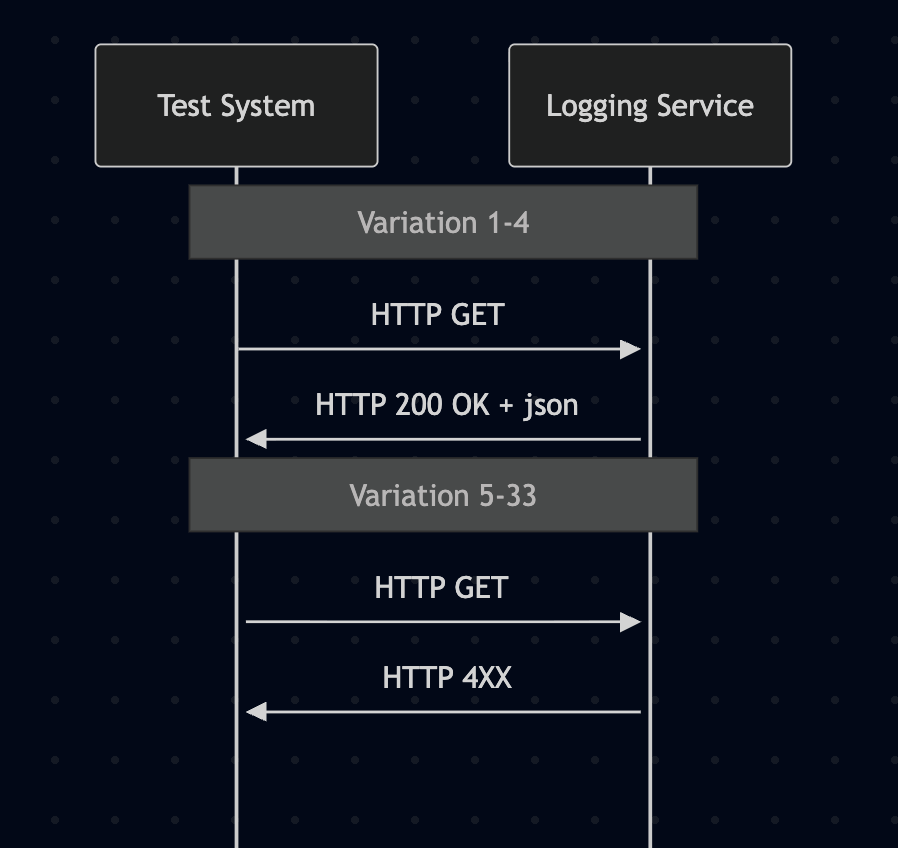

# Test Description: TD_LOG_010

## Overview
### Summary
Response for HTTP GET on /IncidentIds

### Description
Test covers Logging Service HTTP GET requests verification on /IncidentIds and sending a response

### References
* Requirements : RQ_LOG_045, RQ_LOG_047
* Test Case    : TC_LOG_010

### Requirements
IXIT config file for Logging Service

### HTTP transport types
Test can be performed with 2 different HTTP transport types. Steps describing actions for specific one are marked as following:
- (TLS) - used by default inside ESInet on production environment
- (TCP) - used if default TLS is not possible

## Configuration
### Implementation Under Test Interface Connections
<!-- Identify each of the FEs that are part of the configuration and how they are connected -->
* Logging Service (LOG)
  * IF_LOG_ESRP - connected to Test System ESRP IF_ESRP_LOG
* Test System ESRP
  * IF_ESRP_LOG - connected to IUT IF_LOG_ESRP

### Test System Interfaces
<!-- Identify each of the test system interfaces and whether it will be in active or monitor mode -->
* Logging Service (LOG)
  * IF_LOG_ESRP - Active
* Test System ESRP
  * IF_ESRP_LOG - Active
 
### Connectivity Diagram
<!--
[](https://mermaid.live/edit#pako:eNpdkEFPhDAQhf8KmTO7KbAW2hhPRmOCMZE9GZJNpbNAXCgpRUXCf3cETXbtad438-Y1M0FhNIKE48l8FJWyzkuf89aj93B32GeH9On-erO5IUEVgbXXD6-lVV3l7bF3Xjb2Dpu1c-FcEbb6nys1ZVm3pZehfa8LvHCex5ATfGjQNqrW9MnpB-fgKmwwB0mlVvYth7ydaU4NzmRjW4B0dkAfhk4rh7e1otDmD3aqfTGG5FGdetKoa2fs43qE5RbLDMgJPkEGId8GXAgRR0yIRMShDyNIohELWRAmQjAmgh2fffha1u62IeecxTEPoiRiV7EP1gxl9Rs4fwP4vG62)
-->


## Pre-Test Conditions
### Test System ESRP
* Interfaces are connected to network
* Interfaces have IP addresses assigned by DHCP
* Device is active
* ng911 repository cloned to local storage
* (TLS) Generated own PCA-signed certificate and private key files (test_system.crt, test_system.key)
* (TLS) Certificate and key used by Logging Service copied to local storage
* (TLS) PCA certificate copied to local storage

### Logging Service (LOG)
* Interfaces are connected to network
* Interfaces have IP addresses assigned by DHCP
* Default configuration is loaded
* IUT is initialized with steps from IXIT config file
* Device is active
* Device is in normal operating state

## Test Sequence

### Test Preamble

#### Test System ESRP
* Install Wireshark[^1]
* (TLS v1.2) Configure Wireshark to decode HTTP over TLS, use tests system and PS certificate keys [^2]
* (TLS v1.3) Configure logging of session keys and configure Wireshark to decode HTTP over TLS [^3]
* Using Wireshark on 'Test System' start packet tracing on IF_TS_PS interface - run following filter:
   * (TLS)
     > ip.addr == IF_ESRP_LOG_IP_ADDRESS and tls
   * (TCP)
     > ip.addr == IF_ESRP_LOG_IP_ADDRESS and http
* Prepare 3x copies of following JSON file:
    ```
    "CallStartLogEvent_object_example_v010.3f.3.0.1.json",
    ```
* Modify 1st file copy with values:
    ```
    "callId": "urn:emergency:uid:callid:0123456789qwerty:bcf.ng911.test",
    "incidentId": "urn:emergency:uid:incidentid:0123456789qwertyuiop:bcf.ng911.test",
    "startTime": "2025-02-27T12%3A58%3A01.01%2D05%3A00",
    "endTime": "2025-02-27T12%3A58%3A11.01%2D05%3A00"
    ```
* Modify 2nd file copy with values:
    ```
    "callId": "urn:emergency:uid:callid:9876543210qwerty:bcf.ng911.test",
    "incidentId": "urn:emergency:uid:incidentid:9876543210qwertyuiop:bcf.ng911.test",
    "startTime": "2025-02-27T12%3A48%3A01.01%2D05%3A00",
    "endTime": "2025-02-27T12%3A48%3A11.01%2D05%3A00"
    ```
* Modify 3rd file copy with values:
    ```
    "callId": "urn:emergency:uid:callid:9999999999qwerty:bcf.ng911.test",
    "incidentId": "urn:emergency:uid:incidentid:9999999999qwertyuiop:bcf.ng911.test",
    "startTime": "2025-02-27T12%3A38%3A01.01%2D05%3A00",
    "endTime": "2025-02-27T12%3A38%3A11.01%2D05%3A00"
    ```
* For all modified file copies generate JWS JSON, example command:
   * (TLS)
     > python3 -m main generate_jws CallStartLogEvent_object_example_v010.3f.3.0.1_copy1.json --cert cert.pem --key key.pem --output_file CallStartLogEvent_object_example_v010.3f.3.0.1_copy1_jws.json
   * (TCP)
     > python3 -m main generate_jws CallStartLogEvent_object_example_v010.3f.3.0.1_copy1.json --output_file CallStartLogEvent_object_example_v010.3f.3.0.1_copy1_jws.json
* Send HTTP POST to /LogEvents entrypoint of Logging Service with generated JWS object, example:
  * (TLSv1.2):
     > curl --cert test_system.crt --key test_system.key --cacert PCA.crt --tlsv1.2 -X POST https://IF_LOG_ESP_IP_ADDRESS:PORT/LogEvents -H "Content-Type: application/json" -d @CallStartLogEvent_object_example_v010.3f.3.0.1_copy1_jws.json`
  * (TLSv1.3):
     > curl --cert test_system.crt --key test_system.key --cacert PCA.crt --tlsv1.3 -X POST https://IF_LOG_ESP_IP_ADDRESS:PORT/LogEvents -H "Content-Type: application/json" -d @CallStartLogEvent_object_example_v010.3f.3.0.1_copy1_jws.json`
  * (TCP):
     > curl -X POST http://IF_LOG_ESP_IP_ADDRESS:PORT/LogEvents -H "Content-Type: application/json" -d @CallStartLogEvent_object_example_v010.3f.3.0.1_copy1_jws.json`
* Repeat last 6 steps above for each of following files:
    ```
    "CallSignalingMessageLogEvent_example_v010.3f.3.0.1.json",
    "CallEndLogEvent_object_example_v010.3f.3.0.1.json"
    ```

### Test Body

#### Variations
1. Validate 200 OK + JSON response for any correct request.

   Send request without optional parameters, example URL:
    
   ```
   LOGGING_SERVICE_FQDN_OR_IP:PORT/IncidentIds
   ```

2. Validate JSON response for request with valid startTime.

    Send request with additional startTime parameter, example URL:
    
    ```
    IF_LOG_TS_IP_ADDRESS:PORT/IncidentIds?startTime=2025-02-27T12%3A58%3A01.01%2D05%3A00
    ```

3. Validate JSON response for request with valid endTime.

    Send request with additional endTime parameter, example URL:
    
    ```
    IF_LOG_TS_IP_ADDRESS:PORT/IncidentIds?endTime=2025-02-27T12%3A58%3A11.01%2D05%3A00
    ```

4. Validate JSON response for request with valid startTime and endTime.

    Send request with additional startTime and endTime parameters, example URL:
    
    ```
    IF_LOG_TS_IP_ADDRESS:PORT/IncidentIds?startTime=2025-02-27T12%3A58%3A01.01%2D05%3A00?endTime=2025-02-27T12%3A58%3A11.01%2D05%3A00
    ```

5. Validate 4xx error response for request with incorrect 'limit' parameter (send string).

    Send request with example URL:
    
    ```
    LOGGING_SERVICE_FQDN_OR_IP:PORT/IncidentIds?limit=test
    ```
6. Validate 4xx error response for request with incorrect 'limit' parameter (send empty).

    Send request with example URL:
    
    ```
    LOGGING_SERVICE_FQDN_OR_IP:PORT/IncidentIds?limit=
    ```

7. Validate 4xx error response for request with incorrect 'limit' parameter (send space).

    Send request with example URL:
    
    ```
    LOGGING_SERVICE_FQDN_OR_IP:PORT/IncidentIds?limit=%20
    ```

8. Validate 4xx error response for request with incorrect 'limit' parameter (send value exceeding 64bit unsigned int).

    Send request with example URL:
    
    ```
    LOGGING_SERVICE_FQDN_OR_IP:PORT/IncidentIds?limit=18446744073709551616
    ```

9. Validate 4xx error response for request with incorrect 'limit' parameter (send negative value exceeding 64bit int).

    Send request with example URL:
    
    ```
    LOGGING_SERVICE_FQDN_OR_IP:PORT/IncidentIds?limit=-9223372036854775809
    ```

10. Validate 4xx error response for request with incorrect 'start' parameter (send string).

     Send request with example URL:
    
     ```
     LOGGING_SERVICE_FQDN_OR_IP:PORT/IncidentIds?start=test
     ```
11. Validate 4xx error response for request with incorrect 'start' parameter (send empty).

     Send request with example URL:
    
     ```
     LOGGING_SERVICE_FQDN_OR_IP:PORT/IncidentIds?start=
     ```

12. Validate 4xx error response for request with incorrect 'start' parameter (send space).

     Send request with example URL:
    
     ```
     LOGGING_SERVICE_FQDN_OR_IP:PORT/IncidentIds?start=%20
     ```

13. Validate 4xx error response for request with incorrect 'start' parameter (send value exceeding 64bit unsigned int).

     Send request with example URL:
    
     ```
     LOGGING_SERVICE_FQDN_OR_IP:PORT/IncidentIds?start=18446744073709551616
     ```

14. Validate 4xx error response for request with incorrect 'start' parameter (send value less than 1).

    Send request with example URL:
    
    ```
    LOGGING_SERVICE_FQDN_OR_IP:PORT/IncidentIds?start=0
    ```

15. Validate 4xx error response for request with incorrect 'startTime' parameter (send space)

    Send request with example URL:
    
    ```
    LOGGING_SERVICE_FQDN_OR_IP:PORT/IncidentIds?startTime=%20
    ```

16. Validate 4xx error response for request with incorrect 'startTime' parameter (send with incorrect year '20155-08-21T12:58:03.01-05:00')

    Send request with example URL:
    
    ```
    LOGGING_SERVICE_FQDN_OR_IP:PORT/IncidentIds?startTime=20155-08-21T12%3A58%3A03.01%2D05%3A00
    ```

17. Validate 4xx error response for request with incorrect 'startTime' parameter (send with incorrect month '2015-13-21T12:58:03.01-05:00')

    Send request with example URL:
    
    ```
    LOGGING_SERVICE_FQDN_OR_IP:PORT/IncidentIds?startTime=2015-13-21T12%3A58%3A03.01%2D05%3A00
    ```

18. Validate 4xx error response for request with incorrect 'startTime' parameter (send with incorrect day '2015-12-32T12:58:03.01-05:00')

    Send request with example URL:
    
    ```
    LOGGING_SERVICE_FQDN_OR_IP:PORT/IncidentIds?startTime=2015-12-32T12%3A58%3A03.01%2D05%3A00
    ```

19. Validate 4xx error response for request with incorrect 'startTime' parameter (send with incorrect hour '2015-12-21T24:58:03.01-05:00')

    Send request with example URL:
    
    ```
    LOGGING_SERVICE_FQDN_OR_IP:PORT/IncidentIds?startTime=2015-12-21T24%3A58%3A03.01%2D05%3A00
    ```

20. Validate 4xx error response for request with incorrect 'startTime' parameter (send with incorrect minutes '2015-12-21T12:60:03.01-05:00')

    Send request with example URL:
    
    ```
    LOGGING_SERVICE_FQDN_OR_IP:PORT/IncidentIds?startTime=2015-12-21T12%3A60%3A03.01%2D05%3A00
    ```

21. Validate 4xx error response for request with incorrect 'startTime' parameter (send with incorrect seconds '2015-12-21T12:58:61.01-05:00')

    Send request with example URL:
    
    ```
    LOGGING_SERVICE_FQDN_OR_IP:PORT/IncidentIds?startTime=2015-12-21T12%3A58%3A61.01%2D05%3A00
    ```

22. Validate 4xx error response for request with incorrect 'startTime' parameter (send with exceeded time offset '2015-12-21T12:58:03.01-13:00')

    Send request with example URL:
    
    ```
    LOGGING_SERVICE_FQDN_OR_IP:PORT/IncidentIds?startTime=2015-12-21T12%3A58%3A61.01%2D13%3A00
    ```

23. Validate 4xx error response for request with incorrect 'startTime' parameter (send incorrect day in February '2015-02-30T12:58:03.01-05:00')

    Send request with example URL:
    
    ```
    LOGGING_SERVICE_FQDN_OR_IP:PORT/IncidentIds?startTime=2015-02-30T12%3A58%3A61.01%2D05%3A00
    ```

24. Validate 4xx error response for request with incorrect 'endTime' parameter (send space)

    Send request with example URL:
    
    ```
    LOGGING_SERVICE_FQDN_OR_IP:PORT/IncidentIds?endTime=%20
    ```

25. Validate 4xx error response for request with incorrect 'endTime' parameter (send with incorrect year '20155-08-21T12:58:03.01-05:00')

    Send request with example URL:
    
    ```
    LOGGING_SERVICE_FQDN_OR_IP:PORT/IncidentIds?endTime=20155-08-21T12%3A58%3A03.01%2D05%3A00
    ```

26. Validate 4xx error response for request with incorrect 'endTime' parameter (send with incorrect month '2015-13-21T12:58:03.01-05:00')

    Send request with example URL:
    
    ```
    LOGGING_SERVICE_FQDN_OR_IP:PORT/IncidentIds?endTime=2015-13-21T12%3A58%3A03.01%2D05%3A00
    ```

27. Validate 4xx error response for request with incorrect 'endTime' parameter (send with incorrect day '2015-12-32T12:58:03.01-05:00')

    Send request with example URL:
    
    ```
    LOGGING_SERVICE_FQDN_OR_IP:PORT/IncidentIds?endTime=2015-12-32T12%3A58%3A03.01%2D05%3A00
    ```

28. Validate 4xx error response for request with incorrect 'endTime' parameter (send with incorrect hour '2015-12-21T24:58:03.01-05:00')

    Send request with example URL:
    
    ```
    LOGGING_SERVICE_FQDN_OR_IP:PORT/IncidentIds?endTime=2015-12-21T24%3A58%3A03.01%2D05%3A00
    ```

29. Validate 4xx error response for request with incorrect 'endTime' parameter (send with incorrect minutes '2015-12-21T12:60:03.01-05:00')

    Send request with example URL:
    
    ```
    LOGGING_SERVICE_FQDN_OR_IP:PORT/IncidentIds?endTime=2015-12-21T12%3A60%3A03.01%2D05%3A00
    ```

30. Validate 4xx error response for request with incorrect 'endTime' parameter (send with incorrect seconds '2015-12-21T12:58:61.01-05:00')

    Send request with example URL:
    
    ```
    LOGGING_SERVICE_FQDN_OR_IP:PORT/IncidentIds?endTime=2015-12-21T12%3A58%3A61.01%2D05%3A00
    ```

31. Validate 4xx error response for request with incorrect 'endTime' parameter (send with exceeded time offset '2015-12-21T12:58:03.01-13:00')

    Send request with example URL:
    
    ```
    LOGGING_SERVICE_FQDN_OR_IP:PORT/IncidentIds?endTime=2015-12-21T12%3A58%3A61.01%2D13%3A00
    ```

32. Validate 4xx error response for request with incorrect 'endTime' parameter (send incorrect day in February '2015-02-30T12:58:03.01-05:00')

    Send request with example URL:
    
    ```
    LOGGING_SERVICE_FQDN_OR_IP:PORT/IncidentIds?endTime=2015-02-30T12%3A58%3A61.01%2D05%3A00
    ```

33. **Validate 4xx error response for request with incorrect 'area' parameter.**

    Send request with 'area' which is a string without PIDF-LO object, example URL:
    
    `LOGGING_SERVICE_FQDN_OR_IP:PORT/IncidentIds?area=test`

#### Stimulus
Send HTTP GET to /IncidentIds entrypoint of Logging Service:

- (TLSv1.2):
  
  `curl --cert test_system.crt --key test_system.key --cacert PCA.crt --tlsv1.2 -X GET https://URL`

- (TLSv1.3):
  
  `curl --cert test_system.crt --key test_system.key --cacert PCA.crt --tlsv1.3 -X GET https://URL`

- (TCP):
  
  `curl -X GET http://URL`

#### Response
* Variations 1-4
  Logging Service responds with 200 OK with JSON body containing:
- 'IncidentIdArray' which is an array with:
    - 'count' which is integer
    - 'totalCount' which is integer
    - 'incidentIds' which an array with zero or more entries
    - each element in 'incidentIds' must be a string in correct Incident Identifier format (example: `urn:emergency:uid:incidentid:a56e556d871:bcf.state.pa.us`):
        - must contain `urn:emergency:uid:incidentid` at the beginning
        - then after `:` must contain 10 to 36 alphanumeric unique string ID
        - then after `:` must contain correct FQDN
* Variation 5-33
  Logging Service responds with 4xx error message


VERDICT:
* PASSED - if Logging Service responded as expected
* FAILED - any other cases


### Test Postamble
#### Test System ESRP
* stop Wireshark (if still running)
* archive all logs generated
* disconnect interfaces from IUT
* (TLS) remove certificates

#### Logging Service
* disconnect interfaces from Test System
* reconnect interfaces back to default

## Post-Test Conditions
### Test System ESRP
* Test tools stopped
* interfaces disconnected from IUT

### Logging Service
* device connected back to default
* device in normal operating state

## Sequence Diagram
<!--
https://mermaid.live/edit#pako:eNq1kt1LwzAUxf-VcF_XjjRdP5aHgago-AkrMqQvob3roiaZaTqcY_-7bbe5oY9inpJwfodzOXcDhSkROPi-n-vC6LmseK4JUdJaY88KZ2zNyVy81ZjrXlTje4O6wAspKitUJ96de-OQmBVakmHtyHRdO1QeuTVVJXVFpmhXskBOnoSVwkmjSXCETxB_Mhn8gq6z7JFcXWZH4oeko05M9gSjlDzckAF5qY3-S1Tmh_Tf045mM_BAoVVClm0pm47PwS1QYQ68vZbCvuaQ622rE40z07UugDvboAfWNNUCeN-VB82yFO5Q0vfvUuhnY9QBwVK2Bd_tVqDfhF4CfAMfwFkQDVkYsJSORwkN2qcHa-CjZBjESRjH4TikccDirQefvSkdRiyKGEtomo5ZyljoQWW7UfYJUZdoz02jXevO2PYLC1nG4Q
-->




## Comments

Version:  010.3f.5.0.2

Date:     20260204

## Footnotes
[^1]: Wireshark - tool for packet tracing and anaylisis. Official website: https://www.wireshark.org/download.html
[^2]: Wireshark configuration to decrypt TLS packets: https://www.zoiper.com/en/support/home/article/162/How%20to%20decode%20SIP%20over%20TLS%20with%20Wireshark%20and%20Decrypting%20SDES%20Protected%20SRTP%20Stream
[^3]: TLS v1.3 session keys logging + Wireshark configuration to decrypt traffic: https://my.f5.com/manage/s/article/K50557518
