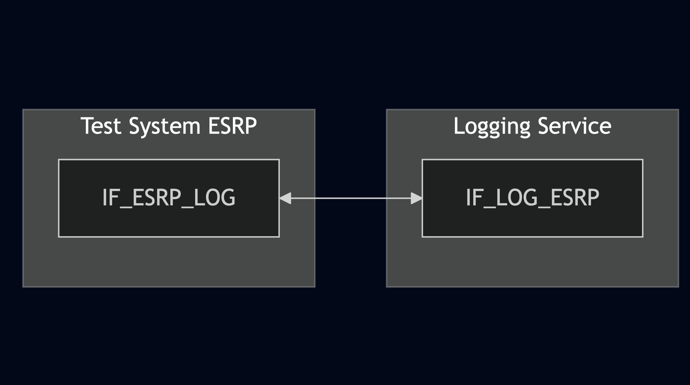
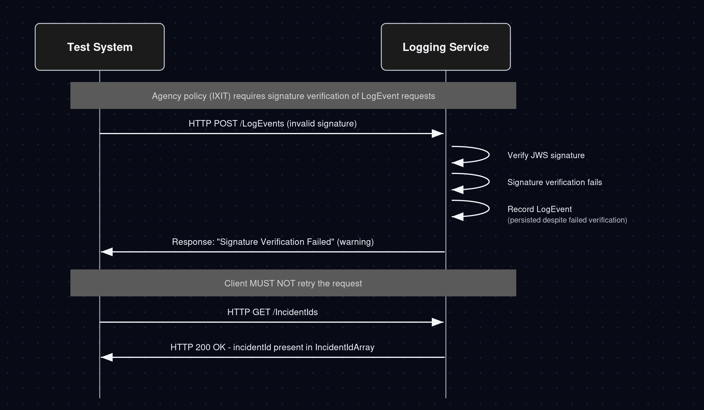

# Test Description: TD_LOG_011

## Overview
### Summary
Response for HTTP POST on /LogEvents with a LogEvent whose signature fails verification

### Description
Test covers a LogEvent with a failed signature: Logging Service must return "Signature
Verification Failed" as a warning, still record the event, and not trigger a client retry.

### References
* Requirements : RQ_LOG_197, RQ_LOG_198
* Test Case    : TC_LOG_011

### Requirements
IXIT config file for Logging Service

### HTTP transport types
Test can be performed with 2 different HTTP transport types. Steps describing actions for specific one are marked as following:
- (TLS) - used by default inside ESInet on production environment
- (TCP) - used if default TLS is not possible

## Configuration
### Implementation Under Test Interface Connections
<!-- Identify each of the FEs that are part of the configuration and how they are connected -->
* Logging Service (LOG)
  * IF_LOG_ESRP - connected to Test System ESRP IF_ESRP_LOG
* Test System ESRP
  * IF_ESRP_LOG - connected to IUT IF_LOG_ESRP

### Test System Interfaces
<!-- Identify each of the test system interfaces and whether it will be in active or monitor mode -->
* Logging Service (LOG)
  * IF_LOG_ESRP - Active
* Test System ESRP
  * IF_ESRP_LOG - Active

### Connectivity Diagram
<!--
[](https://mermaid.live/edit#pako:eNpdUV1rg0AQ_CvHPhvRi6fJUfrSLwqWltinIoSrblQa7-Q821rxv_dU0pLs08zszs7CDpCpHIHD4ai-slJoQ-JdKomtx_v9XbJ72cfPD1er1bWlFs3S0m-790KLpiSv2BqS9K3Bmvy3L1YsIsr8whyroqhkQRLUn1WGZ97zPOsFBwpd5cCN7tCBGnUtJgrDNJKCKbHGFLiFudAfKaRytJ5GyDel6pNNq64ogR_EsbWsa3Jh8LYS9p76T9U2DfWN6qQB7ofreQnwAb6BM7Z1Q-ozz1_T0A8pc6CfhgKX-p6tiAUbj1I2OvAzx3puEHmbkEU0tGAbRDRyQHRGJb3MTldhXhmln5ZvzE8ZfwHwG3xC)
-->



## Pre-Test Conditions
### Test System ESRP
* Interfaces are connected to network
* Interfaces have IP addresses assigned by DHCP
* Device is active
* ng911 repository cloned to local storage
* (TLS) Generated own PCA-signed certificate and private key files (test_system.crt, test_system.key)
* (TLS) Generated a second, untrusted certificate and private key files not signed by the PCA
  (untrusted_test_system.crt, untrusted_test_system.key) - used to produce an invalid signature
* (TLS) Certificate and key used by Logging Service copied to local storage
* (TLS) PCA certificate copied to local storage

### Logging Service (LOG)
* Interfaces are connected to network
* Interfaces have IP addresses assigned by DHCP
* Default configuration is loaded
* IUT is initialized with steps from IXIT config file
* Agency policy is configured (per IXIT) to require signature verification of LogEvent requests
* Logging Service supports signed LogEvent JWS
* Logging Service is configured to verify JWS signatures
* Device is active
* Device is in normal operating state

## Test Sequence

### Test Preamble

#### Test System ESRP
* Install Wireshark[^1]
* (TLS v1.2) Configure Wireshark to decode HTTP over TLS, use test system and Logging Service certificate keys [^2]
* (TLS v1.3) Configure logging of session keys and configure Wireshark to decode HTTP over TLS [^3]
* Using Wireshark on 'Test System' start packet tracing on IF_ESRP_LOG interface - run following filter:
   * (TLS)
     > ip.addr == IF_ESRP_LOG_IP_ADDRESS and tls
   * (TCP)
     > ip.addr == IF_ESRP_LOG_IP_ADDRESS and http
* Prepare the following JSON files:
    ```
    "CallStartLogEvent_object_example_v010.3f.3.0.1.json",
    "CallSignalingMessageLogEvent_example_v010.3f.3.0.1.json",
    "CallEndLogEvent_object_example_v010.3f.3.0.1.json"
    ```
* Modify 1st file copy (CallStartLogEvent) with values:
    ```
    "callId": "urn:emergency:uid:callid:1111111111qwerty:bcf.ng911.test",
    "incidentId": "urn:emergency:uid:incidentid:1111111111qwertyuiop:bcf.ng911.test",
    "timestamp": "2025-02-27T13:08:01.01-05:00"
    ```
* Modify 2nd file copy (CallSignalingMessageLogEvent) with values:
    ```
    "callId": "urn:emergency:uid:callid:2222222222qwerty:bcf.ng911.test",
    "incidentId": "urn:emergency:uid:incidentid:2222222222qwertyuiop:bcf.ng911.test",
    "timestamp": "2025-02-27T13:18:01.01-05:00"
    ```
* Modify 3rd file copy (CallEndLogEvent) with values:
    ```
    "callId": "urn:emergency:uid:callid:3333333333qwerty:bcf.ng911.test",
    "incidentId": "urn:emergency:uid:incidentid:3333333333qwertyuiop:bcf.ng911.test",
    "timestamp": "2025-02-27T13:28:01.01-05:00"
    ```
* For 1st file copy, generate a valid JWS JSON signed with the trusted test system certificate,
  then alter one payload field (e.g. `timestamp`) after signing so the payload no longer matches
  the signature (tampered-payload case), example command:
    > python3 -m main generate_jws CallStartLogEvent_object_example_v010.3f.3.0.1_copy1.json --cert test_system.crt --key test_system.key --output_file CallStartLogEvent_object_example_v010.3f.3.0.1_copy1_jws.json
* For 2nd file copy, generate a JWS JSON signed with the untrusted certificate/key
  (i.e. a certificate/key not signed by the PCA, e.g. self-signed)
  (untrusted_test_system.crt, untrusted_test_system.key), example command:
    > python3 -m main generate_jws CallSignalingMessageLogEvent_example_v010.3f.3.0.1_copy2.json --cert untrusted_test_system.crt --key untrusted_test_system.key --output_file CallSignalingMessageLogEvent_example_v010.3f.3.0.1_copy2_jws.json
* For 3rd file copy, generate a valid JWS JSON signed with the trusted test system certificate,
  then corrupt/truncate the resulting JWS signature segment (invalid-signature-value case),
  example command:
    > python3 -m main generate_jws CallEndLogEvent_object_example_v010.3f.3.0.1_copy3.json --cert test_system.crt --key test_system.key --output_file CallEndLogEvent_object_example_v010.3f.3.0.1_copy3_jws.json
    (then manually corrupt the signature segment of the resulting JWS before sending)

## Test Body

### Variations
1. **Validate warning response for LogEvent request with a tampered payload (signature does
   not match content).**

   Send HTTP POST to /LogEvents with the tampered-payload JWS object (1st file copy).

2. **Validate warning response for LogEvent request signed with a certificate not trusted by
   the Logging Service's configured PCA/CA.**

   Send HTTP POST to /LogEvents with the untrusted-certificate JWS object (2nd file copy).

3. **Validate warning response for LogEvent request with a corrupted/invalid JWS signature
   value.**

   Send HTTP POST to /LogEvents with the corrupted-signature JWS object (3rd file copy).

### Stimulus
Send HTTP POST to /LogEvents entrypoint of Logging Service with the applicable JWS object,
example:

- (TLSv1.2):

  `curl --cert test_system.crt --key test_system.key --cacert PCA.crt --tlsv1.2 -X POST https://IF_LOG_ESRP_IP_ADDRESS:PORT/LogEvents -H "Content-Type: application/json" -d @<jws_file>`

- (TLSv1.3):

  `curl --cert test_system.crt --key test_system.key --cacert PCA.crt --tlsv1.3 -X POST https://IF_LOG_ESRP_IP_ADDRESS:PORT/LogEvents -H "Content-Type: application/json" -d @<jws_file>`
- (TCP):

  `curl -X POST http://IF_LOG_ESRP_IP_ADDRESS:PORT/LogEvents -H "Content-Type: application/json" -d @<jws_file>`

After receiving the response, send HTTP GET to /IncidentIds entrypoint of Logging Service to
confirm the LogEvent was recorded despite the signature verification failure, example:

- (TLSv1.2):

  `curl --cert test_system.crt --key test_system.key --cacert PCA.crt --tlsv1.2 -X GET https://IF_LOG_ESRP_IP_ADDRESS:PORT/IncidentIds`

- (TLSv1.3):

  `curl --cert test_system.crt --key test_system.key --cacert PCA.crt --tlsv1.3 -X GET https://IF_LOG_ESRP_IP_ADDRESS:PORT/IncidentIds`
- (TCP):

  `curl -X GET http://IF_LOG_ESRP_IP_ADDRESS:PORT/IncidentIds`

### Response
* Variations 1-3

  Logging Service responds with a "Signature Verification Failed" status code reported as a
  **warning**, not an error:
  - response uses HTTP status code 434 ("Signature Verification Failure"), reported as a
    warning rather than an error result that would signal the client to retry
  - response body/result identifies the condition as "Signature Verification Failed" at
    warning severity
  - the LogEvent is nonetheless recorded by the Logging Service: the GET /IncidentIds
    response includes the incidentId corresponding to the sent LogEvent

VERDICT:
* PASSED - if Logging Service responded as expected for all 3 variations
* FAILED - any other cases

### Test Postamble
#### Test System ESRP
* stop Wireshark (if still running)
* archive all logs generated
* disconnect interfaces from IUT
* (TLS) remove certificates

#### Logging Service
* disconnect interfaces from Test System
* reconnect interfaces back to default

## Post-Test Conditions
### Test System ESRP
* Test tools stopped
* interfaces disconnected from IUT

### Logging Service
* device connected back to default
* device in normal operating state

## Sequence Diagram
<!--
[
-->



## Comments

Version:  011.3f.5.0.2

Date:     20260820

## Footnotes
[^1]: Wireshark - tool for packet tracing and analysis. Official website: https://www.wireshark.org/download.html
[^2]: Wireshark configuration to decrypt TLS packets: https://www.zoiper.com/en/support/home/article/162/How%20to%20decode%20SIP%20over%20TLS%20with%20Wireshark%20and%20Decrypting%20SDES%20Protected%20SRTP%20Stream
[^3]: TLS v1.3 session keys logging + Wireshark configuration to decrypt traffic: https://my.f5.com/manage/s/article/K50557518
