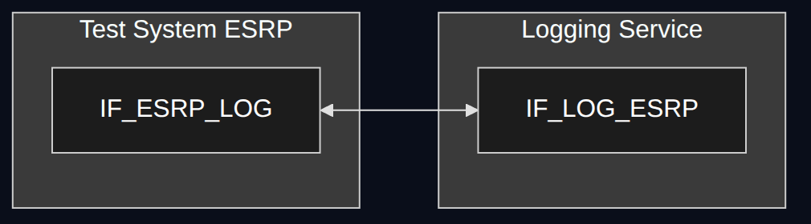
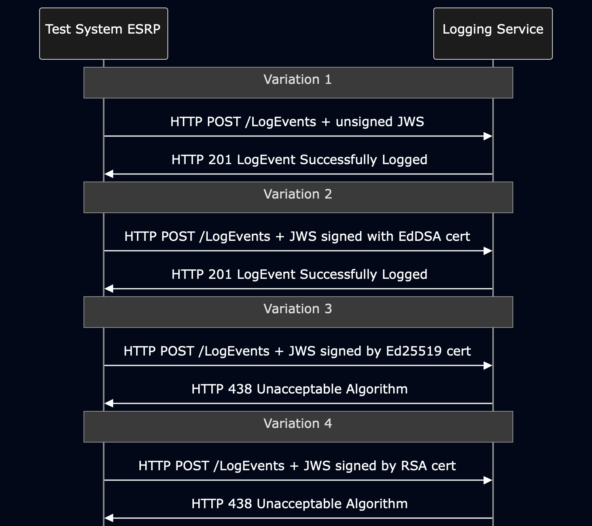

# Test Description: TD_LOG_012

## Overview
### Summary
Handling unsigned and signed LogEvents

### Description
This test verifies if Logging Service supports unsigned LogEvent JWS and signed only by Edwards-curve Digital Signature Algorithm (ECDSA) with
Curve448 (algorithm “EdDSA”)

### References
* Requirements : RQ_LOG_195
* Test Case    : TC_LOG_012

### Requirements
IXIT config file for Logging Service

### HTTP transport types
Test can be performed with 2 different HTTP transport types. Steps describing actions for specific one are marked as following:
- (TLS) - used by default inside ESInet on production environment
- (TCP) - used if default TLS is not possible

## Configuration
### Implementation Under Test Interface Connections
<!-- Identify each of the FEs that are part of the configuration and how they are connected -->
* Logging Service (LOG)
  * IF_LOG_ESRP - connected to Test System ESRP IF_ESRP_LOG
* Test System ESRP
  * IF_ESRP_LOG - connected to IUT IF_LOG_ESRP

### Test System Interfaces
<!-- Identify each of the test system interfaces and whether it will be in active or monitor mode -->
* Logging Service (LOG)
  * IF_LOG_ESRP - Active
* Test System ESRP
  * IF_ESRP_LOG - Active

### Connectivity Diagram
<!--
[](https://mermaid.live/edit#pako:eNqVlFFv2jAQx7-K5Ym3IJXtZULTpLEOhBSNqVS81BU6kiN4JDZznK4I8d2nEKA-46Ra_Ob73_0vPvt34IlOkQ95r3eQStohOwhuN1ig4EMmeApmK3jEzpsLMBJWOZZ19CD4CpJtZnSl0kb-4Q7ucABNxs7IAsz-u861OYc_Qb1I-BFfrStZnz4iGWmTonFFybpejajERKvUMxok9fIEvhXe1csTdZtZNFZ2eF3iXVYXTbdTLhW2V2g_swKkGm2zQG9Kp9h4BuySvCotmrdMd1SXYFsyphnGsMJ81HUfILHahFtrQm3lT9Gue3ISxN6BfYZ6nacrMwV5W3oT7TLITz-nX0fbrG3yV0n3VGtVp5PWu67Lo7RFrwt3UnX43fSbDt2jgsTKF7BSqw4bR_TO2_xToUrwZ1WsqMq9GGut7BgKme-b4D3-hkXF5qDKiC3QpKAgYt-MhDxiJaiyX6KRa8GPR3bs9YRa5_pvsgFjWfwgFGOMldUqM7DbsB_zh19Pgj9iadl8X1osTluCPzfC-puOB0-CT8fLOrKMZ5NrFFXq1YtnkyfBY51lUmVsjuZFJuhV-9hUi2eTJfG6VpuOB-xLv_-11grFI16gKUCmfMgd_F7pG4Cvz173RG_I6w4vyF33DrZQ1x1sgLnuY2ghrnsTW3lLbXzaUpcQa6lJmLTUw-Wsn912Qm-MpR0RwlIbwlc6EJ-uNDHMVjpvh6y0IcpVWviGqvQfb5jqcsInKk295SmNB2hK2w6z1JubT1LPw-MoHa1HUToPn6GBVL8v52CC_KQGbfT031iInXTwhJz_BU4ecaisnu9VwofWVBjxapeCxXsJmYGi2Tz-A1tbRUk)
-->



## Pre-Test Conditions

### Test System ESRP
* Interfaces are connected to network
* Interfaces have IP addresses assigned by DHCP
* Device is active
* ng911 repository cloned to local storage
* TLS Generated own PCA-signed certificate and private key files (test_system.crt, test_system.key)
* (TLS) Certificate and key used by Logging Service copied to local storage
* TLS PCA certificate copied to local storage

### Logging Service (LOG)
* Interfaces are connected to network
* Interfaces have IP addresses assigned by DHCP
* Default configuration is loaded
* IUT is initialized with steps from IXIT config file
* Device is active
* Device is in normal operating state

## Test Sequence

### Test Preamble

#### Test System ESRP
* Install Wireshark[^1]
* (TLS v1.2) Configure Wireshark to decode HTTP over TLS, use test system and Logging Service certificate keys [^2]
* (TLS v1.3) Configure logging of session keys and configure Wireshark to decode HTTP over TLS [^3]
* Using Wireshark on 'Test System' start packet tracing on IF_ESRP_LOG interface - run following filter:
   * (TLS)
     > ip.addr == IF_ESRP_LOG_IP_ADDRESS and tls
   * (TCP)
     > ip.addr == IF_ESRP_LOG_IP_ADDRESS and http
* Make a 4x copies (1x for each variation) and rename to e.g. `LogEvent_var1.json`, `LogEvent_var2.json` etc. Use following JSON source file:
    ```
    "CallStartLogEvent_object_example_v010.3f.3.0.1.json",
    ```
* Modify `callId` for each of the copy, use unique callid values, e.g.:
    ```
    "callId": "urn:emergency:uid:callid:123456789var1:esrp.ng911.test",
    ```
* Modify `incidentId` for each of the copy, use unique incidentid values, e.g.:
    ```
    "incidentId": "urn:emergency:uid:incidentid:123456789var1:esrp.ng911.test",
    ```
* Modify `callIdSip` for each of the copy, use unique Call-ID values, e.g.:
    ```
    "callIdSip": "123456789var1@esrp.ng911.test",
    ```
* Generate EdDSA certificate for Test System ESRP signed by the PCA certificate, e.g.:
  1. `openssl genpkey -algorithm Ed448 -out eddsa.key`
  2. `openssl req -new -key eddsa.key -out eddsa.csr -subj "/C=PL/ST=Dolnoslaskie/L=Wroclaw/O=NG911/OU=Operations/CN=esrp.ng911.test"`
  3. `openssl x509 -req -in eddsa.csr -CA PCA.crt -CAkey PCA.key -CAcreateserial -out eddsa.crt -days 1`

* Generate Ed25519 certificate for Test System ESRP signed by the PCA certificate, e.g.:
  1. `openssl genpkey -algorithm Ed25519 -out ed25519.key`
  2. `openssl req -new -key ed25519.key -out ed25519.csr -subj "/C=PL/ST=Dolnoslaskie/L=Wroclaw/O=NG911/OU=Operations/CN=esrp.ng911.test"`
  3. `openssl x509 -req -in ed25519.csr -CA PCA.crt -CAkey PCA.key -CAcreateserial -out ed25519.crt -days 1`

* Generate RSA certificate for Test System ESRP signed by the PCA certificate, e.g.:
  1. `openssl genrsa -out rsa.key 2048`
  2. `openssl req -new -key rsa.key -out rsa.csr -sha256 -subj "/C=PL/ST=Dolnoslaskie/L=Wroclaw/O=NG911/OU=Operations/CN=esrp.ng911.test"`
  3. `openssl x509 -req -in rsa.csr -CA PCA.crt -CAkey PCA.key -CAcreateserial -out rsa.crt -days 1 -sha256`

* Variation 1 - generate unsigned LogEvent JWS 
    ```
    python3 -m main generate_jws LogEvent_var1.json --output_file JWS_var1.json
    ```
* Variation 2 - generate LogEvent JWS signed with a EdDSA Curve448 certificate 
    ```
    python3 -m main generate_jws LogEvent_var2.json --output_file JWS_var2.json --cert_path eddsa.crt --cert_key eddsa.key
    ```
* Variation 3 - generate LogEvent JWS signed with a Ed25519 certificate 
    ```
    python3 -m main generate_jws LogEvent_var3.json --output_file JWS_var3.json --cert_path ed25519.crt --cert_key ed25519.key --disable_eddsa_checks
    ```
* Variation 4 - generate LogEvent JWS signed with a RSA certificate 
    ```
    python3 -m main generate_jws LogEvent_var4.json --output_file JWS_var4.json --cert_path rsa.crt --cert_key rsa.key --disable_eddsa_checks
    ```

## Test Body

### Variations

1. Unsigned LogEvent

    Use JWS file `JWS_var1.json` generated in Preamble steps

2. LogEvent signed with EdDSA certificate (EdDSA Curve448)

    Use JWS file `JWS_var2.json` generated in Preamble steps

3. LogEvent signed with Ed25519 certificate (EdDSA Curve25519)

    Use JWS file `JWS_var3.json` generated in Preamble steps

4. LogEvent signed with RSA certificate

    Use JWS file `JWS_var4.json` generated in Preamble steps


### Stimulus
Send HTTP POST to /LogEvents entrypoint of Logging Service with the applicable object,
example:

- (TLSv1.2):

  `curl --cert test_system.crt --key test_system.key --cacert PCA.crt --tlsv1.2 -X POST https://IF_LOG_ESRP_IP_ADDRESS:PORT/LogEvents -H "Content-Type: application/json" -d @JWS_FILE`

- (TLSv1.3):

  `curl --cert test_system.crt --key test_system.key --cacert PCA.crt --tlsv1.3 -X POST https://IF_LOG_ESRP_IP_ADDRESS:PORT/LogEvents -H "Content-Type: application/json" -d @JWS_FILE`
- (TCP):

  `curl -X POST http://IF_LOG_ESRP_IP_ADDRESS:PORT/LogEvents -H "Content-Type: application/json" -d @JWS_FILE`


### Response

* Variations 1-2 - Logging Service responds with HTTP 201 LogEvent Sucessfully Logged
* Variations 3-4 - Logging Service responds with HTTP 4xx error message (most likely HTTP 438 Unacceptable Algorithm)

VERDICT:
* PASSED - if Logging Service responded as expected for all 4 variations
* FAILED - any other cases

### Test Postamble
#### Test System ESRP
* stop all HTTP client processes (if still running)
* stop Wireshark (if still running)
* archive traced packets in Wireshark
* archive all logs generated
* disconnect interfaces from IUT
* (TLS) remove certificates

#### Logging Service
* disconnect interfaces from Test System
* reconnect interfaces back to default

## Post-Test Conditions
### Test System ESRP
* Test tools stopped
* interfaces disconnected from IUT

### Logging Service
* device connected back to default
* device in normal operating state

## Sequence Diagram
<!--
https://mermaid.live/edit#pako:eNqdltFu2jAUhl_F8i4XuoSEArmoRFe2aWJt1bBOmrgxySH1mtjMdhgM8e6zHdIx0pKs-Abs75z_t3Ny8BbHPAEc4k6nM2MxZwuahjOGUE6F4GIUKy5kiBYkkzBjFpLwswAWwxUlqSC5gRFaEqFoTJeEKTSO7m4RkWgKUqFoIxXkdq5OTm4-GnDC05SyFEUgVjTWOiV5zRUgvgJhox1Dh-ieCEoU5Qx5JWXWOhcXdvHTdHqLbm-iKXqnc45XwJREb1HBJE0ZJOjzt6gM0rSOMaH7oK7roSoERUUcg5SLIss21hwkLT11W3vSVtDe1S-qHtA4uYpGKAahXu3QhLVy6b_G5XyjPXZ7PW94ymXgD9BXRrS7pSLzDNAoS7nQG8z_w1_wSn93p0-wyRt2cCpogkMlCnBwDiIn5ifemvUZVg-QwwyH-mtCxOMMOwfz1r1OKg2w3W8Wz0n8mApesKSMe-MSFzyyDzXEUtCciM17nnGxZ3xiRp2Zwlodcgv7qXOXXCQgDsl4YcYBKUG_6smRrheb8Rx1rAyuGc-RLbSVfkK0SbqCGpUrsIVwRhk05Go4YF0P7PIxfck006209PGShTgrdDsUf3PUnnVFnEwDSQoTMofssrG-iOngJzyX6yfVLNJYfJaaHB3xgJhxWCj6ZSXZyUQl0qiX2f3ztd7byUp64loUiEGbhTlfNpYl0x3uyFntURumXaKa9dq56tOnK9s9m1QPyDZ9ovyvvy7y-b9ordAWnKkPJKfZpiSu4Ae5L1BEmHTQPYiEMOKgke6SmYOknu1IEFSLmQS7Gdvp9qsvBd85z6sOrAs7fcChvXw4uFgmRFW3jqdZAcxuomAKh57v-zYLDrd4jcOuPzjz3CBwh67X9_vB8NzBG415vTNvGPi94Hzg6cnznYN_W133rNcPBoO-PwyGbk-H6XSkUDzasLhyBQnVlf6lvDbZ21PlbWxX9tZ2fwDoJeKV
-->



## Comments

Version:  010.3d.5.0.0

Date:     20260907

## Footnotes
[^1]: Wireshark - tool for packet tracing and anaylisis. Official website: https://www.wireshark.org/download.html
[^2]: Wireshark configuration to decrypt SIP over TLS packets: https://www.zoiper.com/en/support/home/article/162/How%20to%20decode%20SIP%20over%20TLS%20with%20Wireshark%20and%20Decrypting%20SDES%20Protected%20SRTP%20Stream
[^3]: TLS v1.3 session keys logging + Wireshark configuration to decrypt traffic: https://my.f5.com/manage/s/article/K50557518
