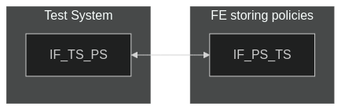
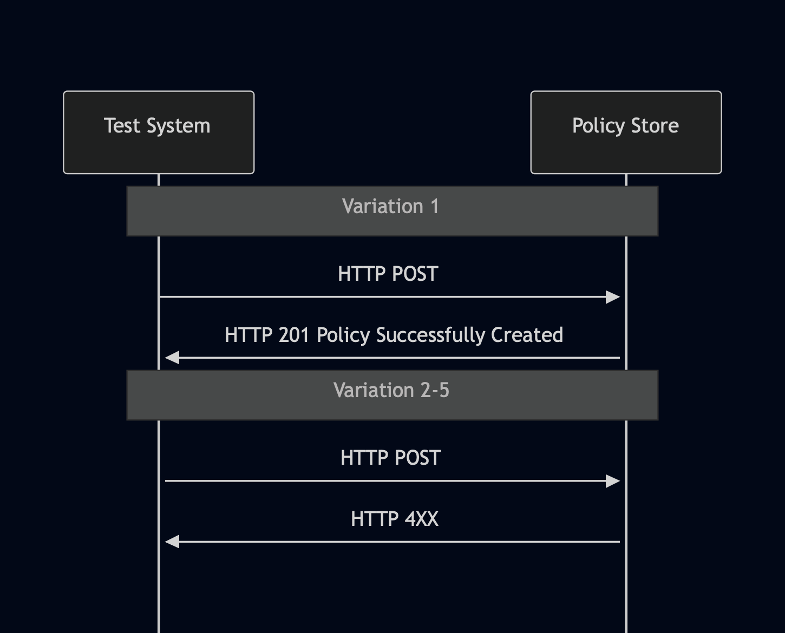

# Test Description: TD_PS_001
## Overview
### Summary
Rejecting HTTP POST with incorrect policies

### Description
Test verifies if Functional Elements storing policies reject HTTP POST with incorrect JWS object or signature

### References
* Requirements : RQ_PS_004, RQ_PS_006, RQ_PS_028, RQ_PS_008
* Test Case    : TC_PS_001

### Requirements
IXIT config file for Policy Store

### HTTP transport types
Test can be performed with 2 different HTTP transport types. Steps describing actions for specific one are marked as following:
- (TLS) - used by default inside ESInet on production environment
- (TCP) - used if default TLS is not possible

## Configuration
### Implementation Under Test Interface Connections
<!-- Identify each of the FEs that are part of the configuration and how they are connected -->
* FE storing policies or Policy Store (PS)
  * IF_PS_TS - connected to Test System IF_TS_PS
* Test System
  * IF_TS_PS - connected to FE IF_PS_TS

### Test System Interfaces
<!-- Identify each of the test system interfaces and whether it will be in active or monitor mode -->
* Test System 
  * IF_TS_PS - Active
* FE storing policies or Policy Store (PS)
  * IF_PS_TS - Active
 
### Connectivity Diagram
<!--
[](https://mermaid.live/edit#pako:eNpdkN0KwjAMhV-l5Hq-wBCvVBAUht2VFCSucSuu7egPIuK7G53gNFfJOfnIIXdovCYo4dz7a9NhSGK7V05wbdbHWh4rOZ_NFtxXksfRifnUBhw6UVNMQt5iIjs6U25UyOk_aL0SMflgXCsG35vGUPyBJ4cYhgIsBYtGc8j7S1aQOrKkoORWY7goUO7Be5iTlzfXQJlCpgLyoDHR0iDftVCesY-sDugO3n9n0obT7MYvvJ9RQPC57T4bjyfKp109)
-->




## Pre-Test Conditions
### Test System
* Interfaces are connected to network
* Interfaces have IP addresses assigned by DHCP
* Device is active
* ng911 repository cloned to local storage
* (TLS) Generated own PCA-signed certificate and private key files (test_system.crt, test_system.key). CN cannot be 'ng911.example.com'
* (TLS) Certificate and key used by FE/Policy Store copied to local storage
* (TLS) PCA certificate copied to local storage

### FE storing policies or Policy Store (PS)
* Interfaces are connected to network
* Interfaces have IP addresses assigned by DHCP
* Default configuration is loaded
* IUT is initialized with steps from IXIT config file
* Device is active
* Device is in normal operating state

## Test Sequence

### Test Preamble

#### Test System
* Install Wireshark[^1]
* (TLS v1.2) Configure Wireshark to decode HTTP over TLS, use tests system and PS certificate keys [^2]
* (TLS v1.3) Configure logging of session keys and configure Wireshark to decode HTTP over TLS [^3]
* Using Wireshark on 'Test System' start packet tracing on IF_TS_PS interface - run following filter:
   * (TLS)
     > ip.addr == IF_TS_PS_IP_ADDRESS and tls
   * (TCP)
     > ip.addr == IF_TS_PS_IP_ADDRESS and http
* go to 'test_suite' directory and using script generate JWS object for variation #2, example:

```
python -m main generate_jws --json test_files/JSON/Policy_object_policyOwner_ng911.example.com_v010.3f.3.0.1.json --cert test_system.crt --key test_system.key
```

### Test Body

#### Variations

1. Validate 201 Policy Successfully Created response for HTTP POST with PCA-signed JWS JSON containing policy - change 'policyOwner' value in 'Policy_object_example_v010.3f.3.0.1.json' file to FQDN of the Test System and generate JWS using Test System PCA-signed certificate

2. Validate 4xx error response for HTTP POST with JWS JSON containing policy which is not PCA-signed - change 'policyOwner' value in 'Policy_object_example_v010.3f.3.0.1.json' file to FQDN of the Test System and generate JWS using Test System certificate which is not PCA-signed

3. Validate 4xx error response for HTTP POST with JWS JSON containing policy which is not signed - change 'policyOwner' value in 'Policy_object_example_v010.3f.3.0.1.json' file to FQDN of the Test System and generate JWS without providing certificate files

4. Validate 4xx error response for HTTP POST with JWS JSON containing policy which is not signed by the policy owner - use 'Policy_object_example_v010.3f.3.0.1.json' file without editing and generate JWS using Test System PCA-signed certificate

5. Validate 4xx error response for HTTP POST with incorrect JWS JSON - use file 'Incorrect_JWS_Policy_object_example_v010.3f.5.0.0.json' for HTTP POST payload


#### Stimulus
Send HTTP POST to FE storing policies/Policy Store:

- (TLSv1.2):
  
  `curl --cert test_system.crt --key test_system.key --cacert PCA.crt --tlsv1.2 -X POST https://IF_PS_TS_IP_ADDRESS:PORT/Policies -H "Content-Type: application/json" -d GENERATED_JWS_JSON`

- (TLSv1.3):
  
  `curl --cert test_system.crt --key test_system.key --cacert PCA.crt --tlsv1.3 -X POST https://IF_PS_TS_IP_ADDRESS:PORT/Policies -H "Content-Type: application/json" -d GENERATED_JWS_JSON`

- (TCP):
  
  `curl -X POST http://IF_PS_TS_IP_ADDRESS:PORT/Policies -H "Content-Type: application/json" -d GENERATED_JWS_JSON`

#### Response
Variation 1
HTTP 201 response

Variation 2-5
HTTP 4XX error response

VERDICT:
* PASSED - if IUT responded as expected
* FAILED - all other cases


### Test Postamble
#### Test System
* stop Wireshark (if still running)
* archive all logs generated
* remove all scenario files
* disconnect interfaces from IUT
* (TLS) remove certificates

#### FE storing policies or Policy Store
* disconnect interfaces from Test System
* reconnect interfaces back to default
* if sent policies were accepted, remove them

## Post-Test Conditions
### Test System 
* Test tools stopped
* interfaces disconnected from IUT

### FE storing policies or Policy Store
* device connected back to default
* device in normal operating state

## Sequence Diagram
<!--
https://mermaid.live/edit#pako:eNq1kstOwzAQRX_Fmi1JlffDi0qoLNgAlRKhCmVjOdPUIrGLYyNC1X8nSWkpSxZ45ce513c0cwCuagQKrutWkiu5FQ2tJCGd0FrpW26U7inZsrbHSs5Qj28WJcc7wRrNuko-KoNEvaMmJfaGFENvsHPIWrWCD6QYHZCSZ6YFM0JJ4k_2p3XFu8vlzW_FfVmuyfqpKH_4a2ASXOm_-cDzL5TlHPt-a9t2ICuNzGD957CBG_9n3GizAQcaLWqgRlt0oEPdsekIh8moArPDDiug47Zm-rWCSh5HzZ7JF6W6s0wr2-yAzn1ywO7rsdrvBl1uNcoa9UpZaYAGnjebAD3AB1A_zRZ5FsSpn6RxmIRh4MAANPIWWRimeTjifp4n8dGBz_nb8SFIoyTw0tSPvMzLfAeYNaoYJD-HwlqMpT-cBmyes-MXjy_GoA
-->




## Comments

Version:  010.3f.5.0.15

Date:     20260121

## Footnotes
[^1]: Wireshark - tool for packet tracing and anaylisis. Official website: https://www.wireshark.org/download.html
[^2]: Wireshark configuration to decrypt TLS packets: https://www.zoiper.com/en/support/home/article/162/How%20to%20decode%20SIP%20over%20TLS%20with%20Wireshark%20and%20Decrypting%20SDES%20Protected%20SRTP%20Stream
[^3]: TLS v1.3 session keys logging + Wireshark configuration to decrypt traffic: https://my.f5.com/manage/s/article/K50557518
