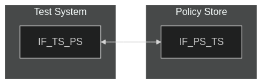
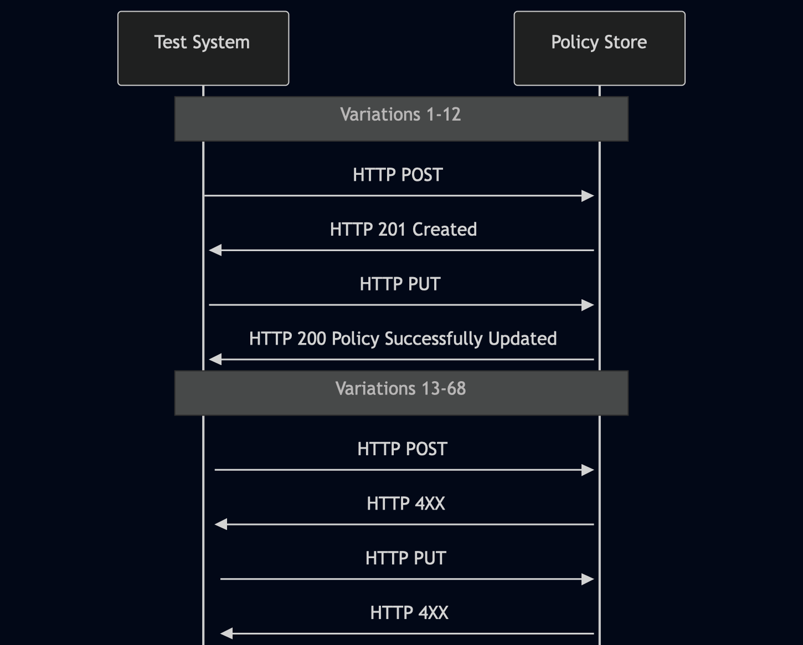

# Test Description: TD_PS_002
## Overview
### Summary
Policy Object contents verification

### Description
Test covers Policy Object contents verification while sending HTTP POST

### References
* Requirements : RQ_PS_010, RQ_PS_025, RQ_PS_026, RQ_PS_030
* Test Case    : 

### Requirements
IXIT config file for Policy Store

### HTTP transport types
Test can be performed with 2 different HTTP transport types. Steps describing actions for specific one are marked as following:
- (TLS) - used by default inside ESInet on production environment
- (TCP) - used if default TLS is not possible

## Configuration
### Implementation Under Test Interface Connections
<!-- Identify each of the FEs that are part of the configuration and how they are connected -->
* Policy Store (PS)
  * IF_PS_TS - connected to Test System IF_TS_PS
* Test System
  * IF_TS_PS - connected to FE IF_PS_TS

### Test System Interfaces
<!-- Identify each of the test system interfaces and whether it will be in active or monitor mode -->
* Test System 
  * IF_TS_PS - Active
* Policy Store (PS)
  * IF_PS_TS - Active
 
### Connectivity Diagram
<!--
[](https://mermaid.live/edit#pako:eNpdUM0KwjAMfpWS8_YCQzyJICgMu5MURlwzN1zb0bXIGHt3oxOc5pR8P3xJJqicJsig7tyjatAHcTwrK7gO-7KQZS43abrlPpc8LswQrzePfSMKGoKQ4xDILMzatyBk9Z8pd11bjUIG5-nHtUpgFyRgyBtsNW83vWAFoSFDCjJuNfq7AmVn1mEMTo62giz4SAnEXmOgXYscaCCrsRsY7dFenPvOpFte4bSc__5CAt7FW_NRzE8do1qx)
-->




## Pre-Test Conditions
### Test System
* Interfaces are connected to network
* Interfaces have IP addresses assigned by DHCP
* Device is active
* ng911 repository cloned to local storage
* (TLS) Generated own PCA-signed certificate and private key files (test_system.crt, test_system.key)
* (TLS) Certificate and key used by FE/Policy Store copied to local storage
* (TLS) PCA certificate copied to local storage

### Policy Store (PS)
* Interfaces are connected to network
* Interfaces have IP addresses assigned by DHCP
* Default configuration is loaded
* IUT is initialized with steps from IXIT config file
* Device is active
* Device is in normal operating state

## Test Sequence

### Test Preamble

#### Test System
* Install Wireshark[^1]
* (TLS v1.2) Configure Wireshark to decode HTTP over TLS, use tests system and PS certificate keys [^2]
* (TLS v1.3) Configure logging of session keys and configure Wireshark to decode HTTP over TLS [^3]
* Using Wireshark on 'Test System' start packet tracing on IF_TS_PS interface - run following filter:
   * (TLS)
     > ip.addr == IF_TS_PS_IP_ADDRESS and tls
   * (TCP)
     > ip.addr == IF_TS_PS_IP_ADDRESS and http

* verify if JWS policy generate from default `Policy_object_example_v010.3f.3.0.X.json` is acceptable for Policy Store. Send HTTP POST and check if PS responded with "HTTP 201 Policy Successfully Created". Save "policyId" JSON parameter value of accepted policy.  Example HTTP POST command:

- (TLSv1.2):
  
  `curl --cert test_system.crt --key test_system.key --cacert PCA.crt --tlsv1.2 -X POST https://IF_PS_TS_IP_ADDRESS:PORT/Policies -H "Content-Type: application/json" -d GENERATED_JWS_OBJECT`

- (TLSv1.3):
  
  `curl --cert test_system.crt --key test_system.key --cacert PCA.crt --tlsv1.3 -X POST https://IF_PS_TS_IP_ADDRESS:PORT/Policies -H "Content-Type: application/json" -d GENERATED_JWS_OBJECT`

- (TCP):
  
  `curl -X POST https://IF_PS_TS_IP_ADDRESS:PORT/Policies -H "Content-Type: application/json" -d GENERATED_JWS_OBJECT`

* use `Policy_object_example_v010.3f.3.0.X.json` from test repository to prepare json files for each variation. Change in file parameters mentioned in variation f.e. for Variation 2 change `"policyOwner": "user@test.example"` to `"policyOwner": "tester@ng911.te$t"`
* use prepared json files, run script to generate JWS object for each varation, example:

```
python -m main generate_jws Policy_object_without_policyOwner_v010.3f.3.0.X.json --cert test_system.crt --key test_system.key
```

* for all HTTP PUT variations generate JWS using JSON body with already stored policy object and changed 1 parameter mentioned

[test_config_ps_002.yaml](..%2F..%2Ftest_configs%2Ftest_config_ps_002.yaml)
### Test Body

#### Variations
JWS with Policy Object:
1. Validate 201 created response for HTTP POST request with `"policyType": "OtherRoutePolicy"` and with 'policyId' parameter: `"policyId": "\n"`
2. Validate 200 Policy Successfully Updated response for HTTP PUT request with `"policyType": "OtherRoutePolicy"` and with 'policyId' parameter: `"policyId": "\n"`
3. Validate 201 created response for HTTP POST request with `"policyType": "OtherRoutePolicy"` and with 'policyId' parameter: `"policyId": "'"`
4. Validate 200 Policy Successfully Updated response for HTTP PUT request with `"policyType": "OtherRoutePolicy"` and with 'policyId' parameter: `"policyId": "'"`
5. Validate 201 created response for HTTP POST request with `"policyType": "OtherRoutePolicy"` and with 'policyId' parameter: `"policyId": "("`
6. Validate 200 Policy Successfully Updated response for HTTP PUT request with `"policyType": "OtherRoutePolicy"` and with 'policyId' parameter: `"policyId": "("`
7. Validate 201 created response for HTTP POST request with 'description' parameter: `"description": "\n"`
8. Validate 200 Policy Successfully Updated response for HTTP PUT request with 'description' parameter: `"description": "\n"`
9. Validate 201 created response for HTTP POST request with 'description' parameter: `"description": "'"`
10. Validate 200 Policy Successfully Updated response for HTTP PUT request with 'description' parameter: `"description": "'"`
11. Validate 201 created response for HTTP POST request with 'description' parameter: `"description": "("`
12. Validate 200 Policy Successfully Updated response for HTTP PUT request with 'description' parameter: `"description": "("`
13. Validate 4xx error response for HTTP POST request without 'policyOwner' parameter 
14. Validate 4xx error response for HTTP PUT request without 'policyOwner' parameter 
15. Validate 4xx error response for HTTP POST request with incorrect 'policyOwner' parameter (special characters not allowed in FQDN): `"policyOwner": "tester@ng911.te$t"`
16. Validate 4xx error response for HTTP PUT request with incorrect 'policyOwner' parameter (special characters not allowed in FQDN): `"policyOwner": "tester@ng911.te$t"`
17. Validate 4xx error response for HTTP POST request with incorrect 'policyOwner' parameter (missing '@'): `"policyOwner": "testerng911.test"`
18. Validate 4xx error response for HTTP PUT request with incorrect 'policyOwner' parameter (missing '@'): `"policyOwner": "testerng911.test"`
19. Validate 4xx error response for HTTP POST request with incorrect 'policyOwner' parameter (double '@'): `"policyOwner": "tester@@ng911.test"`
20. Validate 4xx error response for HTTP PUT request with incorrect 'policyOwner' parameter (double '@'): `"policyOwner": "tester@@ng911.test"`
21. Validate 4xx error response for HTTP POST request with incorrect 'policyOwner' parameter (leading period): `"policyOwner": ".tester@ng911.test"`
22. Validate 4xx error response for HTTP PUT request with incorrect 'policyOwner' parameter (leading period): `"policyOwner": ".tester@ng911.test"`
23. Validate 4xx error response for HTTP POST request with incorrect 'policyOwner' parameter (length exceeded): `"policyOwner": "tester@ng911.testtesttesttesttesttesttesttesttesttesttesttesttesttesttesttesttesttesttesttesttesttesttesttesttesttesttesttesttesttesttesttesttesttesttesttesttesttesttesttesttesttesttesttesttesttesttesttesttesttesttesttesttesttesttesttesttesttesttesttestt"`
24. Validate 4xx error response for HTTP PUT request with incorrect 'policyOwner' parameter (length exceeded): `"policyOwner": "tester@ng911.testtesttesttesttesttesttesttesttesttesttesttesttesttesttesttesttesttesttesttesttesttesttesttesttesttesttesttesttesttesttesttesttesttesttesttesttesttesttesttesttesttesttesttesttesttesttesttesttesttesttesttesttesttesttesttesttesttesttesttestt"`
25. Validate 4xx error response for HTTP POST request without 'policyType' parameter 
26. Validate 4xx error response for HTTP PUT request without 'policyType' parameter 
27. Validate 4xx error response for HTTP POST request with incorrect 'policyType' parameter: `"policyType": "OtherRoutePolicyy"`
28. Validate 4xx error response for HTTP PUT request with incorrect 'policyType' parameter: `"policyType": "OtherRoutePolicyy"`
29. Validate 4xx error response for HTTP POST request without 'policyRules' parameter 
30. Validate 4xx error response for HTTP PUT request without 'policyRules' parameter 
31. Validate 4xx error response for HTTP POST request with `"policyType": "OtherRoutePolicy"` and without 'policyId' parameter 
32. Validate 4xx error response for HTTP PUT request with `"policyType": "OtherRoutePolicy"` and without 'policyId' parameter 
33. Validate 4xx error response for HTTP POST request with `"policyType": "OtherRoutePolicy"` and with incorrect 'policyId' parameter (send integer): `"policyId": 123`
34. Validate 4xx error response for HTTP PUT request with `"policyType": "OtherRoutePolicy"` and with incorrect 'policyId' parameter (send integer): `"policyId": 123`
35. Validate 4xx error response for HTTP POST request with `"policyType": "OriginationRoutePolicy"` and with `"policyId": "test_123"`
36. Validate 4xx error response for HTTP PUT request with `"policyType": "OriginationRoutePolicy"` and with `"policyId": "test_123"`
37. Validate 4xx error response for HTTP POST request with `"policyType": "OriginationRoutePolicy"` or `"policyType": "NormalNextHopRoutePolicy"` and without 'policyQueueName' 
38. Validate 4xx error response for HTTP PUT request with `"policyType": "OriginationRoutePolicy"` or `"policyType": "NormalNextHopRoutePolicy"` and without 'policyQueueName' 
39. Validate 4xx error response for HTTP POST request with `"policyType": "OtherRoutePolicy"` and with `"policyQueueName": "test"`
40. Validate 4xx error response for HTTP PUT request with `"policyType": "OtherRoutePolicy"` and with `"policyQueueName": "test"`
41. Validate 4xx error response for HTTP POST request with incorrect 'policyExpirationTime' parameter (incorrect year): `"policyExpirationTime": "21155-08-21T12:58:03.01-05:00"`
42. Validate 4xx error response for HTTP PUT request with incorrect 'policyExpirationTime' parameter (incorrect year): `"policyExpirationTime": "21155-08-21T12:58:03.01-05:00"`
43. Validate 4xx error response for HTTP POST request with incorrect 'policyExpirationTime' parameter (incorrect month): `"timestamp": "2115-13-21T12:58:03.01-05:00"`
44. Validate 4xx error response for HTTP PUT request with incorrect 'policyExpirationTime' parameter (incorrect month): `"timestamp": "2115-13-21T12:58:03.01-05:00"`
45. Validate 4xx error response for HTTP POST request with incorrect 'policyExpirationTime' parameter (incorrect day): `"policyExpirationTime": "2115-12-32T12:58:03.01-05:00"`
46. Validate 4xx error response for HTTP PUT request with incorrect 'policyExpirationTime' parameter (incorrect day): `"policyExpirationTime": "2115-12-32T12:58:03.01-05:00"`
47. Validate 4xx error response for HTTP POST request with incorrect 'policyExpirationTime' parameter (incorrect hour): `"policyExpirationTime": "2115-12-21T24:58:03.01-05:00"`
48. Validate 4xx error response for HTTP PUT request with incorrect 'policyExpirationTime' parameter (incorrect hour): `"policyExpirationTime": "2115-12-21T24:58:03.01-05:00"`
49. Validate 4xx error response for HTTP POST request with incorrect 'policyExpirationTime' parameter (incorrect minute): `"policyExpirationTime": "2115-12-21T12:60:03.01-05:00"`
50. Validate 4xx error response for HTTP PUT request with incorrect 'policyExpirationTime' parameter (incorrect minute): `"policyExpirationTime": "2115-12-21T12:60:03.01-05:00"`
51. Validate 4xx error response for HTTP POST request with incorrect 'policyExpirationTime' parameter (incorrect second): `"policyExpirationTime": "2115-12-21T12:58:61.01-05:00"`
52. Validate 4xx error response for HTTP PUT request with incorrect 'policyExpirationTime' parameter (incorrect second): `"policyExpirationTime": "2115-12-21T12:58:61.01-05:00"`
53. Validate 4xx error response for HTTP POST request with incorrect 'policyExpirationTime' parameter (incorrect time offset): `"policyExpirationTime": "2115-12-21T12:58:03.01-13:00"`
54. Validate 4xx error response for HTTP PUT request with incorrect 'policyExpirationTime' parameter (incorrect time offset): `"policyExpirationTime": "2115-12-21T12:58:03.01-13:00"`
55. Validate 4xx error response for HTTP POST request with incorrect 'policyExpirationTime' parameter (incorrect day in February): `"policyExpirationTime": "2115-02-30T12:58:03.01-05:00"`
56. Validate 4xx error response for HTTP PUT request with incorrect 'policyExpirationTime' parameter (incorrect day in February): `"policyExpirationTime": "2115-02-30T12:58:03.01-05:00"`
57. Validate 4xx error response for HTTP POST request with incorrect 'policyExpirationTime' parameter (date in the past): `"policyExpirationTime": "2015-04-30T12:58:03.01-05:00"`
58. Validate 4xx error response for HTTP PUT request with incorrect 'policyExpirationTime' parameter (date in the past): `"policyExpirationTime": "2015-04-30T12:58:03.01-05:00"`
59. Validate 4xx error response for HTTP POST request with incorrect 'description' parameter (send integer): `"description": 123`
60. Validate 4xx error response for HTTP PUT request with incorrect 'description' parameter (send integer): `"description": 123`
61. Validate 4xx error response for HTTP POST request with incorrect policy 'conditionType' parameter (send int): `"policyRules_0_conditions_0_conditionType": 123`
62. Validate 4xx error response for HTTP PUT request with incorrect policy 'conditionType' parameter (send int): `"policyRules_0_conditions_0_conditionType": 123`
63. Validate 4xx error response for HTTP POST request with missing policy 'conditionType' parameter remove from 'Policy_object_example_v010.3f.3.0.1.json': `"policyRules_0_conditions_0_conditionType": "MimeBodyCondition"`
64. Validate 4xx error response for HTTP PUT request with missing policy 'conditionType' parameter remove from 'Policy_object_example_v010.3f.3.0.1.json': `"policyRules_0_conditions_0_conditionType": "MimeBodyCondition"`
65. Validate 4xx error response for HTTP POST request with incorrect policy 'negation' parameter (send string): `"policyRules_0_conditions_0_negation": "test"`
66. Validate 4xx error response for HTTP PUT request with incorrect policy 'negation' parameter (send string): `"policyRules_0_conditions_0_negation": "test"`
67. Validate 4xx error response for HTTP POST request with incorrect policy 'description' parameter (send int): `"policyRules_0_conditions_0_description": 123`
68. Validate 4xx error response for HTTP PUT request with incorrect policy 'description' parameter (send int): `"policyRules_0_conditions_0_description": 123`


#### Stimulus
Send HTTP POST / HTTP PUT to Policy Store with generated JWS object for tested variation:

HTTP POST:
- (TLSv1.2):
  
  `curl --cert test_system.crt --key test_system.key --cacert PCA.crt --tlsv1.2 -X POST https://IF_PS_TS_IP_ADDRESS:PORT/Policies -H "Content-Type: application/json" -d JWS_OBJECT`

- (TLSv1.3):
  
  `curl --cert test_system.crt --key test_system.key --cacert PCA.crt --tlsv1.3 -X POST https://IF_PS_TS_IP_ADDRESS:PORT/Policies -H "Content-Type: application/json" -d JWS_OBJECT`

- (TCP):
  
  `curl -X POST https://IF_PS_TS_IP_ADDRESS:PORT/Policies -H "Content-Type: application/json" -d JWS_OBJECT`

HTTP PUT:
- (TLSv1.2):
  
  `curl --cert test_system.crt --key test_system.key --cacert PCA.crt --tlsv1.2 -X PUT https://IF_PS_TS_IP_ADDRESS:PORT/Policies?policyId=STORED_POLICY_ID -H "Content-Type: application/json" -d JWS_OBJECT`

- (TLSv1.3):
  
  `curl --cert test_system.crt --key test_system.key --cacert PCA.crt --tlsv1.3 -X PUT https://IF_PS_TS_IP_ADDRESS:PORT/Policies?policyId=STORED_POLICY_ID -H "Content-Type: application/json" -d JWS_OBJECT`

- (TCP):
  
  `curl -X PUT https://IF_PS_TS_IP_ADDRESS:PORT/Policies?policyId=STORED_POLICY_ID -H "Content-Type: application/json" -d JWS_OBJECT`

#### Response
Variations 1-12
Policy Store responds with HTTP 201 Created (for HTTP POST) / 200 Policy Successfully Updated (for HTTP PUT) message

Variations 13-68
Policy Store responds with HTTP 4XX error message

VERDICT:
* PASSED - if Policy Store responded as expected
* FAILED - any other cases


### Test Postamble
#### Test System
* stop Wireshark (if still running)
* archive all logs generated
* remove all scenario files
* disconnect interfaces from IUT
* (TLS) remove certificates

#### FE storing policies or Policy Store
* disconnect interfaces from Test System
* reconnect interfaces back to default
* if sent policies were accepted, remove them

## Post-Test Conditions
### Test System 
* Test tools stopped
* interfaces disconnected from IUT

### Policy Store
* device connected back to default
* device in normal operating state
* policies added during testing are removed

## Sequence Diagram
<!--
https://mermaid.live/edit#pako:eNq1UztvgzAQ_ivWrYUI88ZDpCodurSNBKmqyosFF4IKdmpMVRrlvxfIo-mYIZ7O8veQv7vbQa4KBAa2bXOZK7muSsYlIU2ltdL3uVG6ZWQt6ha5nEAtfnYoc3yoRKlFw-WzMkjUF2qSYWtI2rcGG4ssVV3lPUkHBWTkVehKmErJllCbuqPF4Vxw7Pn87j_rMcuWZPmSZn_4S8BIuOAf8a5DyUKjMFhcZbO60sU5o7o8x7Zdd3Xdk9W2ODhfHYtnh_Etc_Hf3m6Yx6AOFpS6KoAZ3aEFDepGjFfYjUIczAYb5MCGshD6gwOX-4GzFfJdqeZE06orN8CmkbOgm-I8ztoZgrJAvVCdNMCCSQHYDr6B0SieJbEbRDSMAi_0PNeCHpjvzGLPixJv6BpNkjDYW_AzeQ4PbuSHrhNF1HdiJ6YWiM6otJf5yQ6Lavj302FRpn3Z_wI_IwMf
-->



## Comments

Version:  010.3f.5.2.14

Date:     20251215

## Footnotes
[^1]: Wireshark - tool for packet tracing and anaylisis. Official website: https://www.wireshark.org/download.html
[^2]: Wireshark configuration to decrypt TLS packets: https://www.zoiper.com/en/support/home/article/162/How%20to%20decode%20SIP%20over%20TLS%20with%20Wireshark%20and%20Decrypting%20SDES%20Protected%20SRTP%20Stream
[^3]: TLS v1.3 session keys logging + Wireshark configuration to decrypt traffic: https://my.f5.com/manage/s/article/K50557518
