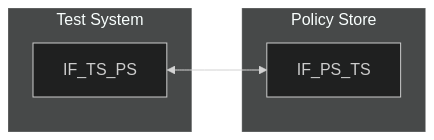
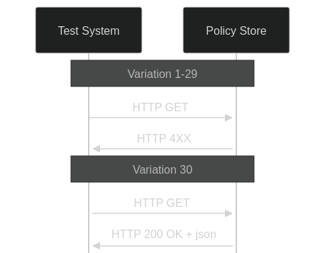

# Test Description: TD_PS_004
## Overview
### Summary
Handling HTTP GET on /Policies entrypoint

### Description
Test covers Policy Store HTTP GET verification and sending response

### References
* Requirements : RQ_PS_016, RQ_PS_017
* Test Case    : TC_PS_004

### Requirements
IXIT config file for Policy Store

### HTTP transport types
Test can be performed with 2 different HTTP transport types. Steps describing actions for specific one are marked as following:
- (TLS) - used by default inside ESInet on production environment
- (TCP) - used if default TLS is not possible

## Configuration
### Implementation Under Test Interface Connections
<!-- Identify each of the FEs that are part of the configuration and how they are connected -->
* Policy Store (PS)
  * IF_PS_TS - connected to Test System IF_TS_PS
* Test System
  * IF_TS_PS - connected to FE IF_PS_TS

### Test System Interfaces
<!-- Identify each of the test system interfaces and whether it will be in active or monitor mode -->
* Test System 
  * IF_TS_PS - Active
* Policy Store (PS)
  * IF_PS_TS - Active
 
### Connectivity Diagram
<!--
[](https://mermaid.live/edit#pako:eNpdUM0KwjAMfpWS8_YCQzyJICgMu5MURlwzN1zb0bXIGHt3oxOc5pR8P3xJJqicJsig7tyjatAHcTwrK7gO-7KQZS43abrlPpc8LswQrzePfSMKGoKQ4xDILMzatyBk9Z8pd11bjUIG5-nHtUpgFyRgyBtsNW83vWAFoSFDCjJuNfq7AmVn1mEMTo62giz4SAnEXmOgXYscaCCrsRsY7dFenPvOpFte4bSc__5CAt7FW_NRzE8do1qx)
-->




## Pre-Test Conditions
### Test System
* Interfaces are connected to network
* Interfaces have IP addresses assigned by DHCP
* Device is active
* ng911 repository cloned to local storage
* (TLS) Generated own PCA-signed certificate and private key files (test_system.crt, test_system.key)
* (TLS) Certificate and key used by Policy Store copied to local storage
* (TLS) PCA certificate copied to local storage

### Policy Store (PS)
* Interfaces are connected to network
* Interfaces have IP addresses assigned by DHCP
* Default configuration is loaded
* Device is active
* IUT is initialized with steps from IXIT config file
* Device is in normal operating state
* Policy Store has stored policies with policyType=OriginationRoutePolicy, policyQueueName=test@example.com. If stored policies have different paremeters, then URLs for all test variations should be adjusted accordingly

## Test Sequence

### Test Preamble

#### Test System
* Install Wireshark[^1]
* (TLS v1.2) Configure Wireshark to decode HTTP over TLS, use tests system and PS certificate keys [^2]
* (TLS v1.3) Configure logging of session keys and configure Wireshark to decode HTTP over TLS [^3]
* Using Wireshark on 'Test System' start packet tracing on IF_TS_PS interface - run following filter:
   * (TLS)
     > ip.addr == IF_TS_PS_IP_ADDRESS and tls
   * (TCP)
     > ip.addr == IF_TS_PS_IP_ADDRESS and http

### Test Body

#### Variations
1. Validate 4xx error response for request without "policyType", "policyOwner", "policyId" and "policyQueueName":

```
POLICY_STORE_FQDN_OR_IP:PORT/Policies
```

2. Validate 4xx error response for request with "policyType" other than "OtherRoutePolicy" and "policyId":

```
POLICY_STORE_FQDN_OR_IP:PORT/Policies?policyType=OriginationRoutePolicy&policyId=test123&policyQueueName=test%40example%2Ecom
```

3. Validate 4xx error response for request with `"policyType": "OtherRoutePolicy"` and "policyQueueName":

```
POLICY_STORE_FQDN_OR_IP:PORT/Policies?policyType=OtherRoutePolicy&policyQueueName=test%40example%2Ecom
```

4. Validate 4xx error response for request with incorrect "limit" parameter (send string):

```
POLICY_STORE_FQDN_OR_IP:PORT/Policies?limit=test&start=1&policyType=OriginationRoutePolicy&policyQueueName=test%40example%2Ecom
```

5. Validate 4xx error response for request with incorrect "limit" parameter (send empty):

```
POLICY_STORE_FQDN_OR_IP:PORT/Policies?limit=&start=1&policyType=OriginationRoutePolicy&policyQueueName=test%40example%2Ecom
```

6. Validate 4xx error response for request with incorrect "limit" parameter (send space):

```
POLICY_STORE_FQDN_OR_IP:PORT/Policies?limit=%20&start=1&policyType=OriginationRoutePolicy&policyQueueName=test%40example%2Ecom
```

7. Validate 4xx error response for request with incorrect "limit" parameter (send value exceeding 64bit unsigned int):

```
POLICY_STORE_FQDN_OR_IP:PORT/Policies?limit=18446744073709551616&start=1&policyType=OriginationRoutePolicy&policyQueueName=test%40example%2Ecom
```

8. Validate 4xx error response for request with incorrect "limit" parameter (send negative value exceeding 64bit int):

```
POLICY_STORE_FQDN_OR_IP:PORT/Policies?limit=-9223372036854775809&start=1&policyType=OriginationRoutePolicy&policyQueueName=test%40example%2Ecom
```

9. Validate 4xx error response for request with incorrect "start" parameter (send string):

```
POLICY_STORE_FQDN_OR_IP:PORT/Policies?limit=10&start=test&policyType=OriginationRoutePolicy&policyQueueName=test%40example%2Ecom
```

10. Validate 4xx error response for request with incorrect "start" parameter (send empty):

```
POLICY_STORE_FQDN_OR_IP:PORT/Policies?limit=10&start=&policyType=OriginationRoutePolicy&policyQueueName=test%40example%2Ecom
```

11. Validate 4xx error response for request with incorrect "start" parameter (send space):

```
POLICY_STORE_FQDN_OR_IP:PORT/Policies?limit=10&start=%20&policyType=OriginationRoutePolicy&policyQueueName=test%40example%2Ecom
```

12. Validate 4xx error response for request with incorrect "start" parameter (send value exceeding 64bit unsigned int):

```
POLICY_STORE_FQDN_OR_IP:PORT/Policies?limit=10&start=18446744073709551616&policyType=OriginationRoutePolicy&policyQueueName=test%40example%2Ecom
```

13. Validate 4xx error response for request with incorrect "start" parameter (send value less than 1):

```
POLICY_STORE_FQDN_OR_IP:PORT/Policies?limit=10&start=0&policyType=OriginationRoutePolicy&policyQueueName=test%40example%2Ecom
```

14. Validate 4xx error response for request with incorrect 'policyOwner' parameter (special characters not allowed in FQDN):

```
POLICY_STORE_FQDN_OR_IP:PORT/Policies?policyOwner=te$t%40example%2Ecom
```

15. Validate 4xx error response for request with incorrect 'policyOwner' parameter (missing '@'):

```
POLICY_STORE_FQDN_OR_IP:PORT/Policies?policyOwner=testexample%2Ecom
```

16. Validate 4xx error response for request with incorrect 'policyOwner' parameter (double '@'):

```
POLICY_STORE_FQDN_OR_IP:PORT/Policies?policyOwner=test%40%40example%2Ecom
```

17. Validate 4xx error response for request with incorrect 'policyOwner' parameter (leading period):

```
POLICY_STORE_FQDN_OR_IP:PORT/Policies?policyOwner=%2Etest%40example%2Ecom
```

18. Validate 4xx error response for request with incorrect 'policyOwner' parameter (length exceeded):

```
POLICY_STORE_FQDN_OR_IP:PORT/Policies?policyOwner=test%40example%2Ecomcomcomcomcomcomcomcomcomcomcomcomcomcomcomcomcomcomcomcomcomcomcomcomcomcomcomcomcomcomcomcomcomcomcomcomcomcomcomcomcomcomcomcomcomcomcomcomcomcomcomcomcomcomcomcomcomcomcomcomcomcomcomcomcomcomcomcomcomcomcomcomcomcomcomcomcomcomcomcom
```

19. Validate 4xx error response for request with incorrect 'policyType' parameter:

```
POLICY_STORE_FQDN_OR_IP:PORT/Policies?policyType=OtherRoutePolicyy
```

20. Validate 4xx error response for request with incorrect "policyQueueName" (send without username), URL:

```
POLICY_STORE_FQDN_OR_IP:PORT/Policies?policyQueueName=sip%3A%40example%2Ecom%3A5060
```

21. Validate 4xx error response for request with incorrect "policyQueueName" (send without domain), URL:

```
POLICY_STORE_FQDN_OR_IP:PORT/Policies?policyQueueName=sip%3Atest%40%3A5060
```

22. Validate 4xx error response for request with incorrect "policyQueueName" (send with not allowed characters), URL:

```
POLICY_STORE_FQDN_OR_IP:PORT/Policies?policyQueueName=sip%3Atest%40example$%2Ecom%3A5060
```

23. Validate 4xx error response for request with incorrect "policyQueueName" (send invalid port), URL:

```
POLICY_STORE_FQDN_OR_IP:PORT/Policies?policyQueueName=sip%3Atest%40example$%2Ecom%3A65536
```

24. Validate 4xx error response for request with incorrect "policyQueueName" (send invalid scheme), URL:

```
POLICY_STORE_FQDN_OR_IP:PORT/Policies?policyQueueName=zip%3Atest%40example$%2Ecom%3A5060
```

25. Validate 4xx error response for request with incorrect "policyId" parameter (send string):

```
POLICY_STORE_FQDN_OR_IP:PORT/Policies?policyId=test
```

26. Validate 4xx error response for request with incorrect "policyId" parameter (send empty):

```
POLICY_STORE_FQDN_OR_IP:PORT/Policies?policyId=
```

27. Validate 4xx error response for request with incorrect "policyId" parameter (send space):

```
POLICY_STORE_FQDN_OR_IP:PORT/Policies?policyId=%20
```

28. Validate 4xx error response for request with incorrect "policyId" parameter (send value exceeding 64bit unsigned int):

```
POLICY_STORE_FQDN_OR_IP:PORT/Policies?policyId=18446744073709551616
```

29. Validate 4xx error response for request with incorrect "policyId" parameter (send negative value exceeding 64bit int):

```
POLICY_STORE_FQDN_OR_IP:PORT/Policies?policyId=-9223372036854775809
```

30. Request with correct data matching policies stored, f.e. URL:

```
POLICY_STORE_FQDN_OR_IP:PORT/Policies?policyType=OriginationRoutePolicy&policyQueueName=test@example.com
```


#### Stimulus
Send HTTP GET to /Policies entrypoint of Policy Store:

- (TLSv1.2):
  
  `curl --cert test_system.crt --key test_system.key --cacert PCA.crt --tlsv1.2 -X GET https://URL`

- (TLSv1.3):
  
  `curl --cert test_system.crt --key test_system.key --cacert PCA.crt --tlsv1.3 -X GET https://URL`

- (TCP):
  
  `curl -X GET http://URL`

#### Response
- Variation 1-29: IUT responds with HTTP 4XX error message

- Variation 30: Policy Store should respond with HTTP 200 OK with JSON body containing:
1. 'PolicyArray' with 'count', 'totalCount' and 'policies' members
2. 'count' has integer value with number of items in 'policies'
3. 'totalCount' has integer value
4. 'policies' is array with JWS elements
5. All JWS elements in 'policies' shall be correct (headers, payload, signature)

VERDICT:
* PASSED - if Policy Store responded as expected
* FAILED - any other cases


### Test Postamble
#### Test System
* stop Wireshark (if still running)
* archive all logs generated
* disconnect interfaces from IUT
* (TLS) remove certificates

#### Policy Store
* disconnect interfaces from Test System
* reconnect interfaces back to default

## Post-Test Conditions
### Test System 
* Test tools stopped
* interfaces disconnected from IUT

### Policy Store
* device connected back to default
* device in normal operating state

## Sequence Diagram
<!--
[](https://mermaid.live/edit#pako:eNq1kVFLwzAUhf9KuK9rR5rOdMnDQFAURB2syJC8hPZui67JTFOxjv13u865-Sp4n3JvvnM4cLZQuBJBQhzHyhbOLsxSKktIZbx3_rIIzteSLPS6RmV7qMa3Bm2BV0Yvva728GEeXEDi3tGTHOtAZm0dsIrI1K1N0ZJZ54SSPGlvdDDOkiRm4iQ-k8STyeC36DbPp-TmOj_h5_97_kz-jY_m8z9HS-k_BmOUksc7MiAvtbMQQYW-0qbsOtjubRSEFVaoQHbPUvtXBcruOk43wc1aW4AMvsEIvGuWK5B9NRE0m1KHYyc_1422z86ddixNF-z-UHnffM-A3MIHyITxYcKFEFlKhRiLjEXQguyuKWU0YWMhKBXJiO8i-OxtR0PGOadZxpN0nNKLbPcFA7W3Dw)
-->




## Comments

Version:  010.3f.3.1.8

Date:     20250428

## Footnotes
[^1]: Wireshark - tool for packet tracing and anaylisis. Official website: https://www.wireshark.org/download.html
[^2]: Wireshark configuration to decrypt TLS packets: https://www.zoiper.com/en/support/home/article/162/How%20to%20decode%20SIP%20over%20TLS%20with%20Wireshark%20and%20Decrypting%20SDES%20Protected%20SRTP%20Stream
[^3]: TLS v1.3 session keys logging + Wireshark configuration to decrypt traffic: https://my.f5.com/manage/s/article/K50557518
