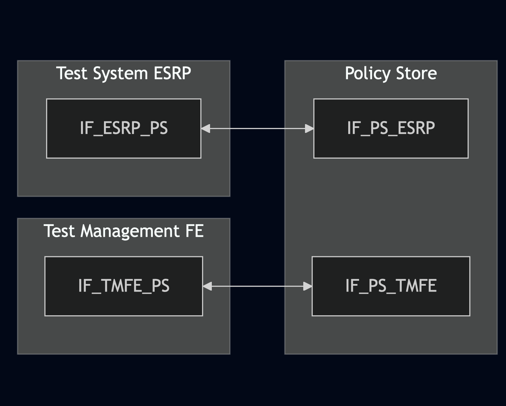
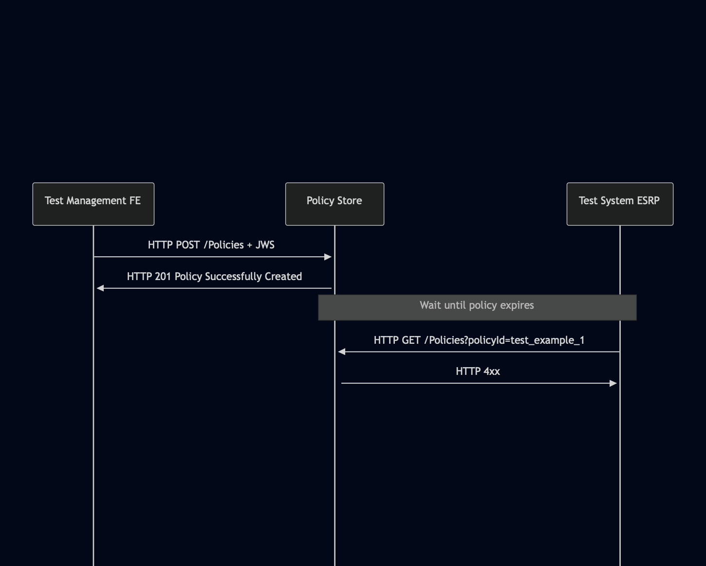

# Test Description: TD_PS_010
## Overview
### Summary
Policies expiration

### Description
Test verifies if Policy Store does not provide expired policies

### References
* Requirements : RQ_PS_001
* Test Case    : 

### Requirements
IXIT config file for Policy Store

### HTTP transport types
Test can be performed with 2 different HTTP transport types. Steps describing actions for specific one are marked as following:
- (TLS) - used by default inside ESInet on production environment
- (TCP) - used if default TLS is not possible

## Configuration
### Implementation Under Test Interface Connections
<!-- Identify each of the FEs that are part of the configuration and how they are connected -->
* Policy Store (PS)
  * IF_PS_ESRP - connected to Test System IF_ESRP_PS
* Test System ESRP
  * IF_ESRP_PS - connected to FE IF_PS_ESRP
* Test Management FE
  * IF_TMFE_PS - connected to FE IF_PS_TMFE

### Test System Interfaces
<!-- Identify each of the test system interfaces and whether it will be in active or monitor mode -->
* Policy Store (PS)
  * IF_PS_ESRP - Active
* Test System ESRP
  * IF_ESRP_PS - Active
* Test Management FE
  * IF_TMFE_PS - Active
 
### Connectivity Diagram
<!--
https://mermaid.live/edit#pako:eNplUdFqgzAU_ZVwn62orSaGsZethcEEqX0aQsk0VVlNJEY2J_77UksrdnnKPeeec09yB8hkzoHC6Sy_s5Ipjd73qUDmvO2O22QfH-PkabV6NlWcTMCdPUS77YK9AFe27T4LxZoSHXirUdK3mtdoFi_trxgX-YM2lucq61GipeIL3SLIjM3j_3tNOSImWMFrLjS6dS6fcleDBYWqcqBaddyCmquaXUoYLi0p6NLYpEDNNWfqK4VUjEbTMPEhZX2TKdkVJdATO7em6pqcaf5aMZOovqPKTOPqRXZCA_UcfzIBOsAPUNfFthuG7poEHvYdgi3ogRLP9gPsYoMSzyPYGy34naY6th9uDBEGmKyJoTYWsE7LpBfZLRPPK_Of0XXp0-7HP-JLmdI
-->




## Pre-Test Conditions
### Test System ESRP, Test Management FE
* Interfaces are connected to network
* Interfaces have IP addresses assigned by DHCP
* Device is active
* ng911 repository cloned to local storage
* (TLS) Generated own PCA-signed certificate and private key files (test_system.crt, test_system.key)
* (TLS) Certificate and key used by Policy Store copied to local storage
* (TLS) PCA certificate copied to local storage

### Policy Store (PS)
* Interfaces are connected to network
* Interfaces have IP addresses assigned by DHCP
* Default configuration is loaded
* IUT is initialized with steps from IXIT config file
* Device is active
* Device is in normal operating state

## Test Sequence

### Test Preamble

#### Test System ESRP, Test Management FE
* Install Wireshark[^1]
* (TLS v1.2) Configure Wireshark to decode HTTP over TLS, use tests system and PS certificate keys [^2]
* (TLS v1.3) Configure logging of session keys and configure Wireshark to decode HTTP over TLS [^3]
* Using Wireshark start packet tracing on local interface for PS - run following filter, example for ESRP:
   * (TLS)
     > ip.addr == IF_ESRP_PS_IP_ADDRESS and tls
   * (TCP)
     > ip.addr == IF_ESRP_PS_IP_ADDRESS and http

#### Test Management FE

* Add expiration time to example policy, edit file `Policy_object_example_v010.3f.3.0.1.json` and add expiration time which is in couple minutes, f.e.
```
"policyExpirationTime": "2025-11-20T12:58:03.01-05:00",
```
* generate JWS object and save to file jws.json, f.e.
```
python3 -m main generate_jws Policy_object_example_v010.3f.3.0.1.json --cert test_system.crt --key test_system.key --output_file jws.json
```
* store policy by sending HTTP POST, f.e.:

   - (TLSv1.2):

    `curl --cert test_system.crt --key test_system.key --cacert PCA.crt --tlsv1.2 -X POST https://IF_PS_TMFE_IP_ADDRESS:PORT/Policies -H "Content-Type: application/jose+json" -d @jws.json`
    
   - (TLSv1.3):

   `curl --cert test_system.crt --key test_system.key --cacert PCA.crt --tlsv1.3 -X POST https://IF_PS_TMFE_IP_ADDRESS:PORT/Policies -H "Content-Type: application/jose+json" -d @jws.json`
    
   - (TCP):

   `curl -X POST https://IF_PS_TMFE_IP_ADDRESS:PORT/Policies -H "Content-Type: application/jose+json" -d @jws.json`


### Test Body

#### Stimulus

Wait until stored policy expires and then retrieve it by sending HTTP GET from Test System ESRP:
   - (TLSv1.2):

   `curl --cert test_system.crt --key test_system.key --cacert PCA.crt --tlsv1.2 -X GET https://IF_PS_ESRP_IP_ADDRESS:PORT/Policies?policyId=test_example_1`
    
   - (TLSv1.3):

   `curl --cert test_system.crt --key test_system.key --cacert PCA.crt --tlsv1.3 -X POST https://IF_PS_ESRP_IP_ADDRESS:PORT/Policies?policyId=test_example_1`
    
   - (TCP):

   `curl -X POST http://IF_PS_ESRP_IP_ADDRESS:PORT/Policies?policyId=test_example_1`


#### Response
Verify if: 
* HTTP GET request was sent after policyExpirationTime - timestamp of HTTP GET request should be later than defined in 'policyExpirationTime' header field in JWS body of the initial HTTP POST (creating a policy)
* Policy Store returns 4xx error


VERDICT:
* PASSED - Policy Store responds with 4xx error
* FAILED - any other cases


### Test Postamble
#### Test System ESRP, Test Management FE
* stop Wireshark (if still running)
* archive all logs generated
* disconnect interfaces from IUT
* (TLS) remove certificates

#### Policy Store
* disconnect interfaces from Test System
* reconnect interfaces back to default

## Post-Test Conditions
### Test System ESRP, Test Management FE
* Test tools stopped
* interfaces disconnected from IUT

### Policy Store
* device connected back to default
* device in normal operating state

## Sequence Diagram
<!--
https://mermaid.live/edit#pako:eNp9kmFP2zAQhv_K6b6Slia0TWIJ0MS6DSRYtVRCQpGQlVyDtcTObAclVP3vuElBmRB88_nufe7es3eYqZyQ4WQySWWm5FYULJUAldBa6W-ZVdow2PLSUCr7IkP_GpIZfRe80Lw6FANsyFi45ZIXVJG08GM1ubg4WatSZB0kDkIMfm02a1j_TjZw2icEGTiBm_tkQIyLD-KPyCMimPnvxU2WkTHbpiw7uNLELeUD7U5ZAvVMehgt6YylClbJn7X3_1T3XFhopBUl1EOC2lpoMiNjI_Untn6uRq4uB9B1fm6d-pFaXtUlPfpf-Bx1OBLnbYseFlrkyKxuyMOKdMUPIe4OpBTtk9tMiswdc67_ppjKvdPUXD4oVb3JtGqKJ2T9E3rY1Llb0vHt3m81yZz0lXJ7QOZHcQ9BtsPWhX449ePYP4uWQbiYRaGHHbIomC6WoR-62ygIojDYe_jSd51NF_HcJeJlGJ1FLjX3kDdWJZ3M3maiXDj7t8PX63_g_hW0atJc
-->




## Comments

Version:  010.3f.5.0.3

Date:     20251124

## Footnotes
[^1]: Wireshark - tool for packet tracing and anaylisis. Official website: https://www.wireshark.org/download.html
[^2]: Wireshark configuration to decrypt TLS packets: https://www.zoiper.com/en/support/home/article/162/How%20to%20decode%20SIP%20over%20TLS%20with%20Wireshark%20and%20Decrypting%20SDES%20Protected%20SRTP%20Stream
[^3]: TLS v1.3 session keys logging + Wireshark configuration to decrypt traffic: https://my.f5.com/manage/s/article/K50557518
