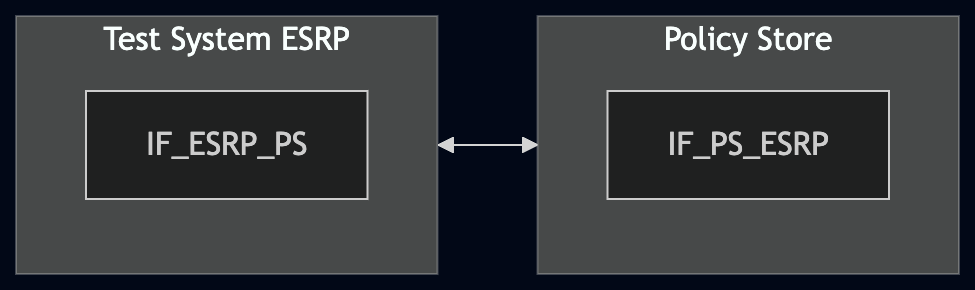
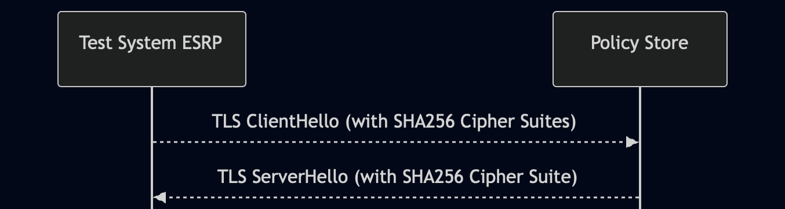

# Test Description: TD_PS_011
## Overview
### Summary
SHA-256 support

### Description
This test verifies support of SHA-256 by the Policy Store.

### References
* Requirements : RQ_PS_112
* Test Case    :

### Requirements
IXIT config file for Policy Store

## Configuration
### Implementation Under Test Interface Connections
<!-- Identify each of the FEs that are part of the configuration and how they are connected -->
* Policy Store (PS)
  * IF_PS_ESRP - connected to Test System ESRP IF_ESRP_PS
* Test System ESRP
  * IF_ESRP_PS - connected to Policy Store IF_PS_ESRP

### Test System Interfaces
<!-- Identify each of the test system interfaces and whether it will be in active or monitor mode -->
* Test System ESRP
  * IF_ESRP_PS - Active
* Policy Store (PS)
  * IF_PS_ESRP - Active

### Connectivity Diagram
<!--
https://mermaid.live/edit#pako:eNqNUV1LwzAU_SvhPnejWVNCg_jgFwgKZd2TRkpssrbYJiNN0Tr23007t4r44H3KuTnnnpPcPRRGKmCwbcx7UQnr0MOaa-Sr619LK3YVus3W6TOHjeocyobOqXZqcXg5EseStVWFq41Gm6u5e3-Xj8w8zbx-Bmel0pLrX24TNzVNXQwoc8aq__mkWf6dcwZ_-cwp0MVicflDCgGUtpbAnO1VAK2yrRgh7EclB1ep1odh_iiFfePA9cFrdkI_GdOeZNb0ZQVsK5rOo34nhVM3tfBva89d6_Moe2167YBhMs0AtocPYASvlhEJY7wKQxzRBAcweE6yTDChEVnRJEliSg8BfE6m4ZLSiJKYUIr9TUz8NNE7kw26OEVSsvb_-Hjc87TuwxdPl5cO
-->




## Pre-Test Conditions

### Test System ESRP
* Interfaces are connected to network
* Interfaces have IP addresses assigned by DHCP
* Device is active
* Test System ESRP has its own certificate signed by PCA
* ng911 repository cloned to local storage

### Policy Store (PS)
* Interfaces are connected to network
* Interfaces have IP addresses assigned by DHCP
* Default configuration is loaded
* IUT is initialized with steps from IXIT config file
* Device is active
* Device is in normal operating state

## Test Sequence

### Test Preamble

#### Test System ESRP
* Copy following configuration file to local storage:
  ```
  test_suite/services/stub_server/http/config/http_service_ssl_sha256.yaml
  ```
* Install Wireshark[^1]
* Copy to local storage PCA-signed certificate and private key files:
  ```
  ESRP-cacert.pem
  ESRP-cakey.pem
  ```
* Copy the PCA certificate to local storage:
  ```
  PCA.crt
  ```
* Using Wireshark on Test System ESRP, start packet tracing on the IF_ESRP_PS interface with the following display filter:
  > ip.addr == IF_ESRP_PS_IP_ADDRESS and tls

### Test Body

#### Stimulus

Send an HTTPS GET request to the `/Policies` entrypoint of the Policy Store - run http_service on Test System ESRP, example:

```bash
sudo python3 test_suite/services/stub_server/http/http_entry.py \
  --ip IF_ESRP_PS_IP_ADDRESS \
  --port 8080 \
  --role SENDER \
  --target_uri https://IF_PS_ESRP_IP_ADDRESS:PORT \
  --path /Policies \
  --method GET \
  --cert ESRP-cacert.pem \
  --cert_key ESRP-cakey.pem \
  --ca PCA.crt \
  --tls_min 1.2 \
  --tls_max 1.2 \
  --ssl-config-file test_suite/services/stub_server/http/config/http_service_ssl_sha256.yaml
```

Using Wireshark, verify that Test System ESRP starts the TLS handshake with a ClientHello containing cipher suites with SHA-256 only.

#### Response

Using Wireshark, verify that:

* the TLS handshake is completed successfully
* the TLS ServerHello sent by Policy Store contains one of the offered cipher suites with SHA-256

VERDICT:
* ERROR - if the TLS ClientHello sent by Test System ESRP does not contain cipher suites with SHA-256 only
* PASSED - if all checks passed
* FAILED - any other case

### Test Postamble

#### Test System ESRP
* Stop the http_service process if it is still running
* Stop Wireshark if it is still running
* Archive the packet capture
* Remove copied certificate and private key files
* Disconnect IF_ESRP_PS from the Policy Store

#### Policy Store
* Disconnect IF_PS_ESRP from Test System ESRP
* Reconnect IF_PS_ESRP to the default network configuration

## Post-Test Conditions

### Test System ESRP
* Test tools are stopped
* IF_ESRP_PS is disconnected from the Policy Store
* The packet capture is archived

### Policy Store
* IF_PS_ESRP is reconnected to the default network configuration
* Device is in normal operating state

## Sequence Diagram
<!--
https://mermaid.live/edit#pako:eNqFkk9v2zAMxb8KwdMG2IESx_mjQ4EgK9DDChhVLyt80WzW0WZLGS1vzYJ890l20ksPu0mP70c9ETxj5WpCiWmalrZy9tU0srQAnWF2vKu8417Cq257ivJ3573rHjU3xu7qHxJEVGujG9ZX-ZuEeVDHhj39GshW9GUyRC_AUbM3lTlq6-FePRWge3im3oM69Z66UfvoLFT0Fa411QlUiBXyTK7oT9O7u0JJeP6qYN8asv6B2tbBpz_GH0A97Bb5CvbmeCAGNRhP_ecJLlREY4sJVsS_if8DX1lMsGFTo_Q8UIIdcafjFc-xXqI_UEclynCsNf8ssbSXwITvvDjX3TB2Q3NAOY44weFYa3-b17vKZGvivRusR5ltF2MTlGd8QzmfL2cLIUS2zfPVJs-WeYKnKK9nQuRZFLdrsV1klwT_ju-K2WqzyQKxDiYhlssE9eCdOtnqFopqE0b8OO3GuCK3aPdj5Zrs8g-Hgra0
-->




## Comments

Version:  010.3f.5.0.3

Date:     20260729

## Footnotes
[^1]: Wireshark - tool for packet tracing and analysis. Official website: https://www.wireshark.org/download.html
